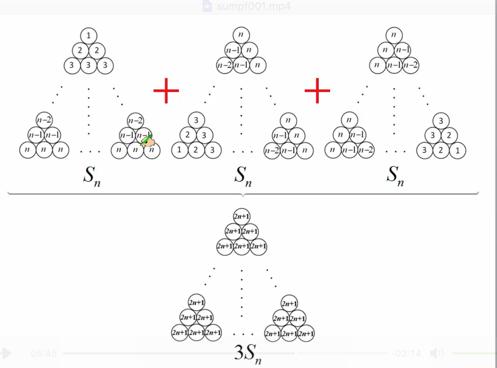
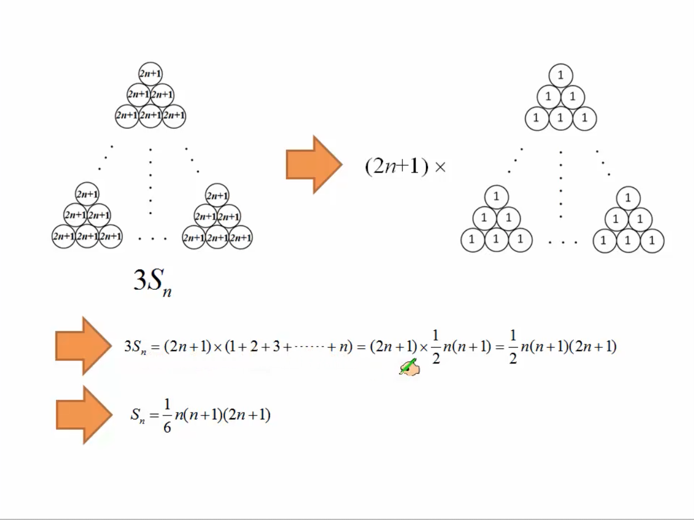
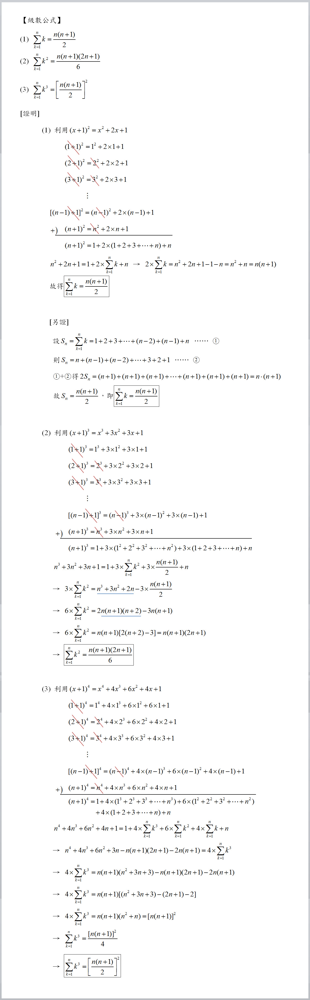

# 定理

## 目录(Catalog)
1. 求和符号 $\sum$  (sigma)
2. [证明] 级数公式

## 生词:
- **quadratic [kwɒ'drætɪk] adj.二次的 n.二次方程式**
- **trigonometric [ˌtriɡənə'metrik] (trigono-metric) --adj.三角法的**
    + --> trigonometric functions 三角函数
- **trigonometry [ˌtrɪgə'nɒmɪtrɪ] --n.三角学, 三角法，三角函数**
    + --> Trigonometry formulas 三角函数公式
- **definition [defɪ'nɪʃ(ə)n] --n.定义，精确度**
    + --> definition of probability. 概率定义
    + --> It is by definition a complex object. 它本质上是个复杂的物体。
- **fundamental [fʌndə'ment(ə)l] --adj.基本的，根本的，重要的。--n.基本原则，基本法则**
- **identity [aɪ'dentɪtɪ] ---n.身份，特性** 
    + --> local identity name 本地身份名称
    + --> Definitions and Fundamental Identities 定义和基本特性

## 内容(Content)
### 1. 求和符号 $\sum$  (sigma)
- A.4.1 定义与基本性质: $a_{1} + a_{2} + ... + a_{9} + a_{10}$ 可以简写为以下形式: 
    + $$
        \sum_{i=1}^{10}a_{i}
      $$
    + : 意思为 $a_{i}$ 项到 $a_{10}$ 项的求和。
    + tips: 求和符号中可以使用任意未被占用的字母作为计数下标，含义不变。

### 2. [证明] 级数公式
> [来源](http://sites.ccvs.kh.edu.tw/fuchi/doc/26266)
> 来源: http://sites.ccvs.kh.edu.tw/fuchi/doc/26266
- (1) 
    $$
        Sn = 1+2+3+ \cdots +(n-2)+(n-1)+n = \frac{n(n+1)}{2} = \sum_{k=1}^{n} k
    $$
    +  比较常用的读法: sigma $k$ 从 1 到 n, 对 $k$ 求和
    + 证明步骤:  
        1. $设 S_n = 1 + 2 + 3 + \cdots + (n-2) + (n-1) + n = \sum_{k=1}^{n} k$
           $\quad \text{(1)}$
        1. $则 S_n = n + (n-1) + (n-2) + \cdots + 3 + 2 + 1  \quad \text{(2)}$
        1. (1) + (2) 得
        1. $2S_n = (1 + n) + [2 + (n-1)] + [3 + (n-2)] + [4 + (n-3)] + \cdots +$
           $[(n-2) + 3] + [(n-1) + 2] + [n + 1]$
        1. $2S_n = (1+n) + (1+n) + (1+n) + \cdots + (1+n) + (1+n) + (1+n)$
        1. $故 S_n = \frac{n(1+n)}{2},$
        1. $即 \sum_{k=1}^{n} k = 1+2+3+ \cdots +(n-2)+(n-1)+n = \frac{n(n+1)}{2}$
- (2) $S_n = 1^2 + 2^2 + 3^2 + \cdots + (n-2)^2 + (n-1)^2 + n^2 = sum_{k=1}^n k^2$
    + $$
        \sum_{k=1}^{n} k^2 = \frac{n(n+1)(2n+1)}{6}
    $$
    + 
        - Tip: (1)第 2 个三角垛在第 1 个三角垛的基础上逆时针旋转 $120^\circ$ 得到
        - (2)第 3 个三角垛是在第 2 个的基础上接着逆时针旋转 $120^\circ$ 得到
    + 
- (3)
    $$
        \sum_{k=1}^{n} k^3 = [\frac{n(n+1)}{2}]^2
    $$
- 完整证明图片
  
