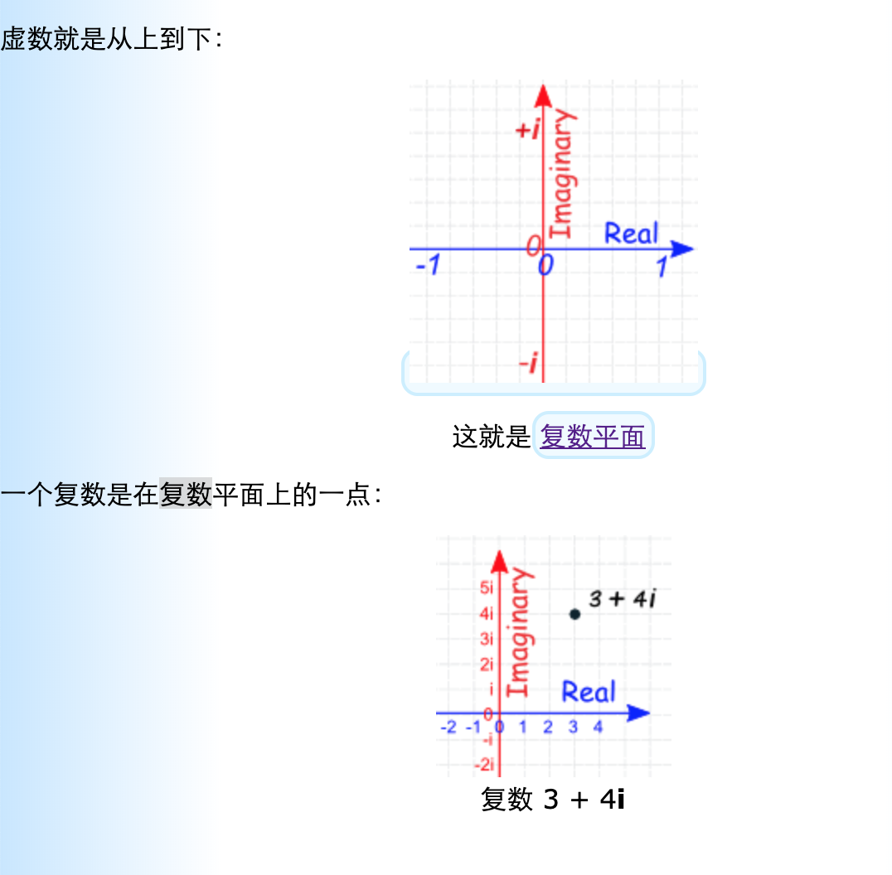

## 复数
> [来源-数学乐](https://www.shuxuele.com/numbers/complex-numbers.html)

#### 生词
- **imaginary [ɪ'mædʒɪn(ə)rɪ] --adj.假想的，虚构的** 
    + --> an imaginary enemy 假想敌
    + --> an imaginary number 虚数
------

#### 复数的定义
- 复数: 7 (Real) + 3i (Imaginary) 
- 复数是: **实数** 和 **虚数**的组合。

> **实数**是像这样的数: (日常遇到的差不多都是实数)
- | 实数 | 实数 | 实数 | 实数 | 实数 | 实数 |
  |:---:|:---:|:---:|:---:|:---:|:---:|
  | 1  | 12.36 | -0.8625 | $\frac{3}{4}$ | $\sqrt{2}$ | 1998 |
  
> **虚数**的平方是负数
- 这通常不会发生，因为
    + 正数的平方是正数
    + 负数的平方也是正数(因为: 负负得正)，例如: $-2 \times -2 = +4$;
- 但你需要想象虚数存在，因为它很有用：
- 虚数 "单位" 是字母 `i`, 就是 `-1` 的平方根

    $$
        i = \sqrt{-1}
    $$
    
    因为 `i` 的平方就是 `-1` 

    $$
        \color{red}{i^2 = -1}
    $$

- 虚数的例子
    + |   虚数 |   虚数 |   虚数 |   虚数 |   虚数 |   虚数 |
      |:---:|:---:|:---:|:---:|:---:|:---:|
      | 3i  |1.04i|-2.8i|$\frac{3i}{4}$| $\sqrt{2}$i| 1988i |
- 整数里的 "i" 就是代表要乘以 $\sqrt{-1}$  
  
> **复数是实数与虚数的组合:**
- **`a` + `bi`**
    + **`a`**: Real Part
    + **`b`**: Imaginary Part
    + **`i`**: $\sqrt[2]{-1}$
- 例子: 
    + | 复数 | 复数 | 复数 | 复数 | 复数 |
      |:---:|:---:|:---:|:---:|:---:|
      | 1 + i| 39 + 3i| 0.8 - 2.2i| -2 + πi |$\sqrt{2} + \frac{i}{2}$|
- 一个数可以是 2 个数的组合吗？
    + 我们可以把 2 个数组合成另一个数吗？ 可以！
    + `分数` 就是这样。 分数 3/8 就是由 3 和 8 合成的数，意思是 "八分之三"。
    + 复数是 2 个数加起来 (实数和虚数)。
- **两个部分都可以是 0**
    + 复数有实部和虚部。
    + 但这两个部都可以是 0， 所以所有实数和虚数都是复数。
        - | 复数 | 实部 | 虚部 |
          |:---:|:---:|:---:|
          |3 + 2i| 3 | 2  |
          |  5   | 5 | 0  |
          | -6i  | 0 | -6 |

> **视觉效果** 
- 实数直接是从左向右的
- 虚数就是从上到下:
- 

> **加法**
- 把两个复数相加，我们分开来加实部和虚部
- $$
    (3 + 2i) + (1 + 7i)
    = 3 + 1 + (2 + 3)i
    = (4 + 9i)
  $$

> **乘法**
- 把 2 个复数相乘和`二项式乘法`规则相同。(Tip:也称为 "首外内尾")
- $(a+bi)(c+di) = ac + adi + bci + bdi^2$
- 示例:
    + $$
        \begin{align}
        & (3 + 2i)(1 + 7i) \\
        & = 3×1 + 3×7i + 2i×1+ 2i×7i \\	 
		 	 	& = 3 + 21i + 2i + 14i^2 \\
		 	 	& = 3 + 21i + 2i − 14   &&\text{（因为 i2 = −1）} \\
		 	 	& = −11 + 23i  \\
       \end{align}
      $$

> **共轭**
- 共轭是把中间的正负号改变，像这样: $a + bi => a - bi$
- 共轭的一般符号是上面放一条横线：
- 例子: $\overline{5-3i} = 5 + 3i$

> **除法**
- 复数除法需要用到共轭。
- 技巧是: 分子(上面)和分母(下面)都乘以分母(下面)的共轭。
- 例子:
    + $$
        \begin{align}
        & \frac{2 + 3i}{4 - 5i} \\
        & = \frac{2 + 3i}{4 - 5i} \times \frac{4 + 5i}{ 4 + 5i} \\
        & = \frac{ 8 + 10i + 12i + 15i^2}{16 + 20i - 20i - 25i^2} \\
        & = 因为 i^2 = -1, 并且同类项相加 (例如: 20i - 20i) \\
        & = \frac{-7 + 22i}{41} \\
        & = 把答案写成 a + bi 的格式  \\
        & = \frac{-7}{41} + \frac{22}{41}i
        \end{align}
      $$