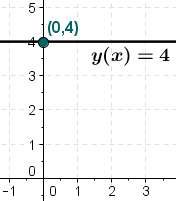

# 常函数 (Constant function)

- 参考来源:
    + [Constant function - Wiki](https://en.wikipedia.org/wiki/Constant_function)
    + [常(数)函数 - Wiki](https://zh.wikipedia.org/wiki/%E5%B8%B8%E6%95%B8%E5%87%BD%E6%95%B8)
    + 更建议看英文的文档, 中文文档编译不够友好.

## 目录(Catalog)
1. `常(数)函数`的定义
2. Basic properties (基本属性)
3. Other properties (其他属性)

## 生词(New Words)
- **regardless [rɪ'ɡɑrdləs] --adv.无论; 不管. --adj.不管的; 不顾的; 不注意的.**
    + He is regardless(adj) of the result. 他不考虑结果.
    + We are determined to go regardless of your intentions.
      不管你的意向如何, 我们下定决心去了.
    + I shall go regardless of the weather. 无论天气好坏我都要去.
- **property ['prɒpətɪ] --n.属性; 性能; 财产; 特性.**
    + Check if an attribute must be bound using property.
      检查一个特性是否一定要用属性绑定.
    + a man of property. 有资产的人.
- **general ['dʒɛnrəl] --adj.一般的; 通常的; 普通的; 普遍的; 概括的.**
  **--n.将军, 上将; 一般; 常规**
    + a general(adj) war. 全面战争.
    + a general(adj) magazine. 综合性杂志.
    + general(adj) prinpicles. 通则; 总则.
    + general(adj) rules. 一般原则.

## 内容(Content)
### 1. `常(数)函数` 的定义
- In mathematics, a `constant function` is a function whose (output) value
  is the same for every input value. For example, the function 
  $y(x) = 4$ (Read: $y$ of $x$) is a consant function because the value of
  $y(x)$ is 4 regardless of the input value $x$ (see image).
  
  (在数学中, `常数函数`是一种对于每个输入值但输出值都相同的函数. 例如, 函数 $y(x) = 4$
  (读作: $y$ of $x$) 是一个常数函数, 因为 $y(x)$ 的值是 4, 不管每次 $x$ 输入何值.)

  

### 2. Basic properties (基本属性)
- As a real-valued function of a real-valued argument, a constant function
  has the general form $y(x) = c$ or just $y = c$.

  (作为一个实值参数的实值函数, 常数函数具有一般形式 $y(x) = c$ 或 just $y = c$.)
- **笔记未写完...... 待续**

### 3. Other properties (其他属性)

