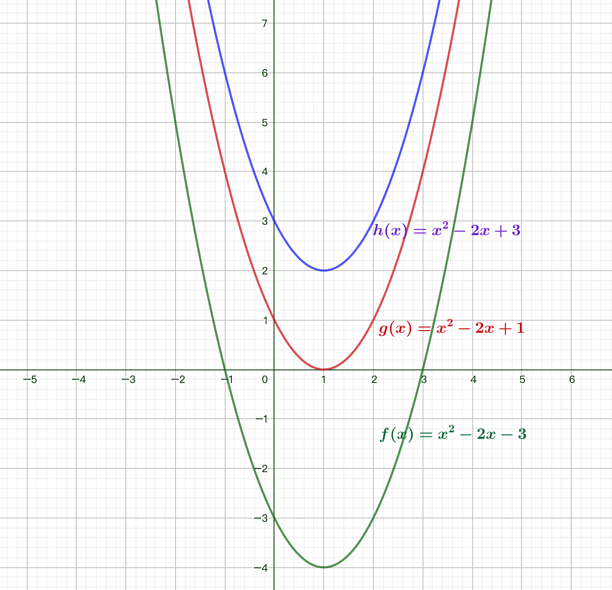

# 函数 Function

## 目录(Catalog)
1. 函数简介
    + 1.1 函数是什么?
    + 1.2 函数的定义.
2. 函数大致可以分为 2 类
    + 2.1 初等函数
        - 2.1.1 初等函数的定义
        - 2.1.2 初等函数可以划分为 6 大基本初等函数
          (`反` `对` `幂` `三` `指` `常`)
            + (1) `常(数)函数 (constant function)`
            + (2) `幂函数 (power function)`
            + (3) `指数函数 (exponential function)`
            + (4) `对数函数(logarithmic function)`
            + (5) `三角函数 (trigonometric function)`
            + (6) 反三角函数 (inverse trigonometric function)`
        - 2.1.3 其他常见初等函数
            + (1) `双曲函数`
            + (2) `反双曲函数`
    + 2.2 非初等函数
        - 2.2.1 `阶乘函数族`
        - 2.2.2 `误差函数与双指数积分`
        - 2.2.3 `贝塞尔函数族`
        - 2.2.4 `椭圆函数与椭圆积分`
        - 2.2.5 `Zeta 函数与多对数函数`
        - 2.2.6 `多项式正交击`
        - 2.2.5 `Q 级数`
        - 2.2.6 `模形式`
        - 2.2.7 `统一函数族`
        - 2.2.6 `数论函数`
3. 关于函数的误区
    + 3.1 误区 1: 超越函数不是初等函数
    + 3.2 误区 2: 绝对值函数不是初等函数
    + 3.3 误区 3: 有解析式的就是初等函数
4. 另外一种初等函数的划分
    + 4.1 `初等函数` 是由基本运算 (例如, 加减乘除, 指数运算, 对数运算) 构成的函数.
    + 4.2 初等函数的分类:
        - 4.2.1 `代数函数`: 能够表示为多项式方程的函数.
            + (1) `多项式`: 能够表示为变量的加减和乘.
                - (01) `线性函数`: 图像为直线的函数, 可分为 2 类: 
                    + (a) `零次函数 (常数函数)`: 零次多项式, 图像为水平线.
                    + (b) `一次函数`: 一次函数, 图像为斜直线.
                - (02) `二次函数`: 二次多项式, 图像为抛物线.
                - (03) `三次函数`
                - (04) `四次函数`
                - (05) `五次函数`
                - (05) `六次函数`
            + (2) `有理函数`: 两个多项式函数的比.
            + (3) `开方`:
                - (01) `平方根`
                - (02) `立方根`
        - 4.2.2 `基本超越函数`: 非代数函数即为 `超越函数`.
            + (1) `指数函数`
            + (2) `双曲函数`: 形式上相似于三角函数.
            + (3) `对数函数`: 指数函数的反函数; 用于求解指数方程
                + (01) `自然对数`
                + (02) `常用对数`
                + (03) `二进对数`
                + (04) `不定对数`
            + (4) 非有理次幂的 `幂函数`:
            + (5) `周期函数`
                + (01) `三角函数`: 正弦, 余弦, 正切等; 主要用于几何学和描述周期现象.
                    参阅 `古德曼函数`.
                + (02) `锯齿波`
                + (03) `方波`
                + (04) `三角波`

## 生词
- **theorem ['θɪərəm] --n.定理, 法则, 命题** 
- **elementary [ˌɛlɪ'mɛntri] --adj.初级的; 初步的;**
    + Elementary function. 初等函数
    + elementary education. (美)初等教育
- **trigonometric [ˌtriɡənə'metrik] (trigono-metric) --adj.三角法的**
    + trigonometric functions 三角函数
- **trigonometry [ˌtrɪgə'nɒmɪtrɪ] (trigo-nometry) --n.三角学, 三角法, 三角函数**
    + Trigonometry formulas 三角函数公式
- **sine [saɪn] --n.[数]正弦**
- **cosine ['kəʊsaɪn] (co-sine) --n.余弦**
- **tangent ['tæn(d)ʒ(ə)nt] --n.切线; 正切. --adj.接触的; 相切的**
- **cotangent [kəʊ'tændʒ(ə)nt] (co-tangent) --n.[数] 余切**
- **secant ['siːk(ə)nt] --n.正割; 割线. --adj.分割的; 交叉的**
- **cosecant ['ko'sikənt] (co-secant) --n.[数]余割**

## 内容(Content)
### 1. 函数简介
#### 1.1 函数是什么?
- 待看: [函数-Wikiwand](https://www.wikiwand.com/zh-cn/%E5%87%BD%E6%95%B0)
- `函数 (Function)` 在数学中为两不为空集的集合间的一种对应关系:
  输入值集合中的每项元素皆能对应​​唯一一项输出值集合中的元素. 例如实数 $x$
  对应到其平方 $x^{2}$ 的关系就是一个函数, 若以 3 作为此函数的输入值,
  所得的输出值便是9.

  为方便起见, 一般做法是以符号 $f, g, h$ 等等来指代一个函数. 若函数 $f$ 
  以 $x$ 作为输入值, 则其输出值一般写作 $f(x)$(读作 $f of x$).
  上述的平方函数关系写成数学式记为 $f(x)=x^{2}$.
  函数的概念并不局限于数之间的映射关系; 表达函数有多种方式, 例如:
    + `解析法` 是用数学式表达两个变量之间的对应关系;
    + `图像法` 是用坐标系上的函数图形表达两个变量之间的对应关系;
    + `列表法` 用表格表达两个变量之间的对应关系.
  
  现代数学中, 函数所有输入值的集合被称作该函数的 `定义域`,
  而其输出值所在的集合称为 `到达域`. 其中 `值域`: **特指该函数的输出值集合**,
  意即 `上域`包含了 `值域`, 值域为上域的 `子集`. 通常输入值称作函数的参数或参量,
  输出值称作函数的值. **函数将有效的输入值变换为唯一的输出值**,
  **同一输入总是对应同一输出, 但反之未必成立**. 

  例如: 因此如 $Root(x) = \sqrt[2]{x}$ 这样的表达式并没有定义出一个函数,
  因为输出值有两个可能. **定义函数时需确定每一个输入值只对应唯一输出值**,
  因此必须明确地选择一个平方根. 例如定义 $Posroot(x) = \sqrt{x}$, 
  亦即对于任何非负输入值, 选择其非负平方根作为函数值. 
- 定义来源 [函数-Wiki](https://zh.wikipedia.org/wiki/%E5%87%BD%E6%95%B0)

#### 1.2 函数的定义.
- 高中《必须1》对函数的定义: `./## 基础数学/高中数学/必修1.md`
- 《托马斯大学微积分》对函数的定义:
    + 1.1.1 `函数`, `定义域` 与 `值域`. 见:
      `../../## 微积分-Calculus/《University Calculus》/Chapter01-函数`

### 2. 函数大致可以分为 2 类
#### 2.1 初等函数
##### 2.1.1 初等函数的定义
- [初等函数-Wiki](https://zh.wikipedia.org/wiki/%E5%88%9D%E7%AD%89%E5%87%BD%E6%95%B0)  
- **初等函数(基本函数)** 是由 `常(数)函数(constant function)`,
  `幂函数(power function)`, `指数函数(exponential function)`,
  `对数函数(logarithmic function)`, `三角函数(trigonometric function)`,
  `反三角函数(inverse trigonometric function)` 经过有限次的有理运算
  (加, 减, 乘, 除, 有限次乘方, 有限次开方) 以及有限次 `函数复合` 所产生,
  并且在 `定义域` 上能用一个 `方程式` 表示的函数.
  
  一般来说, 分段函数不是初等函数, 因为在这些分段函数的定义域上不能用一个解析式表示.

##### 2.1.2 初等函数可以划分为 6 大基本初等函数 (`反` `对` `幂` `三` `指` `常`)
- (1) `常(数)函数 (constant function)`
    + 完整讲解见同目录: `./## 初等函数/1_常(数)函数_constant-function.md`
- (2) `幂函数 (power function)`
    + 完整讲解见同目录: `./## 初等函数/2_幂函数_power-function.md`
- (3) `指数函数 (exponential function)`
    + 完整讲解见同目录: `./## 初等函数/3_指数函数_exponential-function.md`
- (4) `对数函数(logarithmic function)`
    + 对数函数: 指数函数的反函数; 用于求解指数方程.
    + 完整讲解见同目录: `./## 初等函数/4_对数函数_logarithmic-function.md`
- (5) `三角函数 (trigonometric function)`
    + 完整讲解见同目录: `./## 初等函数/5_三角函数_trigonometric-function.md`
- (6) `反三角函数 (inverse trigonometric function)` (即: `反函数`)
    + 完整讲解见同目录: `./## 初等函数/6_反函数_inverse-trigonometric-function.md`

##### 2.1.3 其他常见初等函数
- (1) `双曲函数`
    + 完整讲解见同目录: `./## 初等函数/双曲函数.md`
- (2) `反双曲函数`
    + 完整讲解见同目录: `./## 初等函数/反双曲函数.md`

#### 2.2 非初等函数
- 笔记来自当前文件的上级目录: `../初等函数之上有无定义高等函数.pdf`.
##### 2.2.1 `阶乘函数族`
##### 2.2.2 `误差函数与双指数积分`
##### 2.2.3 `贝塞尔函数族`
##### 2.2.4 `椭圆函数与椭圆积分`
##### 2.2.5 `Zeta 函数与多对数函数`
##### 2.2.6 `多项式正交击`
##### 2.2.5 `Q 级数`
##### 2.2.6 `模形式`
##### 2.2.7 `统一函数族`
##### 2.2.6 `数论函数`

### 3. 关于函数的误区
- 笔记来自当前文件的上级目录: `../初等函数之上有无定义高等函数.pdf`
##### 3.1 误区 1: 超越函数不是初等函数
- 错, 事实上除了 `常函数` 与 `整数次幂函数`, 其他都叫 `初等超越函数`, 
  ⽐如 $sin(2)$,  $arcsin2$,  $log_2{2}$,  $e^2$ ... 统统是 `超越数`,
  刘维尔虽然是超越数的提出者, 但划分的时候并没有这⽅⾯的考虑,
  ⽽且当时也⽆法判断这些数的超越性.

##### 3.2 误区 2: 绝对值函数不是初等函数
- 错, $abs(x) = |x| = \sqrt[2]{x^2}$ 难道不是基本初等函数符合而成的吗?
  分段函数不⼀定不是初等函数, 事实上只要没有跳跃间断点就都能初等表达.

##### 3.3 误区 3: 有解析式的就是初等函数
- 解析式这个词, 是欧拉⽤的, 现在的等价术语是 `封闭形式`, 封闭解只要求闭包,
  对具体的⽣成元没有要求, 初等函数符合正好符合⽽已. 在现代,
  解析函数⼀般是指局部上由收敛幂级数给出的函数

### 4. 另外一种初等函数的划分
- 笔记来源: [函数列表-Wikiwand](https://www.wikiwand.com/zh/%E5%87%BD%E6%95%B0%E5%88%97%E8%A1%A8)
- Notice: 下面这种对初等函数的划分, 从上面 "误区 1"
  的回答便可以看出是一种更合理的划分方法: 
#### 4.1 `初等函数` 是由基本运算 (例如, 加减乘除, 指数运算, 对数运算) 构成的函数.
#### 4.2 初等函数的分类:
- 4.2.1 `代数函数`: 能够表示为多项式方程的函数.
    + (1) `多项式`: 能够表示为变量的加减和乘.
        - (01) `线性函数`: 图像为直线的函数, 可分为 2 类: 
            + (a) `零次函数 (常数函数)`: 零次多项式, 图像为水平线.
            + (b) `一次函数`: 一次函数, 图像为斜直线.
        - (02) `二次函数`: 二次多项式, 图像为抛物线.
        - (03) `三次函数`
        - (04) `四次函数`
        - (05) `五次函数`
        - (05) `六次函数`
    + (2) `有理函数`: 两个多项式函数的比.
    + (3) `开方`:
        - (01) `平方根`
        - (02) `立方根`
- 4.2.2 `基本超越函数`: 非代数函数即为 `超越函数`.
    + (1) `指数函数`
    + (2) `双曲函数`: 形式上相似于三角函数.
    + (3) `对数函数`: 指数函数的反函数; 用于求解指数方程
        + (01) `自然对数`
        + (02) `常用对数`
        + (03) `二进对数`
        + (04) `不定对数`
    + (4) 非有理次幂的 `幂函数`:
    + (5) `周期函数`
        + (01) `三角函数`: 正弦, 余弦, 正切等; 主要用于几何学和描述周期现象.
            参阅 `古德曼函数`.
        + (02) `锯齿波`
        + (03) `方波`
        + (04) `三角波`

---------------
---------------

#### 一次函数(线性函数 linear function)
- 在初等代数与解析几何中, 线性函数是指拥有一个变数的一阶多项式函数或是只有常数的函数, 因为
   在直角坐标系中这些函数的图形是直线。所在, 这些函数是线性的。
  
  线性函数可以表达为 **斜截式**: $y = ax + b (a \not= 0)$ 的定义域是 $R$, 值域也
  是 $R$, 对于 $R$ 中的任意一个数 $x$, 在 $R$ 中都有唯一的数 $y = ax + b$ 
  ($a \not= 0$) 和它对应。其中 $a$ 是斜率, $b$ 是 $y$ 轴截距, 即函数的图形与 $y$ 轴
  相交的 $y$ 坐标, 改变斜率 a 会使直线更陡峭或平缓。改变 $y$ 轴截距 $b$ 会将直线向上或
  向下平移.

  

- 高等数学用法: 在高等数学里, 线性函数是一种线性映射, 是在两个向量空间之间, 维持向量加法与
  标量乘法的映射。
    + $f(x + y) = f(x) + f(y)$ 
    + $f(ax) = af(x)$
    + 例如我们用 "坐标向量" 来表示 $x$ 与 $f(x)$, 那么线性函数可以表达成 
      $f(x) = Mx$, 当中 M 为矩阵。

#### 二次函数 (quadratic function)
- $y = ax^2 + bx + c (a \neq 0)$ 的定义域是 $R$, 值域是 $B$.
  如果令二次函数的值等于0, 则可得一个二次方程。该方程的解称为方程的根或函数的零点.

  二次方程 $ax^2 + bx + c = 0$ 的 2 个根为:
    + $x$ = $\frac{-b \pm \sqrt{b^2 - 4ac}}{2a}$  [读作: $b^2$ - 4ac 的 2 次方根]     

  
  
  **吐槽**: 这里要是不吐槽, 我非要憋死了, 我只想问中国这个社会, 书本的电子版是黄金吗?
  MMP, 能找到的电子版都是扫描版, 扫描的就算了, 你 TM 模糊的我以为我 lu 虚脱了,
  老子只能使用 GeoGebra 自己画; 为什么国外的课本都可以开方电子版?
  难道人家不知道流出电子书就会少卖钱吗? 扭曲的国家.
- 解析式： $f(x) = x^2 -x -2$ 
    + 当 a > 0 时, B = { y | y $\geq$ $\frac{(4ac- b^2)}{4a}$ };
    + 当 a < 0 时, B = { y | y < $\frac{(4ac- b^2)}{4a}$ };
    + 对于 R 中的任意一个数 x, 在 B 中都有唯一的数 $y = ax^2 + bx + c (a \neq 0)$
      和它对应。
