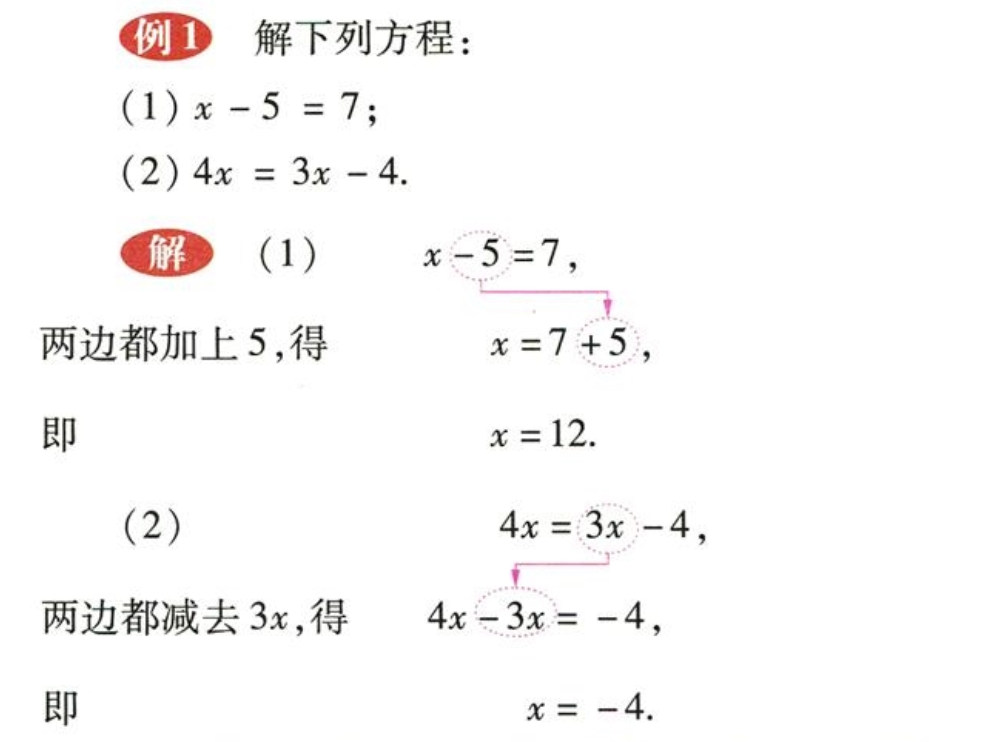
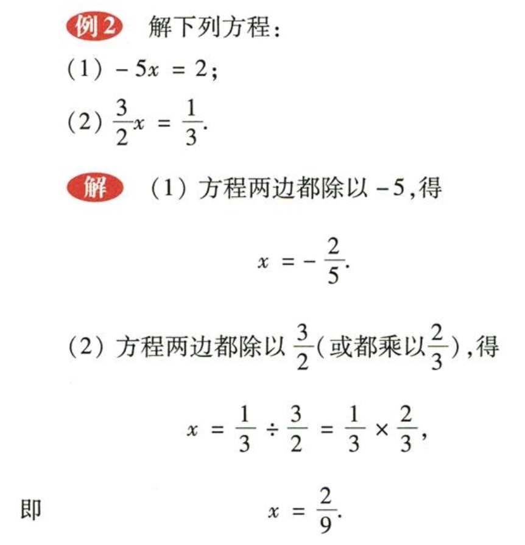
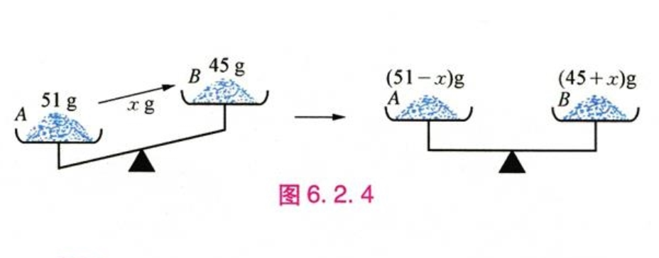

# 七年级数学下册

## 目录(Catalog)
- 第 6 章(chapter 6) -- 一元一次方程 
    + 6.1 从实际问题到方程 (P2)
    + 6.2 解一元二次方程 (P4)
        - 6.2.1 等式的性质与方程的简单变形 (P4)
        - 6.2.2 解一元一次方程 (P9)
    + *阅读材料: 丢番图的墓志铭与方程* (P15)
    + 6.3 实践与探索 (P16)
    + 6.4 小结 (P20)
    + 6.5 复习题 (P21)
- 第 7 章 -- 一次方程组
    + 7.1 二元一次方程组合它的解 (P24)
    + 7.2 二元一次方程组的解法 (P27)
    + 7.3 三元一次方程组及其解法 (P37)
    + 7.4 实践与探索 (P42)
    + *阅读材料: 鸡兔同笼* (P44)
    + 7.5 小结 (P45)
    + 7.6 复习题 (P46)
- 第 8 章 -- 一元一次不等式
    + 8.1 认识不等式 (P50)
    + 8.2 解一元一次不等式 (P53)
    + 8.3 一元一次不等式组 (P62)
    + *阅读材料: 等号与不等号的由来* (P66)
    + 8.4 小结 (P67)
    + 8.5 复习题 (P68) 
    + 综合与实践: 球赛出现问题 (P70)
- 第 9 章 -- 多边形
    + 9.1 三角形 (P72)
        + 9.1.1 认识三角形 (P73)
        + 9.1.2 三角形的内角和与外角和 (P76)
        + 9.1.3 三角形的三边关系 (P80)
    + 9.2 多边形的内角和与外角和 (P83)
    + 9.3 用正多边形铺设地面 (P88)
        + 9.3.1 用相同的正多边形铺设地面 (P88)
        + 9.3.2 用多种正多边形铺设地面 (P90)
    + *阅读材料: 多姿多彩的图案* (P91)
    + 9.4 小结 (P93)
    + 9.5 复习题 (P94)
- 第 10 章 -- 轴对称(Pchen), 平移与旋转
    + 10.1 轴对称 (P98)
        - 10.1.1 生活中的轴对称 (P98)
        - *阅读材料: 剪正五角星 (P101)*
        - 10.1.2 轴对称的再认识 (P102)
        - 10.1.3 画轴对称图形 (P105)
        - 10.1.4 设计轴对称图案 (P107)
    + 10.2 平移 (P112)
        - 10.2.1 图形的平移 (P112)
        - 10.2.2 平移的特征 (P114)
    + 10.3 旋转 (P118)
        - 10.3.1 图形的旋转 (P118)
        - 10.3.2 旋转的特征 (P121)
        - 10.3.3 旋转对称图形 (P122)
    + *阅读材料: 古建筑中的旋转对称 -- 从敦煌洞窟到欧洲教堂*
    + 10.4 中心对称 (P127)
    + 10.5 图形的全等 (P133)
    + 10.6 小结 (P137)
    + 10.7 复习题 (P138)
    + *综合与实践: 图案设计*

## 生词(New Word)
- **transposition [ˌtrænzpə'zɪʃən] --n.调换, 变换, 移项**
    + transposition of word order. 词序的换位.
- **linear ['lɪnɪə] --adj.线性的, 直线的, 线状的**
    + linear equation with one unknown. 一元一次方程.
    + a linear equation. 一次方程
- **equation [ɪ'kweɪʒ(ə)n] --n.相等；均衡；方程式；等式**
    + The equation of wealth with happiness can be dangerous.
        把财富与幸福等同起来是很危险的。
    + I can't make this equation come out. 我不会解这个方程式。
    + an equation of the second degree. 二次方程式
    + a chemical equation 化学方程式 
- **unknown [ʌn'nəʊn] --adj.未知的, 不明的.**
    + an unknown place. 未知的场所.
    + for some unknown reason. 为了某种未知的理由

## 内容(Content)
### 第 6 章(chapter 6) -- 一元一次方程 
- 6.1 从实际问题到方程 (2)
    + **例 1** : 某校七年级 328 名师生乘车外出春游, 已有 2 辆校车共可乘坐 64 人, 
      还需租用 44 座的客车多少辆?  
      **答**: 小学里我们已经学过列方程的解法, 我们不妨回顾一下:  
      设需租用客车 $x$ 辆, 一辆客车可以乘坐 44 人, 那么 $x$ 辆共可乘坐 $44x$ 人,
      加上校车的 64 人, 就是全体的 328 人, 由此我们可得: $44x + 64 = 328$ (1) $\quad$
      问题归结为求出方程 (1) 中的 $x$ 的值, 也就知道需要多少辆客车了,(注: $x$ 即方程的解). 
    + **例 2** : 在课外活动中, 张老师发现同学们的年龄基本上都是 13 岁, 然后他问同学们: 
      "我今年 45 岁, 经过几年后你们的年龄正好是我年龄的 $\frac{1}{3}$ ?"  
      **答**: 
        - (1) 小敏同学很快回答了答案: "3 年!", 他是这样算的:
            + ① 1 年后, 老师的年龄是 46 岁, 同学的年龄是 14 岁, $46 \div 14 \neq 3$ 
              (即 14 不是 46 的 $\frac{1}{3}$).
            + ② 2 年后, 老师的年龄是 47 岁, 同学的年龄是 15 岁, $47 \div 15 \neq 3$ 
              (即 15 不是 47 的 $\frac{1}{3}$).
            + ③ 3 年后, 老师的年龄是 48 岁, 同学的年龄是 16 岁, $48 \div 16 = 3$ 
              (16 恰好是 48 的 $\frac{1}{3}$).
        - (2) 也有的同学说, 我们可以列出方程来解:
            + 设经过 $x$ 年后同学的年龄是老师年龄的 $\frac{1}{3}$, 经过 $x$
              年后同学的年龄是 $(13 + x)$ 岁, 老师的年龄是 $(45 + x)$ 岁, 可得
              $$
                13 + x = \frac{1}{3}(45 + x)
              $$
              我们暂时只能将 $x = 1, 2, 3, 4, \cdots$ 代入方程 (1) 中求得方程的解
              $x = 3$, 不过我们会在接下来的章节中讲解此方程的解法.
    + **例 3 -- 练习(1)** : 某班原分成 2 个小组进行课外体育活动, 第一组 26 人, 
      第二组 22 人, 根据学校活动器材的数量, 要将第一组的人数调整为第二组的一半,
      应从第一组调多少人到第二组去? (注: 根据题意设未知数, 列出方程不必求解.)   
      **答**: 我们根据题意分解作答: 
      
        - (1) 设应从第一组调 $x$ 人到第二组去; 第一组原本 26 人调走 $x$ 人后剩余
          $(26 - x)$ 人, 第二组原本 22 人从第一组调来 $x$ 人后现为 $(22 + x)$ 人, 
        - (2) 根据题意 "要将第一组的人数调整为第二组的一半", 
          那么我们现在只需要把调整后的第二组的人数除以 2 和当前调整后第一组的人数相等即可
          (注: 此处多思考两遍), 
        - (3) 分析完毕, 然后列出方程  
          $$
            (26 - x) = (22 + x) \div 2
          $$
    + **例4 -- 练习(2)**: 师徒二人铺设一条长 186 米的地下电缆, 师傅每小时铺设 18(m) 米,
      徒弟每小时铺设 12 米, 师傅先开始工作, 2 个小时候后徒弟在另一端开始铺设, 
      那么师徒二人还需一起工作多少时间才能完成铺设任务?  
      **答**: 我们先来分析题目:
        - (1) 首先设 师徒二人还需要一起工作 $x$ (h)小时才能完成铺设任务. 
          我们首先要搞清楚列方程等号(=)左右两边相等的条件是什么, 这里很清楚就是 186m
          的地下电缆, 即: **师傅铺设的长度 + 徒弟铺设的长度 = 186m**
        - (2) 接下来我们根据 (1) 的分析来看列方程需要的条件: 
            + a. 师傅先工作 2 个小时候, 那么 2 个小时铺设的长度为 $18 \times 2 = 36m$
            + b. 师徒二人一起工作时, 师傅在 $x$ 小时内铺设的长度为 $18x$
            + c. 师徒二人一起工作时, 徒弟在 $x$ 小时内铺设的长度为 $12x$
        - (3) 现在我们根据 (2) 来列出方程: 
          $$
            18 \times 2 + 18x + 12x = 186
          $$
- 6.2 解一元二次方程 (4)
    + 6.2.1 等式的性质与方程的简单变形 (4)
        - **[1] 等式的基本性质**:
            + (1) `等式两边都加上(或都减去)同一个数或同一个整式, 所得结果仍是等式.`  
                - $\color{#E87631}{\large 如果 a = b, 那么 \; a + c = b + c, \; a - c = b - c.}$
            + (2) `等式两边都乘以(或都除以)同一个数(除数不能为0), 所得结果仍然是等式.`
                - $\color{#E87631}{\large 如果 a = b, 那么 \; ac = bc, \; \frac{a}{c} = \frac{b}{c} (c\neq0).}$
        - **[2]** 由等式的基本性质, 可以得到 **方程的变形规则**:
            + (1) `方程两边都加上(或都减去)同一个数或同一个整式, 方程的解不变.`
            + (2) `方程两边都乘以(或都除以)同一个不等于 0 的数, 方程的解不变.`  
        - 根据 `[1], [2]` 的这些规则, 我们可以对方程进行适当的变形, 求方程的解.
            +   
              以上 2 个方程的解法, 都依据了方程的变形规则 (1), 这里的变形, 
              相当于 `将方程中的某些项改变符号后, 从方程的一边移动到另一边,`-
              `像这样的变形叫做 移项 (transposition).`
            +   
              这 2 个方程的解法, 都依据了方程的变形规则 (2), 将方程的两边都除以未知数的系数
              . 像这样的变形通常称作 "将未知数的系数转化为 1."
    + 6.2.2 解一元一次方程 (9)
        - 前面我们遇到的一些方程, 例如: $44x + 64 = 328$, 
          $\quad$ $13 + x = \frac{1}{3}(45 + x)$ 等, 有一个共同的特点:
          $\color{#E87631}{\large 它们都只含有一个未知数(x), 并且含有未知数的式子都是整式,}$
          $\color{#E87631}{\large 未知数的次数都是 1, 像这样的方程叫做 \bold{一元一次方程}}$
          $\color{#E87631}{\large (linear \; equation \; with \; one \; unknown).}$
        - 现在我们来解几个一元一次方程:
            + **例4**: 解方程 $3(x - 2) + 1 = x - (2x - 1)$
                
                - 解题步骤略, 详解见书本.
            + **例5**: 解方程 $\frac{x - 3}{2} - \frac{2x + 1}{3} = 1$
                
                - 略
            + **例6**: 如图 6.2.4, 天平的 2 个盘内分别盛有 51g(克) 和 45g 的盐,
              问应从盘 A 中拿出多少盐放到盘 B 中, 才能是两者所盛盐的质量相等?  
                
              **答**: 
                - (1) 分析: 题目的意思是从盘 A 中拿出一些盐放到盘 B 中, 使 2 盘所盛盐的质量相等,
                  那么我们可以设从盘 A 中拿出 $x$ 克盐放到盘 B 中两者盐的质量相等, 
                  此时盘 A 中剩余 $(51 - x)$ 克盐, 盘 B 中为 $(45 + x)$ 克盐, 
                  根据两者盐的质量相等我们可以列出等式.
                - (2) 解: 根据 (1) 的分析列出等式如下:  
                  $$
                    51 - x = 45 + x
                  $$
                  解这个方程, 得 $x = 3$, 经检验, 符合题意. 答: 应从盘 A 中拿出 3g
                  盐放到盘 B 中.
            + **例7**: 学校团委组织 65 名团员为学校建花坛搬砖. 女同学每人每次搬 6 块, 
              男同学每人每次搬 8 块, 每人各搬了 4 次, 他(她)们一共搬了 1800 块. 
              问这些团员中有多少名男同学?  
              **答:**
                - (1) 分析: 我们先总结出题目中存在的等量关系:
                    
                    + **所有男同学搬砖数 + 所有女同学搬砖数 = 搬砖总数(1800)块**
                - (2) 根据 (1) 的分析来总结等式的成立条件: 
                    + (2.1) 设团员中有 $x$ 名男同学, 因为一共组织了 65 名团员,
                      那么女同学的数量为 $(65 - x)$
                    + (2.2) 根据男同学每人每次搬 8 块, 每人搬 4 次,
                      就是说一个男同学 4 次共搬了 $ 4 \times 8 = 32$ 块砖.
                    + (2.3) 女同学每人每次搬 6 块, 每人搬 4 次,
                      即一个女同学 4 次共搬了 $ 4 \times 6 = 24$ 块砖.
                - (3) 根据 (2) 的分析我们得到一个男同学或女同学 4 次搬砖的数量, 
                  那么 $x$ 名男同学, 4次搬砖的数量就是 $32x$, 所有女同学的搬砖数量为
                  $24 \times (65 - x)$, 现在根据 (1) 的等式关系, 来列出方程:
                  $$
                    32x + 24(65 - x) = 1800
                  $$
                  解这个方程, 得 $x = 30$, 经检验, 符合题意. 答: 这些团员中有 30 名男同学.
            + P13: **练习** (注: 练习题略, 但请至少做一下 1,3 5 / 2, 4, 6...) 
            + **概括**: 用一元一次方程解决实际问题, 关键在于**`抓住问题中的等量关系`**,
              列出方程. 求得方程的解后, 经过检验, 得到实际问题的解答.
            + **习题 6.2.2** : 做练习题的 1, 3, 5
                - (5). 小莉和同学在 "五一" 假期去森林公园玩, 在溪流边的 A 码头租了一艘小艇,
                  逆流而上, 划行速度约为 4km/h. 到 B 地后沿原路返回, 速度增加了 50%,
                  回到 A 码头比去时少花了 20(min) 分钟, 求 A, B 两地之间的路程.  
                  **答**: 
                    + (1) 分析: 我们先总结出题目中存在的等量关系 
                        
                        - **A --> B 的路程 =  B --> A 的路程**
                    + (2) 设小莉从 A 码头到 B 地以 4km/h 的速度需要 $x$(h) 小时, 
                      那么计算出从 A --> B 划行的总路程为 $4x$ (注: 路程 = 速度 x 时间)
                    + (3) 小莉从 B 地原路返回到 A 码头, 速度增加了 50%, 计算此时的速度为
                      (4 + 4 $\times$ 50% = 6km/h), 由上题从 B 地回到 A 码头比去时少花 20min,
                      可知用时为 $(x - \frac{1}{3})$, (注: 20min = $\frac{1}{3}h$)
                    + (4) 由 (2), (3) 列出等式:
                      $$
                        4x = 6(x - \frac{1}{3})
                      $$
                      解这个方程, 得 $x = 1$, 经检验, 符合题意. 答: A, B 两地之间的路程为 4km.
- **阅读材料: 丢番图的墓志铭与方程 (15)**
- 6.3 实践与探索 (16)
    + **前置知识:**
        - (1) 圆柱的体积公式: $\color{#E87631}{\large V = h \pi r^2} \;$ [高(h), 半径(r)]
- 6.4 小结 (20)
- 6.5 复习题 (21)
### 第 7 章 -- 一次方程组
- 7.1 二元一次方程组合它的解 (24)
- 7.2 二元一次方程组的解法 (27)
- 7.3 三元一次方程组及其解法 (37)
- 7.4 实践与探索 (42)
- **阅读材料: 鸡兔同笼 (44)**
- 7.5 小结 (45)
- 7.6 复习题 (46)
### 第 8 章 -- 一元一次不等式
- 8.1 认识不等式 (50)
- 8.2 解一元一次不等式 (53)
- 8.3 一元一次不等式组 (62)
- **阅读材料: 等号与不等号的由来 (66)**
- 8.4 小结 (67)
- 8.5 复习题 (68) 
- **综合与实践: 球赛出现问题 (70)**   
### 第 9 章 -- 多边形
- 9.1 三角形 (72)
    + 9.1.1 认识三角形 (73)
    + 9.1.2 三角形的内角和与外角和 (76)
    + 9.1.3 三角形的三边关系 (80)
- 9.2 多边形的内角和与外角和 (83)
- 9.3 用正多边形铺设地面 (88)
    + 9.3.1 用相同的正多边形铺设地面 (88)
    + 9.3.2 用多种正多边形铺设地面 (90)
- **阅读材料: 多姿多彩的图案 (91)**
- 9.4 小结 (93)
- 9.5 复习题 (94)
### 第 10 章 -- 轴对称(chen), 平移与旋转
- 10.1 轴对称 (98)
    + 10.1.1 生活中的轴对称 (98)
    + *阅读材料: 剪正五角星 (101)*
    + 10.1.2 轴对称的再认识 (102)
    + 10.1.3 画轴对称图形 (105)
    + 10.1.4 设计轴对称图案 (107)
- 10.2 平移 (112)
    + 10.2.1 图形的平移 (112)
    + 10.2.2 平移的特征 (114)
- 10.3 旋转 (118)
    + 10.3.1 图形的旋转 (118)
    + 10.3.2 旋转的特征 (121)
    + 10.3.3 旋转对称图形 (122)
- *阅读材料: 古建筑中的旋转对称 -- 从敦煌洞窟到欧洲教堂*
- 10.4 中心对称 (127)
- 10.5 图形的全等 (133)
- 10.6 小结 (137)
- 10.7 复习题 (138)
- 综合与实践: 图案设计

