# 九年级数学上册

## 目录(Catalog)
- 第 21 章 -- 二次根式
    + 21.1 二次根式 (P2)
    + *阅读材料: 蚂蚁和大象一样重吗?* (P4)
    + 21.2 二次根式的乘除 (P5)
        - 21.2.1 二次根式的乘法 (P5)
        - 21.2.2 积的算术平方根 (P6)
        - 21.2.3 二次根式的除法 (P7)
    + 21.3 二次根式的加减 (P10)
    + 21.4 小结 (P13)
    + 21.5 复习题 (P15)
- 第 22 章 -- 一元二次方程
    + 22.1 一元二次方程 (P18) 
    + 22.2 一元二次方程的解法 (P20)
        - 22.2.1 直接开平方法和因式分解法 (P20)
        - 22.2.2 配方法 (P25) 
        - 22.2.3 公式法 (P28)
        - 22.2.4 一元二次方程根的判别式 (P31)
        - 22.2.5 一元二次方程的根与系数的关系 (P33)
    + *阅读材料 "代数学之父" 韦达* (P37)
    + 22.3 实践与探索 (P28)
    + 22.4 小结 (P43)
    + 22.5 复习题 (P45)
- 第 23 章 -- 图形的相似
    + 23.1 成比例线段 (P48)
        - 23.1.1 成比例线段 (P48)
        - 23.1.2 平行线分线段成比例 (P51)
    + *阅读材料 黄金分割* (P56) 
    + 23.2 相似图形 (P57)
    + 23.3 相似三角形 (P61)
        + 23.3.1 相似三角形 (P61)
        + 23.3.2 相似三角形的判定 (P64)
        + 23.3.3 相似三角形的性质 (P71)
        + 23.3.4 相似三角形的应用 (P72)
    + 23.4 中位线 (P77)
    + 23.5 位似图形 (P80)
    + *阅读材料 数学与艺术的美妙结合--分形* (P82)
    + 23.6 图形与坐标 (P84)
        - 23.6.1 用坐标确定位置 (P84)
        - 23.6.2 图形的变换与坐标 (P88)
    + 23.7 小结 (P94)
    + 23.8 复习题 (P95)
- 第 24 章 -- 解直角三角形
    + 24.1 测量 (P100)
    + 24.2 直角三角形的性质 (P102)
    + 24.3 锐角三角函数 (P105)
    + 24.4 解直角三角形 (P111)
    + *阅读材料 葭生池中* (P118)
    + 24.5 小结 (P119)
    + 24.6 复习题 (P120)
    + **总和与实践 高度的测量** (P124)
- 第 25 章 -- 随机事件的概率
    + 25.1 在重复试验中观察不确定现象 (P126)
    + *阅读材料*
        - *计算机帮我们画趋势图* (P134)
        - *搅匀对保证公平很重要* (P135)
    + 25.2 随机事件的概率 (P136)
        - 25.2.1 概率及其意义 (P136) 
        - 25.2.2 频率与概率 (P141)
        - *阅读材料 电脑键盘上的字母为何不按字母顺序排列* (P147)
        - 25.2.3 列举所有机会均等的结果 (P149)
    + *阅读材料*
        - *The Birthday Problem 生日问题* (P155)   
        - *模拟实验* (P157)
    + 25.3 小结 (P158)
    + 25.4 复习题 (P159)
    + 综合与实践 骰(tóu)子与概率 (P162)

​    
## 生词(New Word)
- **Nu ($\nu$) [nu:] --n.希腊字母的第13个字母**
- **quadratic [kwɒ'drætɪk] --adj.二次的。--n.二次方程式**
    + complete quadratic equation 完全二次方程
- **equation [ɪ'kweɪʒ(ə)n] --n.相等；均衡；方程式；等式**
    + I can't make this equation come out. 我不会解这个方程式。
    + an equation of the second degree. 二次方程式

## 内容(Content)
### 第 21 章 -- 二次根式
- 21.1 二次根式 (2)
    +   
      人造地球卫星要冲出地球, 围绕地球运动, 发射时就必须达到一定的速度, 
      这个速度称为第一宇宙速度. 计算第一宇宙速度的公式是:
      $$
        \nu = \sqrt[2]{gR}
      $$
      其中 $g$ 为重力加速度, $R$ 为地球半径.
    + **概括(1):**
        - $\sqrt[2]{a}$ $(a \geq 0)$ 表示非负数 $a$ 的算术平方根, 也就是说,
          $\sqrt{a}$ $(a \geq 0)$ 是一个非负数, 它的平方等于 $a$, 既有:
            + (1) $\color{#E87631}{\large \sqrt{a} \; (a \geq 0)} \quad$
              [读作: $a$ 的二次方根 或 $a$ 的平方根. 通常简读为: 根号 $a$]
            + (2) $\color{#E87631}{\large (\sqrt{a})^2 = a \; (a \geq 0)}$
              [读作: $a$ 的平方根的平方]  
          形如 $\sqrt{a}$ $(a \geq 0)$ 的式子叫做 **二次根式**
    + **注意:**
        - 在 $\sqrt{a}$ 中, $a$ 的取值必须满足 $(a \geq 0)$, 
          即二次根式的被开方数必须是非负数.
        - 例: $x$ 是怎样的实数时, 二次根数 $\sqrt{x - 1}$ 有意义? 答: 略.
    + **概括(2):**
        - $\sqrt{a^2}$ 等于什么?
            + (1) 当 $a \geq 0$ 时, $\color{#E87631}{\large \sqrt{a^2} = a}$ 
              [读作: $a$ 的平方的二次方根等于 $a$] 
            + (1) 当 $a \leq 0$ 时, $\color{#E87631}{\large \sqrt{a^2} = - a}$
- *阅读材料: 蚂蚁和大象一样重吗?* (4)
- 21.2 二次根式的乘除 (5)
    + 21.2.1 二次根式的乘法 (5)
        - **公式(1)**: $\color{#E87631}{\sqrt{a} \cdot \sqrt{b} = \sqrt{ab} \quad (a \geq 0, \; b\geq 0)}$
          [简读为: 根号 a 乘以根号 b 等于根号 a 乘以 b, a 大于等于 0, b 大于等于 0]  
          **两个算术平方根的积, 等于它们被开房数的积的算术平方根.**
    + 21.2.2 积的算术平方根 (6)
        - **公式(2)**: $\color{#E87631}{\sqrt{ab} = \sqrt{a} \cdot \sqrt{b} \quad (a \geq 0, \; b\geq 0)}$  
          **积的算术平方根, 等于个因式算术平方根的积.** 
    + 21.2.3 二次根式的除法 (7)
        - **公式(3)**: $\color{#E87631}{\frac{\sqrt{a}}{\sqrt{b}} = \sqrt{\frac{a}{b}} \quad (a \geq 0, \; b > 0)}$  
          **两个算术平方根的商, 等于商的算术平方根.**
        - 公式(3)也可写成: $\color{#E87631}{\sqrt{\frac{a}{b}} = \frac{\sqrt{a}}{\sqrt{b}} \quad (a \geq 0, \; b > 0)}$  
          **商的算术平方根, 等于两个算术平方根的商.**
        - **最简二次根式:**  
          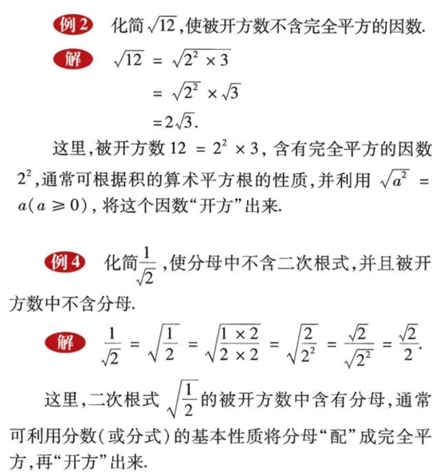  
          按照例(2) 和例(4) 的要求, `化简后的二次根式被开方数中不含分母, 并且被开方数中所有因数(或因式)的幂的指数都小于2, 像这样的二次根式称为最简二次根式.` 
- 21.3 二次根式的加减 (10)
    + **概括**
        - 与整式中同类项相类似, 我们把像 $3\sqrt{a}$, $-2\sqrt{a}$ 与 $4\sqrt{a}$
          这样的几个二次根式, 称为同类二次根式.  
        - 二次根式的加减, 与整式的加减类似, 关键是将同类二次根式合并.
        - 例如:  
          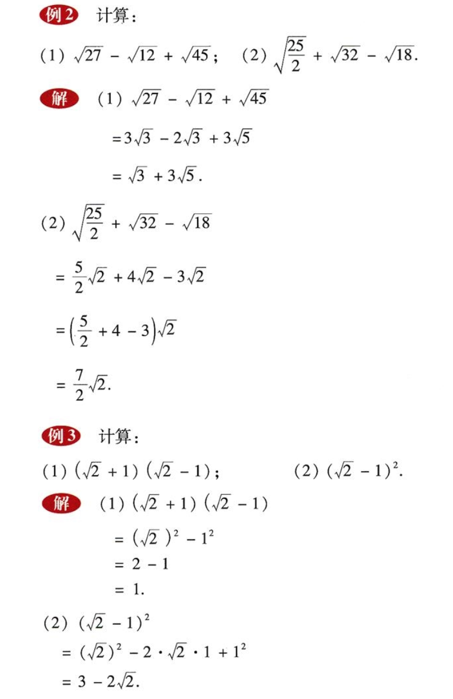
- 21.4 小结 (13)
- 21.5 复习题 (15)
### 第 22 章 -- 一元二次方程
- 22.1 一元二次方程 (18)
    + 问题  
      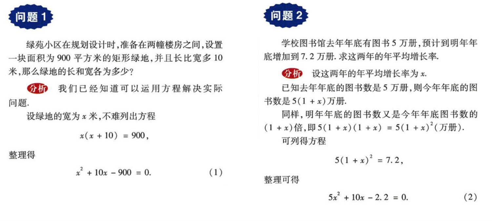
    + **概括**:
        - 上述问题中 (1) 和 (2) 两个整式方程中都只含有一个未知数($x$),
          并且未知数的最高次数是 2 (注: $x^2$), 这样的方程叫做 **`一元二次方程`**
          (quadratic equation with one unknown). 一元二次方程的一般形式是:
          $$
            \color{#E87631}{\large ax^2 + bx + c = 0} \quad (\large a \neq 0; \; a, b, c 是已知数)
          $$
- 22.2 一元二次方程的解法 (20)
    + 22.2.1 直接开平方法和因式分解法 (20)
        - **`直接开平方法`**: 
            + (1) 解方程 $x^2$ = 4;
            + 解: 对于题 (1) 有这样的解法:  
              方程 $x^2 = 4 \;$ 意味着 $x$ 是 4 的平方根, 所以 $x = \pm \sqrt{4}$,  
              即 $x = \pm 2$. 这里得到了方程的 2 个根, 通常也表示成  
              $\quad \quad \quad$ $x_1 = 2, x_2 = -2$.  
              这种解一元二次方程的方法叫做 **直接开平方法**.
        - **`因式分解法`**:
            + (2) 解方程 $x^2 - 1 = 0$.
            + 解: 对于题 (2) 有这样的解法:  
              将方程左边用平方差公式分解因式, 得  
              $(x - 1)(x + 1) = 0$,  
              必有 $x - 1 = 0 或 x + 1 = 0$.  
              分别解这 2 个一元一次方程, 得  
              $\quad \quad \quad$ $x_1 = 1, x_2 = -1$.  
              这种解一元二次方程的方法叫做 **因式分解法**.
        - **例1** 解下列方程:
            + (1) $x^2 - 2 = 0$. $\quad$ (2) $16x^2 - 25 = 0$  
              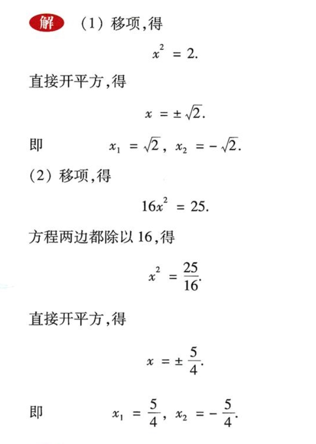
        - **例2** 解下列方程:
            + (1) $3x^2 + 2x = 0$. $\quad$ (2) $x^2 = 3x$.  
              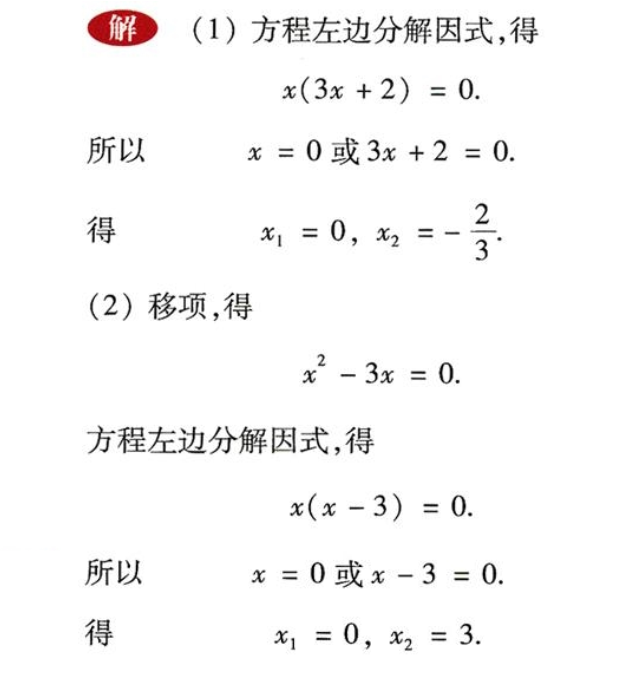
        - **读一读: 什么时候两数的乘积为零** -- 谈谈因式分解法解方程的依据
            + 用因式分解法解一元二次方程时, 我们现将左边化为 2 个一次因式的乘积, 
              右边是 0 的形式, 如 "试一试" 中的 $(x - 1)(x + 1) = 0$; 
              然后由乘积等于 0, 得到 2 个因式中至少有一个等于 0, 从而将一元二次方程
              "降次", 转化为 2 个一元二次方程: $x - 1 = 0$ 和 $x + 1 = 0$ 来解.  
               $\quad$ 这里方程变形的依据, 实际上还是关于等式的性质: 
               `两数乘积等于零, 必须且只需其中至少有一个乘数等于 0`. 也就是说,
               当且仅当 $a = 0$ 或 $b = 0$ 时, $ab = 0$, 证明如下:  
               $\quad$ 设 $a, b$ 是两个实数, 如果 $a = 0$ 或 $b = 0$,
               因为 0 乘以任何数都等于 0, 所以 $ab = 0$;  
               $\quad$ 反过来, 如果 $ab = 0$, 那么必须有 $a = 0$ 或 $b = 0$.
               我们不难用反证法证明这个结论. 事实上, 假设结论不成立, 即 $a \neq 0$
               且 $b \neq 0$, 这时必有 $ab \neq 0$, 与已知 $ab = 0$ 矛盾, 
               所以假设不成立, 即 $a = 0$ 或 $b = 0$.
        - **例(3)** 解下列方程:
            + (1) $(x + 1)^2 - 4 = 0$; $\quad$  (2) $12(2 - x)^2 - 9 = 0$.
                - 解: 略   
    + 22.2.2 配方法 (25)
        - **例(4)** 解方程: $x^2 + 2x = 5$.  
          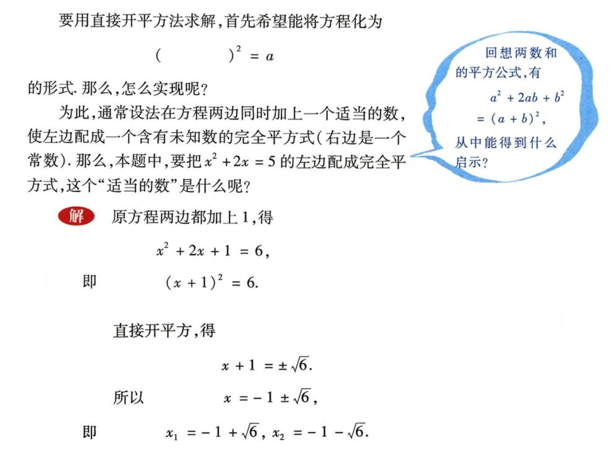
        - **`配方法`**: 这里的解法，是通过方程的简单变形，`将左边配成一个含有未知数的完全平方式`,
          `右边是一个非负常数，从而可以直接开平方求解. 这种解一元二次方程的方法叫做配方法`.  
          (**提示: 一般情况下一元二次方程`不能使用 因式分解法 的时候才会考虑 配方法`.**)
        - **例(5)** 用配方法解方程:
            + (1) $x^2 - 4x + 1 = 0$; $\quad$ (2) $4x^2 - 12x - 1 = 0$.  
              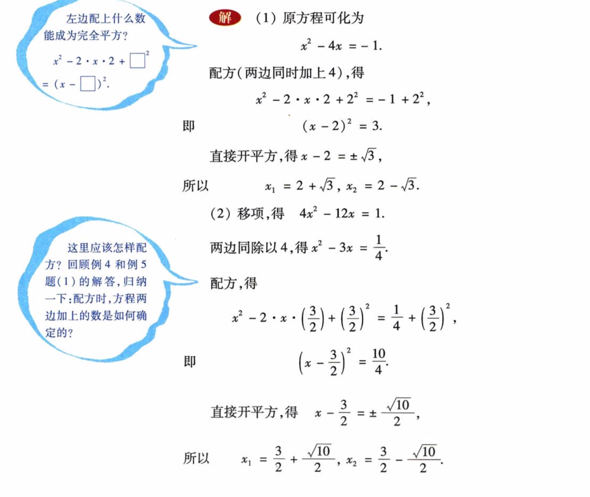
            + 配方时, 方程两边同时加上的数是如何确定的? (即: 配方法的一般步骤是:)
                - (1) 方程两边同时除以二次项系数, 将二次项系数化为 1.
                  (Tip: 例(5) 的第 (2) 个示例中, 两边同时除以 4 使 $4x^2$ 变成 $x^2$)
                - (2) 移项, 使方程左边只有二次项和一次项, 常数项在右边;
                - (3) 配方, **方程两边同时加上一次项系数一半的平方, 使方程左边为一个完全平方式,**
                  **右边是一个常数**; (Tip: △此步为重点)
                - (4) 通过 (3) 使方程变形为 $(x + m)^2 = n$ 的形式;
                - (5) 如果此时右边(n)是非负数, 两边直接开平方解这个一元二次方程.
                - (6) 如果右边是负数, 则方程无解.
    + 22.2.3 公式法 (28)
        - 我们来解一般形式的一元二次方程 
          $$
            \color{#E87631}{\large ax^2 + bx + c = 0 \quad (a \neq 0)}
          $$
          因为 $a \neq 0$, 所以两边同除以 $a$ 得
          $$
            x^2 + \frac{b}{a}x + \frac{c}{a} = 0
          $$
          移项, 得 
          $$
            \quad x^2 + \frac{b}{a}x = - \frac{c}{a}
          $$
          配方(关键步骤), 得 
          $$
          \quad x^2 + 2 \cdot x \cdot \frac{b}{2a} + (\frac{b}{2a})^2 = (\frac{b}{2a})^2 - \frac{c}{a}
          $$
          即 $\quad (x + \frac{b}{2a})^2 = \frac{b^2 - 4ac}{4a^2}$  
          因为 $a \neq 0,$ 所以 $4a^2 > 0$. 当 $b^2 - 4ac \geq 0$ 时, 直接开平方,得 
          $$
            x + \frac{b}{2a} = \frac{\sqrt{b^2 - 4ac}}{|2a|} = \pm \frac{\sqrt{b^2 - 4ac}}{2a}
          $$
          所以
          $$
            x = -\frac{b}{2a} \pm \frac{\sqrt{b^2 - 4ac}}{2a}
          $$
          即当 a > 0 时: 
          $$
            x_1 = - \frac{b}{2a} + \frac{\sqrt{b^2 - 4ac}}{2a} = \frac{-b + \sqrt{b^2 - 4ac}}{2a}
          $$
          当 a < 0 时:
          $$
            x_2 = - \frac{b}{2a} - \frac{\sqrt{b^2 - 4ac}}{2a} = \frac{-b - \sqrt{b^2 - 4ac}}{2a}
          $$
        - 由以上研究, 得到了一元二次方程 $ax^2 + bx + c = 0$ 的求根公式:
          $$
          \color{#E87631}{\large x = \frac{-b \pm \sqrt{b^2 - 4ac}}{2a}} \quad (b^2 - 4ac \geq 0).
          $$
        - **`公式法`**: `将一元二次方程中系数` $a, b, c$ `的值, 直接代入这个公式,`
          `就可以求得方程的根. 这种解一元二次方程的方法叫做公式法`
        - **例(6)**解下列方程:
            + (1) $2x^2 + x - 6 = 0$; $\quad$ (2) $x^2 + 4x = 2$;  
              (3) $5x^2 - 4x - 12 = 0$; $\quad$ (4) $4x^2 + 4x + 10 = 1 - 8x$.
            + 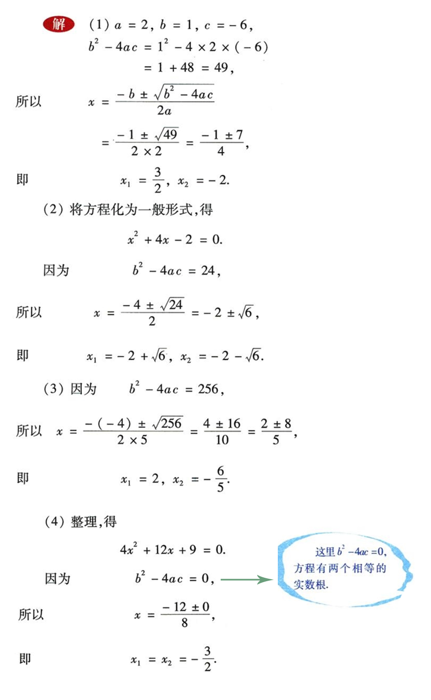
    + 22.2.4 一元二次方程根的判别式 (31)
      
        - 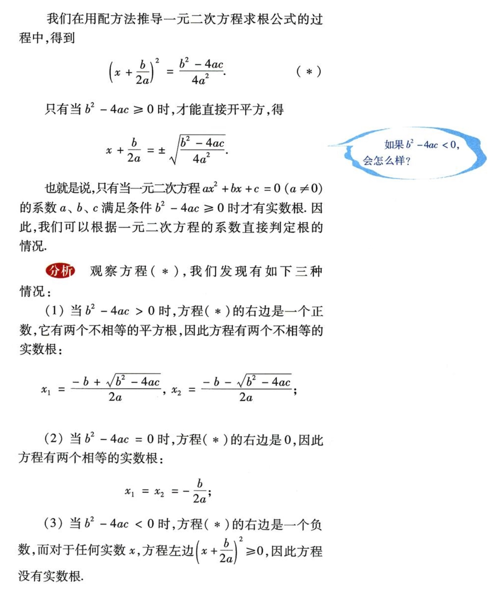
        - **概括**:
            + 这里的 $\color{#E87631}{b^2 - 4ac}$ 叫做一元二次方程**`根的判别式`**,
              通常用符号 $\color{#E87631}{\Delta}$ 来表示,
              用它可以直接判断一元二次方程 $ax^2 + bx + c = 0 \; (a \neq 0)$ 
              的实根的情况:  
                - 当 $\color{#E87631}{\Delta > 0}$ 时, 方程有 2 个不相等的实数根;
                - 当 $\color{#E87631}{\Delta = 0}$ 时, 方程有 2 个相等的实数根;
                - 当 $\color{#E87631}{\Delta < 0}$ 时, 方程没有实数根. 
        - **例(7)** 不解方程, 判断下列方程的根的情况:
            + (1) $3x^2 = 5x - 2$; $\quad$ (2) $4x^2 - 2x + \frac{1}{4} = 0$;
              $\quad$ (3) $4(y^2 + 1) - y = 0.$
            + 解: 略 (注: 只需判断 $\Delta$ $> 或 = 或 <$ 0 即可)
    + 22.2.5 一元二次方程的根与系数的关系 (33)
        - 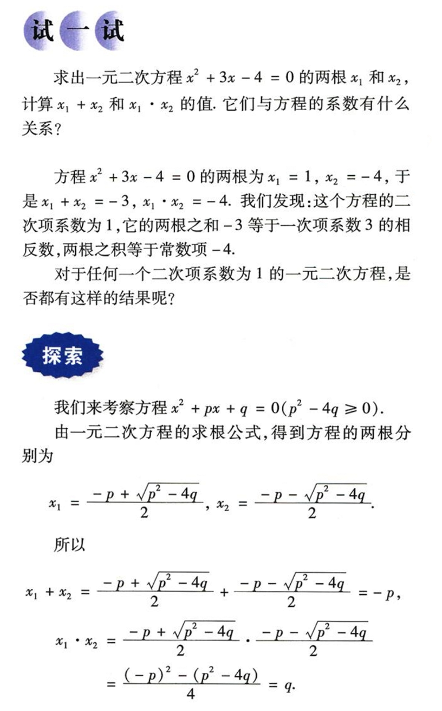
        - **概括:**
            + 二次项系数为 1 的一元二次方程根与系数的关系:  
              设一元二次方程 $x^2 + px + q = 0$ 的两根为 $x_1, x_2$, 那么
              $$
                x_1 + x_2 = -p, \; x_1 \cdot x_2 = q.
              $$
        - **例(8)** 不解方程, 求出方程的两根之和与两根之积:           
            + (1) $x^2 + 3x - 5 = 0$; $\quad$ (2) $2x^2 - 3x - 5 = 0$.
            + 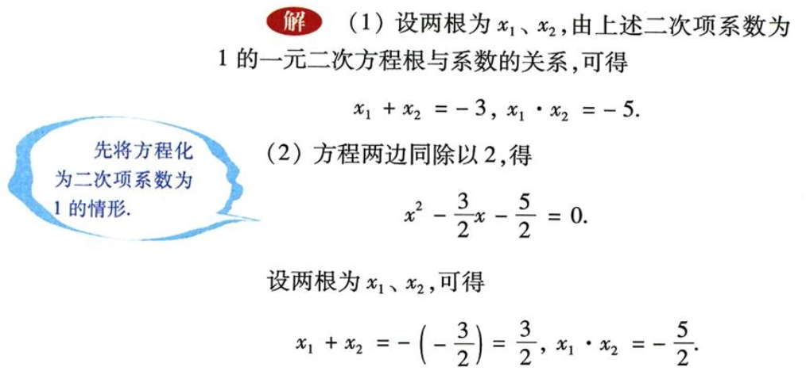
        - **例(9)** 试探索一元二次方程 $ax^2 + bx + c = 0$ 
          $(a \neq 0, \; b^2 - 4ac \geq 0)$ 的根与系数的关系.  
          **解:** 方程两边同时除以 $a$, 得
          $$
            \color{#E87631}{x^2 + \frac{b}{a}x + \frac{c}{a} = 0}.
          $$
          由二次项系数为 1 的一元二次方程根与系数的关系(注: 即上面的公式`(12)`), 可得
          $$
            \color{#E87631}{x_1 + x_2 = -\frac{b}{a} , \quad
            x_1 \cdot x_2 = \frac{c}{a}}.
          $$
          这就是一般情形下一元二次方程的根与系数的关系, 前面概括的结论是它的特例 (二次项系数为 1 的情形).  
          利用这个结论, 我们可以直接写出例(8) 中题 (2) 的答案:  
          $x_1 + x_2 = -(\frac{-3}{2}) = \frac{3}{2}$,
          $x_1 \cdot x_2 = \frac{-5}{2} = -\frac{5}{2}$
        - **练习**: 请做 (2), (3) 题.
        - **习题 22.2**: 请做一下奇数的题目(即: 1, 3, 5, ...... )  
- *阅读材料 "代数学之父" 韦达* (37)
    + 一元二次方程的根与系数的关系最早由法国数学家 韦达
      (François Viète, 弗朗索瓦·韦达 1540 - 1603) 发现,习惯上也称作 **韦达定理**.
      `韦达定理更一般地揭示了一元 n 次方程的根与系数的关系`,
      一元二次方程是其特例.
    + 韦达是 16 世纪最有影响的数学家之一, 被尊称为 "代数学之父". 
      他是第一个引进系统的代数符号, 并对方程论做了改进的数学家.
- 22.3 实践与探索 (28)
    + **问题(1)**:
      学校生物小组有一块长 $32 \, m$, 宽 $20 \, m$ 的矩形试验田, 为了管理方便,
      准备沿平行于两边的方向横, 纵各开辟一条等宽的小道. 
      要使试验田的种植面积为 $540 \, m^2$, 小道的宽应是多少?  
        - **分析:** 
            + (1) 问题中没有明确小道在试验田中的位置, 试着画出图形 22.3.1,
              不难发现小道的占地面积与位置无关.  
              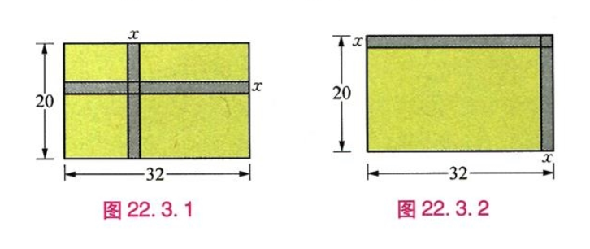
            + (2) 默认没有开辟小道的情况下, 试验田的种植面积为
              $32 \times 20 = 640 \, m^2$. (长方形的面积公式 = 长 x 宽);
            + (3) 我们设小道的宽为 $x \, m$, 那么横向小道的面积为 $32x \, m^2$;
            + (4) 因为纵向小道的宽度和横向小道的宽度相同都是 $x \, m$,
              所以纵向小道的宽度为 $20x \, m^2$;
            + (5) 我们观察图形注意到横向小道和纵向小道中间有一块重叠的部分,
              而且从图中可以观察出这个重叠的部分是一个边长为 $x$ 的正方形;
              题目要求试验田的种植面积为 $540 \, m^2$, 那么就需要用总面积 $640 \, m^2$
              减去横向小道和纵向小道的面积, 但是两条小道的重叠部分会被多减去一次, 
              所以我们需要把多减去的重叠小正方形加回来即可, 小正方形面积为 $x^2 \, m^2$.
        - **解:** 我们根据上面的分析来列出方程
          $$
            32 \times 20 - 32x - 20x + x^2 = 540
          $$
          合并简化方程, 得 $x^2 - 52x + 100 = 0$  
          (Note: `解一般的一元二次方程首先考虑 "因式分解", 若不行再考虑 "配方法" 或 "公式法"`)  
          因式分解, 得 $(x - 50)(x - 2) = 0$  
          解, 得 $x_1 = 50, \quad x_2 = 2$, 因为试验田的最长边才 $32 \, m$, 所以
          $x_1 = 50$ 舍去, 得 $x = 2$; 答: 小道的宽是 $2 \, m$.
    + **问题(2)**  
      某药品经过两次降价, 零售价由每瓶 56 元降为 31.5 元. 已知两次降价的百分率相同,
      求每次降价的百分率.
        - **分析:**
            + (0) 我们先总结出题目中存在的等量关系: **56 元的药经过两次降价 = 31.5 元.**
            + (1) 首先来分析, 每瓶药 56 元, 如果设每次降价的百分率为 $x$, 
              第一次降的价为 56 $\times$ $x$,  
              *第一次降价后的零售价 = 总价 56 元 - 第一次降的价*,  
              即: 56 - 56$x$, 合并后为 56(1 - $x$)
            + (4) 第二次降价是在第一次降价后的基础上(即: 56(1 - $x$) 元)
              再降 $x$个百分比, 即第二次的降价为: [56(1 - $x$)] $\times$ $x$:  
              *第二次降价后的零售价 =  第一次降价后的零售价 - 第二次降的价*,  
              即: 31.5 = 56(1 - $x$) - 56(1 - $x$)$x$ 
        - **解:**
            + 根据上面的分析列出方程:
              $$
                56(1 - x) - 56(1 - x)x = 31.5.
              $$
              (Note: 观察方程无法使用 "因式分解" 法, 等号右边的 31.5
              带有小数所以也不适合用 "配方法", 那么只有 "公式法" 比较合适)  
              把转化方程为 $x^2 + \frac{b}{a}x + \frac{c}{a} = 0$ 的形式,  
              $$
                x^2 - 2x + \frac{24.5}{56} = 0.
              $$
              接着套用求根公式: $x = \frac{-b \pm \sqrt{b^2 - 4ac}}{2a}$
              $\quad (b^2 - 4ac \geq 0)$.  
              解方程, 得 $x_1 = 0.25, \quad  x_2 = 1.75$.  
              因为降价的百分率不可能大于 1 (即: 100%), 所以 $x_2 = 1.75$ 不符合题意.
              经检验 $x_1$ = 0.25 = 25% 符合本题要求.  
              答: 每次降价的百分率为 25%.
    + **练习**
        + (1), (2), (3) 略
        + (4) 据某初级中学对毕业班学生三年来参加市级以上各项活动获奖情况的统计,
          七年级时有 48 人次获奖，之后逐年增加，到九年级毕业时累计共有 183 人次获奖,
          求这两年中获奖人次的平均年增长率.
            - 分析:
                + ① 分析: 这道题和上面的 **问题(2)** 是换汤不换药, 我们来写出分析过程:
                + ② 设每年平均年增长率为 $x$, 七年级有 48 人获奖, 那么,  
                  *八年级的获奖人数 = 七年级的获奖人数 + (七年级获奖人数 $\times$ 增长率 $x$).*  
                  即: 48 + 48 $\times$ $x$, 合并后即 48(1 + $x$)
                + ③ *九年级的获奖人数 = 八年级获奖人数 + (八年级获奖人数 $\times$ 增长率 $x$).*   
                  即: 183 = 48(1 + $x$) + [48(1 + $x$)] $\times$ $x$   
            - 解: 根据上面的分析列出方程:
              $$
                48(1 + x) + 48(1 + x)x = 183
              $$
              求解... 略
    + **问题(3)**
        - 小明把一张边长为 10cm 的正方形硬纸板的四周各剪去一个同样大小的正方形,
          再折叠成一个无盖的长方体盒子, 如果要求长方体的底面积为 81$cm^2$,
          那么剪去的正方形边长为多少?
          如图 22.3.3.  
          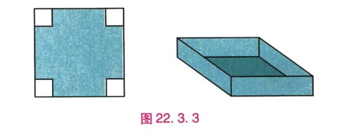
    + **问题(4)**
      
        -        
- 22.4 小结 (43)
- 22.5 复习题 (45)
### 第 23 章 -- 图形的相似
- 23.1 成比例线段 (48)
    + 23.1.1 成比例线段 (48)
    + 23.1.2 平行线分线段成比例 (51)
- *阅读材料 黄金分割* (56) 
- 23.2 相似图形 (57)
- 23.3 相似三角形 (61)
    + 23.3.1 相似三角形 (61)
    + 23.3.2 相似三角形的判定 (64)
    + 23.3.3 相似三角形的性质 (71)
    + 23.3.4 相似三角形的应用 (72)
- 23.4 中位线 (77)
- 23.5 位似图形 (80)
- *阅读材料 数学与艺术的美妙结合--分形* (82)
- 23.6 图形与坐标 (84)
    + 23.6.1 用坐标确定位置 (84)
    + 23.6.2 图形的变换与坐标 (88)
- 23.7 小结 (94)
- 23.8 复习题 (95)
### 第 24 章 -- 解直角三角形
- 24.1 测量 (100)
- 24.2 直角三角形的性质 (102)
- 24.3 锐角三角函数 (105)
- 24.4 解直角三角形 (111)
- *阅读材料 葭生池中* (118)
- 24.5 小结 (119)
- 24.6 复习题 (120)
- 综合与实践 高度的测量 (124)
### 第 25 章 -- 随机事件的概率
- 25.1 在重复试验中观察不确定现象 (126)
- *阅读材料*
    + *计算机帮我们画趋势图* (134)
    + *搅匀对保证公平很重要* (135)
- 25.2 随机事件的概率 (136)
    + 25.2.1 概率及其意义 (136) 
    + 25.2.2 频率与概率 (141)
    + *阅读材料 电脑键盘上的字母为何不按字母顺序排列* (147)
    + 25.2.3 列举所有机会均等的结果 (149)
- *阅读材料*
    + *The Birthday Problem 生日问题* (155)   
    + *模拟实验* (157)
- 25.3 小结 (158)
- 25.4 复习题 (159)
- 综合与实践 骰(tóu)子与概率 (162)