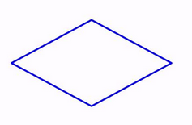
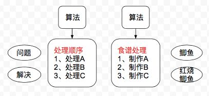
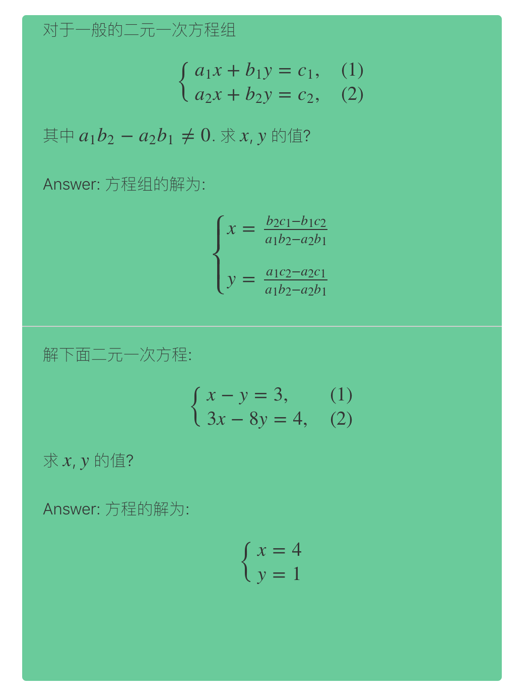
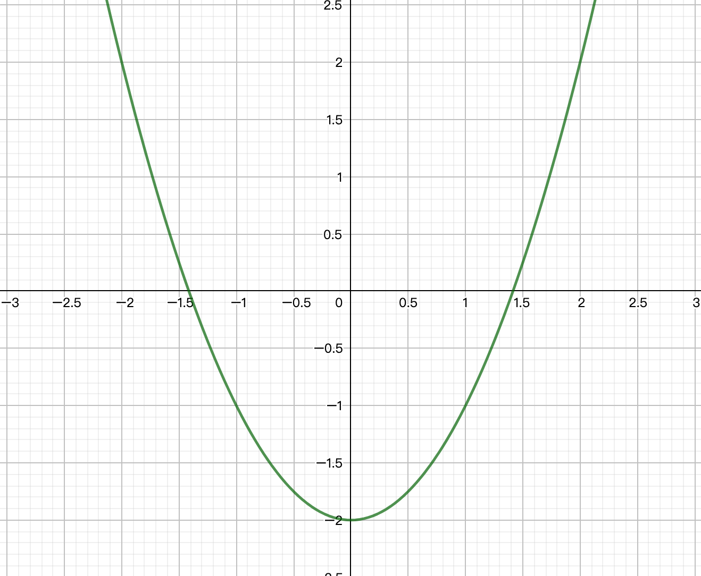
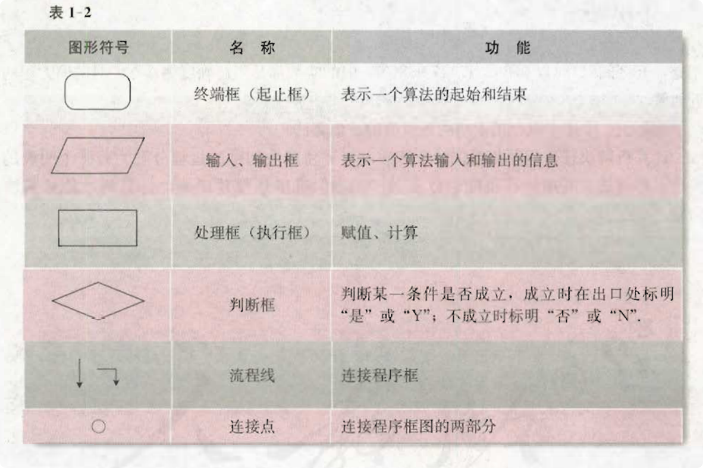
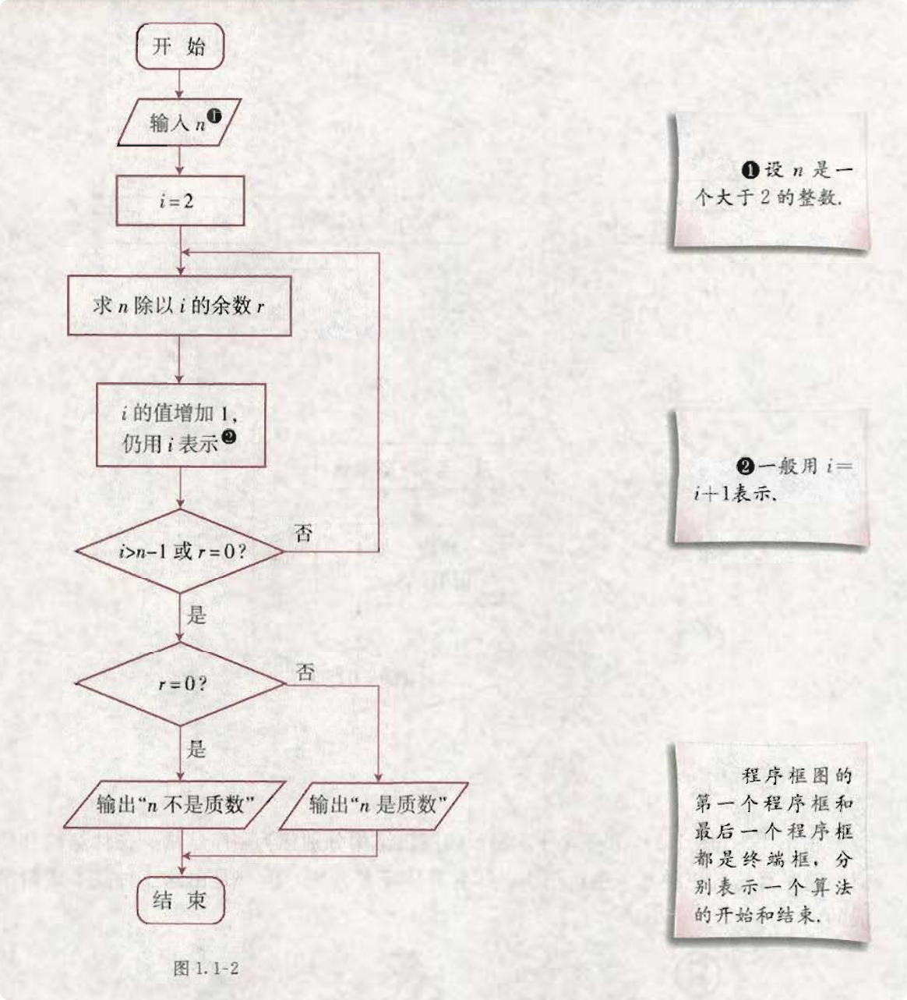
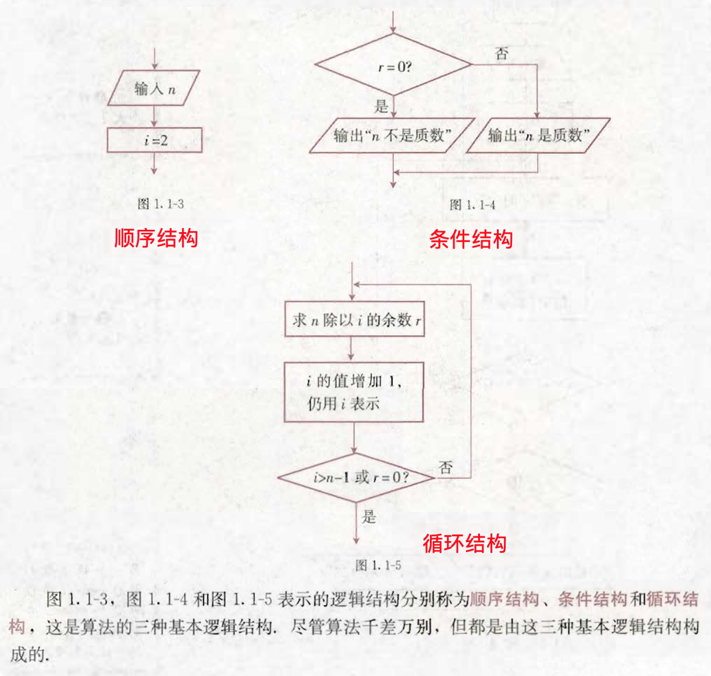
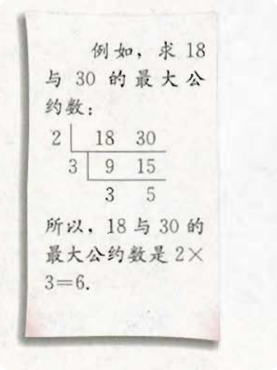

# 必修 3


## 本书部分常用符号

- <span style="display: inline-block; width: 120px; height: 36px;
        margin-right: 50px; border-radius: 4px; border: 1px solid black;">
   </span>
终端框(起止框) 

- <span style="display: inline-block; width: 100px; height: 32px;
        transform: skewX(-45deg); margin: 10px 50px 10px 10px;
        border: 1px solid black;">
   </span>
输入, 输出框 

- <span style="display: inline-block; width: 120px; height: 36px;
        margin-right: 50px; border: 1px solid black;">
   </span>
处理框 (执行框)

-  判断框
- $S$: 标准差
- $S^2$: 方差
- $f_n(A)$: 事件 $A$ 出现的`频率`
- $P(A)$: 事件 $A$ 出现的`概率`


## Catalog
- 第 1 章 -- 算法初步
    + 1.1 算法与程序框图
    + 1.2 基本算法语句
    + 1.3 算法案例
        - 阅读与思考: 割圆术
    + 小结
	+ 复习参考题
- 第 2 章 -- 统计
    + 2.1 随机抽样
        - 阅读与思考:
            + (1) 一个著名的案例
            + (2) 广告中数据的可靠性
            + (3) 如何得到敏感性问题的诚实反应
    + 2.2 用样本估计总体
        - 阅读与思考: 生产过程中的质量控制图
    + 2.3 变量间的相关关系
        - 阅读与思考: 相关关系的强与弱
    + 小结
	+ 复习参考题
- 第 3 章 -- 概率
    + 3.1 随机事件的概率
        - 阅读与思考: 天气变化的认识过程
    + 3.2 古典概型
    + 3.3 几何概型
        - 阅读与思考: 概率与密码
    + 小结
	+ 复习参考题  


## New Words
- **algorithm ['ælgərɪð(ə)m]  --n.算法**
    + mathematics and algorithm  数学和算法
    + a basic algorithm for division. 除法基本法则. 
- **deviation [diːvɪ'eɪʃ(ə)n] --n.偏差, 背离, 偏离**
    + absolute deviation 绝对偏差
    + deviation from a norm. 背离标准
    + standard deviation. 标准偏差
- **variance ['veərɪəns] --n.[数]方差; 不一致; 变化**
    + My ideas are at variance with his. 我的思想和他的不同.
    + variances in temperature. 温度的变化.
- **dichotomy [daɪˈkɔtəmɪ] --n.二分法; 二分, 两分**
    + This is a false dichotomy. 这是一个错误的二分法.
- **scatter ['skætə] --v.分散; 散开. --n.分散; 散播**
    + The farmers were scattering seed on the fields.
        农夫把种子撒在田里.
    + Small villages scatter at the foot of the mountain.
        村庄零零落落地散布在山脚下.    
- **regression [rɪ'ɡreʃn] --n.复原; 退步; 回归(一种数学方法)**
    + regression line. 回归直线
    + equation of linear regression. 线性回归方程.
    + A way to solve this problem is to perform logistic regression
      解决此问题的一种方法是进行逻辑回归.
- **dichotomy [daɪˈkɑtəmi]{US} --n.二分(法), 一分为二**
    + dichotomy search 二分查找


## Additional Content
### (1) 算法是什么?
- 其实在没有电脑之前, 就已经有算法了. **它是解决某个问题的计算方法, 步骤.**

  比如: 小学算术乘法表, 九九八十一. 比如: 妈妈做饭脑子里出现的食谱, 先炒,
  再炖, 再小伙收汁 (我又饿了`^_^`.)

  **计算机算法, 是用计算机解决问题的方法, 步骤. 解决不同的问题, 需要不同的算法.**

  例如下图:
  
  

  *Hint:* 此笔记来自此 [文章](https://www.zhihu.com/question/55136787)
  中 *大头妹D* 的回答.

### (2) 质数 和 约数
- 什么是 `质数`?
    + 定义: 质数(又称 素数): 质数是大于 1 的自然数中, 除了 1 和它本身外,
      不能被其他自然数 (0 除外) 整数的数.
- 如何判断一个数是不是质数?
    + 根据定义, 因为质数除了 1 和本身之外没有其他约数, 所以判断 `n` 是否为质数,
      根据定义直接判断从 2 到 `n - 1` 是否存在 `n` 的约数即可.
- `约数` 是什么?
    + 定义: `约数` 又叫 `因数`. 若一个数 a 能够整数另一个数 b, 那么称 b 就是
      a 的约数. <br>
      (详细定义: 整数 a 除以整数 b(b $\neq$ 0) 除得的商正好是整数而没有余数,
      我们就说 a 能被 b 整除. a 称为 b 的倍数, b 称为 a 的约数.)
    + 例如:
        - (1) 4 的正约数有: 1, 2, 4. 
        - (2) 6 的正约数有: 1, 2, 3, 6.
        - (3) 10 的正约数有: 1, 2, 5, 10.
        - (4) 12 的正约数有: 1, 2, 3, 4, 12.
        - (5) 15 的正约数有: 1, 3, 5, 15.
    + **Notice:** 一个数的约数必须包括 1 及其本身.


## Content

### 第 1 章 -- 算法初步

#### 1.1 算法与程序框图
##### 1.1.1 算法的概念
- `算法(algorithm)` 一词出现于 12 世纪, 指的是用阿拉伯数字进行算数运算的过程.
  在数学中, 算法通常是指按照一定规则解决某一类问题的明确和有限的步骤. 现在,
  算法通常可以编成计算机程序, 让计算机执行并解决问题.
- <i style="color: red;">Think?</i> 你能写出求解一般的 `二元一次方程组`
  的步骤吗?

  <strong style="color: #ff9900;">例 (0)</strong>: 对于一般的二元一次方程组
  $$
    \begin{cases}
    a_1x + b_1y = c_1,  & \text{(1)}  \\
    a_2x + b_2y = c_2,  & \text{(2)}
    \end{cases}
  $$
  其中 $a_1b_2 - a_2b_1 \neq 0$. 求 $x$, $y$ 的值?

  A: 首先我们来分析, 即然求 $x$, $y$ 的值, 首先想到的是, 在求解 $x$ 的过程中不能出现
  $y$ , 因为 $a_1, a_2, b_1, b_2, c_1, c_2$ 都是已知的常数项系数,
  求解 $y$ 的时候, 计算中不能出现 $x$, 然后分别求出即可.
  那现在我们就按照这个逻辑分步写出求解过程.
  
  **第 1 步**: 我们先想法约去两个二元一次方程中的 $y$, 即可求出 $x$ 的值:

  我们让 $(1) \times b_2$ - $(2) \times b_1$, 消去 $y$ 后得:
  
  **Hint: 请一定在纸上写一下计算步骤, 你以为理解的东西, 可能事实上并没有.**
  $$
    (a_1b_2 - a_2b_1)x = b_2c_1 - b_1c_2. \quad \text{(3)}
  $$
  **第 2 步**: 求解 $(3)$ 得
  $$
    x = \frac{b_2c_1 - b_1c_2}{a_1b_2 - a_2b_1}.
  $$
  **第 3 步**: 我们让 $(1) \times a_1$ - $(2) \times a_2$, 消去 $x$ 后得:
  $$
    (a_1b_2 - a_2b_1)y = a_1c_2 - a_2c_1. \quad \text{(4)}
  $$
  **第 4 步**: 求解 $(4)$ 得
  $$
    y = \frac{a_1c_2 - a_2c_1}{a_1b_2 - a_2b_1}.
  $$
  **第 5 步**: 得到方程组的解为:
  $$
    \begin{cases}
        x = \frac{b_2c_1 - b_1c_2}{a_1b_2 - a_2b_1}  \\[2ex]
        y = \frac{a_1c_2 - a_2c_1}{a_1b_2 - a_2b_1}
    \end{cases}
  $$
  上述步骤构成了解二元一次方程组的一个算法, 我们可以进一步根据这一算法来编写计算机程序,
  让计算机来解二元一次方程组.
- 你可能会好奇,上面的 `例(0)` 如果真的用编程语言来实现, 到底是个什么样?
  那么我此处就用"网页三剑客"(`HTML + CSS + JavaScript`)来实现上面这个简单的算法.

  (tip: 网页三剑客为一个称呼, 它们三个是我们平时上网,
  在浏览器(IE/Chrome)中浏览的网页的基本组成(即: 网页基本由这三部分构成),
  这里面真正复杂的只有 `JavaScript`, 也只有它才是真正的编程语言; `HTML`
  为超文本标记语言, `CSS` 为层叠样式表, 是用来定义如何显示 HTML 的.).

  **Hint: 下面这些内容已经超出了高中所学范围, 如果你感兴趣,
  等高考完后再去了解不迟.**
  
  使用 JavaScript 实现二元一次方程组求解的算法如下:
  ```html
    <!doctype html>
    <html lang="en">
    <head>
        <meta charset="UTF-8">
        <meta name="viewport"
            content="width=device-width, user-scalable=no, initial-scale=1.0,
            maximum-scale=1.0, minimum-scale=1.0">
        <meta http-equiv="X-UA-Compatible" content="ie=edge">
        <title>high school algorithm demo</title>
        <!-- 首先添加内联配置的选项, 这个选项需要写在下面 cdn 加载 MathJax 之前.-->
        <!-- tip: 內连配置即允许 MathJax 公式和 html 元素写在同一行,
            或者写成一个代码块. -->
        <script type="text/x-mathjax-config">
            MathJax.Hub.Config({
                tex2jax: {
                    inlineMath: [ ['$','$'], ["\\(","\\)"] ],
                    displayMath: [ ['$$','$$'], ["\\[","\\]"] ]
                }
            });
        </script>
        <!-- 引入 MathJax 国内 CDN 镜像, 实现在页面中显示 LaTex 公式 -->
        <link rel="dns-prefetch" href="//cdn.bootcss.com" />
        <link rel="dns-prefetch" href="//cdn.mathjax.org" />
        <script src="//cdn.bootcss.com/mathjax/2.7.0/MathJax.js?config=TeX-AMS-MML_HTMLorMML"></script>
        
        <!-- 引用 Typo.css 重置默认 CSS 样式. -->
        <link rel="stylesheet" href="./typo.css">
        <style type="text/css">
            .container {
                width: 66%;
                margin: 20px auto;
                background: #66cc99;
                border-radius: 4px;
                min-height: 660px;
            }
            .container p {
                margin-left: 20px;
                margin-bottom: 20px;
            }
            .MathJax{ outline: 0; }
        </style>
    </head>
    <body>
        <div class="container">
            <p>
                <span>对于一般的二元一次方程组</span>
                $$
                \begin{cases}
                    a_1x + b_1y = c_1,  & \text{(1)}  \\
                    a_2x + b_2y = c_2,  & \text{(2)}
                \end{cases}
                $$
                其中 $a_1b_2 - a_2b_1 \neq 0$. 求 $x$, $y$ 的值?
            </p>
            <p>
                <span>Answer: 方程组的解为: </span>
                $$
                \begin{cases}
                x = \frac{b_2c_1 - b_1c_2}{a_1b_2 - a_2b_1}  \\[2ex]
                y = \frac{a_1c_2 - a_2c_1}{a_1b_2 - a_2b_1}
                \end{cases}
                $$
            </p>
            <hr>
            <p>
                <span>解下面二元一次方程: </span>
                $$
                \begin{cases}
                x - y = 3,  & \text{(1)}  \\
                3x - 8y = 4,  & \text{(2)}
                \end{cases}
                $$
                求 $x$, $y$ 的值?
            </p>
            <p>
                <span>Answer: 方程的解为: <br>
                    <i class="result"></i>
                </span>
            </p>
        </div>
        <script>
            // - 首先声明一个用来表示二元一次方程组的函数, 此函数接收一个 6 个属性的对象
            function linearEquations(obj) {
                let {a1 = 1, a2 = 1, b1 = 1, b2 = 1, c1 = 1, c2 = 1} = obj;
              
                // - 直接套用上面解二元一次方程组解的公式即可.
                let x = (b2 * c1 - b1 * c2) / (a1 * b2 - a2 * b1);
                let y = (a1 * c2 - a2 * c1) / (a1 * b2 - a2 * b1);
                return {x, y}
            }
  
            const obj = {
                a1: 1,
                a2: 3,
                b1: -1,
                b2: -8,
                c1: 3,
                c2: 4
            };
            let {x, y} = linearEquations(obj)
  
            const resultI = document.querySelector('.result');
            resultI.innerHTML =
                `
                    $$
                    \\begin{cases}
                        x =  ${x}  \\\\
                        y =  ${y}
                    \\end{cases}
                    $$
                `
        </script>
    </body>
    </html>
  ```
  效果图如下:

  
- <strong style="color: #ff9900;">例 (1)</strong>: 
    + (1) 设计一个算法, 判断 7 是否为质数.
    + (2) 设计一个算法, 判断 35 是否为质数.

  *Additional Info*: 如何判断一个数是不是质数?
    + 根据定义, 因为质数除了 1 和本身之外没有其他约数, 所以判断 `n` 是否为质数,
      根据定义直接判断从 2 到 `n - 1` 是否存在 `n` 的约数即可.
      
  
  `算法分析`:
    + (1) 根据质数的定义, 可以这样判断: 依次用 2 ~ 6 除 7, 如果它们中有一个能整除
      7, 则 7 不是质数, 否则 7 是质数.  
      根据以上分析, 可写出如下的算法:
        - 第 1 步: 用 2 除 7, 得到余数 1, 因为余数不为 0, 所以 2 不能整数 7.
        - 第 2 步: 用 3 除 7, 得到余数 1, 因为余数不为 0, 所以 3 不能整数 7.
        - 第 3 步: 用 4 除 7, 得到余数 3, 因为余数不为 0, 所以 4 不能整数 7.
        - 第 4 步: 用 5 除 7, 得到余数 2. 因为余数不为 0, 所以 5 不能整除 7
        - 第 5 步: 用 6 除 7, 得到余数 1. 因为余数不为 0, 所以 6 不能整除 7.
          因此, 7 是质数.
    + (2) 类似地，可写出“判断 35 是否为质数”的算法:
        - 第 1 步，用 2 除 35, 得到余数 1. 因为余数不为 0, 所以 2 不能整除 35
        - 第 2 步，用 3 除 35, 得到余数 2. 因为余数不为 0, 所以 3 不能整除 35.
        - 第 3 步，用 4 除 35, 得到余数 3. 因为余数不为 0, 所以 4 不能整除 35.
        - 第 4 步，用 5 除 35, 得到余数 0. 因为余数为 0, 所以 5 能整除 35.
        因此，35 不是质数.
  
- <strong style="color: #ff9900;">探究</strong> 你能写出 "判断整数 $n(n >2)$"
  是否为质数" 的算法吗?
    + 对于任意大于 2 的整数 $n$, 若用 $i$ 表示 2 ~ ($n$ - 1) 中的任意一整数,
      则 "判断 $n$ 是否为质数" 的算法包含下面的重复操作:
      
      用 $i$ 除 $n$, 得到余数 $r$. 判断余数 $r$ 是否为 0, 若是, 则 $n$ 不是质数;
      否则, 将 $i$ 的值加 1, 再执行同样的操作.

      这个操作一直进行到 $i$ 的值等于 $(n - 1)$ 为止. 因此,
      "判断 $n$ 是否为质数" 的算法可以写成:
        - 第 1 步, 给定大于 2 的整数 $n$.
        - 第 2 步, 令 $i$ = 2 (即: 2 为起始值.).
        - 第 3 步, 用 $i$ 除 $n$, 得到余数 $r$
        - 第 4 步, 判断 "$r = 0$" 是否成立, 若成立, 则 $n$ 不是指数, 结束算法;
          否则, 将 $i$ 的值加 1, 仍用 $i$ 表示.
        - 第 5 步, 判断 "$i > (n-1)$" 是否成立. 若是, 则 $n$ 是质数, 结束算法;
          否则, 返回到第 3 步.
    + 用 `JavaScript` 实现的源码如下:
      ```js
         // - 判断一个数是否为质数
        function isPrime(num) {
            if (num <= 2) return;
            let i = 2;
            let len = num - 1;
            for (; i <= len; i++) {
                if ( num % i === 0) {
                    return false;
                }
            }
            return true;
        }
        console.log(isPrime(7));    // true
        console.log(isPrime(25));   // false
      ```

- <strong style="color: #ff9900;">例 (2)</strong>: 写出用 "二分法"
  求方程 $x^2 - 2 = 0 (x > 0)$ 的近似解的算法.
    + *Additional Info (添加信息)*: 
        - (1) `函数零点`:  二次函数的图像与 $x$ 轴的焦点和相应的一元二次方程的根的关系,
          可以推广到一般情形, 为此, 先给出`函数零点`的概念:
            + 对于函数 $y = f(x)$, 我们把使 $f(x) = 0$ 的实数 $x$ 叫做函数
              $y = f(x)$ 的 `零点(zero point)`.
                - 实数: 有理数和无理数的总和.
            + 这样, 函数 $y = f(x)$ 的零点就是方程 $f(x) = 0$ 的实数根,
              也就是函数 $y = f(x)$ 的图像于 $x$ 轴的交点的横坐标, 所以: 
              方程 $f(x) = 0$ 有实数根 $\iff$(即:等价于) 函数 $y = f(x)$
              的图像与 $x$ 轴有交点 $\iff$ 函数 $y = f(x)$ 有零点.
        - (2) 一般地, 我们有:
          **如果函数 $y = f(x)$ 在区间 [a, b] 上的图像是连续不断的一条曲线,
          并且有 $f(a) \cdot f(b) < 0$, 那么,函数 $y = f(x)$在区间 (a, b)
          内有零点,即存在 $c\in(a, b)$, 使得 $f(c) = 0$, 这个 $c$ 也是方程
          $f(x) = 0$ 的根.**  -- 来自 <a href="./必修1.md">必修1.md</a>
    + **Added**: 为了更好的理解下面的 `算法分析`, 这里添加部分解说:
        - 先给出函数 $f(x) = x^2 -2$ 的图像:
          
          

          $x^2 -2 = 0$ 的解为 $x = \pm \sqrt[]{2}$, 即 $\pm \sqrt[]{2}$
          为函数的 `零点`. 

        - 我们现在来看标题: *写出用 `二分法` 求方程 $x^2 - 2 = 0 (x > 0)$
          的近似解的算法.*  我们上一行已经求出此方程的解为 $\pm \sqrt[]{2}$,
          标题中要求 $x > 0$ 那么 $x = \sqrt[]{2}$; 那这里的近似解又是什么意思?

          A: 实际上这里说的近似解就是$\sqrt[]{2}$ 的近似有理数根, 因为
          $\sqrt[]{2}$ 为无理数嘛! 那好, 现在的问题就变成了如何求 $\sqrt[]{2}$
          相对应的近似有理数是多少呢? 答: 求法就在标题里给出了, 对, 就是 `二分法`.

        - 现在的问题就为 `二分法` 又是什么? 
        
          A: `二分法(dichotomy)`$^\color{red}{*}$:
          指的是将一个整体事物分割成 2 部分. 即是说这 2 部分必须是互补事件,
          即所有事物必须属于双方中的一方, 且互斥, 没有事物可以同时属于双方.

          定义是看到了, 是不是还是很迷? 这个要怎么用? 

          这里先根据上面的图形和下面的 `算法分析` 给出一个白话解说;

          我们首先来想第一个问题, 求 $\sqrt[]{2}$ 的近似值,
          这个近似有理数需要精确到小数点后多少位? 咱们都知道 $\sqrt[]{2}$
          大致等于 1.414... 但是后面的我们就不怎么知道了,
          假如我需要精确到小数点后 6 位, 那么我们根据什么 "条件" 可以得到这个值?

          答: 这就牵扯到下面 `算法分析` 中使用的 `精确度`($d$) 了.
          那 `精确度` 是神马东西又怎么用? `精确度` 是近似数与精确数的接近程度,
          与下面 `算法分析` 中 $|a - b|$ 的值相对应, 先别着急,
          看完下面的讲解你便会明白.

          根据上面的图形我们可以看到, $\sqrt[]{2}$ 是处于 1 ~ 2 之间的一个数,
          根据 `二分法` 的定义, 我们可以把零点所在的区间缩小在 `[1, 2]` 之间,
          此区间的中点 $m = \frac{1 + 2}{2} = 1.5$.

          现在我们根据区间的中点 1.5 把 `[1, 2]` 区间分为 `[1, 1.5]` 和
          `[1.5, 2]`, 接着我们根据上面 *Additional Info (添加信息)* 的
          `(2)`中的定义来判断, 零点在哪个区间中, 也就是分别判断
          $f(1) \cdot f(1.5)$ 和 $f(1.5) \cdot f(2)$ 哪个值小于零, 

          我们代入可以得出 $f(1) \cdot f(1.5) < 0$, 那好,
          现在我们把 `[1, 1.5]` 区间确认为包含零点的区间,
          接着我们在取此区间的中点 $m= \frac{1 + 1.5}{2} = 1.25$, 
          那么现在的区间分为 `[1, 1.25]` 和 `[1.25, 1.5]`,
          接下来的操作和上一步是一样的, 结果请查看下面 `算法分析` 中的
          `表 1-1` 即可, 这里不再接着叙述......

          注意: 下面的 `算法分析` 讲解很简练, 请大家也仔细看一遍.

    + **`算法分析`**:
      
      令 $f(x) = x^2 -2$, 则方程 $x^2 -2 = 0$ 的解就是函数 $f(x)$ 的零点.
    
      `二分法` 的基本思想是: 把函数 $f(x)$ 的零点所在的区间 `[a, b]`
      一分为二(即: $\frac{a + b}{2}$ 其中 `[a, b]`
      所在的区间满足 $f(a) \cdot f(b)$ < 0), 这样得到 `[a, m]` 和 `[m, b]`
      2 个区间. 根据 $f(a) \cdot f(m) < 0$ 是否成立,
      取出零点所在的区间 `[a, m]` 或 `[m, b]`, 仍记为 `[a, b]` {tip: 新 `[a, b]`,
      这里更详细的描述见下面的 步骤 4}. 对所得的区间 `[a, b]` 重复上述步骤,
      直到包含零点的区间 `[a, b]` 足够小, 则 `[a, b]` 内的数可以作为方程的近似解.
      
      根据上面的分析可以写出如下的算法:
        - 第 1 步, 令 $f(x) = x^2 -2$, 给定精确度 $d^{Q1}$.
        - 第 2 步, 确定区间 `[a, b]`, 满足 $f(a) \cdot f(b) < 0$.
        - 第 3 步, 取区间中点 $m = \frac{a + b}{2}$.
        - 第 4 步, $f(a) \cdot f(m) < 0$, 则含零点的区间为 [a, m]; 否则,
          含零点的区间为 [m, b], 将新得到的含零点的区间仍记为 [a, b].
        - 第 5 步, 判断 [a, b] 的长度是否小于 $d$ 或 $f(m)$ 是否等于 0. 若是,
          则 $m$ 是方程的近似解; 否则, 返回第 3 步.
      
      当 $d = 0.005$ 时, 按照以上算法, 可以得到表 1-1 和图 1.1-1. 于是, 开区间
      (1.4140625, 1.41796875) 中的实数都是当精确度为 0.005 时的原方程的近似解.

      实际上, 上述步骤也是求 $\sqrt[]{2}$ 的近似值的一个算法.

      计算机解决任何问题都要依赖于算法, 只有将解决问题的过程分解为若干个明确的步骤,
      即算法, 并用计算机能够接受的 "语言" 准确地描述出来, 计算机才能够解决问题.
      
      | $a$ | $b$ | $|a-b|$ |
      |:--- | :--- | :--- |
      | 1 | 2 | 1 |
      | 1.25 | 1.5 | 0.5 |
      | 1.375 | 1.5 | 0.25 |
      | 1.375 | 1.5 | 0.125 |
      | 1.375 | 1.437 5 | 0.0625 |
      | 1.406 25 | 1.437 5 | 0.031 25 |
      | 1.406 25 | 1.421 875 | 0.015 625 |
      | 1.414 0625 | 1.421 875 | 0.007 812 5 |
      | 1.414 062 5 | 1.417 968 75 | 0.003 906 25 |

      
      
      (这截图的清晰度真是好气哦, 可还是要保持微笑. `^_^`)

##### 1.1.2 程序框图与算法的基本逻辑结构
- **(1) 程序框图**
    + **Hint:** `程序框图` 在日后学习各种编程语言的时候都会用的到.
    + `程序框图` 又称 `流程图`, 是一种程序框, 流程线及文字说明来表示算法的图形.

      在程序框图中,一个或几个程序框的组合表示算法中的一个步骤;
      带有方向箭头的流程线将程序框连接起来、表示算法步骤的执行顺序.
      `表 1-2` 列出了几个基本的程序框、流程线和它们表示的功能.
      
      
      
      *Tip:*
        - 圆角矩形 -- 终端框
        - 菱形 -- 输入/输出框
        - 矩形 -- 处理框(执行框)

      例如. 1.1.1 节中 "判断整数 $n (n > 2)$ 是否为质数"
      的算法就可以用下面的程序框图表示.

      
- **(2) 算法的基本逻辑结构**
    + 用程序框图表示算法时, 算法的逻辑结构展现得非常清晰. 图 1.1-2
      的程序框图中包含下面 3 种逻辑结构:
      
      


#### 1.2 基本算法语句
- **Note:** 整个章节的内容此处暂时先省略....

  因为我本身是写代码的(`JavScript`), 所以对这个
  `BASIC (Beginner's All-purpose Symbolic Instruction Code)`
  (初学者通用符号指令代码), 中的 `输入语句, 输出语句, 赋值语句, 条件语句, 循环语句`
  本身是比较熟悉的.

  **Tip:** 如果此章节的内容学起来很吃力, 也别气馁, 这些东西,
  在以后你学习任何一门编程语言时, 都会以一种更基础和详细的方式讲解到, 此处多看两遍,
  熟悉一下即可, 高考好像也不会把这算法相关的知识, 放入到大题的考查范围.


#### 1.3 算法案例
- **案例(1) 辗转相除法与更相减损术**
  
  在小学, 我们学过求 *两个正整数的最大公约数* 的方法: 先用两个数公有的质因数连续去除,
  一直除到所得的商是互质数为止, 例如:
  
  
  但是, 当两个数公有的质因数较大时(如 8251 与 6105),
  使用上述方法求最大公约数就比较困难. 下面介绍 2 中古老而有效的算法: 
    + **(1) `辗转相除法`**
      这种算法是由欧几里得在公元前 300 年左右首先提出的, 因而又叫 `欧几里得算法`.

      **Added 辗转相除法的定理: 两个正整数 `a` 和 `b` (a > b),
      它们的最大公约数等于 `a` 除以 `b` 的余数 `c` 和 ` b` 之间的最大公约数.** 
    
      例如: 求 10 和 25 之间的最大公约数 -- A: 25 除以 10 商 2 余 5, 那么 10 
      和 25 的最大公约数等同于 10 和 5 的最大公约数, 即 5.

      例如, 用辗转相除法求 `8251` 与 `6105` 的最大公约数,
      我们可以考虑用两数中较大的数除以较小的数, 求得商和余数:
      $$
        8251 = 6105 \times 1 + 2146.
      $$
      由此可得, 6105 与 2146 的公约数也是 8251 与 6105 的公约数, 反过来,
      8251 与 6105 的公约数也是 6105 与 2146 的公约数, 所以它们的最大公约数相等.
      
      对 6105 与 2146 重复上述步骤
      $$
        6105 = 2146 \times 2 + 1813.
      $$
      同理, 2146 与 1813 的最大公约数也是 6105 与 2146 的最大公约数.
      继续重复上述步骤:
      $$
        2146 = 1813 \times 1 + 33  \\
        1813 = 333 \times 5 + 148, \\ 
        333 = 148 \times 2 + 37,   \\
        148 = 37 \times 4.
      $$
      最后的除数 37 是 148 和 37 的最大公约数, 也就是 8251 与 6105
      的最大公约数这就是辗转相除法. 由除法的性质可以知道, 对于任意两个正整数,
      上述除法步骤总可以在有限步之后完成,
      从而总可以用辗转相除法求出两个正整数的最大公约数.
    + **(2) `更相减损术`**
      `《九章算术》` 是中国古代的数学专著, 其中的 `更相减损术` 也可以用来求 2
      个数的最大公约数, 即 "可半者半之, 不可半者, 副置分母, 子之数, 以少减多,
      更相减损, 求其等也, 以等数约之."
      
      翻译为现在语言如下:
        - 第 (1) 步: 任意给定 2 个正整数, 判断他们是否都是偶数, 若是, 用 2 约减;
          若不是, 执行第 (2) 步.
        - 第 (2) 步: 以较大的数减去较小的数, 接着把所得的差与较小的数比较,
          并以大数减小数. 继续这个操作, 直到所得的数相等为止, 则这个数(等数)
          或这个数与约简的数的乘积就是所求的最大公约数.
      
      下面我们用一个例子来说明这个算法.

      例(1): 用 `更相减损术` 求 98 与 63 的最大公约数. <br>
      解: 由于 63 不是偶数, 把 98 和 63 以大数减小数, 并辗转相间, 如下所示:
      $$
        98 - 63 = 35  \\
        63 - 35 = 28  \\
        35 - 28 = 7   \\
        28 - 7 = 21   \\
        21 - 7 = 14   \\
        14 - 7 = 7    \\
      $$
      所以, 98 与 63 的最大公约数等于 7.

- **阅读与思考: 割圆术**


### 第 2 章 -- 统计
#### 2.1 随机抽样

#### 2.2 用样本估计总体
##### 2.2.1 用样本的频率分布估计总体分布
##### 2.2.2 用样本的数字特征估计总体的数字特征
+ (1) 众数, 中位数, 平均数
    - `众数`: 数据中出现频率最多的数字.
    - `中位数`: 在 n 个数据由大到小排序后, 位在中间的数字.
    - `平均数 (Mean, 或称 平均值)`: 是统计中的一个重要概念. 为集中趋势的最常用测度值,
      目的是确定一组数据的均衡点.
        + 在统计中算术平均数常用于表示统计对象的一般水平, 它是描述数据集中程度的一个统计量.
          我们既可以用它来反映一组数据的一般情况, 也可以用它进行不同组数据的比较,
          以看出组与组之间的差别. 用平均数表示一组数据的情况, 有直观、简明的特点, 
          所以在日常生活中经常用到, 如平均的速度、平均的身高、平均的产量、平均的成绩等.
        + 不是所有类型的资料都能使用平均数, 在没有充分考虑个体和群体性质的状况下,
          平均数可以得出毫无意义或无法反映现实的结果, 平均数适合用于数值型数据,
          不能用于分类数据和顺序数据. 
        + `算术平均数`: $n$ 个数据相加后除以 $n$. 算术平均数（或简称平均数）是一组样本 
          $x_{1},x_{2},\ldots ,x_{n}$ 的和除以样本的数量. 其通常记作 
          $$
            {\bar {x}}={\frac {x_{1}+x_{2}+\cdots +x_{n}}{n}}
          $$
        + `几何平均数`: $n$ 个数据相乘后开 $n$ 次方. 
        + `调和平均数`: $n$ 个数据的倒数取算术平均, 再取倒数. 
        + `平方平均数`(也称 `均方根`): $n$ 个数据的平方取算数平均, 再开根号. 
        + `移动平均数`: 在股票交易中广泛运用. 数学上, 移动平均可视为一种卷积.   
+ (2) 标准差:
    - `标准差`(又称`标准偏差`, `均方差`, 英文: Standard Deviation, 缩写 SD),
      数学符号 $\sigma$ (sigma), 在概率统计中最常使用作为测量一组数值的离散程度之用.
      标准差定义: 为方差开算术平方根, 反应组内个体间的离散程度;
      标准差于期望值之比为标准离差率. --Wikipedia
    - P75: 考察样本数据的分散程度的大小, 最常用的统计量是 `标准差`.
      标准差是样本数据到平均数的一种平均距离, 一般用 $S$ 表示.
      所谓 "平均距离" 含义可以作如下理解: 
      
      假设样本数据是 $x_1, x_2, x_3, \cdots, x_n, \bar{x}$(读作: 平均数 $x$)
      表示这组数据的平均数, $x_i$ 到 $\bar{x}$ 的距离是
      
      $|x_i - \bar{x}| \quad (i = 1, 2, \cdots, n)$

      于是, 样本数据  $x_1, x_2, x_3, \cdots, x_n, 到 \bar{x}$ 的 "平均距离" 是
      $$
        S = \frac{|x_1 - \bar{x}| + |x_2 - \bar{x}| + \cdots + |x_n - \bar{x}|}{n}
      $$
      
      由于上式含有绝对值, 运算不太方便, 因此,通常改用如下公式来计算标准差: 
      $$
        S = \sqrt{\frac{1}{n}[(x_1-\bar{x})^2+(x_2-\bar{x})^2+\cdots+(x_n-\bar{x})^2]}
      $$
+ (3) 方差: (Variance)
    + P77: 从数学的角度考虑, 人们有时用标准差的平方 $S^2$ -- `方差` 来代替标准差,
      作为测量样本数据分散程度的工具: 
      $$
        S=\frac{1}{n}[(x_1-\bar{x})^2+(x_2-\bar{x})^2+\cdots+(x_n-\bar{x})^2]
      $$
      显然, 在刻画样本数据的分散程度上, 方差与标准差是一样的, 但在解决实际问题时,
      一般采用标准差.
### 2.3 变量间的相关关系
##### 2.3.1 变量之间的相关关系
##### 2.3.2


## 第 3 章 -- 概率**
### 3.1 随机事件的概率

### 3.2 古典概型

### 3.3 几何概型
    + 阅读与思考: 概率与密码

