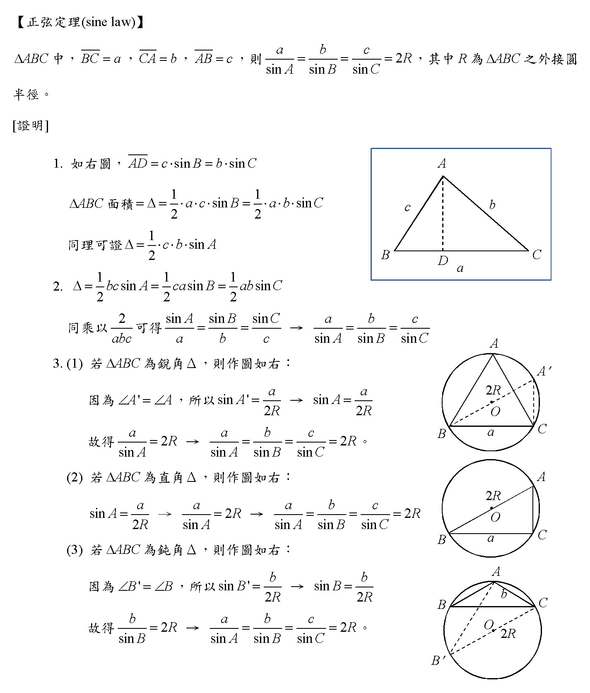
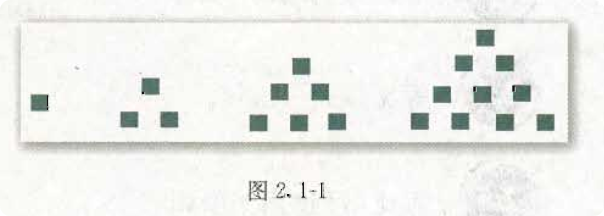
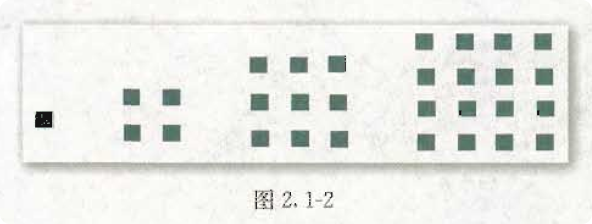
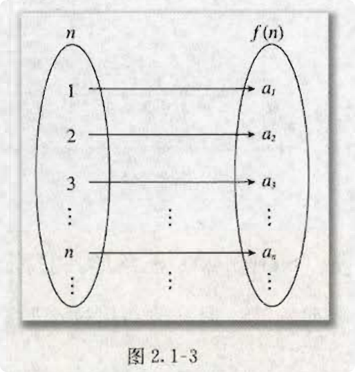

# A版-必修5
>**目录 (Table of Content)**
- **第 1 章 -- 解三角形**
	+ 1.1 正弦定理和余弦定理
		+ 探究与发现: 解三角形的进一步讨论
	+ 1.2 应用举例
		+ 阅读与思考: 海伦和秦九韶
	+ 1.3 实习作业
	+ 小结
	+ 复习参考题
- **第 2 章 -- 数列**
	+ 2.1 数列的概念与简单表示法
		- 阅读与思考: 斐波那契数列
		- 信息技术应用: 估计 $\sqrt{2}$ 的值
	+ 2.2 等差数列
	+ 2.3 等差数列的前 $n$ 项和
	+ 2.4 等比数列
	+ 2.5 等比数列的前 $n$ 项和
		- 阅读与思考: 九连环
		- 探究与发现: 购房中的数学
	+ 小结
	+ 复习参考题
- **第 3 章 -- 不等式**
	+ 3.1 不等关系与不等式 
	+ 3.2 一元二次不等式及其解法
	+ 3.3 二元一次不等式 (组) 与简单的线性规划问题
		- 阅读与思考: 错在哪儿
		- 信息技术与应用: 用 Excel 解决线性规划问题举例 
	+ 3.4 基本不等式: $\sqrt{ab} = \frac{a+b}{2}$
	+ 小结
	+ 复习参考题


## 生词
- **geometric [ˌdʒɪə'metrɪk] --adj.几何学的; 几何学图形的**
    + geometric shape 几何形状
    + geometric figures. 几何学图形
    + a geometric design. 几何图形
- **ratio ['reɪʃɪəʊ] --n.比率, 比值**
    + amplification ratio 放大比率
    + calculate the ratios to one decimal place. 比率计算至小数点后第一位. 
    + It defines the aspect ratio of the image. 它定义了图像的纵横比


## 前置知识
- 连接圆上任意 2 点的线段叫做弦, 经过圆心的弦叫做直径, 直径是一个圆里最长的弦.
- 定点在圆周上, 并且两边都和圆相交的角叫做圆周角.
- 定点在圆心上的角叫做圆心角.
- 圆周角定理: 
    + 在同圆或等圆中, 同弧或等弧所对的圆周角都等于这条弧所对的圆心角的一半.
    + 圆周角的读数等于它所对的弧的度数的一半.
    + 同圆或等圆中, 同弧或等弧所对的圆周角相等, 相等圆周角所对的弧也相等.
    + 半圆 (或直径) 所对圆周角是直角, $90^\circ$ 的圆周角所对的弦是直径.
    + 圆的内接四边形的对角互补, 并且任何一个外角都等于它的内对角.
    + 在同圆或等圆中, 圆周角相等 $\iff$ 弧相等 $\iff$ 弦相等 $\iff$ 弦心距 
      (圆心到弦的弦的垂直距离)相等.
- 圆心角定理
    + 在同圆或等圆中, 若两个圆心角、两条弧、两条弦、两条弦的弦心距中有一组量相等, 则对应的
      其余各组量也相等
        - (1) 等弧对等圆心角
        - (2) 把顶点在圆心的周角等分成360份时, 每一份的圆心角是1°的角．
        - (3) 因为在同圆中相等的圆心角所对的弧相等, 所以整个圆也被等分成360份, 把每一份
          这样得到的弧叫做1°的弧
        - (4)圆心角的度数和它们对的弧的度数相等
- 公式:
	+ 弦长: 见 [必修2](./必修2.md)
    + 弧长: 见 [必修2](./必修2.md)
    + 扇形面积:见 [必修2](./必修2.md)


## 第 1 章 —— 解三角形

### 1.1 正弦定理和余弦定理
- 1.1.1 **正弦定理**
    + > 定义: 正弦定理是三角學中的一個定理.它指出：對於任意
      $\triangle ABC, a、b、c$ 分別為 $\angle A、\angle B、\angle C$ 的对边,
      $R$ 为 $\triangle ABC$ 的外接圓半徑, 则有
      ${\frac{a}{\sin \angle A}} = {\frac{b}{\sin \angle B}} =$
      ${\frac{c}{\sin \angle C}=2R}$
    + 证明详见:
       
    + 正弦定理常见变形:
      
        - $\sin A: \sin B : \sin C = a:b:c$
- 1.1.2 **余弦定理**
    + > 
    + 第 1 种证明为: 
        - Tip: 下图的 $\angle{B}$ 实际上是直角三角形.
             
    + 第 2 种证明为:
      
        - 这个证明来自于 `必修 5` 书本, 但是理论上来说我认为不如上面
### 1.2 应用举例
#### 海伦和秦九韶

### 1.3 实习作业


## 第 2 章 —— 数列
### 2.1 数列的概念与简单表示法
- 传说古希腊毕达哥拉斯$^\color{red}{01}$学派的数学家经常在沙滩上研究数学问题,
  他们在沙滩上画点或用小石子来表示数.
  比如, 他们研究过 1, 3, 6, 10, .... 见下图
    + $\color{red}{01}$: 毕达哥拉斯(Pythagoras, 约公元前 570 年 ~
      约公元前 500 年)

  

  由于这些数可以用 图 2.1-1 中所示的三角形点阵表示, 他们就将其称为三角形数.
  类似地, 1, 4, 9, 16, ..., 被称为正方形数、因为这些数能够表示成正方形.
  即图 2.1-2

  

- 我们来分析一下 图 2.1-1 中的 1, 3, 6, 10, 15, 21, ... 这些数的规律:
  ```
    1  = 0 + 1,
    3  = 1 + 2,
    6  = 3 + 3,
    10 = 6 + 4, 
    15 = 10 + 5,
    21 = 15 + 6,
    ...
  ```
  如果我们按照这种对应格式
  ```
    1,   3,   6,   10,  15,  21,
    |    |    |    |    |    |  
    a_1  a_2  a_3  a_4  a_5  a_6 
  ```
    + Tip: 上面的 a_1 = $a_1$, a_2 = $a_2$, a_3 = $a_3$, ...
      由于无法在代码块中使用 LaTex 转换, 所以看起来很别扭, 为了排版好看,
      只能讲究一下了.

  把每一项和 $a_n$ 对应起来, 那么上面的规律最终可以写成这样:
  ```
    1  = 0 + 1,  <=>  a_1 = a_0 + 1
    3  = 1 + 2,  <=>  a_2 = a_1 + 2
    6  = 3 + 3,  <=>  a_3 = a_2 + 3
    10 = 6 + 4,  <=>  a_4 = a_3 + 4
    15 = 10 + 5, <=>  a_5 = a_4 + 5
    21 = 15 + 6, <=>  a_6 = a_5 + 6
    ...
  ```
  通过上面的现有规律我们可以总结一个公式即:
  $$
    a_n  = a_{n-1} + n
  $$
  , 我们可以确定对目前的已知项此公式是对的, 但是不能确定尚未写出的其他项是不是正确的,
  实际上能够证明后面的其他项套用这个公式也是正确的, 这个牵扯到 "数学归纳法"
  的证明, 在:
  <a href="../如何证明数学归纳法是正确的.md">../如何证明数学归纳法是正确的.md</a>
  这个文件中会给出详细的证明,
  但是目前对于刚学习数列概念的我们, 只需要知道此公式适用于下面未写出的其他项即可,
  等学完整个 "第二章 -- 数列" 记得回头来看证明即可.

  图 2.1-2 的规律和上面 2.1-1 相同, 不再重复记录步骤, 你可以自己尝试证明. 

- 下面我们给出有关 `数列` 的一些定义:
  
    + tip: 下面的定义可能和书本不太一样, 一些内容来自
      [维基百科-数列](https://zh.wikipedia.org/wiki/%E6%95%B0%E5%88%97).

  **`数列(sequence of number)`**是一列(两个以上)按顺序排列的数, 所组成的序列.
    + tip: 关于 `序列` 见
      <a href="../序列是什么.md">../序列是什么.md</a>

  数列中的每一个数叫做这个数列的 **`项`**. 数列中的每一项都和它的序号有关,
  排在第一位的数称为这个数列的第 1 项(通常也叫做 **`首项`**),
  排在第二位的数称为这个数列的第 2 项 $\cdots\cdots$ 排在第 $n$
  位的数称为这个数列的第 $n$ 项.

  所以, 数列的一般形式可以写成
  $$
    a_1, a_2, a_3, \cdots a_n, \cdots,
  $$
  记作: <$a_n$>, {$a_n$} 或 $(a_n)$.
    + tip: {$a_n$} 是表示数列的一种方式, 不是无序的集合符号.
    + Added: 我们可能会见到另外一种叙述数列一般形式的说法, 如下, 记作:
      <$a_k$>, {$a_k$} 或 $(a_k)$: <br>
      $\{a_k\}_{k=1}^{n} = {a_1, a_2, a_3, \cdots, a_n}$
      其中 $n \in Z^+$, $Z^+$ 是正整数集.

  项数有限的数列叫做 `有穷数列`, 项数无限的数列叫做 `无穷数列`.

  从第 2 项起, 每一项都大于它的前一项的数列叫做 `递增数列`;

  从第 2 项起, 每一项都小于它的前一项的数列叫做 `递减数列`,

  各项相等的数列叫做 `常数列`;

  从第 2 项起, 有些项大于它的前一项, 有些项小于它的前一项的数列叫做 `摆动数列`.

- 数列可以看成以正整数集 $N^+$ (或它的有限子集 {1, 2, 3, $\cdots$, $n$})
  为定义域的函数 $a_n = f(n)$ 当自变量按照从小到大的顺序依次取值时所对应的一列函数值
  (下图 2.1-3). 反过来, 对于函数 $y = f(x)$, 如果
  $f(i)$ $(i = 1, 2, 3, \cdots)$ 有意义, 那么我们可以得到一个数列
  $$
    f(1), f(2), f(3), \cdots, f(n), \cdots.
  $$

  


#### 斐波那契数列
#### 估计 $\sqrt{2}$ 的值

### 2.2 等差数列

### 2.3 等差数列的前 n 项和

### 2.4 等比数列 (geometric sequence)
- 等比数列, 又称"几何数列". 是一种特殊数列. 它的特点是: 从第 2 项起,
  每一项与前一项的比都是一个常数.
	+ 例如: 数列 2, 4, 8, 16, 32, ... , $2^n$, $2^{n+1}$, ....
      这就是一个等比数列, 因为第 2 项与第 1 项的比和第 3 项与第 2 项的比相同,
      都等于 2, $2^{198}$ 与 $2^{197}$ 的比也等于 2. 如 2 这样,
      后一项与前一项的比称为 `公比(common ratio)`, 通常用字母 `r` 或 `q`.
- **等比公式**
	+ 根据等比数列的定义可得: $r$ = $\frac{a_n}{a_{n-1}}$ $(n \geq 2)$
- **通项公式**
	+ 可以任意定义一个等比数列 ${a_n}$, 这个等比数列从第一项起分别是 
	  $a_1, a_2, a_3, ..., a_n, ...$. 公比为 `r`, 则有: 
	  $$
	  	\begin{align}
			& a_2 = a_1r \\
			& a_3 = a_2r = a_1r^2 \\
			& a_4 = a_3r = a_2r^2 = a_1r^3 \\
			& . \\
			& . \\
			& .
		\end{align}
	  $$
	+ 以此可推得, 等比数列 ${a_n}$ 的通项公式为:
		- $a_n = a_{n-1}r = a_1{r^{n-1}}$
- **求和公式**
	+ 对上面定义的等比数列 $a_1, a_2, a_3, ..., a_n, ...$ 的所有项累加.
	  $a_1 + a_2 + a_3 + ... + a_n +  ...$ 称为 `等比数列的和` 或
	  `等比级数`, 记为 $\color{red}{S_n}$.
	+ 如果该等比数列的公比为 $q$, 则有：
	  $$
	  	\begin{align}
			S_n &= a_1 + a_2 + a_3 + ... + a_n \\
				&= a_1 + a_1q + a_1q^2 + ... + a_1q^{n-1}  \text{利用等比数列通项公式} ...(1) \\
	  	\end{align}	
	  $$
	+ 先将两边同时乘以公比 $q$, 有
	  $$
	  	qS_n = a_1q + a_1q^2 + ... + a_1q^n  ...(2)
	  $$
	+ (1) - (2) 式, 有:
	  $$
	  	(1-q)S_n = a_1 - a_1q^n ...(3)
	  $$
	+ 然后进行讨论: 当 $q \neq 1$ 时, $S_n = a_1 \frac{1-q^n}{1-q}$; 而当 $q = 1$
	  时, 由 (3) 式2无法得通项公式.
	+ 但可以发现, 此时:
	  $$
	  	\begin {align}
		  S_n &= a_1 + a_2 + a_3 + ... + a_n \\
				&= a_1 + a_1q + a_1q^2 + ... + a_1q^{n-1} \\
				&= a_1 + a_1 + a_1 + ... + a_1
				&= na_1 
		\end{align}  
	  $$
	+ 综上所述, 等比数列 ${a_n}$ 得求和公式为:
	  $$
	  	S_n = 
		  \begin{cases}
		  	\frac{a_1 - a_1q^n}{1-q}  & (q \neq 1) \\
			 na_1  & (q = 1)
		  \end{cases}
	  $$
	+ 经过推导, 可以得到另外一个求和公式: 当 $q \neq 1$ 时：
	  $S_n = \frac{a_1(1-q^n)}{1-q} = \frac{a_1q^n - a_1}{q-1}$
	  (Tip：也既是上下项都乘以 $-1$)
- **当 $-1 < q <1$ 时,  等比数列无限项之和**
	+ 由于当 $-1 < q < 1$ 及 $n$ 得值不断增加时, $q^n$ 得值便会不断减少而且趋于 0, 因此
	  无限项之和为:
	  $$
	  S = \lim_{n \to \infty}
	  $$

### 2.5 等比数列的前 n 项和
#### 九连环
#### 购房中的数学

## 第 3 章 —— 不等式
### 3.1 不等关系与不等式
### 3.2 一元二次不等式及其解法
### 3.3 二元一次不等式 (组) 与简单的线性
### 3.4 基本不等式: $\sqrt{ab} \leq \frac{a+b}{2}$