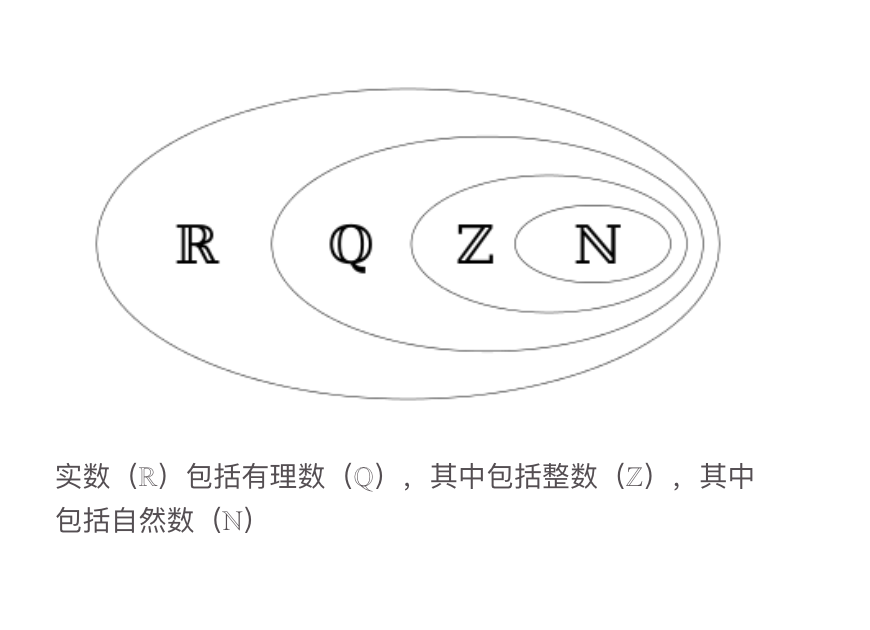
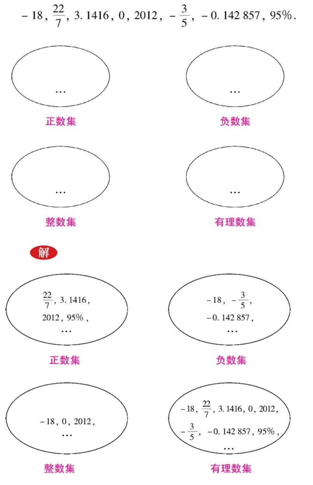
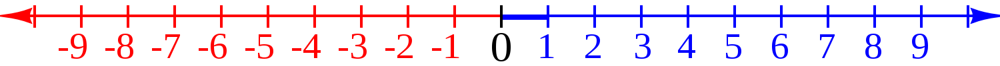
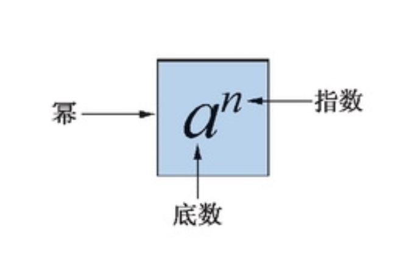
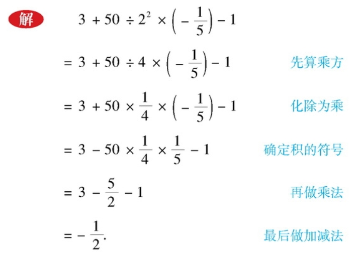
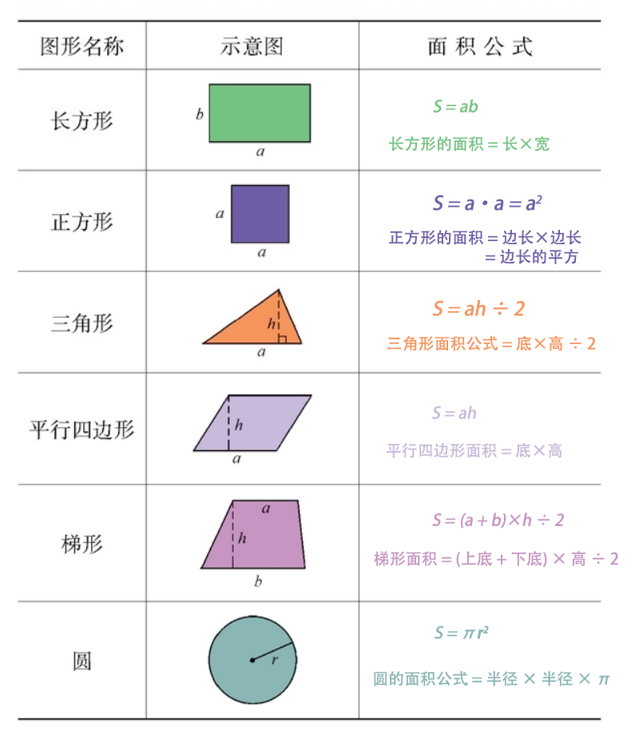
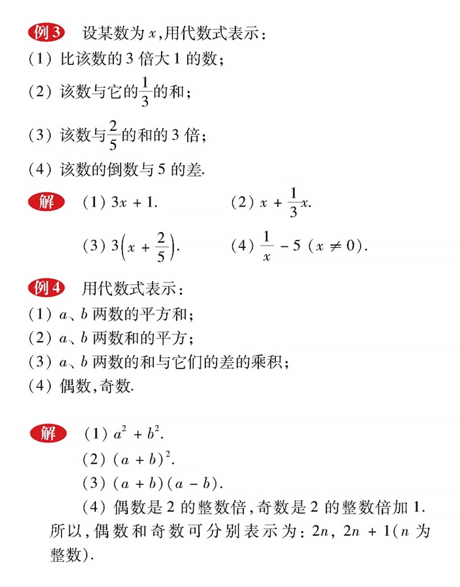

# 七年级数学上册

## 目录(Catalog)
- 第 1 章 -- 走进数学世界
    + 1.1 数学帮我们成长
    + 1.2 人类离不开数学
    + 1.3 人人都能学会数学
    + *阅读材料 华罗庚的故事*
    + *阅读材料 幻方*
- 第 2 章 -- 有理数
    + 2.1 有理数
        - 2.1.1 正数和负数
        - 2.1.2 有理数
    + 2.2 数轴
        - 2.2.1 数轴
        - 2.2.2 在数轴上比较数的大小
    + 2.3 相反数 
    + 2.4 绝对值
    + 2.5 有理数的大小比较
    + 2.6 有理数的加法
        - 2.6.1 有理数的加法法则
        - 2.6.2 有理数加法法则的运算律
    + 2.7 有理数的减法
    + 2.8 有理数的加减混合运算
        - 2.8.1 加减法统一成加法
        - 2.8.2 加减运算律在加减混合运算中的应用
        - *阅读材料: 中国人最早使用负数 -《九章算术》和我国古代的 "正负数"*
    + 2.9 有理数的乘法
    + 2.10 有理数的除法
    + 2.11 有理数的乘方
        - *阅读材料: $2^{64}$ 有多大*
    + 2.12 科学记数法
    + 2.13 有理数的混合运算
    + 2.14 近似数
    + 2.15 用计算器进行计算
        - *阅读材料: 从结绳计数到计算器*
    + 复习题 
- 第 3 章 -- 整数的加减
    + 3.1 列代数式 
        - 3.1.1 用字母表示数 
        - 3.1.2 代数式
        - 3.1.3 列代数式
    + 3.2 代数式的值
        - *阅读材料: 有趣的 "$3x + 1$" 问题*
    + 3.3 整式
        - 3.3.1 单项式 
        - 3.3.2 多项式
        - 3.3.3 升幂排列和降幂排列
    + 3.4 整式的加减
        - 3.4.1 同类型
        - 3.4.2 合并同类项
        - 3.4.3 去括号与添括号
        - 3.4.4 整式的加减
        - *阅读材料: 用分离系数法进行整式的加减运算*
        - *综合与实践 身份证号码与学籍号*
- 第 4 章 -- 图形的初步认识
    + 4.1 生活中的立体图形 
    + 4.2 立体图形的视图
        - 4.2.1 由立体图形到视图
        - 4.2.2 由视图到立体图形
    + 4.3 立体图形的表面展开图
    + 4.4 平面图形
        - *阅读材料 七巧板*
    + 4.5 最基本的图形 - 点和线
        - 4.5.1 点和线
        - 4.5.2 线段的长短比较
        - *阅读材料: 欧拉公式*
    + 4.6 角
        - 4.6.1 角
        - 4.6.2 角的比较和运算
        - 4.6.3 余角和补角
        - 小结
        - 复习题
        - *综合与实践 制作包装盒*
- 第 5 章 -- 相交线与平行线
    + 5.1 相交线
        - 5.1.1 对顶角  
        - 5.1.2 垂线
        - 5.1.3 同位角, 内错角, 同旁内角
    + 5.2 平行线
        - 5.2.1 平行线
        - 5.2.2 平行线的判定
        - 5.2.3 平行线的性质
        - *阅读材料 九树成行*
        - 小结
        - 复习题

## 生词(New Word)
- **positive ['pɒzɪtɪv] --adj.积极的, 正面的, 肯定的**
    + positive number. 正数
    + negative number. 负数
- **negative ['negətɪv] --adj.消极的, 否定的, 阴性的.  --n.否定   --v.否定**
- **integer ['ɪntɪdʒə] --n.整数, 整体**
    + Integers, rational numbers, and irrational numbers are all real.
        整数、有理数和无理数都是实数.
- **fraction ['frækʃən] --n.[数]分数; 部分; 稍微.**
    + a common fraction. 普通分数. 
    + volume fraction. 体积分率, 体积分数; 容积率.
    + a fraction of. 一小部分.
- **rational ['ræʃ(ə)n(ə)l] --adj.有理的, 合理的.  --n.有理数**
    + man is a rational being. 人是理性动物.  
- **ratio ['reɪʃɪəʊ] --n.比率, 比值**
    + amplification ratio 放大比率
    + calculate the ratios to one decimal place. 比率计算至小数点后第一位. 
    + It defines the aspect ratio of the image. 它定义了图像的纵横比
- **axis ['æksɪs] --n.轴; 坐标轴; 轴线; 中心线.**
    + The earth turns on its axis. 地球自转.
    + The axis of a circle is its diameter. 圆的轴线是其直径.
- **origin ['ɔrɪdʒɪn] --n.原点; 起源; 来源**
    + country of origin 原产地; 原产国
    + origin of life. 生命的起源
    + point of origin. 原点, 起始点.
- **opposite ['ɒpəzɪt] --adj.相反的; 相对的; 对面的. --n.对面; 对立面. --adv.对面.**
    + in the opposite(adj) direction. 在相反的方向.
    + on the opposite side of the road. 在道路对面.
    + The result was opposite(adj) to [from] what we expected.
      结果与我们所预料的正相反.
    + He sat down opposite(adv) to the teacher. 他在教师的对面坐下来.
    + Of course, the opposite(n) is also possible.
      当然, 相同情况也是是有可能的.
- **reciprocal [rɪ'sɪprəkl] --adj.倒数的; 相互的; 互惠的. --n.倒数**
    + reciprocal(adj) help. 互助.
    + reciprocal(adj) love. 相爱.
    + The reciprocal(n) of 8 is 1/8(R: one slash eight). 八的倒数为八分之一.
- **involution [ˌɪnvə'lʊʃən] --n.乘方; 混乱; 对合**
- **exponent [ɪk'sponənt] --n.[数]指数; 倡导者; 说明者**
    + That happened because in the limit of high temperature,
      then this exponent is really small, right?
      它发生的原因是在高温极限下, 这个指数就会很小, 对吗?
    + She was a leading exponent of free trade during her political
      career. 她从政期间是自由贸易的主要倡导者.
- **approximate [ə'prɒksɪmət]/[ə'prɑksɪmət] --adj.近似的, 大约的. --vt&vi.近似, 接近**
    + The total income approximates(vt) 10, 000 dollars. 总收入近一万美元.
- **algebraic [ˌældʒə'breɪk] --adj.代数的; 代数学的.**
    + algebraic expression. 代数式
    + algebraic equation. 代数方程.
    + A functional index cannot be a built-in algebraic, exponential,
      log, or hex function. 函数索引不能是内置的代数, 指数, 对数或十六进制函数.

$\color{red}{^*}$
XXX

- 提示: $\color{red}{^*}$ 号为标记生词.

## 内容(Content)
### 第 1 章 -- 走进数学世界
#### 1.1 数学帮我们成长
#### 1.2 人类离不开数学
#### 1.3 人人都能学会数学
- 数学并不神秘, 不是只有天才才能学好数学, 只要通过努力, 人人都能学会数学.
#### *阅读材料 华罗庚的故事*
- 宇宙之大, 粒子之微, 火箭之速, 化工之巧, 地球之变, 生物之谜, 日用之繁,
  无处不用数学. -- 华罗庚
  
  我国著名的数学家华罗庚说: **"聪明在于学习, 天才由于积累."**
  这句话正是他一生的真实写照.

  *华罗庚, 1910 年出生于江苏省金坛县, 1924 年毕业于该县公立初级中学. 以后,
  他又到上海中华职业中学读书, 用不到一年半的时间, 就读完了两年的课程. 15 岁的时候,
  华罗庚迫于家境困难而辍学. 返回家乡后, 他一面帮助父亲在小杂货店里干活、记账,
  一面钻研数学.*
  
  *父亲不愿意让他读书, 而是让他干活.就是在这种生活艰难、无人指导的困境下,
  在一间斗室里, 他以昏暗的油灯为伴, 孜孜不惓地坚持自学. 20 岁时,
  他的一篇论文《苏家驹之代数的五次方程式解法不能成立之理由》发表在上海《科学》杂志上,
  显示出了这位 20 岁青年的数学才华. 然而就在同一年, 华罗庚患了严重的伤寒病和关节炎,
  在与疾病的斗争中, 他意志顽强, 坚韧不拔, 终于战胜了病魔, 但他的左腿瘸了.
  就是在此期间, 他仍然努力钻研数学, 接连取得了许多重大的科研成果.
  一般人从初中到大学毕业要八年时间, 而华罗庚完全依靠自学, 只用了六年半的时间.
  华罗庚正是凭着这种刻苦钻研的精神, 终于成为举世公认的大数学家.*
#### *阅读材料 幻方*

### 第 2 章 -- 有理数
#### 2.1 有理数
##### $\,$ 2.1.1 正数和负数
- **正数(positive$\color{red}{^*}$ number)**: 在数学上指大于 0 的实数,
    如 13, 3.5, 500 1.2, ... 这样的数是正数. 正数前面有时可以加上一个
    "+"(读作 "正")号, 如 7 可以写成 +7.
- **负数(negative$\color{red}{^*}$ number)**:
    像 -2, -2.5, -237, -0.7 这样的数是负数, 负数与正数相对.
- 注意: **0** 既不是正数, 也不是负数.
##### $\,$ 2.1.2 有理数
- **补充知识**: 什么是有理数? 
    - 在数学上, 可以表示为两个整数比的数($\large{\frac{a}{b}}$, $b \neq 0$)
        被定义为**有理数**, 例如: $\large{\frac{3}{8}}$, 0.75(也可表示为
        $\frac{3}{4}$). 整数和分数统称为有理数. 与有理数相对应的是 **无理数**,
        例如 $\sqrt{2}$ 就是无理数, 它无法用整数比表示.
        
        
- 到目前为止, 我们所学过的数就可以分为以下几类:
    + (1) 正整数: 如 1, 2, 3, ...
    + (2) 零: 即 0 
    + (3) 负整数: 如 -1, -2, -3, ...
    + (4) 正分数: 如 $\frac{1}{3}, \frac{22}{7}, 4.5(即 4\frac{1}{2}), ...$
    + (5) 负分数: 如 $-\frac{1}{2}, -2\frac{2}{7}, -0.3(即 -\frac{3}{10}), ...$
  
  正整数, 负整数和零统称为**整数(integer$\color{red}{^*}$)**,

  正分数和负分数统称为**分数(fraction$\color{red}{^*}$)**.
  
  整数和分数统称为**有理数(rational number)**.
- 读一读:
    + "有理数" 的英文名 rational$\color{red}{^*}$ number
      中的单词 rational 应看成 ratio$\color{red}{^*}$(比, 比率)
      的形容词形式. 因此, rational number 应该理解为 "比率数",
      即可以表示为两个整数之商(比率)的数. 在学习了有理数的除法(第 2.0 节)
      之后我们可以看到. 这样的解释准确地描述了有理数的本质.

      我们可以把已经学过的数作出如下分类:
      $$
        有理数 
        \begin{cases}
            整数 
                \begin{cases}
                正整数 \\ 
                零 \\
                负整数
                \end{cases}  \\[2ex]
            分数 
                \begin{cases}
                    正分数 \\ 
                    负分数
                \end{cases}  \\[2ex]
        \end{cases}
      $$
      把一些数放在一起, 就组成了一个数的集合, 简称**数集**(set of numbers **数的集合**).  
      所有有理数组成的数集叫做*有理数集*.  
      所有整数组成的数集叫做*整数集*,  
      所有负数组成的数集叫做*负数集*,  
      所有正整数与零组成的数集叫做*非负整数集*(即*自然数集*), 如此等等.
- <strong style="color: red">例(1)</strong>
    把下列各数填入表示它所在的数集的圈里:

    
##### $\,$ 习题 2.1 -- P14 
- 请务必把习题做完,
  *定义*和*例题*只需要理解和弄懂, 但**做题是熟练定义和理论的必要步骤**.

#### 2.2 数轴
##### $\,$ 2.2.1 数轴
- > 注意: 此节内容来自
  [维基百科-数线](https://zh.wikipedia.org/zh-cn/%E6%95%B8%E7%B7%9A) 
  
  数学上, **数轴(number axis$\color{red}{^*}$)**或**数线**是一个一维的图,
  把整数表示为点而且均匀地分布在一条线上,
  由笛卡尔发明.
  数线是一条规定了原点(origin$\color{red}{^*}$),
  方向和单位长度的直线.
  其中, **原点, 方向**和**单位长度**称为数线的三要素.
  它通常被用来帮助教授简单的加法和减法(特别是运算中有负数的时候).

  数线图如下:

  

  大多数情况下, 数线被表示为水平的(当然这不是必须的).
  它被原点(Tip: 一般为 0)分为对称的 2 个部分.
  通常正数在原点的右边, 负数在原点的左边,
  实数和数线上的点均全部对应.

##### $\,$ 2.2.2 在数轴上比较数的大小
- 提示: 请结合上节 2.2.1 的数线图理解下面的总结:

  一般来说, 原点(0)的右边通常是正数, 而且离原点的距离越远, 数值越大;

  相反, 原点(0)的左边是负数, 离原点的距离越远数值就越小.

##### $\,$ 习题 2.2 -- P18
- 请务必把习题做完, *定义*和*例题*只需要理解和弄懂,
  但**做题是熟练定义和理论的必要步骤**.

#### 2.3 相反数 
- 提示: 请参考上面 `2.2.1` 中的数轴图来对应学习.
- 像 6 和 -6、1.5 和 -1.5 这样,
  **只有正负号不同的两个数称互为相反数(opposite$\color{red}{^*}$ number)**,
  也就是说, 其中一个数是另一个数的相反数. 这里, 6 和 -6 互为相反数,
  6 是 -6 的相反数, -6 是 6 的相反数.

  **在数轴上表示互为相反数的两个点分别位于原点的两旁, 且与原点的距离相等.**
  
  我们规定: **零的相反数是零.** 
- 问题: 除零外, 数轴上还有没有表示别的数的点, 它与原点的距离也等于零? 答: 没有.
- 习题 2.3 -- P21
    + 请务必把习题做完,
      *定义*和*例题*只需要理解和弄懂, 但**做题是熟练定义和理论的必要步骤**.
#### 2.4 绝对值
- 提示: 请参考上面 `2.2.1` 中的数线轴来对应学习.
- **我们把在数轴上表示数 $a$ 的点与原点的距离叫做数 $a$ 的绝对值(absolute, value),
  记作 $|a|$.**
    + 例如, 在数轴上表示 +5 的点与原点的距离是 5, 所以 +5 的绝对值是 5, 记作
      |+ 5| = 5; 在数轴上表示 -6 的点与原点的距离是 6, 所以 -6 的绝对值是 6,
      记作 |- 6| = 6.
- 概括: 由绝对值的意义, 我们可以知道:
    + (1) 一个正数的绝对值是它本身.
    + (2) 零的绝对值是零.
    + (3) 一个负数的绝对值是它的相反数.
    
  将上面的结论用数学式子表示为:
    + (1) 当 a > 0 时, |a| = a;
    + (2) 当 a = 0 时, |a| = 0;
    + (3) 当 a < 0 时, |a| = a;
  
  由此可以看出, 任何一个有理数的绝对值总是整数或 0 (通常也称为非负数).
  即对任意有理数 a, 总有 **|a| $\geq$ 0**
- 例(1) 略
- 习题 2.4 -- P24 必做
#### 2.5 有理数的大小比较
- 提示: 请参考上面 `2.2.1` 中的数轴图来对应学习.
- 概括: 在数轴上, 表示两个负数的两个点中, 与原点距离较远的那个点在左边,
  也就是绝对值大的点在左边, 所以, **两个负数, 绝对值大的反而小.**

  例如, 比较 $\large{-\frac{3}{4}}$ 和 $\large{-\frac{3}{2}}$,
  我们可以分两步进行:
    + (1) 先分别求出它们的绝对值, 并比较其大小:
      $$
        |-\frac{3}{4}| = \frac{3}{4},
      $$
      $$
        |-\frac{3}{2}| = \frac{3}{2},
      $$
      $$
        \frac{3}{2} > \frac{3}{4};
      $$
    + (2) 根据 "两个负数, 绝对值大的反而小", 得出结论:
      $$
        -\frac{3}{4} > -\frac{3}{2}
      $$
- 例: 比较下列各对数的大小:
    + (1) -1 与 -0.01
    + (2) -|-2| 与 0;
    + (3) -(-$\large{\frac{1}{9}}$) 与 -|-$\large{\frac{1}{10}}$|
    + (4) -$\large{\frac{3}{4}}$ 与 -$\large{\frac{2}{3}}$

  解: 略 (提示: 自己试着解答, 如果不甚理解见书本 P26)
- 习题 2.5 -- P28 必做
#### 2.6 有理数的加法
##### $\,$ 2.6.1 有理数的加法法则
- (1) **同号两数相加, 取与加数相同的正负号, 并把绝对值相加;**
  
  (2) **绝对值不相等的异号两数相加, 取绝对值较大的加数的正负号, 并用较大的绝对值减去较小的绝对值;**
  
  (3) **互为相反的两个数相加得零;**
  
  (4) **一个数与零相加, 仍得这个数.**
  
  注意: 一个有理数由*正负号*和*绝对值*两部分组成, 进行加法运算时,
  应当注意和的正负号及绝对值.

- 练习 -- P31: 必做.
##### $\,$ 2.6.2 有理数加法法则的运算律
- 在小学里我们知道, 数的加法满足交换律, 例如: 5 + 3.5 = 3.5 + 5;  
  还满足结合律, 例如: (5 + 3.5) + 2.5 = 5 + (3.5 + 2.5).

  引进了负数以后, 这些运算律是否还成立呢? 也就是说, 上面两个等式中,
  将 5、3.5 和 2.5 换成任意的有理数, 是否仍然成立呢? 答: 仍成立. 
- 概括: 有理数的加法仍然满足交换律和结合律.
    + **加法交换律: 两个数相加, 交换加数的位置, 和不变.**  
      

      a + b = b + a
      

    + **加法结合律: 三个数相加, 先把前面两个数相加, 或者先把后两个数相加, 和不变.**
      

      (a + b) + c = a + (b + c)
      

      这样多个有理数相加, 可以任意交换加数的位置, 也可以先把其中的几个数相加, 使计算简化.
- 例(2): 略
  
  例(3): 略
- 习题 2.6 -- P34 必做
#### 2.7 有理数的减法
- 有理数减法法则: **减去一个数, 等于加上这个数的相反数.**
- 习题 2.7 -- P37 必做

#### 2.8 有理数的加减混合运算
##### $\,$ 2.8.1 加减法统一成加法
##### $\,$ 2.8.2 加减运算律在加减混合运算中的应用
- (1) 加减法统一成加法
    + 例(1): 把 $\large{(+\frac{2}{3}) + (-\frac{4}{5}) - (+\frac{1}{5})- (-\frac{1}{3}) - (+ 1)}$
      写成省略加号的和的形式, 并把它读出来.
    
      解: $\large{(+\frac{2}{3}) + (-\frac{4}{5}) - (+\frac{1}{5}) - (-\frac{1}{3}) - (+ 1)}$

      = $\large{(+\frac{2}{3}) + (-\frac{4}{5}) + (-\frac{1}{5}) + \frac{1}{3} + (- 1)}$

      = $\large{\frac{2}{3} - \frac{4}{5} - \frac{1}{5} + \frac{1}{3} - 1}$
    
      读作: "$\large{\frac{2}{3}, -\frac{4}{5}, -\frac{1}{5}, \frac{1}{3}, -1}$" 的和,
      也可读作 "$\large{\frac{2}{3}}$ 减 $-\large{\frac{4}{5}}$ 减 $-\large{\frac{1}{5}}$ 加 $\large{\frac{1}{3}}$ 减 $-1$".
- (2) 加法运算律在加减混合运算中的应用
    + 例2: 计算:
      - (1) -24 + 3.2 - 16 - 3.5 + 0.3;
        
        (2) 0 - $21\frac{2}{3}$ + ($3\frac{1}{4}$) - (-$\frac{2}{3}$) - (+ $\frac{1}{4}$)

        解: (1), (2)略
- 习题 2.8 -- P41 必做
- *阅读材料: 中国人最早使用负数 -《九章算术》和我国古代的 "正负数"*
#### 2.9 有理数的乘法
- 有理数乘法法则: **两数相乘, 同号得正, 异号得负, 并把绝对值相乘; 任何数与零相乘, 都的零.**
+ 概括: 有理数的乘法仍然满足交换律和结合律.
    - **乘法交换律: 两个数相乘, 交换因数的位置, 积不变.**  
        

            a * b = b * a
        

    - **乘法结合律: 三个数相乘, 先把前面两个数相乘, 或者先把后两个数相乘, 积不变.**
        

            (ab)c = a(bc)
        

      
      根据乘法交换律和结合律, 三个或三个以上的有理数相乘, 可以任意交换因数的位置,
      也可以先把其中的几个数相乘.

    - 添加内容:
        + **什么是因数?**  
          答: 因数是一个常见的数学名词, 用于描述非零整数 a 和 整数 b
          之间存在的整除关系, 即 b 可以被 a 整除. 这里我们称 b 是 a 的倍数,
          a 是 b 的 "因数" ( 或称 "约数", "因子"). 来源
          [维基百科-约数](https://zh.wikipedia.org/zh-cn/%E5%9B%A0%E6%95%B8)
+ 例(2) 计算: $(-10) \times \large{\frac{1}{3}} \times 0.1 \times 6$.
    + 解: $(-10) \times \large{\frac{1}{3}} \times 0.1 \times 6$

        = $[(-10) \times 0.1] \times (\large{\frac{1}{3}} \times 6)$

        = $(-1) \times 2$

        = -2
- 一般地, 我们有: **几个不等于 0 的数相乘, 积的正负号由负因数的个数决定,
  当负因数的个数为奇数时, 积为负; 当负因数的个数为偶数时, 积为正.**
- **几个数相乘, 有一个因数为 0, 积就等于 0.**
- 概括: 有理数的运算仍满足分配律:
  + **分配律: 一个数与两个数的和相乘, 等于把这个数分别与这两个数相乘, 再把积相乘.**
    

        a(b + c) = ab + ac
    

- 例(4) 计算: (1) $30 \times (\frac{1}{2} - \frac{2}{3} + \frac{2}{5})$;
  (2) 4.98 $\times$ (-5).
  
    + 解: 略 (提示: 请自行解答, 若有迷惑请看书本讲解.)
- 例(5) 计算: (1) $\frac{3}{4} \times (8 - \frac{4}{3} - \frac{14}{15})$;
  (2) 8 $\times$ (-$\frac{2}{5}$) - (-4) $\times$ ($-\frac{2}{9}$) + (-8) $\times$ $\frac{3}{5}$.
  
    + 解: 略 (提示: 同上)
- 习题 2.9 -- P51
  
    + 必做
#### 2.10 有理数的除法
- 小学里我们学过倒数. 对于有理数仍然有效:

  乘积是 1 的两个数互为**倒数(reciprocal$\color{red}{^*}$)**.
  
  例如, -2 和 $-\frac{1}{2}$ 互为倒数, $\frac{2}{3}$ 与 $\frac{3}{2}$
  互为倒数.

  这样, 有理数的除法可以转化为乘法:
  
  **除以一个数等于乘以这个数的倒数.**

  注意: <strong style="color:red;">零不能作除数</strong>.
- 例(1) 计算: $\quad$ (1) (-18) $\div$ 6; $\quad$
  (2) ($-\frac{1}{5}$) $\div$ ($-\frac{2}{5}$) $\quad$
  (3) ($\frac{6}{25}$) $\div$ ($-\frac{4}{5}$)
    + 解: 
        - (1) (-18) $\div$ 6 = (-18) $\times$ $\frac{1}{6}$ = -3
        - (2) ($-\frac{1}{5}$) $\div$ ($-\frac{2}{5}$) =
          ($-\frac{1}{5}$) $\times$ ($-\frac{5}{2}$) = $\frac{1}{2}$
        - (3) ($\frac{6}{25}$) $\div$ ($-\frac{4}{5}$) =
          ($\frac{6}{25}$) $\times$ ($-\frac{5}{4}$) = $-\frac{3}{10}$
- 因为除法可以转化为乘法, 所以与乘法类似, 我们也有如下有理数除法法则:
    + **两数相除, 同号得正, 异号得负, 并把绝对值相除.**
    + **零除以任何一个不等于零的数, 都得零.**
- 例(2) 略
- 例(3) 略
- 例(4) 略
- 习题 2.10 -- P56
  
    + 必做
#### 2.11 有理数的乘方
- 在小学我们已经学过:
  
  $a \cdot a$ 记作 $a^2$, 读作: $a$ 的平方(或 $a$ 的 2 次方);

  $a \cdot a \cdot a$ 记作 $a^3$, 读作: $a$ 的立方(或 $a$ 的 3 次方).
  
  一般地, $n$ 个相同的因数 $a$ 相乘:
  $$
    \large{\underbrace{a \cdot a \cdot  \cdots  \cdot a}_{n 个}}
  $$
  记作 $a^n$.

  例如: (1) $2 \times 2 \times 2 = 2^3$; $\quad$
  (2) $(-2)(-2)(-2)(-2) = (-2)^4$.

  求 $n$ 个相同因数积的运算, 叫做**乘方(involution$\color{red}{^*}$)**,
  乘方的结果叫做**幂(power)**.
  
  在 $a^n$ 中, $a$ 叫做**底数(base number)**, $n$ 叫做**指数(exponent$\color{red}{^*}$)**,

  $a^n$ 读作 $a$ 的 $n$ 次方, $a^n$ 看作是 $a$ 的 $n$ 次乘方的结果时,
  也可读作 $a$ 的 $n$ 次幂.
  
  
  
  例如, $2^3$ 中, 底数是 2, 指数是 3, $2^3$ 读作 2 的 3 次方, 或 2 的 3 次幂.

  一个数可以看作这个数本身的一次方, 例如 8 就是 $8^1$, 指数 1 通常省略不写.
  
  额外提示: 数学上规定, **任何数的 0 次方都等于 1**. 例如: $2^0$= 1,
  $(-5)^0$ = 1.
  
  例(1) 计算: $\quad$(1) $(-2)^3$; $\quad$ (2) $(-2)^4$; $\quad$
  (3) $(-2)^5$.
    + 解: 略.

  根据有理数乘法法则(`2.9 有理数的乘法`), 我们有:
    + **正数的任何次幂都是正数**;
    + **负数的奇数次幂是负数, 负数的偶次幂是正数.**
- 习题 2.11 -- P58   
  
    + 必做
- *阅读材料: $2^{64}$ 有多大*
#### 2.12 科学记数法
- 利用 10 的幂, 有时可以方便地表示日常生活中遇到的一些较大的数, 如:

  光的速度大约是 300 000 000 米/秒;  
  全世界人口数大约是 7 000 000 000.
  
  这样的大数, 读、写都不方便, 考虑到 10 的幂有如下特点:
  
  $10^2$ = 100, $10^3$ = 1000, $10^4$ = 10000, $\cdots$,  
  即: 一般地, 10 的 $n$ 次幂, 在 1 的后面有 $n$ 个 0.
  
  这样就可用 10 的幂表示一些大数, 如:  
  7 000 000 000 = 7 $\times$ 1000000000 = 7 $\times$ $10^9$
  
  这样, 一个大于 10 的数就记成 $a \times 10^n$ 的形式, 其中
  1 $\leq$ $a$ < 10, $n$ 是正整数. 像这样的记数法叫做**科学记数法.**
- **例(1)** 用科学记数法表示下列各数:  
  (1) 696 000; $\quad$ (2) 1 000 000; $\quad$ (3) 58 000.
    + 解: (1) 696 000 = 6.96 $\times$ $10^5$  
      (2) 1 000 000 = 1 $\times$ $10^6$  
      (3) 58 000 = 5.8 $\times$ $10^4$
- 思考: 通过上面的 `例(1)` 可以看出用科学记数法表示一个数时,
  10 的指数与原数的整数位数有什么关系? 答: **用科学计数法表示一个 $n$ 位整数,
  10 的指数等于 $n - 1$.** 
#### 2.13 有理数的混合运算
- 有理数的混合运算, 计算顺序:
    + (1) **先算乘方, 再算乘除, 最后算加减;**
        - 提示: 加法和减法叫做第一级运算; 乘法和除法叫第二级运算;
          乘方和开方(今后将会学到)叫第三级运算.
    + (2) **同级运算, 按照从左到右的顺序进行;**
    + (3) **如果有括号, 就先算小括号里的, 再算中括号里的, 然后算大括号里的.**
- 例(1): 略
- 例(2) 计算:  3 + 50 $\div$ $2^2$ $\times$ (-$\large{\frac{1}{5}}$) - 1.
  
  
- 例(3) 计算: 
  [1 - (1 - 0.5 $\times$ $\large{\frac{1}{3}}$)] $\times$ [2 - $(-3)^2$]
  
    + 解: 自己尝试解答, 有疑惑请参照书本, 此处不再截图.
- 例(4) 略
- 习题 2.13 -- P65
  
    + 必做
#### 2.14 近似数
- 近似数是和准确数相对应的一个概念, 先来看一下定义:
    + (1) **准确数**: 表示量的准确值的数, 叫做准确数.
        - 例如: 九(一)班喜欢看球赛的同学人数是 35, 那 35
          这个数就是一个表示具体值的一个准确数, 一个也不多, 一个也不少.
    + (2) **近似数(approximate number$\color{red}{^*}$)**:
      表示量的近似值的数, 叫做近似数.
        - 例如: 在实际生活中, 我们常会遇到或用到近似数, 例如, 我国的陆地面积约为
          960 万平方千米, 小李家的写字台长 120cm, 这里的 960, 120 都是近似数.
- 使用近似数有一个近似程度的问题, 也就是精确度的问题. 我们都知道:
  $$
    \pi = 3. 141 592 6\cdots.
  $$
  计算中我们需要对 $\pi$ 取近似数:
    + (1) 如果结果只取整数, 那么按四舍五入的法则应为 3, 这叫做精确到*个位*.
    + (2) 如果结果取 1 位小数, 那么应为 3.1, 这叫做精确到*十分位*(或*精确到 0.1*);
    + (3) 如果结果取 2 位小数, 那么应为 3.14, 这叫做精确到*百分位*(或*精确到 0.01*);
    + (4) 如果结果取 3 位小数, 那么应为 3.142, 这叫做精确到*千分位*(或*精确到 0.001*);
    + $\cdots\cdots$
- 概括: 一般地, 一个近似数四舍五入到某一位, 就说这个近似数精确到那一位.
  
  例如: 小明的身高为 1.70 米, 1.70 这个近似数精确到百分位(即: 0.01).
- 例(1) 下列由四舍五入法得到的近似数, 各精确到哪一位?  
  
  (1) 132.4; $\quad$ (2) 0.0572.

  解:
    - (1) 132.4 精确到十分位(即精确到 0.1). 速记技巧: 即只需要记得,
      小数点后面第一位为十分位, 再往后以 "百", "千", "万" 类推即可.
    - (2) 0.0572 精确到万分位(即精确到 0.0001)
- 例(2) 用四舍五入法, 按括号中的要求对下列个数取近似数:
    + (1) 0.340 82 (精确到千分位)
    + (2) 64.8 (精确到个位);
    + (3) 1.5046 (精确到 0.01);
    + (4) 130 542 (精确到千位)
    
  解:
    + (1) 0.340 82 $\approx$ 0.341.
    + (2) 64.8 $\approx$ 65.
    + (3) 1.5046 $\approx$ 1.50.
    + (4) 130 542 $\approx$ 1.31 $\times$ $10^5$.
        - 提示: `2.12 科学记数法` 用科学计数法表示一个 $n$ 位整数,
          10 的指数等于 $n - 1$.
- 注意:
    + (1) 例(2) 的小题 (4) 中, 如果把结果写成 131 000,
      会误认为是精确到个位得到近似数, 这里用科学记数法, 把结果写成
      1.31 $\times$ $10^5$, 就准确地表示精确到千位.
    + (2) 有一些量, 我们或者很难测出它们的准确值, 或者没有必要算得它们的准确值,
      这时通过粗略的估算就能得到所要的近似数, 有时近似数也并不总是按 "四舍五人"
      法得到的.
        - 例如, 某地遭遇水灾, 约有 10 万人的生活受到影响.
          政府拟从外地调运一批粮食救灾, 需估计每天要调运的粮食数.
          如果按一个人平均一天需要 0.5 千克粮食计算, 那么可以估计出每天要调运 5
          万千克粮食.
        - 又如某校初一年级共有 112 名同学, 想租用 45 座的客车外出秋游.
          为估计需租用客车的辆数, 计算得 112 $\div$ 45 = 2.488$\cdots$,
          就不能用四舍五法, 而要用 "进一法" 即应租用 3 辆客车.
- 习题 2.14 -- P69: 必做
#### 2.15 用计算器进行计算
- *阅读材料: 从结绳计数到计算器*
#### 复习题 -- P76 
- 必做

### 第 3 章 -- 整数的加减
#### 3.1 列代数式 
##### $\,$ 3.1.1 用字母表示数
- 为了测试一种皮球的弹起高度与下落高度之间的关系, 通过试验,
  得到下面一组数据(单位：厘米)
    
  | 下落高度 | 40   | 50   | 80   | 100  | 150  |
  | -------- | ---- | ---- | ---- | ---- | ---- |
  | 弹起高度 | 20   | 25   | 40   | 50   | 75   |
  
  如果我们用字母 $b$ 表示下落高度的厘米数, 那么对应的弹起高度为
  $\large{\frac{1}{2}}b$(厘米).

  这里, 我们用字母 $b$ 表示下落高度以后, 得出表示弹起高度的式子
  $\large{\frac{1}{2}}b$, 反映了这种皮球的弹起高度和下落高度之间的数量关系.
    
- 让我们再看几个用字母表示数的例子:
    + (1) 如果用 a、b 表示任意两个有理数, 那么加法交换律可以表示为:
      
a + b = b + a.

      乘法交换规律可以表示为: 
      
      
ab = ba.

    + (2) 某种大米每千克的售价是 4.8 元, 购买这种大米 2 千克、2.5 千克、
      5 千克、10 千克各需付款多少元?
      
      购买这种大米 2 千克需付款 4.8 $\times$ 2 = 9.6(元);  
      购买这种大米 2.5 千克需付款 4.8 $\times$ 2.5 = 12(元);  
      购买这种大米 5 千克需付款 4.8 $\times$ 5 = 24(元);  
      购买这种大米 10 千克需付款 4.8 $\times$ 10 = 48(元);
    
      如果用字母 $n$ 表示购买这种大米的千克数, 那么需付款 4.8$n$(元).
    + (3) 我们知道, 长方形的面积等于长与宽的积. 如果用 $a, b$
      分别表示长方形的长和宽, 用 $S$ 表示长方形的面积, 则有长方形的面积公式:
      $$
        S = ab.
      $$
      我们可以用公式表示一些常见图形的面积, 请看下表:

      

      从这些例子, 我们可以体会到, 用字母表示数之后,
      有些数量之间的关系用含有字母的式子表示, 看上去更加简明, 更具有普遍意义了.
- 例(1) 填空:
    + (1) 某地为了治理河山, 改造环境, 计划在第十二个五年计划期间植树绿化荒山, 
        如果每年植树绿化 $n$ 公顷, 那么五年内可以植树绿化荒山
        $\underline{\color{red}{5n}}$ 公顷;
    + (2) 每本练习本 $m$ 元, 甲买了 5 本, 乙买了 2 本, 两人一共花了
        $\underline{\color{red}{(5m + 2m)}}$ 元, 甲比乙多花了
        $\underline{\color{red}{5m - 2m}}$ 元;
    + (3) 1500 米跑步测试, 如果某同学跑完全程的成绩是 $t$ 秒,
        那么他跑步的平均速度是 $\underline{\color{red}{\frac{1500}{t}}}$
        米/秒.
- 注意:
    + (1) 式子中出现的乘号, 通常写作 "·" 或省略不写, 比如上面例(1) 中的 $5 \times n$ 常写作 $5・n$ 或 $5n$;
    + (2) 数字与字母相乘时, 数字通常写在字母前面, 如 $5n$ 一般不写成 $n5$;
    + (3) 除法运算写成分数形式, 如 $1500 \div t$ 通常写作
        $\frac{1500}{t} (t \not= 0)$.
##### $\,$ 3.1.2 代数式
- 概括: 在上节(`3.1.1`)的研究中, 出现了
    $b,\ \frac{1}{2}b,\ a + b,\ ab,\ 9.6,\ 4.8n,\ \frac{1}{2}(a + b)h,\ 5m - 2n,\ \frac{1500}{t} (t \not= 0)$
    等, 它们都是由数和字母用运算符号链接起来的式子,
    称为**代数式(algebraic$\color{red}{^*}$ expression)**.
    单独一个数或一个字母也是代数式.
- 例(2) 用代数式表示下列问题中的量:
    + (1) 长为 $acm$、宽为 $bcm$ 的长方形的周长;
    + (2) 开学时爸爸给小强 $a$ 元, 小强买文具用去了 $b$ 元($a > b$),
      此时小强还剩多少元？
    + (3) 某机关原有工作人员 $m$ 人, 抽调 $20%$ 下基层工作后, 
      留在该机关工作的还有多少人？
    + (4) 甲每小时走 $a$ 千米, 乙每小时走 $b$ 千米, 两人同时同地出发反向行走, 
      $t$ 小时后, 他们之间的距离是多少？

    解: 
    + (1) 长方形的周长是它的 4 条边长之和, 所以它的周长是
      $\color{red}{2(a+b)cm}$.
    + (2) 还剩 $\color{red}{(a-b)}$ 元.
    + (3) 下基层工作的人数是机关原有工作人员的 $20\%$, 其人数为 $20\%・m$, 
      即 $\frac{1}{5}m$, 所以留在机关工作的还有
      $\color{red}{(m - \frac{1}{5}m)}$ 人.
      
      我们也可以这样考虑: 该机关工作人员抽调 20% 下基层,
      那么留在原机关工作的人数应是总人数的 $(1-20\%)$,
      所以留在机关工作的还有$(1 - 20\%)m$ 人, 即
      $\color{red}{\frac{4}{5}m}$ 人.
    + (4) $t$ 小时后, 他们之间的距离是 $\color{red}{(at + bt)}$ 千米.
##### $\,$ 3.1.3 列代数式
- 做一做:
    + 某地区夏季高山上的温度从山脚处开始每升高 100 米降低 $0.7^{\circ}C$.
      如果山脚温度是 $28^{\circ}C$, 那么比山脚高 300 米处的温度为
      $\underline{\color{red}{ ? }}$; 一般地,
      比山脚高 $x$ 米处的温度为 $\underline{\color{red}{ ? }}$;
      
      答: 根据题意可知, 比山脚高 300 米处的温度为
      $(28 - 0.7\times 3)^{\circ}C$, 即为 $25.9^{\circ}C$; 一般地, 
      比山脚高 $x$ 米处的温度为 $\color{red}{(28 - \frac{0.7}{100}x)^{\circ}C}$.
        - 提示: $\frac{0.7}{100}x$ 的意思: 题目中说每升高 100 米下降
          $0.7^{\circ}C$ (读作: 0.7 摄氏度), 那么每升高 1 米下降的温度即为:
          $\frac{0.7}{100} = 0.007^{\circ}C$.
      
      在解决实际问题时, 常常先把问题中有关的数量用代数式表示出来, 即列出代数式, 
      使问题变得简洁, 更具般性.
- 
##### $\,$ 习题 3.1 -- P88: 必做
#### 3.2 代数式的值
- 问题:
    + 某礼堂第 1 排有 18 个座位, 往后每排比前一排多 2 个座位. 问:  
        - (1) 第 n 排有多少个座位? (用含 n 的代数式表示)
        - (2) 第 10 排、第 15 排、第 23 排各有多少个座位?
       
      解:
        - (1)
          第 2 排比第 1 排多 2 个座, 即第 2 排为 *18 + 2 = 20* 个座;  
          第 3 排比第 2 排多 2 个座, 即第 3 排为 *20 + 2 = 22* 个座; 
          第 4 排比第 3 排多 2 个座, 即第 4 排为 *22 + 2 = 24* 个座;
          $\cdots\cdots$ 
          考虑: 第 2 排比第一排多 2 个座, 第 3 排比第 2 排多 2 个座,
          那就是说,  
          2 x 2 个, 即 *18 + 2 x 2 = 22*;

类似地, 第 4 排是第 1 排的后 3 排, 它的座位数应比第 1 排多 2×3 个, 即为 18+2×3=24

一般地, 第 n 排是第 1 排的后（n-1) 排, 它的座位

数应比第 1 排多 2 (n-1) 个, 即为 18+2 (n-1)
- *阅读材料: 有趣的 "$3x + 1$" 问题*

#### 3.3 整式
##### $\,$ 3.3.1 单项式 
##### $\,$ 3.3.2 多项式
##### $\,$ 3.3.3 升幂排列和降幂排列

#### 3.4 整式的加减
##### $\,$ 3.4.1 同类型
##### $\,$ 3.4.2 合并同类项
##### $\,$ 3.4.3 去括号与添括号
##### $\,$ 3.4.4 整式的加减
##### $\,$ *阅读材料: 用分离系数法进行整式的加减运算*
##### $\,$ *综合与实践 身份证号码与学籍号*

### 第 4 章 -- 图形的初步认识
+ 4.1 生活中的立体图形 
+ 4.2 立体图形的视图
    - 4.2.1 由立体图形到视图
    - 4.2.2 由视图到立体图形
+ 4.3 立体图形的表面展开图
+ 4.4 平面图形
    - *阅读材料 七巧板*
+ 4.5 最基本的图形 - 点和线
    - 4.5.1 点和线
    - 4.5.2 线段的长短比较
    - *阅读材料: 欧拉公式*
+ 4.6 角
    - 4.6.1 角
    - 4.6.2 角的比较和运算
    - 4.6.3 余角和补角
    - 小结
    - 复习题
    - *综合与实践 制作包装盒*

### 第 5 章 -- 相交线与平行线
+ 5.1 相交线
    - 5.1.1 对顶角  
    - 5.1.2 垂线
    - 5.1.3 同位角, 内错角, 同旁内角
+ 5.2 平行线
    - 5.2.1 平行线
    - 5.2.2 平行线的判定
    - 5.2.3 平行线的性质
    - *阅读材料 九树成行*
    - 小结
    - 复习题
