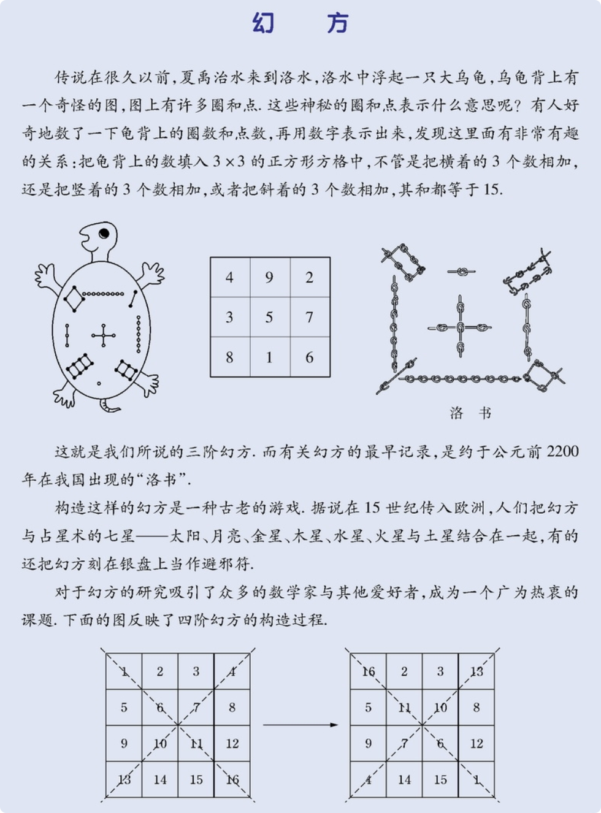

# 七年级数学上册

## 目录(Catalog)
- 第 1 章 -- 走进数学世界
    + 1.1 数学帮我们成长
    + 1.2 人类离不开数学
    + 1.3 人人都能学会数学
    + *阅读材料 华罗庚的故事*
    + *阅读材料 幻方*
- 第 2 章 -- 有理数
    + 2.1 有理数
        - 2.1.1 正数和负数
        - 2.1.2 有理数
    + 2.2 数轴
        - 2.2.1 数轴
        - 2.2.2 在数轴上比较数的大小
    + 2.3 相反数 
    + 2.4 绝对值
    + 2.5 有理数的大小比较
    + 2.6 有理数的加法
        - 2.6.1 有理数的加法法则
        - 2.6.2 有理数加法法则的运算律
    + 2.7 有理数的减法
    + 2.8 有理数的加减混合运算
        - 2.8.1 加减法统一成加法
        - 2.8.2 加减运算律在加减混合运算中的应用
        - *阅读材料: 中国人最早使用负数 -《九章算术》和我国古代的 "正负数"*
    + 2.9 有理数的乘法
    + 2.10 有理数的除法
    + 2.11 有理数的乘方
        - *阅读材料: $2^64$ 有多大*
    + 2.12 科学记数法
    + 2.13 有理数的混合运算
    + 2.14 近似数
    + 2.15 用计算器进行计算
        - *阅读材料: 从结绳计数到计算器*
- 第 3 章 -- 整数的加减
    + 3.1 列代数式 
        - 3.1.1 用字母表示数 
        - 3.1.2 代数式
        - 3.1.3 列代数式
    + 3.2 代数式的值
        - *阅读材料: 有趣的 "$3x + 1$" 问题*
    + 3.3 整式
        - 3.3.1 单项式 
        - 3.3.2 多项式
        - 3.3.3 升幂排列和降幂排列
    + 3.4 整式的加减
        - 3.4.1 同类型
        - 3.4.2 合并同类项
        - 3.4.3 去括号与添括号
        - 3.4.4 整式的加减
        - *阅读材料: 用分离系数法进行整式的加减运算*
        - *综合与实践 身份证号码与学籍号*
- 第 4 章 -- 图形的初步认识
    + 4.1 生活中的立体图形 
    + 4.2 立体图形的视图
        - 4.2.1 由立体图形到视图
        - 4.2.2 由视图到立体图形
    + 4.3 立体图形的表面展开图
    + 4.4 平面图形
        - *阅读材料 七巧板*
    + 4.5 最基本的图形 - 点和线
        - 4.5.1 点和线
        - 4.5.2 线段的长短比较
        - *阅读材料: 欧拉公式*
    + 4.6 角
        - 4.6.1 角
        - 4.6.2 角的比较和运算
        - 4.6.3 余角和补角
        - 小结
        - 复习题
        - *综合与实践 制作包装盒*
- 第 5 章 -- 相交线与平行线
    + 5.1 相交线
        - 5.1.1 对顶角  
        - 5.1.2 垂线
        - 5.1.3 同位角, 内错角, 同旁内角
    + 5.2 平行线
        - 5.2.1 平行线
        - 5.2.2 平行线的判定
        - 5.2.3 平行线的性质
        - *阅读材料 九树成行*
        - 小结
        - 复习题

## 生词(New Word)
- **positive ['pɒzɪtɪv] --adj.积极的, 正面的, 肯定的**
    + positive number. 正数
    + negative number. 负数
- **negative ['negətɪv] --adj.消极的, 否定的, 阴性的.  --n.否定   --v.否定**
- **integer ['ɪntɪdʒə] --n.整数, 整体**
    + Integers, rational numbers, and irrational numbers are all real.
        整数、有理数和无理数都是实数.
- **fraction ['frækʃən] --n.[数]分数; 部分; 稍微.**
    + a common fraction. 普通分数. 
    + volume fraction. 体积分率, 体积分数; 容积率.
    + a fraction of. 一小部分.
- **rational ['ræʃ(ə)n(ə)l] --adj.有理的, 合理的.  --n.有理数**
    + man is a rational being. 人是理性动物.  
- **ratio ['reɪʃɪəʊ] --n.比率, 比值**
    + amplification ratio 放大比率
    + calculate the ratios to one decimal place. 比率计算至小数点后第一位. 
    + It defines the aspect ratio of the image. 它定义了图像的纵横比
- **axis ['æksɪs] --n.轴; 坐标轴; 轴线; 中心线.**
    + The earth turns on its axis. 地球自转.
    + The axis of a circle is its diameter. 圆的轴线是其直径.
- **origin ['ɔrɪdʒɪn] --n.原点; 起源; 来源**
    + country of origin 原产地; 原产国
    + origin of life. 生命的起源
    + point of origin. 原点, 起始点.

$\color{red}{^*}$
XXX

- 提示: $\color{red}{^*}$ 号为标记生词.

## 内容(Content)
### 第 1 章 -- 走进数学世界
##### 1.1 数学帮我们成长
##### 1.2 人类离不开数学
##### 1.3 人人都能学会数学
- 数学并不神秘, 不是只有天才才能学好数学, 只要通过努力, 人人都能学会数学.
##### *阅读材料 华罗庚的故事*
- 宇宙之大, 粒子之微, 火箭之速, 化工之巧, 地球之变, 生物之谜, 日用之繁,
  无处不用数学. -- 华罗庚
  
  我国著名的数学家华罗庚说: **"聪明在于学习, 天才由于积累."**
  这句话正是他一生的真实写照.

  *华罗庚, 1910 年出生于江苏省金坛县, 1924 年毕业于该县公立初级中学. 以后,
  他又到上海中华职业中学读书, 用不到一年半的时间, 就读完了两年的课程. 15 岁的时候,
  华罗庚迫于家境困难而辍学. 返回家乡后, 他一面帮助父亲在小杂货店里干活、记账,
  一面钻研数学.*
  
  *父亲不愿意让他读书, 而是让他干活.就是在这种生活艰难、无人指导的困境下,
  在一间斗室里, 他以昏暗的油灯为伴, 孜孜不惓地坚持自学. 20 岁时,
  他的一篇论文《苏家驹之代数的五次方程式解法不能成立之理由》发表在上海《科学》杂志上,
  显示出了这位 20 岁青年的数学才华. 然而就在同一年, 华罗庚患了严重的伤寒病和关节炎,
  在与疾病的斗争中, 他意志顽强, 坚韧不拔, 终于战胜了病魔, 但他的左腿瘸了.
  就是在此期间, 他仍然努力钻研数学, 接连取得了许多重大的科研成果.
  一般人从初中到大学毕业要八年时间, 而华罗庚完全依靠自学, 只用了六年半的时间.
  华罗庚正是凭着这种刻苦钻研的精神, 终于成为举世公认的大数学家.*
##### *阅读材料 幻方*
- 

### 第 2 章 -- 有理数
##### 2.1 有理数
- 2.1.1 正数和负数
    + **正数(positive$\color{red}{^*}$ number)**: 在数学上指大于 0 的实数,
      如 13, 3.5, 500 1.2, ... 这样的数是正数. 正数前面有时可以加上一个
      "+"(读作 "正")号, 如 7 可以写成 +7.
    + **负数(negative$\color{red}{^*}$ number)**:
      像 -2, -2.5, -237, -0.7 这样的数是负数, 负数与正数相对.
    + 注意: **0** 既不是正数, 也不是负数.
- 2.1.2 有理数
    + **补充知识**: 什么是有理数? 
        - 在数学上, 可以表示为两个整数比的数($\large{\frac{a}{b}}$, $b \neq 0$)
          被定义为**有理数**, 例如: $\large{\frac{3}{8}}$, 0.75(可被表达为
          $\frac{3}{4}$). 整数和分数统称为有理数. 与有理数相对应的是 **无理数**,
          如 $\sqrt{2}$ 无法用整数比表示.
          
          

    + 到目前为止, 我们所学过的数就可以分为以下几类:
        - 正整数: 如 1, 2, 3, ...
        - 零: 即 0 
        - 负整数: 如 -1, -2, -3, ...
        - 正分数: 如 $\frac{1}{3}, \frac{22}{7}, 4.5(即 4\frac{1}{2}), ...$
        - 负分数: 如 $-\frac{1}{2}, -2\frac{2}{7}, -0.3(即 -\frac{3}{10}), ...$
    + 正整数, 零和负整数统称为**整数(integer$\color{red}{^*}$)**,
      正分数和负分数统称为**分数(fraction$\color{red}{^*}$)**.
    + 整数和分数统称为**有理数(rational number)**.
    + 读一读:
        - "有理数" 的英文名 rational$\color{red}{^*}$ number
          中的单词 rational 应看成 ratio$\color{red}{^*}$(比, 比率)
          的形容词形式. 因此, rational number 应该理解为 "比率数",
          即可以表示为两个整数之商(比率)的数. 在学习了有理数的除法(第 2.0 节)
          之后我们可以看到. 这样的解释准确地描述了有理数的本质.

          我们可以把已经学过的数作出如下分类:
          $$
          有理数 
            \begin{cases}
                整数 
                    \begin{cases}
                    正整数 \\ 
                    零 \\
                    负整数
                    \end{cases}  \\[2ex]
                分数 
                    \begin{cases}
                        正分数 \\ 
                        负分数
                    \end{cases}  \\[2ex]
            \end{cases}
          $$
          把一些数放在一起, 就组成了一个数的集合, 简称**数集**(set of numbers
          **数的集合**).  
          所有有理数组成的数集叫做*有理数集*.  
          所有整数组成的数集叫做*整数集*,  
          所有负数组成的数集叫做*负数集*,  
          所有正整数与零组成的数集叫做*非负整数集*(即*自然数集*), 如此等等.
    + <strong style="color: red">例</strong>
      把下列各数填入表示它所在的数集的圈里:

      
- 习题 2.1 -- P14 
    + 请务必把习题做完,
      *定义*和*例题*只需要理解和弄懂, 但**做题是熟练定义和理论的必要步骤**.
##### 2.2 数轴
- 2.2.1 数轴
    + 注意: 此节的内容书本写得混乱无法做精简和总结, 故下面的内容来自
      [维基百科-]() 
    + 数学上, **数轴(number axis$\color{red}{^*}$)**或**数线**是一个一维的图,
      把整数表示为点而且均匀地分布在一条线上, 由笛卡尔发明. 数线是一条规定了原点(origin$\color{red}{^*}$), 方向和单位长度的直线. 其中, **原点, 方向**和**单位长度**称为数线的三要素. 它通常被用来帮助教授简单的加法和减法(特别是运算中有负数的时候).

      图示如下:

      

      大多数情况下, 数线被表示为水平的(当然这不是必须的). 它被原点(Tip: 一般为 0)分为对称的 2 个部分. 通常正数在原点的右边, 负数在原点的左边, 实数和数线上的点均全部对应.

- 2.2.2 在数轴上比较数的大小
    - 提示: 请结合上节 2.2.1 的数线图理解下面的总结:

      一般来说, 原点(0)的右边通常是正数, 而且离原点的距离越远, 数值越大;

      相反, 原点(0)的左边是负数, 离原点的距离越远数值就越小.

##### 2.3 相反数 
##### 2.4 绝对值
##### 2.5 有理数的大小比较
##### 2.6 有理数的加法
- 2.6.1 有理数的加法法则
- 2.6.2 有理数加法法则的运算律
##### 2.7 有理数的减法
##### 2.8 有理数的加减混合运算
- 2.8.1 加减法统一成加法
- 2.8.2 加减运算律在加减混合运算中的应用
- *阅读材料: 中国人最早使用负数 -《九章算术》和我国古代的 "正负数"*
##### 2.9 有理数的乘法
##### 2.10 有理数的除法
##### 2.11 有理数的乘方
- *阅读材料: $2^64$ 有多大*
##### 2.12 科学记数法
##### 2.13 有理数的混合运算
##### 2.14 近似数
##### 2.15 用计算器进行计算
- *阅读材料: 从结绳计数到计算器*

### 第 3 章 -- 整数的加减
+ 3.1 列代数式 
    - 3.1.1 用字母表示数 
    - 3.1.2 代数式
    - 3.1.3 列代数式
+ 3.2 代数式的值
    - *阅读材料: 有趣的 "$3x + 1$" 问题*
+ 3.3 整式
    - 3.3.1 单项式 
    - 3.3.2 多项式
    - 3.3.3 升幂排列和降幂排列
+ 3.4 整式的加减
    - 3.4.1 同类型
    - 3.4.2 合并同类项
    - 3.4.3 去括号与添括号
    - 3.4.4 整式的加减
    - *阅读材料: 用分离系数法进行整式的加减运算*
    - *综合与实践 身份证号码与学籍号*

### 第 4 章 -- 图形的初步认识
+ 4.1 生活中的立体图形 
+ 4.2 立体图形的视图
    - 4.2.1 由立体图形到视图
    - 4.2.2 由视图到立体图形
+ 4.3 立体图形的表面展开图
+ 4.4 平面图形
    - *阅读材料 七巧板*
+ 4.5 最基本的图形 - 点和线
    - 4.5.1 点和线
    - 4.5.2 线段的长短比较
    - *阅读材料: 欧拉公式*
+ 4.6 角
    - 4.6.1 角
    - 4.6.2 角的比较和运算
    - 4.6.3 余角和补角
    - 小结
    - 复习题
    - *综合与实践 制作包装盒*

### 第 5 章 -- 相交线与平行线
+ 5.1 相交线
    - 5.1.1 对顶角  
    - 5.1.2 垂线
    - 5.1.3 同位角, 内错角, 同旁内角
+ 5.2 平行线
    - 5.2.1 平行线
    - 5.2.2 平行线的判定
    - 5.2.3 平行线的性质
    - *阅读材料 九树成行*
    - 小结
    - 复习题
