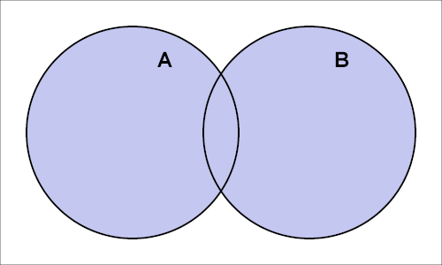
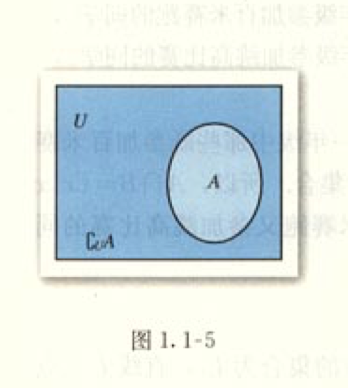
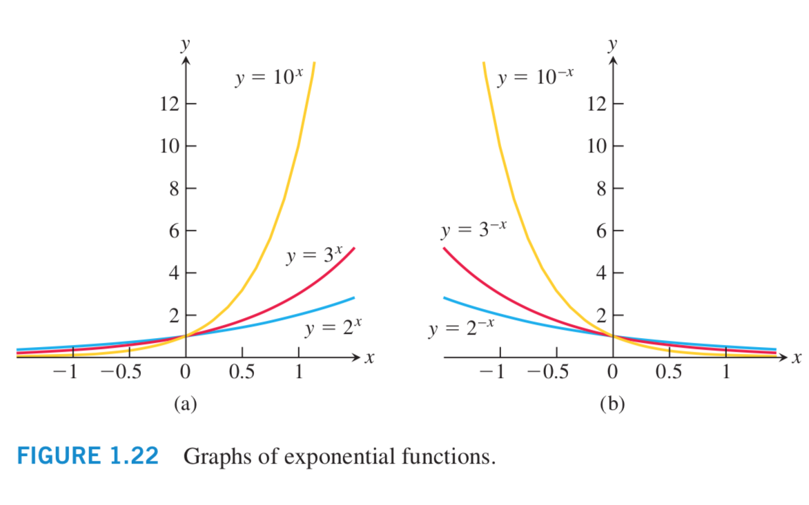

# 必修 1 
> **目录 (Table of Content)**
- **第 1 章 -- 集合与函数的概念**
    + 1.1 集合
        + 阅读与思考: 集合中元素的个数
    + 1.2 函数及其表示
        - 阅读与思考: 函数概念的发展历程
    + 1.3 函数的基本性质
        - 信息技术应用: 用计算机绘制函数图形
    + 小结
	+ 复习参考题    
- **第 2 章 —— 基本初等函数 (1)**
    + 2.1 指数函数
        - 信息技术应用: 借用信息技术探究指数函数的性质
    + 2.2 对数函数
        - 阅读与思考: 对数的发明
        - 探究与发现: 互为反函数的两个函数图像之间的关系 
    + 2.3 幂函数
    + 小结
	+ 复习参考题    
-  **第 3 章 —— 函数的应用**
    + 3.1 函数与方程
        - 阅读与思考: 中外历史上的方程求解
        - 信息技术应用: 借助信息技术求方程的近似解 
    + 3.2 函数模型及其应用
        - 信息技术应用: 收集数据并建立函数模型
    + 小结
	+ 复习参考题    

## 生词
- **intersection [ˌɪntə'sekʃn] --n.交集；十字路口；交叉点**
    + --> intersection set. 交集
    + --> You are gonna make a right at the intersection.
        十字路口往右转。
    + --> Turn right at the next intersection. 在下个十字路口右转。    
- **complementary [kɒmplɪ'ment(ə)rɪ] --adj.补充的，互补的**
    + --> complementary set 补集
    + --> complementary angles 余角，互余角
    + --> complementary function 余函数
- **radical ['rædɪk(ə)l] --n.根号,根式。 --adj.根本的,基本的**
- **radicand ['rædɪkænd] n.被开方数。**
- **exponential [ˌekspə'nenʃ(ə)l]  --n.指数.  --adj.指数的**
    + --> Exponential growth. 指数生长
    + --> exponential function 指数函数

## 第 1 章 —— 集合与函数概念
### 1.1 集合
> **1.1.1 集合的含义与表示**
- 一般地，我们把研究对象统称为**元素 (element)**, 把一些元素组成的总体叫做**集合 (set)**
  简称为(**集**)
- 只要构成两个集合的元素是一样的，我们就称这 2 个集合是相等的。
- 我们通常用大写拉丁字母 $A, B, C,$ ... 表示集合； 用小写拉丁字母 $a, b, c,$ ... 表示
  集合中的元素。
    + 如果 $a$ 是集合 $A$ 中的元素，就说 $a$ 属于(belong to) 集合 $A$, 
      记作 $a \in A$ 
    + 如果 $a$ 不是集合 $A$ 中的元素，就说 $a$ 不属于(not belong to) 集合 $A$, 
      记作 $a \notin A$ 
    + 数学中一些常用的数集及其记法:  
        - 全体非负整数组成的集合称为非负整数集 (或自然数集)， 记作 $N$
        - 所有正整数组成的集合称为正整数集，记作 $N^*$ 或 $N_+$
        - 全体整数组成的集合称为整数集， 记作 $Z$
        - 全体有理数组成的集合称为有理数集，记作 $Q$
        - 全体实数组成的集合称为实数集，记作 $R$
- 集合的读法:例如: $A = \{x\in R | x^2-2=0 \}$ (读作: 集合 A 包含 $x$ 属于 R 且, 
  $x^2-2=0$ [不确定是不是这样读,因为没找到范例])     
- Add Content: 
    + 质数(又称 素数): 质数是大于 1 的自然数中，除了 1 和它本身外，不能被其他自然数 
      (0 除外) 整数的数。
    + 互质 (co-prime) 符號：$\bot$ ，又称互素、在数论中，如果2个或2个以上的整数的
      最大公因数是1，则称它们为互质。
        - 1.如果数域是正整数(N+), 那么 1 与所有正整数互质
        - 2.如果数域是整数(Z), 那么 1 和 -1 与所有整数互质, 而且他们是唯一与 0 互质
          的整数。兩個整数 a 与 b 互质，记为 a ⊥ b。
        + 互质的例子:
            + 例如 8 与 10 的最大公因数是 2， 不是 1，因此他们并不互质。
            + 又例如 7, 10, 13 的最大公因数是 1， 因此他们互质。 
    + 有理数: 人們將所有能表示成 $\frac{p}{q}$ (p q 是整數 p,q互質)的數稱之為有理數。
        - 任何带有"有限小数部分"或"无限循环小数部分"的数都可以写成 $\frac{p}{q}$ 的形式，
          因而都是有理数; 
        - 而带有无限不循环小数部分的数不能写成 $\frac{p}{q}$ 的形式，因而是无理数。
    + 无理数: 人們將這些不是有理數的數稱為無理數。
    + 实数(R): 將有理數和無理數統稱為實。
    + 实数系: 全体实数组成的数集称为实数系，也称为 "实数集"。
    + 实数的连续性: 实数这种能与数轴上的点一一对应的特点称为实数的连续性。          
      
> **1.1.2 集合间的基本关系**
- 子集 (subset): $A \sube B$ 或 $B \supe A$
- 文氏图 (Venn 图): 在数学中，我们经常用平面上封闭曲线的内部代表集合，这种图称为 Venn 图。
- 相等: 集合 $A$ 与 集合$B$中的元素是一样的，说集合 $A$ 和 集合$B$ 相等，记作: $A = B$
- 真子集（proper subset）: $$
- 空集 (empty set): 把不包含任何元素的集合叫做空集。

> **1.1.3 集合的基本运算**
- **并集 (union set)**: 一般地，由所有属于集合 $A$ 或属于集合 $B$ 的元素组成的集合，
  称为集合 $A$ 与集合 $B$的并集 (union set), 记作 $A \cup B$ (读作: A 并 B), 即:
  $$
        A \cup B = \{x | x \in A, 或 x \in B \}
  $$
    + 可用 Venn 图表示为:
    + 
- **交集 (intersection set)**: 一般地，由属于集合 $A$ 且属于集合 $B$ 的所有元素组成
  的集合，称为 $A$ 与 $B$的交集 (intersection set), 记作 $A \cap B$ (读作: A 交 B)
  , 即:
  $$
        A \cap B = \{x | x \in A, 且 x \in B \}
  $$
- **全集 (universe set)**: 一般地，如果一个集合含有我们所研究问题中涉及的所有元素，那么
  就称这个集合为 全集 (universe set), 通常记作 $U$
- **补集 (complementary set)**: 对于一个集合 $A$, 在全集 $U$ 中不属于集合 $A$ 的所有
  元素组成的集合称为 集合$A$ 相对于全集 $U$ 的补集 (complementary set)， 简称为集合 $A$
  的补集，记作 $\complement_UA$ = $\{ x | x \in U, 且 x \notin A \}$ 
    + 可用 Venn 图表示为: 

### 1.2 函数及其表示
> **1.2.1 函数的概念**
- 设 A, B 是非空的数集，如果按照某种确定的对应关系 $f$,使对于集合 A 中任何一个数 
  $x$, 在集合 B 中都有唯一确定的数 $f(x)$ 和它对应，那么就称 $f$: A $\rightarrow$ 
  B 为集合 A 到 B 的一个 "函数 (function)", 记作: 
  $$
        \begin{align}
            &y = f(x), x \in A.
        \end{align}
  $$
  其中 $x$ 叫做自变量，$x$ 的取值范围 A 叫做函数的 **定义域 (domain)**, 与 $x$ 的
  值相对应的 $y$ 值叫做 "函数值", 函数值的集合 { $y = f(x) | x \in A$} [读作: 集合
  $y = f(x) 且 x$ 属于 A] 叫做函数的 **值域 (range)**. 显然，值域是集合 $B$ 的子集。
- 我们所熟悉的一次函数 $y = ax + b (a \neq 0)$ 的定义域是 $R$，值域也是 $R$，对于 $R$
  中的任意一个数 $x$, 在 $R$ 中都有唯一的数 $y = ax + b (a \neq 0)$ 和它对应。 
- 二次函数 $y = ax^2 + bx + c (a \neq 0)$ 的定义域是 $R$, 值域是 $B$.
    + 当 $a > 0$ 时， $B = \{ y | y \geqslant \frac{4ac - b^2}{4a} \}$
    + 当 $a < 0$ 时， $B = \{ y | y \leqslant \frac{4ac - b^2}{4a} \}$
    + 对于 $R$ 中的任意一个数 $x$, 在 $B$ 中都有唯一的数 
      $y = ax^2 + bx + c (a \neq 0)$ 和它对应。
- 一元二次方程 —— 判别式 ： 
    + 根的判别式是判断"方程实根"个数的公式，在解题时应用十分广泛，涉及到解系数的取值范围、
      判断方程根的个数及分布情况等。一元二次方程 $ax^2 + bx + c = 0 \; (a \neq 0)$ 
      的根的判别式是 $b^2 - 4ac$，(用 "$\Delta$" 表示，读作 "delta")。
    + 判别式定义: 判别式即判定"方程实根"个数及分布情况的公式。
    + 一元二次方程，根的判别式 $\Delta = b^2 - 4ac$ 的推导过程? 
      (20200202 Added: 来自九年级上册课本 P28)
        - 解: 因为一元二次方程的 $a \neq 0$, 所以两边同除以 $a$
          $$
          \begin{align}
                & x^2 + \frac{b}{a}x + \frac{c}{a} = 0 \\
                & 移项, 得 \quad x^2 + \frac{b}{a}x = - \frac{c}{a} \\
                & 配方(关键步骤), 得 \quad x^2 + 2 \cdot x \cdot \frac{b}{2a} + 
                (\frac{b}{2a})^2 = (\frac{b}{2a})^2 - \frac{c}{a} \\
                & 即 \quad (x + \frac{b}{2a})^2 = \frac{b^2 - 4ac}{4a^2} \\
                & 因为 a \neq 0, 所以 4a^2 > 0. \; 当 b^2 - 4ac \geq 0 时, 直接开平方, 得 \quad
                x + \frac{b}{2a} = \frac{\sqrt{b^2 - 4ac}}{|2a|} \\
                & 当 a > 0 时: x = - \frac{b}{2a} + \frac{\sqrt{b^2 - 4ac}}{2a} 
                = \frac{-b + \sqrt{b^2 - 4ac}}{2a} \\
                & 当 a < 0 时; x = - \frac{b}{2a} - \frac{\sqrt{b^2 - 4ac}}{2a}
                = \frac{-b - \sqrt{b^2 - 4ac}}{2a} \\ 
            \end{align}
          $$
    + 这里的 $\color{#E87631}{b^2 - 4ac}$ 叫做一元二次方程**`根的判别式`**,
      通常用符号 $\color{#E87631}{\Delta}$ 来表示,
      用它可以直接判断一元二次方程 $ax^2 + bx + c = 0 \; (a \neq 0)$ 的实根的情况:  
        - 当 $\color{#E87631}{\Delta > 0}$ 时, 方程有 2 个不相等的实数根;
        - 当 $\color{#E87631}{\Delta = 0}$ 时, 方程有 2 个相等的实数根;
        - 当 $\color{#E87631}{\Delta < 0}$ 时, 方程没有实数根.  
- 区间:
    + 闭区间: $[a, b]$
    + 开区间: $(a, b)$ 
    + 半开半闭区间: [a, b), (a, b]
    + 端点: 用实心点表示包括在区间内的端点，用空心点表示不包括在区间内的端点。
- 分段函数
- 映射 (mapping): 设 $A$, $B$ 是非空的集合，如果按某一个确定的对应
  关系 $f$，使对于集合 $A$ 中的任意一个元素 $x$，在集合 $B$ 中都有唯一确定的元素 $y$ 与
  之对应，那么就称对应 $f: A \rightarrow B$ 为从集合 $A$ 到集合 $B$ 的一个映射 (mapping).

### 1.3 函数的基本性质
> **1.3.1 函数的基本性质**
- 增函数 (increasing function)
- 减函数 (decreasing function)
- 最大值 (maximum value)
- 最小值 (minimum value)
- 奇函数 (odd function)
- 偶函数 (even function)

## 第 2 章 —— 基本初等函数 (1)
> Q: 幂函数和指数函数的区别？
- A: 幂函数 $y = x^a$ 底数 $x$ 为自变量，指数 $a$ 为常数。  
     指数函数 $y = a^x$ (a > 0 且 $a \neq 1$) ($x \in R$) 底数 $a$ 为常数, 
     指数 $x$ 为自变量。

### 2.1 指数函数 (exponential function)
#### 2.1.1 指数与指数幂的运算
> **根式** 
- ${\large n 次方根}$: 一般地 如果 $x^n = a$ 那么 $x$ 叫做 $a$ 的 $n$ 次方根 
  (n th root)，其中 $n > 1$, 且 $n \in N_+$
- 式子 $\sqrt[n]{a}$ 叫做 ${\large 根式}$ (radical), 这里 $n$ 叫做 
  ${\large 根指数} (radical-exponent)$ , $a$ 叫做 ${\large 被开方数} (radicand)$
- 例如:
    + 根据 n 次方根的意义可得: ($\sqrt[n]{a})^n$ = $a$.
    +  $(\sqrt[]{5})^2$ = 5,  $(\sqrt[5]{-3})^5$ = -3.
    +  sqrt = square root 平方根
> **分数指数幂**
- Tip: **幂**: 指乘方运算的结果。$n^m$ 指将 $n$ 自乘 $m$ 次 ($m$ 为正整数)。把 $n^m$
  次方看作乘方的结果，叫做 "$n 的 m 次幂$" 或 "$n 的 m 次方$"。
- 我们规定正数的正分数指数幂的意义是:
    + $a^\frac{m}{n}$ = $\sqrt[n]{a^m}$ ($a > 0,$ $m,n \in N_+,$ 且 $n >1$)
      [读作: $a 的 n 分之 m 次方 = a的 m 次方的 n 次方根$]
    + 于是，在条件 $a > 0,$ $m,n \in N^*,$ 且 $n >1$ 下, 根式可以写成分数指数幂的形式.
    + 正数的负分数指数幂的意义与负整数指数幂的意义相仿，我们规定
        - $a^-\frac{m}{n}$ = $\frac{1}{a^\frac{m}{n}}$ 
          ($a > 0,$ $m,n \in N^*,$ 且 $n >1$)
    + *0 的正分数指数幂等于 0，0 的负分数指数幂没有意义。*
    + 规定了分数指数幂的意义以后，指数的概念就从正数指数推广到了有理数指数。
    + 重要的运算法则: 来源:https://zh.wikipedia.org/wiki/%E5%86%AA
        - (1) 同底数相乘，底数不变，指数相加: 
            + $a^m \cdot a^n$ = $a^{m+n}$  
        - (2) 同底数相除，底数不变，指数相减:
            + $a^m \div a^n$ = $a^{m-n}$  
        - (3) 同指数幂相除，指数不变，底数相除:
            + $\frac{a^n}{b^n}$ = $(\frac{a}{b})^n$
    +  其他等式
        - $(a^m)^n$ = $a^{mn}$
        - $(ab)^n$ = $a^n \cdot b^n$
        - $x^0 = 1  (x \neq 0)$
        - $x^1 = x$
        - $x^{-1} = \frac{1}{x} (x \neq 0)$

#### 2.1.2 指数函数及其性质
- ${\large 指数函数 (exponential function)}$: 一般地, 函数 
  $y = a^x (a > 0, 且 a \not= 1)$ 叫做 "指数函数 (exponential function)"，
  其中 底数 $a$ 为常数, 指数 $x$ 为自变量, 函数的定义域是 $R$. 

---
- Note: 这里给出指数函数和对数函数的图形
    + 

    +       
---

### 2.2 对数函数 (logarithmic function)
- **logarithmic [ˌlɔɡə'riðmik] --adj.对数的**
    + Logarithmic functions 对数函数

#### 2.2.1 对数及其运算
> **对数**
- $\color{orange}{{\large 对数:}}$ 一般地，如果 $a^x = N (a > 0, 且 a \not=1)$, 
  那么数 $x$ 叫做以 $a$ 为底 $N$ 的 "对数(logarithm)", 记作 $x=\log_a{N}$ (读作: 
  以 $a$ 为底 $N$ 的对数), 其中 $a$ 叫做对数的 "底数"， $N$ 叫做 "真数"。
- $\color{orange}{{\large 常数对数}}$: 通常我们将以 10 为底的对数叫做 "常用对数 
  (common logarithm)" 并把 $\log_{10}{N}$ 记作 $\lg N$. 
- $\color{orange}{{\large 自然对数}}$: 在科学技术中常使用以无理数 
  $e = 2.718281828...$ 为底数的对数，以 $e$ 为底的对数称为"自然对数(natural 
  logarithm)",并且把 $\log_{e}{N}$ 记为 $\ln N$。
- 根据对数的定义，可以得到对数与指数间的关系: 
    + 当 $a > 0, a \neq 1 时， a^x = N \leftrightarrow x = \log_{a}{N}$ . 
      由指数与对数的这个关系，可以得到关于对数的如下结论: 
        - "负数和零都没有对数": 
        - $\log_{a}{1}$ = 0,
        - $\log_{a}{a}$ = 1. 
> **对数的运算**
- 对数的运算性质: 如果 $a>0$, 且 $a \neq 1$, $M>0, N>0$, 那么:
    + (1) $\log_{a}{(M \cdot N)}$ = $\log_{a}{M} + \log_{a}{N}$;
        - 读作: 以 $a$ 为底，$MN$ 的对数
    + (2) $\log_{a}{\frac{M}{N}}$ = $\log_a{M} - \log_{a}{N}$;
        - 同底数幂相减, 底数不变,指数相除 
    + (3) $\log_{a}{M^n}$ = $n\log_{a}{M} (n \in R)$.
- 对数运算 Wikipedia 公式总结(https://zh.wikipedia.org/zh-cn/%E5%AF%B9%E6%95%B0)
    + **和差**: 
        - 公式: 对数和公式 见上面的(1)， 对数差公式 见上面的 (2)
        - 推导: 
            - 对数和公式推导: 
              设 $M = \beta^{m}, N = \beta^{n}$
              $$
              \begin{align}
                    & \log_{a}{MN} = {\log_{a}{\beta^m \beta^n}} \\
                        & = {\log_{a}{\beta^{m+n}}} \\
                        & = (m+n){\log_{a}{\beta}} \\
                        & = m\log_{a}{\beta} + n\log_{a}{\beta} \\
                        & = \log_{a}{\beta^m} + \log_{a}{\beta^n} \\
                        & = \log_{a}{M} + \log_{a}{N}
                \end{align}
              $$
              即: $\log_{a}{M} + \log_{a}{N} =  \log_{a}{MN}$
            - 对数差公式推导: 
              $$
                \begin{align}
                    & \log_{a}{\frac{M}{N}} \\ 
                        & = \log_{a}{M} + \log_{a}{\frac{1}{N}} \\
                        & = \log_{a}{M} - \log_{a}{N}
                \end{align}
              $$
    + **基变换 (换底公式)**
        - 公式: $\log_{a}{x} = \frac{\log_{\beta}{x}}{\log_{\beta}{\alpha}}$
        - 推导: 
          $$
            \begin{align}
                & 设 \log_{a}{x} = t \\
                & \therefore x = a^t \\
                & 两边取对数(同底数的对数，真数相同，对数相等) 则有 \log_{\beta}{x} 
                    = \log_{\beta}{\alpha ^ t} \\
                & 即 \log_{\alpha}{x} = t \log_{\beta}{\alpha} \\ 
                & 又 \therefore \log_{a}{x} = t  \\
                & \because \log_{a}{x} 
                    = \frac{\log_{\beta}{x}}{\log_{\beta}{\alpha}}  
                    \quad (读作: 以 \beta 为底 x 的对数 除以 以 \beta 为底 a 的对数) \\
            \end{align}
          $$
    + **指系 (次方公式)**
        - 公式: $\log_{a^n}{x^m} = \frac{m}{n}\log_{a}{x}$
        - 推导:
          $$
          \begin{align}
                & \log_{a^n}{x^m} = \frac{\log_{e}{x^m}}{\log_{e}{a^n}} \\
                    &= \frac{m \log_{e}{x}}{n\log_{e}{a}} \\
                    &= \frac{m}{n}\log_{a}{x} \\
            \end{align}
          $$
    + **还原**
        - 公式: $a^{\log_{a}{x}} = x = \log_{a}{a^x}$
        - 推导:
          我们由对数的基本定义 
          $$
            \begin{align}
                & a^n = x  \qquad (1) \\
                & \log_{a}{x} = n  \qquad (2) \\
                & 把 (2) 代入 (1)  \\
                & a^{\log_{a}{x}} = x  \\
                & 右侧: 因为: a^1 = a，所以: \log_{a}{a} = 1. 因此: x = \log_{a}{a^x}
            \end{align}
          $$
    + **互换**
        - 公式: $M^{\log_{a}{N}} = N^{log_{a}{M}}$
        - 推导:
          $$
            \begin{align} 
                & 设 b = log_{a}{N}, c = \log_{a}{M} \\
                & 则有 a^c = M 和 a^b = N. \\
                & M^b = N^c \\
                & (a^c)^b = (a^b)^c \\
                & 所以 M^{\log_{a}{N}} = N^{log_{a}{M}}
            \end{align}
          $$
    + **倒数:**
      $$
        \begin{align}
            & \log_{a}{\theta} \\
            & = \frac{\log_{e}{\theta}}{\log_{e}{a}}  \\
            & = \frac{1}{\log_{e}{a}}{\log_{e}{\theta}} \\
            & = \frac{1}{log_{\theta}{a}} 
        \end{align}
      $$
    + **链式:**
      $$
        \begin{align}
            & \log_{\gamma}{\beta} \log_{\beta}{\alpha} \\
            & = \frac{\ln{\alpha}}{\ln{\beta}} \frac{\ln{\beta}}{\ln{\gamma}} \\
            & = \frac{\ln{\alpha}}{\ln{\gamma}} \\
            & = \log_{\gamma}{\alpha} 
        \end{align}
      $$

#### 2.2.2 对数函数及其性质
- $\color{orange}{{\large 对数函数}}$: 我们把函数 y = $log_{a}{x}$ 
  $(a>0, 且 a \neq 1)$ 叫做对数函数, 其中 $x$ 是自变量，函数的定义域是$(0, +\infty)$。
- $\color{orange}{{\large 反函数}}$: 详细见 微积分第一章笔记

### 2.3 幂函数 (power function)
- 详细见: <托马斯微积分> 1.1.6 幂函数

## 第 3 章 —— 函数的应用
### 3.1 函数与方程
> **3.1.1 方程的根与函数的零点**
- 二次函数 $y = ax^2 + bx + c (a \neq 0)$ 的定义域是 $R$, 值域是 $B$.
    + 当 $a > 0$ 时， $B = \{ y | y \geqslant \frac{4ac - b^2}{4a} \}$
    + 当 $a < 0$ 时， $B = \{ y | y \leqslant \frac{4ac - b^2}{4a} \}$
    + 对于 $R$ 中的任意一个数 $x$, 在 $B$ 中都有唯一的数 
      $y = ax^2 + bx + c (a \neq 0)$ 和它对应。

  
- 一元二次方程 —— 判别式: *讲解见上面*.
- 根据判别式 $\Delta = b^2 - 4ac$ 我们有:
    + (1) 当 $\Delta > 0$ 时, 一元二次方程有 2 个不等的实数根 $x_1, x_2,$ 相应的二次函数
      的图像与 $x$ 轴有 2 个交点 $(x_1, 0), (x_2, 0)$ 
    + (2) 当 $\Delta = 0$ 时......
    + (3) 当 $\Delta < 0$ 时......
- 二次函数的图像与 $x$ 轴的焦点和相应的一元二次方程的根的关系，可以推广到一般情形，为此，
  先给出函数零点的概念:
    + 对于函数 $y = f(x)$, 我们把使 $f(x) = 0$ 的实数 $x$ 叫做函数 $y = f(x)$ 的 
      `零点(zero point)`.
    + 这样, 函数 $y = f(x)$ 的零点就是方程 $f(x) = 0$ 的实数根, 也就是函数 $y = f(x)$ 
      的图像于 $x$ 轴的交点的横坐标, 所以
        - `方程`$f(x) = 0$ `有实数根` $\iff$ `函数` $y = f(x)$ `的图像与 x 轴有交点`
          $\iff$ `函数` $y = f(x)$ `有零点`.   
- 一般地, 我们有: **如果函数 $y = f(x)$ 在区间 [a, b] 上的图像是连续不断的一条曲线,**
  **并且有 $f(a) \cdot f(b) < 0$, 那么,函数 $y = f(x)$在区间 (a, b) 内有零点,**
  **即存在 $c\in(a, b)$, 使得 $f(c) = 0$, 这个 $c$ 也是方程 $f(x) = 0$ 的根.**
### 3.2 函数模型及其应用