# A版-必修5
>**目录 (Table of Content)**
- **第 1 章 -- 解三角形**
	+ 1.1 正弦定理和余弦定理
		+ 探究与发现: 解三角形的进一步讨论
	+ 1.2 应用举例
		+ 阅读与思考: 海伦和秦九韶
	+ 1.3 实习作业
	+ 小结
	+ 复习参考题
- **第 2 章 -- 数列**
	+ 2.1 数列的概念与简单表示法
		- 阅读与思考: 斐波那契数列
		- 信息技术应用: 估计 $\sqrt{2}$ 的值
	+ 2.2 等差数列
	+ 2.3 等差数列的前 $n$ 项和
	+ 2.4 等比数列
	+ 2.5 等比数列的前 $n$ 项和
		- 阅读与思考: 九连环
		- 探究与发现: 购房中的数学
	+ 小结
	+ 复习参考题
- **第 3 章 -- 不等式**
	+ 3.1 不等关系与不等式 
	+ 3.2 一元二次不等式及其解法
	+ 3.3 二元一次不等式 (组) 与简单的线性规划问题
		- 阅读与思考: 错在哪儿
		- 信息技术与应用: 用 Excel 解决线性规划问题举例 
	+ 3.4 基本不等式: $\sqrt{ab} = \frac{a+b}{2}$
	+ 小结
	+ 复习参考题


## 生词
- **sine [saɪn] --n.[数]正弦**
- **cosine ['kəʊsaɪn] (co-sine) --n.余弦**
- **arithmetic [ə'rɪθmətɪk] --n.算术, 计算**
    + arithmetic had never been her strong point. 计算从来不是他的强项. 
- **geometric [ˌdʒɪə'metrɪk] --adj.几何学的; 几何学图形的**
    + geometric shape 几何形状
    + geometric figures. 几何学图形
    + a geometric design. 几何图形
- **ratio ['reɪʃɪəʊ] --n.比率, 比值**
    + amplification ratio 放大比率
    + calculate the ratios to one decimal place. 比率计算至小数点后第一位. 
    + It defines the aspect ratio of the image. 它定义了图像的纵横比


## 前置知识
- 连接圆上任意 2 点的线段叫做弦, 经过圆心的弦叫做直径, 直径是一个圆里最长的弦.
- 定点在圆周上, 并且两边都和圆相交的角叫做圆周角.
- 定点在圆心上的角叫做圆心角.
- 圆周角定理: 
    + 在同圆或等圆中, 同弧或等弧所对的圆周角都等于这条弧所对的圆心角的一半.
    + 圆周角的度数等于它所对的弧的度数的一半.
    + 同圆或等圆中, 同弧或等弧所对的圆周角相等, 相等圆周角所对的弧也相等.
    + 半圆 (或直径) 所对圆周角是直角, $90^\circ$ 的圆周角所对的弦是直径.
    + 圆的内接四边形的对角互补, 并且任何一个外角都等于它的内对角.
    + 在同圆或等圆中, 圆周角相等 $\iff$ 弧相等 $\iff$ 弦相等 $\iff$ 弦心距 
      (圆心到弦的弦的垂直距离)相等.
- 圆心角定理
    + 在同圆或等圆中, 若两个圆心角、两条弧、两条弦、两条弦的弦心距中有一组量相等, 则对应的
      其余各组量也相等
        - (1) 等弧对等圆心角
        - (2) 把顶点在圆心的周角等分成360份时, 每一份的圆心角是1°的角．
        - (3) 因为在同圆中相等的圆心角所对的弧相等, 所以整个圆也被等分成360份, 把每一份
          这样得到的弧叫做1°的弧
        - (4)圆心角的度数和它们对的弧的度数相等
- 公式:
	+ 弦长: 见 [必修2](./必修2.md)
    + 弧长: 见 [必修2](./必修2.md)
    + 扇形面积:见 [必修2](./必修2.md)


## 第 1 章 —— 解三角形

### 1.1 正弦定理和余弦定理
#### 1.1.1 正弦定理
- 定义: `正弦定理` 是三角學中的一個定理. 它指出: 对于任意
  $\triangle ABC, a、b、c$ 分別為 $\angle A、\angle B、\angle C$ 的对边,
  $R$ 为 $\triangle ABC$ 的外接圓半徑, 则有
  ${\frac{a}{\sin \angle A}} = {\frac{b}{\sin \angle B}} =$
  ${\frac{c}{\sin \angle C}=2R}$
- 证明:
    + 方法(1): 来自本书--必修5
      
      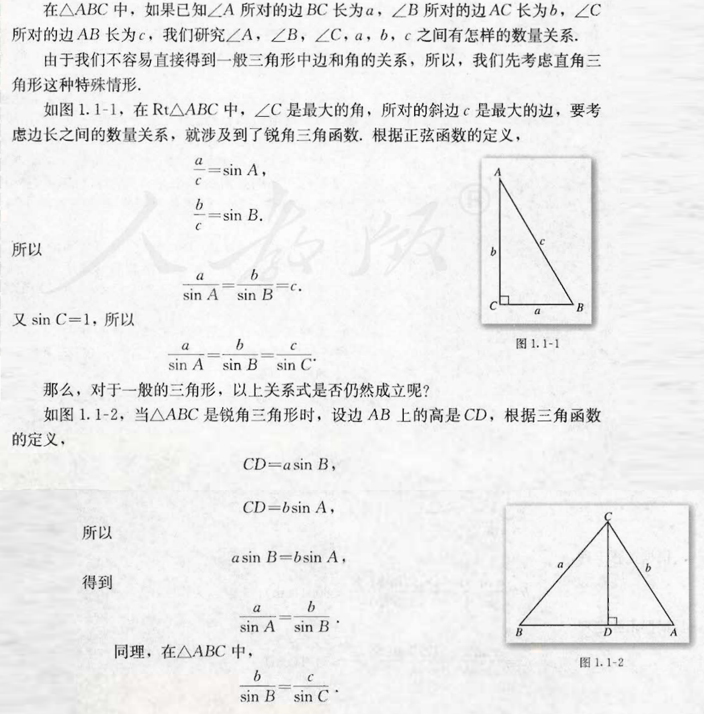

      tip: 上图最后 2 步的 "同理, 在 $\triangle ABC$ 中,
      $\frac{b}{\sin B}$ = $\frac{c}{\sin C}$". 
      是从 $\angle B$ 向线段AB($\overline{AB}$) 作垂线后再利用正弦定理来证得. 
    + 方法(2):
        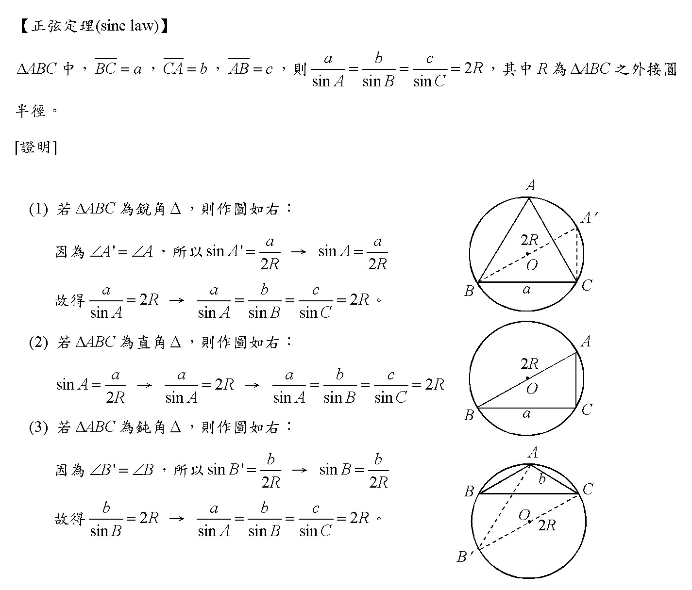
- 正弦定理常见变形:
  
    - $\sin A: \sin B : \sin C = a:b:c$
#### 1.1.2 **余弦定理**
- 定义: `余弦定理(law of cosines)`
  是三角形中任何一边的平方等于其他两边的平方和减去这两边与它们夹角的余弦($\cos$)积的两倍.即:

  $a^2 = b^2 + c^2 - 2bc\cos A$
  
  $b^2 = a^2 + c^2 - 2ac\cos B$
  
  $c^2 = a^2 + b^2 - 2ab\cos C$
- 证明: 
    - 方法(1):  tip 下图的 $\angle{B}$ 实际上是直角三角形, 可以理解为过点 $B$
      分别作 $x$ 轴和 $y$ 轴垂线的焦点. (即: 下图二)
      
      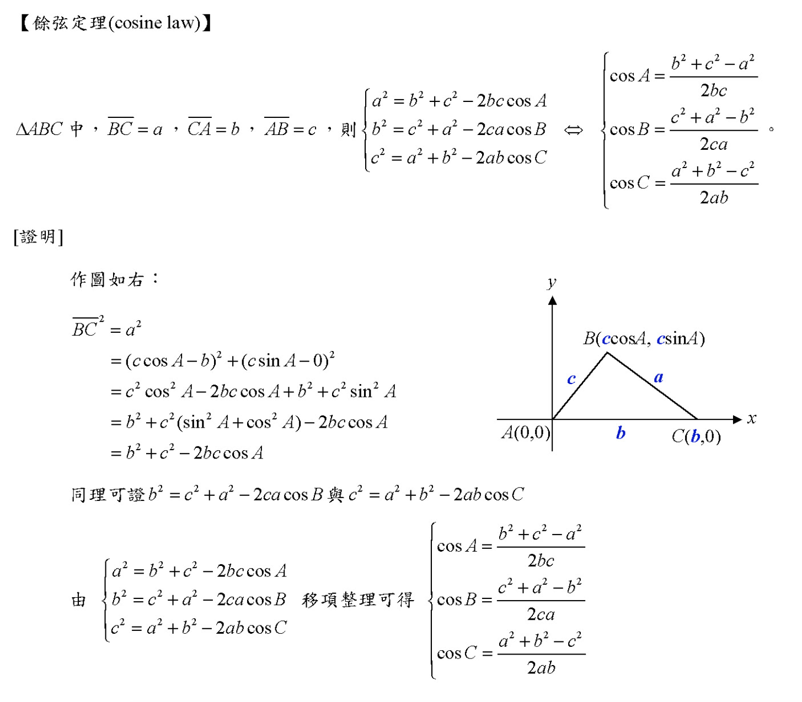

      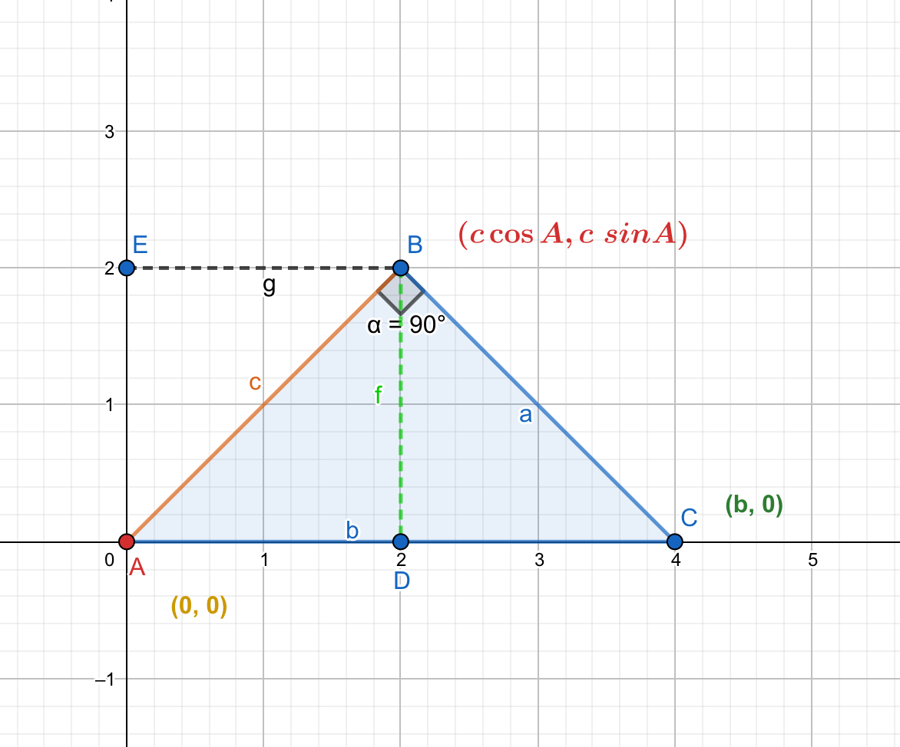
    + 方法(1): 来自本书--必修5:
      
      由于涉及到边长问题, 我们可以考虑用向量的数量积(即:点积),
      或用解析几何中的两点间距离公式来研究这个问题.
         + tip: 如果对向量不太熟悉, 可以先看:
            - `必修4.md` 
            - 和 `../数学乐-Wikipedia/向量-矢量.md`
      
      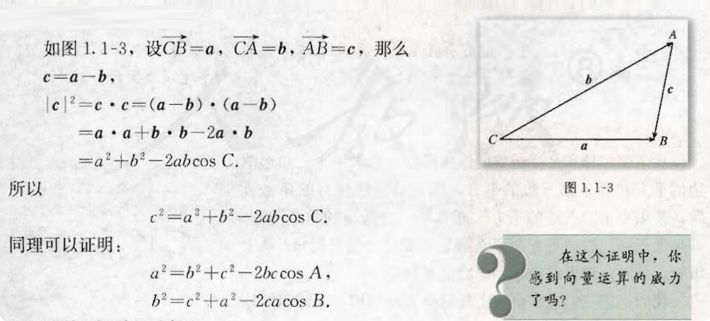
      
### 1.2 应用举例
#### 海伦和秦九韶
- 古希腊的数学发展到亚历山大里亚时期, 数学的应用性得到了很大的发展,
  其突出的一点就是三角术的发展. 三角术是人们为了建立定量的天文学,
  以便用来预报天体的运行路线和位置以帮助报时, 计算日历、航海和研究地理而产生的.

  在解三角形的问题中, 一个比较困难的问题是如何由三角形的三边 a, b, c
  直接求出三角形的面积, 据说这个问题最早是由古希腊数学家阿基米德解决的,
  他得到了公式
  $$
    S = \sqrt[]{p(p-a)(p-b)(p-c)}, \quad 这里 p = \frac{1}{2}(a + b + c)
  $$
  但现在人们常常以古希腊的数学家海伦（Heron）命名这个公式, 称此公式为海伦公式,
  因为这个公式最早出现在海伦的著作《测地术》中, 并在海伦的著作《测量仪器》和《度量术》
  中给出证明. 海伦公式的特点是形式很美, 大家很容易记住公式.

  海伦是古希腊的数学家, 他还是一位优秀的测绘工程师,
  生活的年代大约在一世纪. 他的代表作是《度量术》, 此书讨论平画图形的面积、
  立体图形的体积以及把图形分成比例部分. 《测量仪器》是他的另一本代表作,
  其中描述的一种仪器, 功能相当于现代的经纬仪. 在此书中他还讨论许多测量的问题,
  如怎样挖隧道, 从山的两侧开始, 找准方向, 使隧道准确会合; 确定两点间高度的差;
  测量可望不可及的两点之间的距离; 还有各种高度和距离的测量问题.
  我国南宋著名数学家秦九詔(约 1202 - 1261)
  也发现了与海伦公式等价的从三角形三边求面积的公式, 他把这种方法称为 "三斜求积".
  在他的著作《数书九章》卷五 "田域类" 里有一个题目: "问有沙田一段,
  有三斜其小斜一十三里, 中斜一十四里, 大斜一十五里, 里法三百步. 欲知为田几何."
  这道题实际上就是已知三角形的三边长, 求三角形的面积.《数书九章》中的求法是:
  "以小斜幂并大斜幂减中斜幂, 余半之, 自乘于上. 以小斜幂乘大斜幂减上, 余四约之,
  为实. 一为从隅, 开平方得积. ”如果把以上这段文字写成公式, 就是
  
  $$
    S = \sqrt[]{\frac{1}{4}[c^2a^2-(\frac{c^2 + a^2 - b^2}{2})^2]}
  $$
  
  秦九韶独立推出了 "三斜求积" 公式, 它虽然与海伦公式形式上不一样, 但两者完全等价,
  它填补了我国传统数学的一个空白, 从中可以充分说明我国古代已具有很高的数学水平. 

  秦九詔是我国古代数学家的杰出代表之一, 他的《数书九章》
  概括了宋元时期中国传统数学的主要成就,
  尤其是系统总结和发展了高次方程的数值解法与一次同余问题的解法,
  提出了相当完备的 "正负开方术" 和 "大衍求一术",
  对数学发展产生了广泛的影响秦九詔是一位既重视理论又重视实践,
  既善于继承又勇于创新的数学家, 他被国外科学史家赞誊为 "他那个民族, 那个时代,
  并且确实也是所有时代最伟大的数学家之一".


### 1.3 实习作业


## 第 2 章 —— 数列
### 2.1 数列的概念与简单表示法
- 传说古希腊毕达哥拉斯$^\color{red}{01}$学派的数学家经常在沙滩上研究数学问题,
  他们在沙滩上画点或用小石子来表示数.
  比如, 他们研究过 1, 3, 6, 10, .... 见下图
    + $\color{red}{01}$: 毕达哥拉斯(Pythagoras, 约公元前 570 年 ~
      约公元前 500 年)

  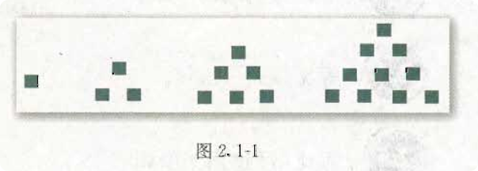

  由于这些数可以用 图 2.1-1 中所示的三角形点阵表示, 他们就将其称为三角形数.
  类似地, 1, 4, 9, 16, ..., 被称为正方形数、因为这些数能够表示成正方形.
  即图 2.1-2

  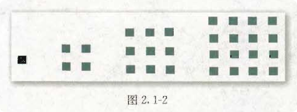

- 我们来分析一下 图 2.1-1 中的 1, 3, 6, 10, 15, 21, ... 这些数的规律:
  ```
    1  = 0 + 1,
    3  = 1 + 2,
    6  = 3 + 3,
    10 = 6 + 4, 
    15 = 10 + 5,
    21 = 15 + 6,
    ...
  ```
  如果我们按照这种对应格式
  ```
    1,   3,   6,   10,  15,  21,
    |    |    |    |    |    |  
    a_1  a_2  a_3  a_4  a_5  a_6 
  ```
    + Tip: 上面的 a_1 = $a_1$, a_2 = $a_2$, a_3 = $a_3$, ...
      由于无法在代码块中使用 LaTex 转换, 所以看起来很别扭, 为了排版好看,
      只能讲究一下了.

  把每一项和 $a_n$ 对应起来, 那么上面的规律最终可以写成这样:
  ```
    1  = 0 + 1,  <=>  a_1 = a_0 + 1
    3  = 1 + 2,  <=>  a_2 = a_1 + 2
    6  = 3 + 3,  <=>  a_3 = a_2 + 3
    10 = 6 + 4,  <=>  a_4 = a_3 + 4
    15 = 10 + 5, <=>  a_5 = a_4 + 5
    21 = 15 + 6, <=>  a_6 = a_5 + 6
    ...
  ```
  通过上面的现有规律我们可以总结一个公式即:
  $$
  a_n  = a_{n-1} + n
  $$
  , 我们可以确定对目前的已知项此公式是对的, 但是不能确定尚未写出的其他项是不是正确的,
  实际上能够证明后面的其他项套用这个公式也是正确的, 这个牵扯到 "数学归纳法"
  的证明, 在:
  <a href="../如何证明数学归纳法是正确的.md">../如何证明数学归纳法是正确的.md</a>
  这个文件中会给出详细的证明,
  但是目前对于刚学习数列概念的我们, 只需要知道此公式适用于下面未写出的其他项即可,
  等学完整个 "第二章 -- 数列" 记得回头来看证明即可.

  图 2.1-2 的规律和上面 2.1-1 相同, 不再重复记录步骤, 你可以自己尝试证明. 

- 下面我们给出有关 `数列` 的一些定义:
  
    + tip: 下面的定义可能和书本不太一样, 一些内容来自
      [维基百科-数列](https://zh.wikipedia.org/wiki/%E6%95%B0%E5%88%97).

  **`数列(sequence of number)`**是一列(两个以上)按顺序排列的数, 所组成的序列.
    + tip: 关于 `序列` 见
      <a href="../序列是什么.md">../序列是什么.md</a>

  数列中的每一个数叫做这个数列的 **`项`**. 数列中的每一项都和它的序号有关,
  排在第一位的数称为这个数列的第 1 项(通常也叫做 **`首项`**),
  排在第二位的数称为这个数列的第 2 项 $\cdots\cdots$ 排在第 $n$
  位的数称为这个数列的第 $n$ 项.

  所以, 数列的一般形式可以写成
  $$
    a_1, a_2, a_3, \cdots a_n, \cdots,
  $$
  记作: <$a_n$>, {$a_n$} 或 $(a_n)$.
    + tip: {$a_n$} 是表示数列的一种方式, 不是无序的集合符号.
    + Added: 我们可能会见到另外一种叙述数列一般形式的说法, 如下, 记作:
      <$a_k$>, {$a_k$} 或 $(a_k)$: <br>
      $\{a_k\}_{k=1}^{n} = {a_1, a_2, a_3, \cdots, a_n}$
      其中 $n \in Z^+$, $Z^+$ 是正整数集.

  项数有限的数列叫做 `有穷数列`, 项数无限的数列叫做 `无穷数列`.

  从第 2 项起, 每一项都大于它的前一项的数列叫做 `递增数列`;

  从第 2 项起, 每一项都小于它的前一项的数列叫做 `递减数列`,

  各项相等的数列叫做 `常数列`;

  从第 2 项起, 有些项大于它的前一项, 有些项小于它的前一项的数列叫做 `摆动数列`.

- 数列可以看成以正整数集 $N^+$ (或它的有限子集 {1, 2, 3, $\cdots$, $n$})
  为定义域的函数 $a_n = f(n)$ 当自变量按照从小到大的顺序依次取值时所对应的一列函数值
  (下图 2.1-3). 反过来, 对于函数 $y = f(x)$, 如果
  $f(i)$ $(i = 1, 2, 3, \cdots)$ 有意义, 那么我们可以得到一个数列
  $$
    f(1), f(2), f(3), \cdots, f(n), \cdots.
  $$

  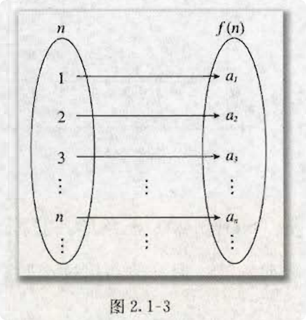
  
  如果数列 $\{ a_n\}$ 的第 $n$ 项与序号 $n$ 之间的关系可以用一个式子来表示,
  那么这个公式叫做这个数列的 `通项公式`. 我们可以根据数列的通项公式算出数列的各项.
  
  + tip: 我们上面推导的那个 $a_n  = a_{n-1} + n$ 也即是上面数列的通项公式.
  
- **例(1):**

  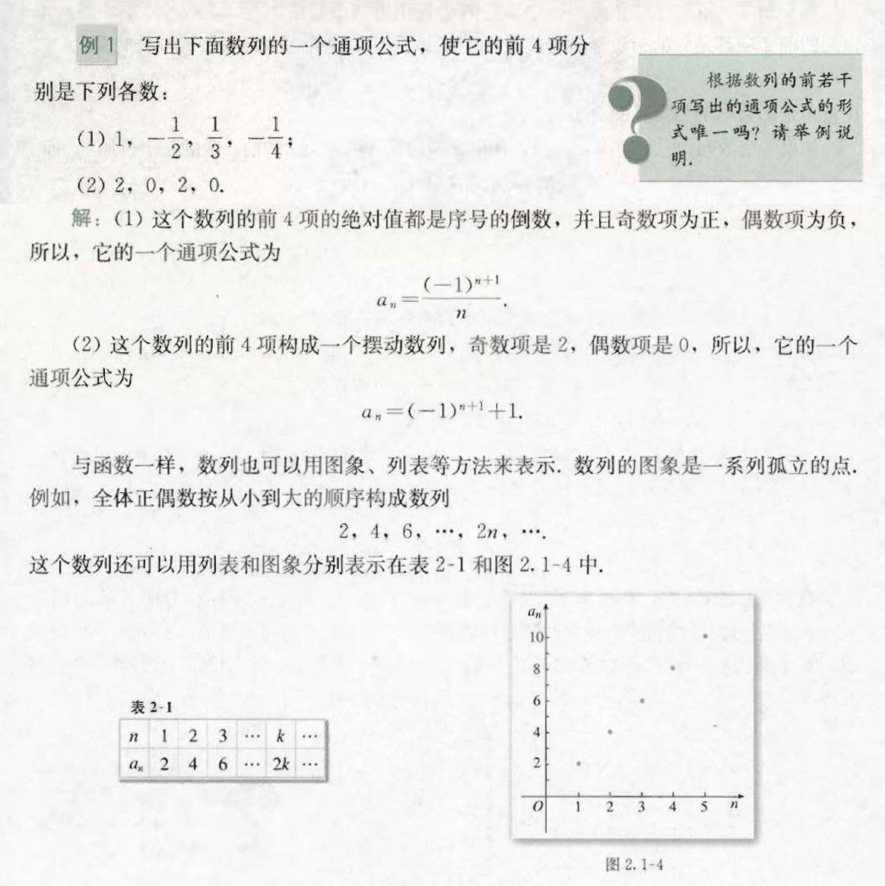

- **例(2): `递推公式` 的推导**

  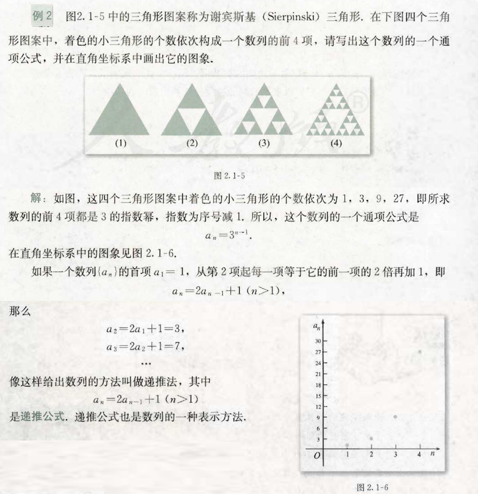

#### 斐波那契数列
- 暂略

#### 估计 $\sqrt{2}$ 的值
- 暂略

### 2.2 等差数列
- `等差数列`的定义: 一般地, 如果一个数列从第 2 项起, 每一项与它前一项的差等于同一个常数,
  那么这个数列就叫做 `等差数列(arithmetic sequence)`, 这个常数叫做等差数列的
  `公差(common difference)`, 公差通常用字母 $\color{orange}{d}$ 表示.
  
    + tip: 一些教材书把等差数列的英文缩写记作 `A.P. (Arithmetic Progression)`.
- `等差中项`: 由 3 个数 $a$, A, $b$ 组成的等差数列可以看作是最简单的等差数列. 这时,
  A 叫做 $a$ 与 $b$ 的 `等差中项(arithmetic mean)`. 
- 一般地, 如果等差数列 $\{ a_n\}$ 的首项是 $a_1$, 公差为 $d$, 我们根据等差数列的定义,
  可以得到
  $$
    a_2 - a_1 = d, \quad a_3 - a_2 = d, \quad a_4 - a_3 = d, \cdots
  $$
  所以
  $$
    \begin{align}
        & a_2 = a_1 + d, \\
        & a_3 = a_2 + d = (a_1 + d) + d = a_1 + 2d \\
        & a_4 = a_3 + d = (a_2 + d) + d = (a_1 + d + d) + d = a_1 + 3d, \\
        & \cdots \cdots
    \end{align}
  $$
  由此, 根据一步一步的递推我们即可推出等差数列的通项公式, 如下:
  $$
  \bbox[#f9f9f9, 10px]{a_n = a_1 + (n-1)d}.
  $$

### 2.3 等差数列的前 n 项和
- 200 多年前, 高斯的算术老师提出了下面的问题: 
  
  1 + 2 + 3 + $\cdots$ + 100 = ?

  据说, 当其他同学忙于把 100 个数逐项相加时, 10
  岁的高斯却用下面的方法迅速算出了正确的答案:

  小高斯是这么考虑的.
    + 高斯(Carl Friedrich Gauss, 1777-1855), 德国著名的数学家.
      他的研究涉及数学的各个领域, 是历史上最伟大的数学家之一, 被誉为 "数学王子".

  1 + 2 + 3 + $\cdots$ + 100 顺序计算的结果和 100 + 99 + 98 + $\cdots$ + 1
  逆向计算的结果应该是相等的. 那么, 就将这两串数字像下面这样纵向地相加.

  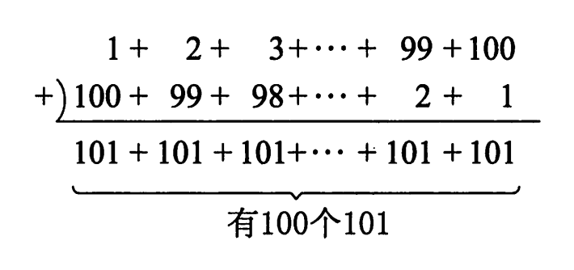

  如此一来, 就变成了 101 + 101 + 101 + $\cdots$ + 101 一共 100 个 101
  相加的结果. 这样的计算就非常简单了. 只要将 101 乘以 100 即可, 结果为 10100.
  不过 10100 是要求的数的 2 倍, 因此还得除以 2, 答案为 5050. 

  高斯的算法实际上解决了求等差数列
  $$
    1, 2, 3, \cdots n, \cdots
  $$
  中前 100 项的求和问题, 人们从这个算法中受到启发, 用下面的方法计算
  $1, 2, 3, \cdots n, \cdots$ 的前 $n$ 项和:

  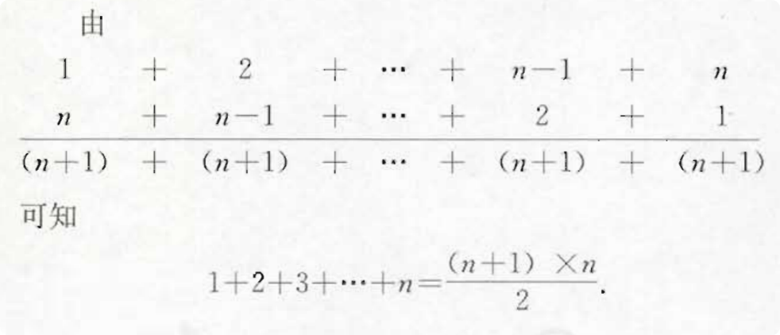
- 一般地, 我们称
  $$
    a_1 + a_2 + a_3 + \cdots + a_n.
  $$
  为数列 $\{ a_n \}$ 的前 $n$ 项和, 用 $S_n$ 表示, 即
  $$
    S_n = a_1 + a_2 + a_3 + \cdots + a_n.
  $$
  由高斯算法的启示, 对于公差为 $d$ 的等差数列, 我们用两种方式表示 $S_n$:
  $$
    S_n = a_1 + (a_1 + d) + (a_1 + 2d) + \cdots + [a_1 + (n - 1)d] \quad (1) 
  $$
  和 
  $$
    S_n = a_n + (a_n - d) + (a_n - 2d) + \cdots + [a_n - (n - 1)d]. \quad (2)
  $$
  由 (1) + (2), 得
  $$
  \begin{align}
        2S_n & = \underbrace{(a_1 + a_n) + (a_1 + a_n) + (a_1 + a_n) + \cdots + (a_1 + a_n)}_{n 个}    \\[2ex]
        & = n(a_1 + a_n)
    \end{align}
  $$
  由此得到等差数列 $\{ a_n\}$ 的前 $n$ 项和的公式
  $$
    S_n = \frac{n(a_1 + a_n)}{2}
  $$
  如果代入等差数列的通向公式 $a_n = a_1 + (n - 1)d$, $S_n$ 也可以用首项 $a_1$
  与公差 $d$ 表示
  $$
  S_n = na_1 + \frac{n(n - 1)}{2}d
  $$
- **例(2) 和 例(3)**
  
  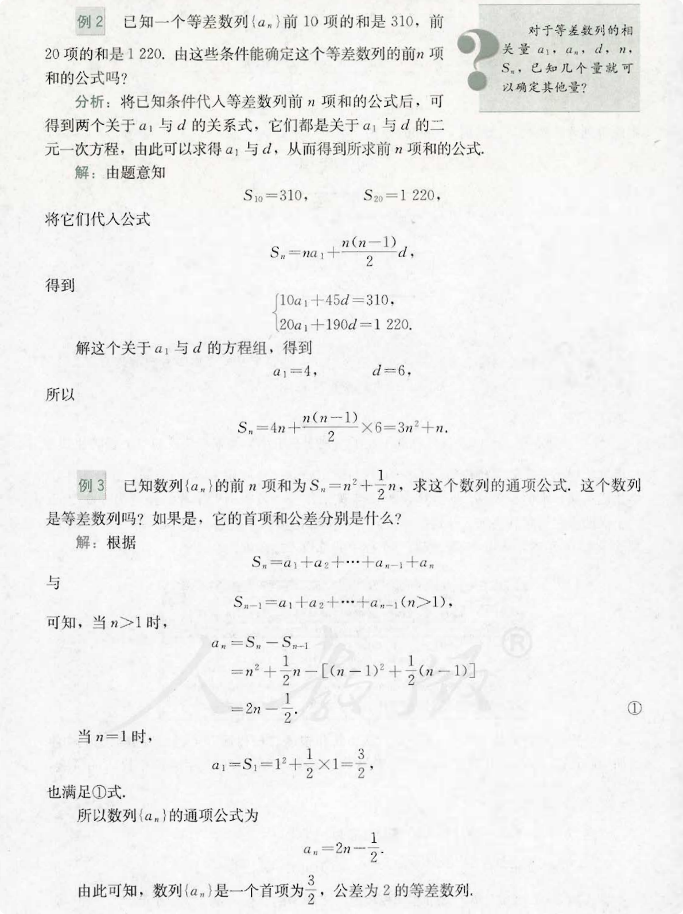


### 2.4 等比数列 (geometric sequence)
- 在 2.2 `等差数列` 的开头有一个示例, 说我国现行储蓄制度规定, 银行存款利息的方式为单利,
  即当年本金的利息都不会算入到下一年的本金中. 按照单利计算本利和(本金和利息的和)的公式为:
  $$
    本利和 = 本金 \times (1 + 利息 \times 存期).
  $$
  但是, 除了上面说的单利, 银行还有一种支付利息的方式 -- 复利,
  即把前一期的本金和利息加在一起算作下一期本金,
  也就是通常说的 "利滚利", 按照复利计算本利和的公式是:
  $$
    本利和 = 本金 \times (1 + 利率)^{存期}.
  $$
  例如, 现在存入银行 10000 元钱, 年利率是 1.98%, 那么按照复利,
  5 年内各年末得到的本利和分别是（计算时精确到小数点后 2 位）:
  | 时间 | 年初本金(元) | 年末本利和(元)|
  | :---: | :---: | :---: |
  | 第 1 年 | 1000 | 10000 + 10000 $\times$ 0.0198 = 10000(1 + 0.0198) = 1000 $\times$ 1.0198 |
  | 第 2 年 | 1000 $\times$ 1.0198 | 1000 $\times$ 1.0198$^2$ |
  | 第 3 年 | 1000 $\times$ 1.0198$^2$ | 1000 $\times$ 1.0198$^3$ |
  | 第 4 年 | 1000 $\times$ 1.0198$^3$ | 1000 $\times$ 1.0198$^4$ |
  | 第 5 年 | 1000 $\times$ 1.0198$^4$ | 1000 $\times$ 1.0198$^5$ |

  各年末的本利和(元) 组成了下面的数列:
  $$
    1000 \times 1.0198    \qquad (1)  \\[2ex]
    1000 \times 1.0198^2  \qquad (2)  \\[2ex]
    1000 \times 1.0198^3  \qquad (3)  \\[2ex]
    1000 \times 1.0198^4  \qquad (4)  \\[2ex]
    1000 \times 1.0198^5  \qquad (5)  \\
  $$
  上面的 (1), (2), (3), (4), (5) 项中, 我们从第 2 项起,
  每一项与前一项的比都等于一个常数(1.0198). 像这种数列, 我们称为等比数列.

- `等比数列(geometric sequence)`, 又称 `几何数列`. 是一种特殊数列. 它的特点是:
  数列从第 2 项起, 每一项与前一项的比都是一个常数.
	+ 例如: 数列 2, 4, 8, 16, 32, ... , $2^n$, $2^{n+1}$, ....
      这就是一个等比数列, 因为第 2 项与第 1 项的比和第 3 项与第 2 项的比相同,
      都等于 2, $2^{198}$ 与 $2^{197}$ 的比也等于 2.
  
  如 2 这样, 后一项与前一项的比称为 `公比(common ratio)`, 通常用字母 `r` 或 `q`.
- **等比公式**
	
	+ 根据等比数列的定义可得: $q$ = $\frac{a_n}{a_{n-1}}$ $(n \geq 2)$
- **通项公式**
	+ 可以任意定义一个等比数列 ${a_n}$, 这个等比数列从第一项起分别是 
	  $a_1, a_2, a_3, ..., a_n, ...$. 公比为 `q`, 则有: 
	  $$
	  	\begin{align}
			& a_2 = a_1q \\
			& a_3 = a_2q = a_1q^2 \\
			& a_4 = a_3q = a_2q^2 = a_1q^3 \\
			& . \\
			& . \\
			& .
		\end{align}
	  $$
	+ 以此可推得, 等比数列 ${a_n}$ 的通项公式为:
      $$
        \bbox[#f9f9f9, 6px]{a_n = a_{n-1}q = a_1{q^{n-1}}}
      $$

### 2.5 等比数列的前 n 项和
- 一般地, 对于一个等比数列
  $$
    a_1, a_2, a_3, ..., a_n, ...
  $$
  它的前 $n$ 项和是:
  $$
    S_n = a_1 + a_2 + a_3 + ... + a_n.
  $$
  如果该等比数列的公比为 $q$, 则有: 
  $$
    \begin{align}
        S_n &= a_1 + a_2 + a_3 + ... + a_n \\
            &= a_1 + a_1q + a_1q^2 + ... + a_1q^{n-1} \quad (根据等比数列的通项公式) \quad (1)
    \end{align}	
  $$
  先将两边同时乘以公比 $q$, 有
  $$
    qS_n = a_1q + a_1q^2 + ... + a_1q^n  \quad (2)
  $$
  (1) - (2) 式, 有:
  $$
    (1-q)S_n = a_1 - a_1q^n ...(3)
  $$
  然后进行讨论:
    + 当 $q \neq 1$ 时, $S_n = a_1 \frac{1-q^n}{1-q}$;
    + 当 $q = 1$ 时, 由 (3) 式无法得通项公式.

  但可以发现, 此时:
  $$
    \begin {align}
        S_n &= a_1 + a_2 + a_3 + ... + a_n \\
            &= a_1 + a_1q + a_1q^2 + ... + a_1q^{n-1} \\
            &= a_1 + a_1 + a_1 + ... + a_1 \\
            &= na_1 
    \end{align}  
  $$
  综上所述, 等比数列 ${a_n}$ 得求和公式为:
  $$
  S_n = 
    \begin{cases}
        \frac{a_1 - a_1q^n}{1-q}  & (q \neq 1) \\[2ex]
        na_1  & (q = 1)
    \end{cases}
  $$
  经过推导, 上面的当 $q \neq 1$ 时的公式可以变形为:
  $$
    \begin{align}
       S_n = \frac{a_1(1-q^n)}{1-q} 
           = \frac{a_1q^n - a_1}{q-1}
    \end{align}
  $$
  tip: 也既是上下项都乘以 $-1$.

- **当 $-1 < q <1$ 时,  等比数列无限项之和**
	+ 由于当 $-1 < q < 1$ 及 $n$ 得值不断增加时, $q^n$ 得值便会不断减少而且趋于 0, 因此
	  无限项之和为:
	  $$
	  S = \lim_{n \to \infty}
	  $$

- > Added: `等差数列` / `等比数列` 的更多参考见:
  `../../什么是数学_BOOK/Chapter01_自然数/Chapter01_自然数.md`


#### 九连环
#### 购房中的数学

## 第 3 章 —— 不等式
### 3.1 不等关系与不等式
### 3.2 一元二次不等式及其解法
### 3.3 二元一次不等式 (组) 与简单的线性

### 3.4 基本不等式: $\sqrt{ab} \leq \frac{a+b}{2}$
- 我们先来看下图 
  
  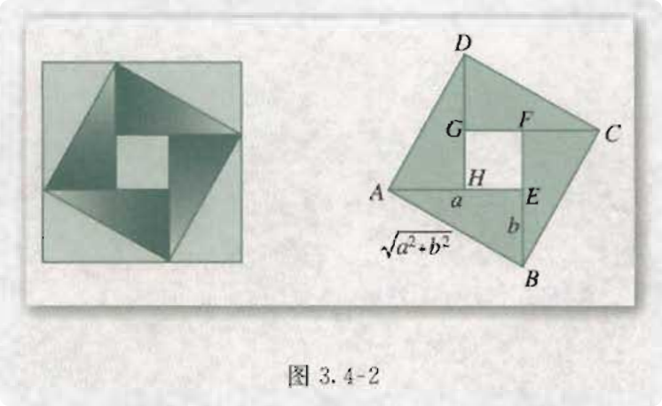

  将图 3.4-2 中的左边的 "风车" 图形抽象成右图的形式. 在正方形 $ABCD$ 中有 4
  个全等的直角三角形. 设直角三角形的两条直角边的长为 $a$, $b$ (a $\neq$ b),
  我们可以看出来正方形 $ABCD$ 的四条边边都为 $\sqrt[]{a^2 + b^2}$. 
  4 个直角三角形的面积和为 $2ab$ (三角形面积 = 底 $\times$ 高 $\div$ 2).
  正方形 $ABCD$ 的面积为 $a^2 + b^2$ (正方形面积 = 边长的平方). 
  从图中我们可以很直观的看出正方形 $ABCD$ 的面积大于 4 个直角三角形的面积和,
  我们就得到了一个不等式
  $$
  a^2 + b^2 > 2ab.
  $$
  当直角三角形变为等腰直角三角形, 即 $a$ = $b$ 时, 正方形 $EFGH$ 缩为一个点,
  这时有
  $$
    a^2 + b^2 = 2ab.
  $$
- 一般地, 对于任意实数 $a$, $b$, 我们有
  $$
    a^2 + b^2 \geq 2ab.
  $$
  当且仅当 a=b 时，等号成立
- 你能给出上面的证明吗?
  
  特别地, 如果 $a > 0$, $b > 0$. 我们用 $\sqrt[]{a}$, $\sqrt[]{a}$
  分别代替 $a$, $b$, 可得
  $$
    a^2 + b^2 \geq 2ab.
  $$
  通常我们把上式写作
  $$
    \sqrt[]{ab} \leqslant \frac{a + b}{2}  \quad (a>0, b>0). \qquad (0)
  $$
  以上我们从几何图形中的面积关系获得了不等式 (0). 能否利用不等式的性质,
  直接推导出这个不等式呢? 我们一起来分析一下
  $$
    \frac{a + b}{2} \geqslant \sqrt[]{ab}   \qquad (1)
  $$
  只需要证
  $$
    a + b \geqslant 2\sqrt[]{ab},   \qquad (2)
  $$
  只要证 (2), 即 
  $$
    a + b - 2\sqrt[]{ab} \geqslant 0.   \qquad (3)
  $$
  要证(3), 只要证
  $$
    (\sqrt{a} - \sqrt{b})^2 \geqslant 0. \qquad (4)
  $$
  显然, (4) 是成立的(一个数的平方一定大于等于 0). 当且仅当 $a$ = $b$ 时,
  (4) 中的等号成立.
- 我们常把 $\frac{a + b}{2}$ 叫做正数 $a, b$ 的 `算术平均数`, 把 $\sqrt{ab}$
  叫做正数 $a, b$ 的 `几何平均数`.
