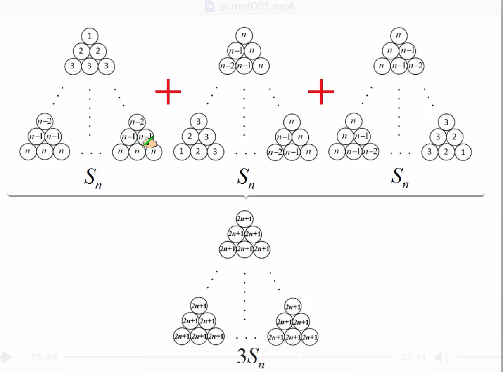
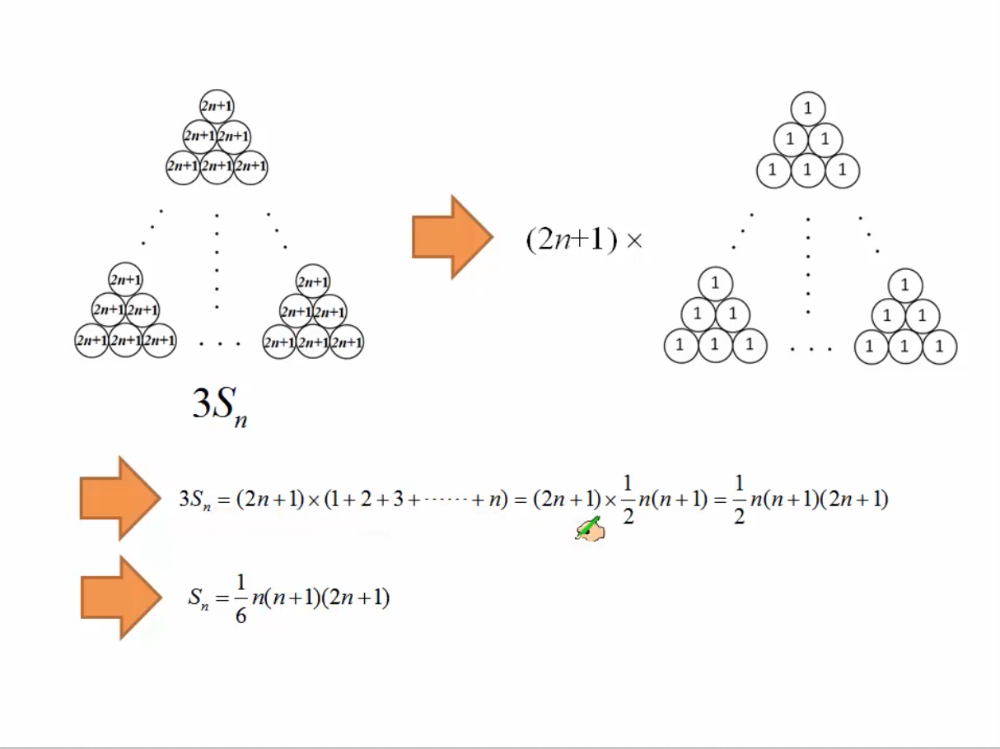
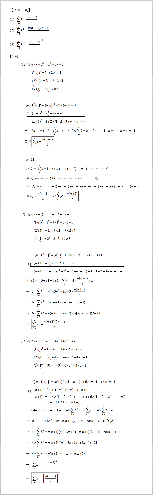

# 基础定理

## 目录(Catalog)
1. 求和符号 $\sum$ (sigma)
2. [证明] 级数公式
3. 学习线性代数需要先学微积分吗？
4. 机器学习和计算机视觉相关的数学
5. 全称量词 / 全称量化
    + 基础
6. 存在量词 ($\exists$)
7. 注(排)水问题:
8. 平行四边形, 矩形, 菱形, 正方形的定义和判定方法?
9. 在直角三角形中, $30^\circ$ 角所对的直角边等于斜边的一半

## 生词:
- **quadratic [kwɒ'drætɪk] adj.二次的 n.二次方程式**
- **trigonometric [ˌtriɡənə'metrik] (trigono-metric) --adj.三角法的**
    + --> trigonometric functions 三角函数
- **trigonometry [ˌtrɪgə'nɒmɪtrɪ] --n.三角学, 三角法，三角函数**
    + --> Trigonometry formulas 三角函数公式
- **definition [defɪ'nɪʃ(ə)n] --n.定义，精确度**
    + --> definition of probability. 概率定义
    + --> It is by definition a complex object. 它本质上是个复杂的物体。
- **fundamental [fʌndə'ment(ə)l] --adj.基本的，根本的，重要的。--n.基本原则，基本法则**
- **identity [aɪ'dentɪtɪ] ---n.身份，特性** 
    + --> local identity name 本地身份名称
    + --> Definitions and Fundamental Identities 定义和基本特性
- **exist [ɪg'zɪst] --vi.存在, 生存, 幸存**
    + --> Some people believe that ghosts exist.
        有的人相信鬼魂存在.
    + --> Such things exist only in fancy. 那样的事只有存在于幻想中
    + --> We cannot exist without air. 我们没有空气就不能存在.
    + --> Mankind exists on food. 人类靠食物生活.

## 内容(Content)
### 1. 求和符号 $\sum$  (sigma)
- A.4.1 定义与基本性质: $a_{1} + a_{2} + ... + a_{9} + a_{10}$ 可以简写为以下形式: 
    + $$
        \sum_{i=1}^{10}a_{i}
      $$
    + : 意思为 $a_{i}$ 项到 $a_{10}$ 项的求和。
    + tips: 求和符号中可以使用任意未被占用的字母作为计数下标，含义不变。
- A.4.2 双重求和: 两个连用的求和符号间存在运算优先顺序，我们可以通过添加括号来明确区分它们
  的关系, 如下所示:        
  $$
  \begin{align}
        & \sum_{i=1}^3 \sum_{j=1}^4f(i,j) \\
        & = \sum_{i=1}^3 (\sum_{j=1}^4f(i,j)) \\
        & = \sum_{i=1}^3(f(i, 1) + f(i, 2) + f(i, 3) + f(i, 4)) \\
        & = (f(1, 1) + f(1, 2) + f(1, 3) + f(1, 4)) \\
          & \quad + (f(2, 1) + f(2, 2)+ f(2, 3) + f(2, 4)) \\
          & \quad + (f(3, 1) + f(3, 2) + f(3, 3) + f(3, 4))
    \end{align}
  $$
  

### 2. [证明] 级数公式
> [来源](http://sites.ccvs.kh.edu.tw/fuchi/doc/26266)
> 来源: http://sites.ccvs.kh.edu.tw/fuchi/doc/26266
- (1) 
    $$
        Sn = 1+2+3+ \cdots +(n-2)+(n-1)+n = \frac{n(n+1)}{2} = \sum_{k=1}^{n} k
    $$
    +  比较常用的读法: sigma $k$ 从 1 到 n, 对 $k$ 求和
    + 证明步骤:  
        1. $设 S_n = 1 + 2 + 3 + \cdots + (n-2) + (n-1) + n = \sum_{k=1}^{n} k$
           $\quad \text{(1)}$
        1. $则 S_n = n + (n-1) + (n-2) + \cdots + 3 + 2 + 1  \quad \text{(2)}$
        1. (1) + (2) 得
        1. $2S_n = (1 + n) + [2 + (n-1)] + [3 + (n-2)] + [4 + (n-3)] + \cdots +$
           $[(n-2) + 3] + [(n-1) + 2] + [n + 1]$
        1. $2S_n = (1+n) + (1+n) + (1+n) + \cdots + (1+n) + (1+n) + (1+n)$
        1. $故 S_n = \frac{n(1+n)}{2},$
        1. $即 \sum_{k=1}^{n} k = 1+2+3+ \cdots +(n-2)+(n-1)+n = \frac{n(n+1)}{2}$
- (2) $S_n = 1^2 + 2^2 + 3^2 + \cdots + (n-2)^2 + (n-1)^2 + n^2 = \sum_{k=1}^n k^2$
    + $$
        \sum_{k=1}^{n} k^2 = \frac{n(n+1)(2n+1)}{6}
    $$
    + 
      
        - Tip: (1)第 2 个三角垛在第 1 个三角垛的基础上逆时针旋转 $120^\circ$ 得到
        - (2)第 3 个三角垛是在第 2 个的基础上接着逆时针旋转 $120^\circ$ 得到
    + 
- (3)
    $$
        \sum_{k=1}^{n} k^3 = [\frac{n(n+1)}{2}]^2
    $$
- 完整证明图片
  

### 3. 学习线性代数需要先学微积分吗？
- Answer (1): 不需要，它们是独立的。
    + 微积分是序结构，线性代数是代数结构
    + 应该不是独立的吧, 《Linear Algebra with Applications, Eighth Edition》
      这本经典书籍，一些例题涉及了微积分，
      特别是第六章教如何用特征值和特征向量求解线性微分方程组，我看了当时就懵逼了。
      找了另一本《托马斯微积分》，1000多页，还是先得学微积分啊。
        - 线性代数解微积分应该是微分方程这门课的内容，是等到线代和微积分之后再学的。
          线性代数很多用到微积分的例子也是不需要的，如果为了给学生举出无限维向量空间的例子，
          老师可以根据微积分课的进度随便给几个学生看得懂的例子就好。所以建议两门课是大一同时上。
- Answer(2): 微积分和线性代数是合作的关系，微分是曲线曲面的平直化,
  平直化之后就是线性代数的事情了。尤其到多变量微积分，线性代数的知识用得上。
  实际上微积分和线性代数最好都学两轮（不同理论高度学两遍）。或者到微分几何课程里面再重温。

### 4. 机器学习和计算机视觉相关的数学
- (1) 线性代数 (Linear Algebra)
- (2) 概率和统计 (Probability and Statistics)
- (3) 分析 (Analysis)
- (4) 拓扑 (Topology)
- (5) 流形理论 (Manifold Theory)

### 5. 全称量词 / 全称量化
- 来源: https://zh.wikipedia.org/zh-cn/%E5%85%A8%E7%A7%B0%E9%87%8F%E5%8C%96
- 全称量词 $\forall$: 就是 A(ll) 的反写,读作 for all. 表示任意的,所有的.
- 在谓语逻辑中, 全称量化是尝试形式化某个事物 (逻辑谓词) 对于所有事物或所有有关的事物都为真
  的概念. 结果的陈述是全称量化后的陈述,我们在谓词上有了全称量化. 在符号逻辑中,全称量化 (
  $\forall$) 是用来指示全称量化的符号.
#### 基础
- 假设你要说的是: $2 \cdot{0} = 0 + 0, 以及 2\cdot{1} = 1 + 1, 以及$
  $2\cdot{2} = 2 + 2,$ 等等.
- 由于 "以及" 一词的重复使用,这似乎是一个 *逻辑合取*. 然而 *形式逻辑* 中的合取概念却不能
  表达出 "等等" 一词的含义. 因此该命题改述为:
    + 对任意自然数 n, 都存在 $2 \cdot n = n + n$.  
  这便是一个使用全称量化的单一命题.

------

### 6. 存在量词 ($\exists$)
- 存在量词 $\exists$: 读作 there exists, 就是 E(xistence) 的反写. 表示存在一个,
  至少一个.

### 7. 注(排)水问题:
> 一个水池, 底部装有一个常开的排水管, 上部装有若干个同样粗细的进水管. 当打开 4 个进水管时,
  需要 5h 小时才能注满水池; 当打开 2 个进水管时需要 15h 才能注满水池; 现在要用 2 小时将
  水注满, 至少打开多少个进水管?
- Note: 注(排)水问题是一类特殊的工程问题, 往水池注水或从水池排水相当于一项工程, 
  水的流量就是工作量. 单位时间内的流量就是工作效率.
- 答: 我们假设每个进水管每小时注水一份; 
    + (1) 4 个进水管 5h 一共注水 $4 \times 5 = 20$ 份
    + (2) 2 个进水管 15h 一共注水 $2 \times 15 = 30$ 份, 
    + (3) 让 (2) - (1) 可得出 10h 小时一共排出 10 份水, 这是因为开 2 个进水管比开
      4 个进水管多向外排水 10 个小时, 由 10 个小时排出 10 份水可得每小时水池排出 1 份水. 
    + (3) 根据 4 个水管 5 小时注水 20 份, 同时 5 小时内又会排出 5 份水 (20 - 5 = 15).
      可得水库容纳 15 份水. 
    + (4) 既然知道水池可容纳 15 份水, 又希望在 2 个小时内注满水池, 
      但 2 个小时内又会流出 2 份水, 所以可得 (15 + 2 = 17), 
      既 2 个小时内住满水池我们总共需要 17 份水. 一个水管 1 小时注水一份, 
      如果 1 小时注满我们需要 17 根,
      但现在说 2 个小时注满即可, 所以 17 $\div$ 2 $\approx$ 9 个.

### 8. 平行四边形, 矩形, 菱形, 正方形的定义和判定方法?
> 定义:
- 平行四边形：两组对边分别平行的四边形是平行四边形。
- 矩形: 4 个角都是直角的四边形是矩形。
- 菱形: 4 条边都相等的四边形是菱形。
- 正方形: 4 条边 和 4 个角都相等(直角)的四边形是正方形.   
> 判定: 
- 平行四边形: 
    + 两对边分别相等; 
    + 两对角分别相等; 
    + 两对边分别平行; 
    + 有一组对边平行且相等;
    + 对角线互相平分.
- 矩形: (在平行四边形基础上) 有一角为直角; 对角线相等.
- 菱形: (在平行四边形基础上) 有一组邻边相等; 对角线垂直; 对角线也是角平分线.
- 正方形: 即是矩形又是菱形. 

### 9. 在直角三角形中, $30^\circ$ 角所对的直角边等于斜边的一半
> 证明: `在直角三角形中,` $\color{#e7691e}{30^\circ}$`角所对的直角边等于斜边的一半`
- 

### 10. 两三角形相似 ($\backsim$)
- (1) 两角对应相等两三角形相似
- (2) 两边对应成比例且夹角相等 
- (3) 三边对应成比例, 两个三角形相似.
