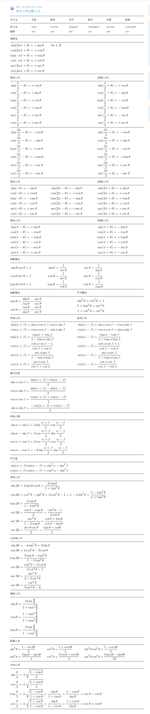
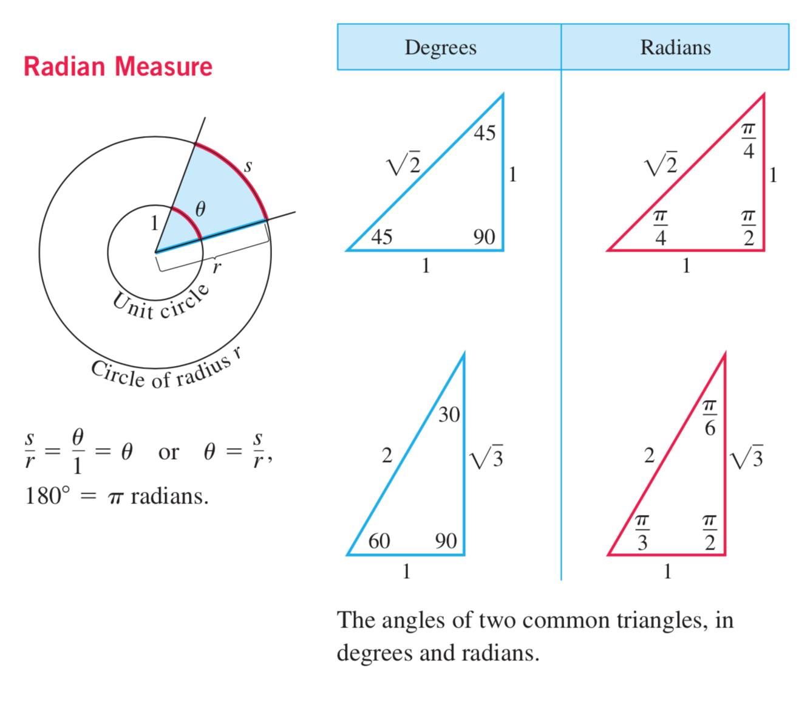

# 三角函数 (trigonometric function)

- [三角函数-Wiki](https://zh.wikipedia.org/wiki/%E4%B8%89%E8%A7%92%E5%87%BD%E6%95%B0)

## 目录(Catalog)

## 生词(New Words)

## 内容(Content)
## 几何定义
> **直角三角形中的定义**
- 在**直角三角形**中仅有**锐角**(大小在 0 - 90 度之间的角)三角函数的定义. 给定一个锐角 
  $\theta$ , 可以做出一个直角三角形, 使得其中的一个内角是$\theta$ 。设这个三角形中, 
  $\theta$ 的对边、邻边和斜边长度分别是$a, b, h$, 那么  
  
    + $\theta$ 的正弦是对边与斜边的比值：$\sin{\theta}=\frac{a}{h}$
    + $\theta$ 的馀弦是邻边与斜边的比值：$\cos{\theta}=\frac{b}{h}$
    + $\theta$ 的正切是对边与邻边的比值：$\tan{\theta}=\frac{a}{b}$
    + $\theta$ 的余切是邻边与对边的比值：$\cot{\theta}=\frac{b}{a}$
    + $\theta$ 的正割是斜边与邻边的比值：$\sec{\theta}=\frac{h}{b}$
    + $\theta$ 的馀割是斜边与对边的比值：$\csc{\theta}=\frac{h}{a}$ 
> **直角坐标系中的定义**
- 设 $P(x, y)$ 是平面直角坐标系 $xOy$ 中的一个点, $\theta$ 是横轴正向
  $\overrightarrow{Ox}$ 逆时针旋转到 $\overrightarrow{OP}$ 方向所形成的角, 
  $r = \sqrt{x^2 + y^2} > 0$ 是 $P$ 到原点 $O$ 的距离, 则 $\theta$ 的六个三角函数
  定义为: 
- | 正弦 | 馀弦 | 正切 | 馀切 | 正割 | 馀割 |
  | :--:  | :--:  | :--:  | :--:  | :--:  | :--: |
  |$\sin{\theta}=\frac{y}{r}$|$\cos{\theta}=\frac{x}{r}$|$\tan{\theta}=\frac{y}{x}$|$\cot{\theta}=\frac{x}{y}$|$\sec{\theta}=\frac{r}{x}$|$\csc{\theta}=\frac{r}{y}$|
-  
- 这样可以对 0 到 $360^\circ$ 的角度定义三角函数. 要注意的是以上的定义都只在定义式有意义
  的时候成立. 比如说当 $x = 0$ 的时候, $\sin{\theta} = \frac{y}{x}$ 和 
  $\sec{\theta} = \frac{r}{x}$ 都没有意义,这说明对于 $90^\circ$ 角和 $270^\circ$角,
  正

## 三角函数公式 (Trigonometry Formulas)
- **Definitions and Fundamental Identities 定义和基本特性**
    + Sine: $sin\theta$ = $\frac{y}{r}$ = $\frac{1}{csc\theta}$
    + Cosine: $cos\theta$ = $\frac{x}{r}$ = $\frac{1}{sec\theta}$
    + Cosine: $tan\theta$ = $\frac{y}{x}$ = $\frac{1}{cot\theta}$
    + 

- **Identities 特性**
    + 

- **Trigonometric Functions 三角函数**
    + 
    + Notes: 
        - Domain: 定义域
        - Range: 值域
        - All real numbers except odd integer multiples of $\pi/2$:
          除 π/2 的奇数整数倍之外的所有实数
    + 

## 基本类型的三角函数
1. 正弦sin函數:(sine /saɪn/ ):
    + 奇偶性:	奇函数
    + 定义域:   ($-\infty$, $+\infty$)
    + 值域:	    [1, -1]
    + 周期:	    2π
    + 特定值
        - 当 x = 0	 y = 0
        - 当 x = $+\infty$, y = N/A
        - 当 x = $-\infty$	N/A
    + 最大值:	($\frac{(4n+1)π}{2}$ , 1)
    + 最小值:	($\frac{(4n+1)π}{2}$ , -1)
    + 其他性质
        - 渐近线:	$N/A$
        - 根:	$kπ$
        - 临界点:	$kπ-\frac{π}{2}$
        - 拐点:	$kπ$
        - 不动点: $0$
1. 餘弦cos函數:(cosine): 见上图。 正弦函数和余弦函数关于 x = $\frac{π}{4}$
1. 正切tan函數:(tangent /'tæn(d)ʒ(ə)nt/ )
1. 餘切cot函數:(cotangent)
1. 正割sec函數:(secant /'siːk(ə)nt/ )
1. 餘割csc函數:(cosecant)
1. 正矢函數:
1. 半正矢函數：