# 向量 (矢量 Vector)

- 详细来源: https://www.shuxuele.com/algebra/vectors.html

## Catalog
1. 常量 (标量)
2. 向量 (矢量)
    + 2.1 向量的定义
    + 2.2 向量的运算(使用向量)
        - 2.2.1 向量相加(加向量)
        - 2.2.2 向量相减(减向量)
        - 2.2.3 缩放向量
    + 2.3 向量的量值
        + 2.3.1 向量乘以向量 (`叉积` 和 `点积`)
            - 2.3.1.1 `叉积` (也称 向(量)积) [**结果是向量**]
                + 叉积的运算(1)
                + 叉积的运算(2)
            - 2.3.1.2 `点积` (也称 标积) [结果是标量]
    + 2.4 向量的记法

## New Words
+ unit ['juːnɪt] --n.单元, 单位
+ magnitude ['mægnɪtjuːd] --n.大小；重大

## Content
### 1. 常量 (标量)
- `标量`(也称纯量或无向量) 只有 **量值** (大小):
    + 例如: 3.044, -7 和 $2\frac{1}{2}$ 是标量
    + `距离、速度、时间、温度、质量、长度、面积、体积、密度、电荷、压力、能量、功 和 功率`
      都是标量.

### 2. 向量 (矢量)
### 2.1 向量的定义
- **`矢量(向量)`**: 物理学上指由大小和方向共同决定的量.
  
  有 **量值 (大小)** 和 **方向**:
  
  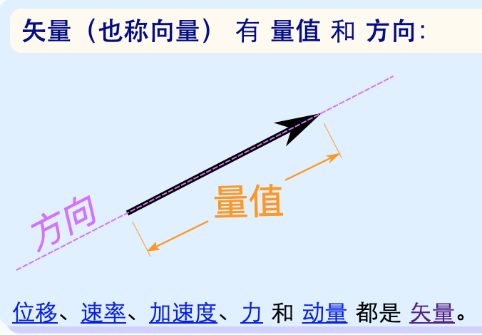

  `位移、速率、加速度、力 和 动量` 都是矢量. 
    + Tips: 距离和位移
        - 距离是标量 (E.g.: 3km)
        - 位移是矢量 (E.g.: 3km 向南)
        - 你可能走了很长的距离, 但你的位移可能是很小 (甚至是 0, 若你回到原位). 
          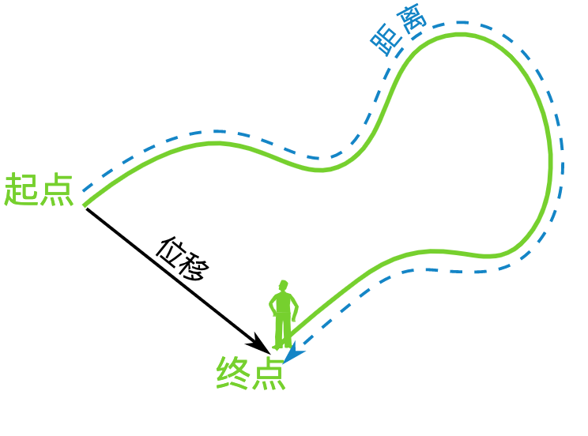
    + Tips: 速度与速率:
        - 速度是移动的快慢. 
        - 速率是向一个方向的速度. ·
        - E.g.:
            + "狗狗跑得有 9 km/h 那么快" 是描述的 速度. 
            + "狗狗向西跑 9 km/h 那么快" 是描述的 速率. 

### 2.2 向量的运算(使用向量)
- 最常用的方法时先把矢量拆分为 $x$ 部分与 $y$ 部分, 像这样:

  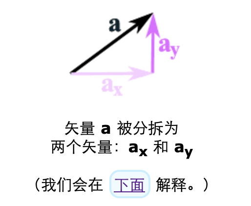
  
  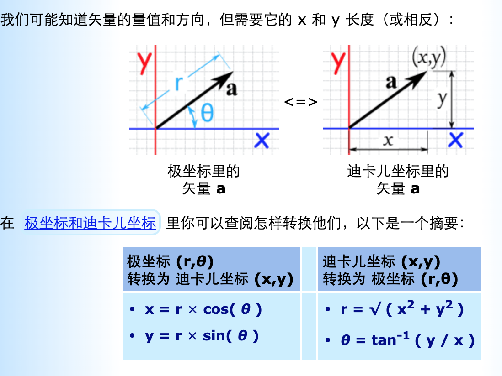
  
  tip: 这里的 $r$ 实际上是长度, 虽然图上画的那个是向量(比如称为 $\bold a$),
  那么 $r$ = $\bold |a|$ (读作: 向量 $\bold |a|$的长度)

#### 2.2.1 向量相加(加向量)
- 把两个向量相加就是把它们的头尾连接起来, $x$ 部分和加 $y$ 部分再分别相加:
  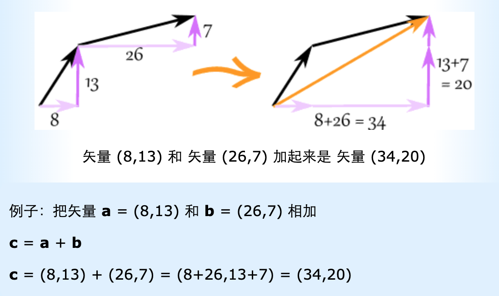

#### 2.2.2 向量相减(减向量)
- 先把第二个向量 (要减去的向量) 倒转方向. 然后把它们相加：
  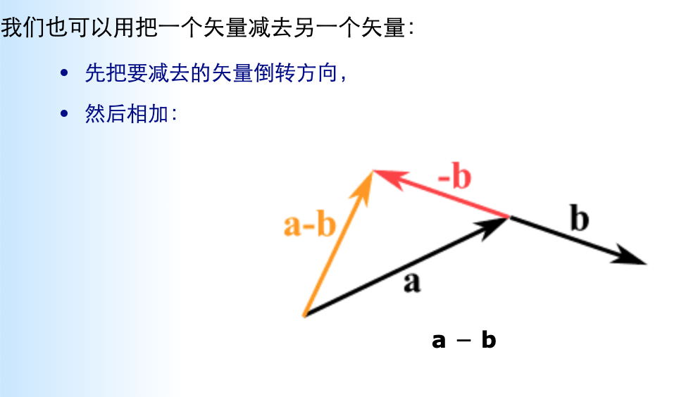
  
  例子: 把 ${\bold k} = (4, 5)$ 从 ${\bold v} = (12, 2)$ 减去
  $$
    \begin{align}
        & {\bold a} = {\bold v} + {\bold -k} \\
        & {\bold a} = (12, 2) + -(4, 5) = (12, 2) + (-4, -5) 
            = (12-4, 2-5) = (8, -3)
    \end{align}
  $$
  
#### 2.2.3 缩放向量
- 我们可以把向量乘以标量 (叫 "缩放" 向量):
  
  例子: 把 向量 ${\bold m} = (7, 3)$ 乘以标量 3:
    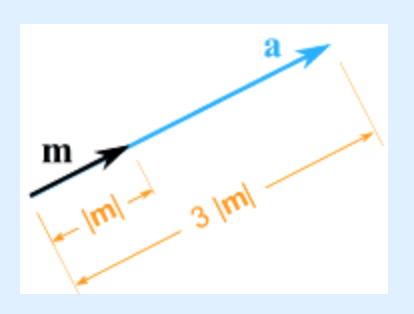
  
  ${\bold a} = 3 {\bold m} = (3 \times 7, 3 \times 3) = (21, 9)$
  
  它还是指向同一方向, 但长了 3 倍.  

### 2.3 向量的量值
- 向量两旁有垂直线代表它的量值: ${\bold |a|}$
  
  也可以用双垂线, 以免和绝对值混淆: ${\bold ||a||}$
    + 读作: 向量 ${\bold a}$ 的量值 (长度) $\Rightarrow$ ${\bold |a|}$  
- 我们用勾股定理来求向量的量值: 
    + 例子: 向量 ${\bold b}$ = (6,8) 的量值是多少？
        - ${\bold |b|} = \sqrt{( 62 + 82 )} = \sqrt{( 36+64 )} = \sqrt{100} = 10$
- 量值为 1 的向量称为 `单位向量`.        

#### 2.3.1 向量乘以向量 (`叉积` 和 `点积`)
$\quad$ 怎么把两个向量相乘? 有 2 个方法!
##### 2.3.1.1 `叉积` (也称 向(量)积) [**结果是向量**]
- 详细: https://www.shuxuele.com/algebra/vectors-cross-product.html 
- 两个向量的叉积 ${\bold a} \times {\bold b}$ 是与这 2 个向量垂直的 向量:
  
  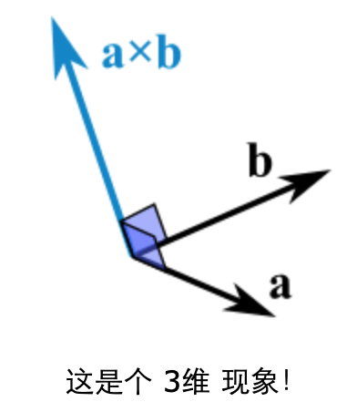

###### 叉积的运算(1)
- 叉积是这样计算的: ${\bold a} \times {\bold b}$ =
  ${\bold |a|}{\bold |b|} \sin(\theta){\bold n}$ 
    + ${\bold |a|}$: 向量 ${\bold a}$ 的量值 (长度) $\quad$ 
        [Tip: 也可读为: ${\bold a} 向量的长度$] 
    + ${\bold |b|}$: 向量 ${\bold b}$ 的量值 (长度) $\quad$ 
        [Tip: 也可读为:  ${\bold b} 向量的长度$]
    + $\theta$ 是 ${\bold a}$ 和 ${\bold b}$ 之间的角度. 
    + 用图形表示为: 
        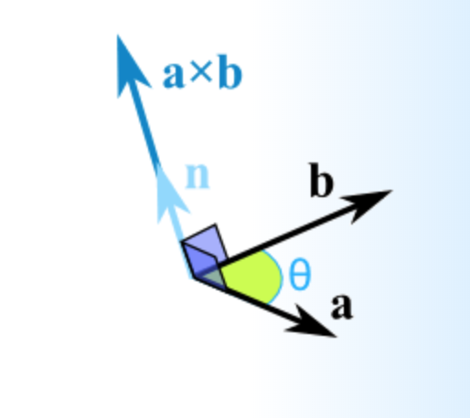
    + ${\bold n}$ 是 ${\bold a}$ 和 ${\bold b}$ 垂直的 "`单位向量`". 
        - `单位向量 (Unit Vector)`: 单位向量的大小为 1 (A Unit Vector has 
            a magnitude of 1). 
        - 符号: The symbol is usually a lowercase letter with a "hat", 
          such as: $\hat{a}$ (Pronounced "a-hat")  
          (通常是小写的带有 "帽子"的字母, 例如: ${\hat a}$ (发音为: "a-hat"))

          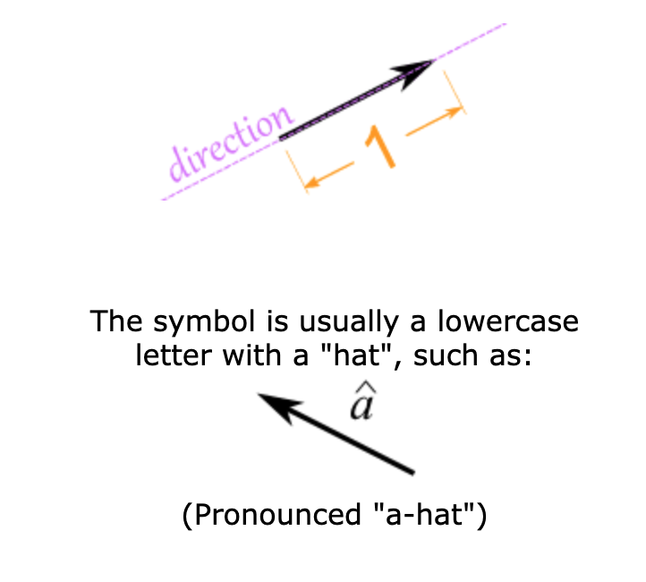

        - 缩放 (Scaling): A vector can be "scaled" off the unit vector.
          Here vector ${\bold a}$ is shown to be 2.5 times unit vector.
          Notice they still point in the same direction:

          (向量可以从单位向量 "缩放". 这里向量 ${\bold a}$ 显示为单位向量的 2.5 
          倍. 请注意, 它们仍指向同一方向.) 

          For example:

          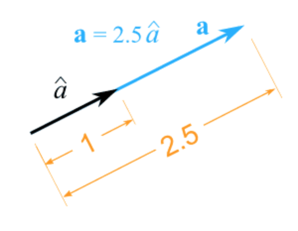             
        - In 2 Dimensions (在 2 维中)
            + Unit vector can be used in 2 Dimensions:
              
              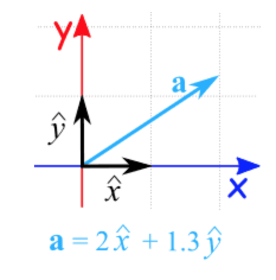

            + Here we show that the vector ${\bold a}$ is made up of 2 
              "$x$" unit vectors and 1.3 "$y$" unit vectors.

              (这里我们显示向量 ${\bold a}$ 由 2$x$ 单位向量 和 3$y$ 单位向量
              组成. )
        - In 3 Dimensions (在 3 维中):
            + Likewise we can use unit vectors in there (or more!) 
                dimensions:  
                (同样我们可以在 3 个 (或更多) 维度中使用单位向量. ) 
                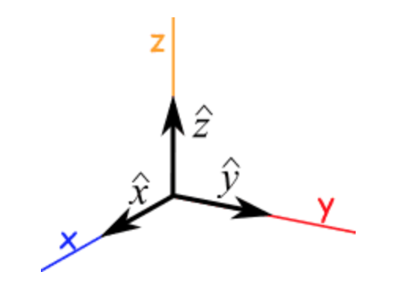
    + 长度 是: ${\bold a}$ 的长度 乘以 ${\bold b}$ 的长度 乘以 
      ${\bold a}$ 和 ${\bold b}$ 之间的正弦, 然后我们乘以向量 ${\bold n}$ 来确保
      结果是指向着正确的方向. (垂直于 ${\bold a}$和 ${\bold b}$)

###### 叉积的运算(2)
- 我们也可以这样计算叉积: 若 ${\bold a}$ 和 ${\bold b}$ 
    的起点是原点 (0,0,0), 叉积的重点便会在：
    + ${\bold c_x} = {\bold a_y}{\bold b_z} - {\bold a_z}{\bold b_y}$
    + ${\bold c_y} = {\bold a_z}{\bold b_x} - {\bold a_x}{\bold b_z}$
    + ${\bold c_z} = {\bold a_x}{\bold b_y} - {\bold a_y}{\bold b_x}$
- 例子: ${\bold a}$ = (2, 3, 4) 和 ${\bold a}$ = (5, 6, 7) 的叉积:
  $$
    \begin{align}
        {\bold c_x} = {\bold a_y}{\bold b_z} - {\bold a_z}{\bold b_y}
        = 3 \times 7 - 4 \times 6 = -3 \\ 
        {\bold c_y} = {\bold a_z}{\bold b_x} - {\bold a_x}{\bold b_z}
        = 4 \times 5 - 2 \times 7 = 6 \\ 
        {\bold c_z} = {\bold a_x}{\bold b_y} - {\bold a_y}{\bold b_x}
        = 2 \times 6 - 3 \times 5 = -3 \\ 
        答案: {\bold a} \times {\bold b} = (-3, 6 -3)    
    \end{align}
  $$

- **哪个方向？**: 若叉积指着相反的方向, 它仍然是垂直于相乘的 2 个向量, 所以我们来
  这样求正确的方向: **"右手定则"** -- 把食指指着向量 ${\bold a}$ 的方向, 把
  中指指着向量 ${\bold b}$ 的方向: 拇指指着的方向便是叉积的方向. 
  
  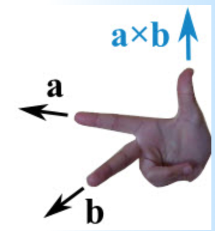

##### 2.3.1.2 `点积` (也称 标量积/数量积) [结果是标量]
- tip: `点积(Dot Product)` 又称 `数量积` 或 `标量积(Scalar Product)`
- 详细: https://www.shuxuele.com/algebra/vectors-dot-product.html
- **运算**: 点积的结果是个 数 (是 "标量",  而不是 向量). 
    + 点积是用中点来表示:
        - ${\bold a \cdot \bold b}$
        - 这个式子的意思是 ${\bold a}$ 和 ${\bold b}$ 的点积
        
  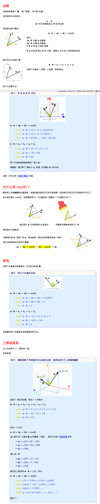   

### 2.4 向量的记法
- 向量通常是以粗体字母来记录, 像 ${\bold a}$ 或 ${\bold b}$, 以区别于标量:
  
  所以 ${\bold c}$ 是向量, 有量值和方向. 
  
  但 c 是标量. 像: 3 或 12.4
  
  例子: k${\bold b}$ 是 标量 k 乘以 向量 ${\bold b}$. 
  
  向量也可以写成它的头 (始点) 和尾 (终点) 的字母, 上面再放个箭头, 像这样: 
      
  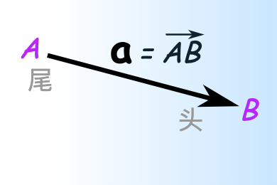