# 第 1 章 函数

## 目录
- 1.1 函数及其图形
    + 1.1.1 函数, 定义域 与 值域    
    + 1.1.2 函数的图形
    + 1.1.3 用数值表示函数
    + 1.1.4 分段定义的函数
    + 1.1.5 垂直线检验法
    + 1.1.6 函数类型
    + 1.1.7 增函数与减函数
    + 1.1.8 偶函数与奇函数: 函数的对称性
- 1.2 函数组合及移动图形与改变图形标度
    + 1.2.1 函数的和, 差, 积, 商
    + 1.2.2 复合函数
    + 1.2.3 移动函数图形 (Shifting a Graph of a Function)
    + 1.2.4  改变函数图形标度与反射函数图形
    + 1.2.5 椭圆
    + 习题 1.2
- 1.3 三角函数
    + 1.3.1 角
    + 1.3.2 6个基本三角函数
    + 1.3.3 三角函数的周期性和图形
    + 1.3.4 三角恒等式
    + 1.3.5 余弦定理
    + 1.3.6 三角函数图形的变换
- 1.4 指数函数
    + 1.4.1 指数的性质 
    + 1.4.2 自然指数函数 $e^x$
    + 1.4.3 指数增长与指数衰减
    + 习题 1.4
- 1.5 反函数与对数函数
    + 1.5.1 一对一函数 
    + 1.5.2 反函数
    + 1.5.3 求反函数
    + 1.5.4 对数函数
    + 1.5.5 对数函数的性质
    + 1.5.6 对数函数的应用
    + 1.5.7 反三角函数
    + 1.5.7 反正弦函数与反余弦函数
    + 习题 1.5
- 1.6 用计算器和计算机作图
    + 习题 1.6
------

## 生词: 
- polynomial [ˌpɒlɪ'nəʊmɪəl] --adj.多项式的。--n.多项式
- Common Functions 常用函数

-------

## P 预备知识
### 1. 直线
> 证明微积分是如此有用的一个理由在于**微积分是把一个量的变化率和该量的图形连系起来的**正确的
  数学。
- 增量
    + **[增量]**：如果一个质点从点 $(x_1, y_1)$ 移动到点 $(x_2, y_2)$, 其坐标的增量
        为 $\Delta x = x_2 - x_1$  和 $\Delta y = y_2 - y_1$
    + 注：记号 $\Delta x$ 和 $\Delta y$ 读作 'delta x' 和 'delta y'. $\Delta$ 是
      表示 "差" 的希腊字母 d 的大写.  $\Delta x$ 和 $\Delta y$ 都不表示相乘。
- 直线的斜率
    + **[斜率]**：设 $P_1(x_1, y_1)$ 和 $P_2(x_2, y_2)$ 是非垂直直线 $L$ 上
        的斜率为 (习惯上用 $m$ 来记斜率)
      $$
        m=\frac{升高}{行进的距离}=\frac{\Delta{y}}{\Delta{x}}=\frac{y_2-y_1}{x_2-x_1}
      $$
    + Note: 垂直直线没有斜率  
- 平行线和垂直线
- 直线的方程
    + **[点 - 斜式方程]**：$y = m(x - x_1) + y_1$ 是过点 $(x_1, y_1)$, 且斜率为 
      $m$ 的直线的 点 - 斜式方程
    + **[斜率 - 截距方程]**： $y = mx + b$ 是斜率为 $m$ 而 $y$ 截距为 $b$ 的直线的
      斜率 - 截距方程。 
    + **[两点式]**:
    + **[一般线性方程]**： $Ax + By = C$ （$A$ 和 $B$ 不全为 0） 是 $x$, $y$ 的 
      一般 线性方程。  

#### 2.函数和图形

- 绝对值函数
- <i style="color: orange">移位公式:</i>
    + 垂直移位: $y = f(x) + k$
        - 若 $k$ > 0，则向上移动 $k$ 个单位。
        - 若 $k$ < 0，则向下移动 $|k|$ 个单位。
    + 水平移位: $y = f(x + h)$
        - 若 h > 0，则向左移动 $h$ 个单位。
        - 若 h < 0，则向右移动 $|h|$ 个单位。
- 复合函数:
    + 若 $k > 0$, 函数 $y = y_0e^{kx}$ 是指数增长的模型;
    + 若 $k < 0$, 函数 $y = y_0e^{kx}$ 是指数衰减的模型;

------

## 1.1 函数及其图形
#### 1.1.1 函数, 定义域 与 值域
- 函数, 定义域, 值域: 
    + 在每种情形下，一个变量(例如 $y$) 的值依赖于另外一个变量(例如 $x$) 的值，我们把这样
      的事例称为 "$y$ 是 $x$ 的函数", 并用记号表示成 
      $$
        \color{#e7691e}{y = f(x) (读作: y 等于 f 对 x 的值 
            (y \, equals \, f \, of \, x))} 
      $$
      在这种表示法中，符号 $f$ 代表函数，字母 $x$ 代表 $f$ 的输入值的 
      **自变量**，而 $y$ 是 **因变量** 或 $f$ 在 $x$ 的输出值。
    + > *<i style="color: red">定义</i>*: 从集合 $D$ 到集合 $Y$ 的 **函数** 是一个
      对应规则, 对于每个元素 $x \in D$ 确定唯一的(单个)元素 $f(x) \in Y$. 
    + 所有可能输入值的集合 $D$ 称为函数的**定义域**，当 $x$ 取遍 $D$ 中的元素时，$f(x)$
      的所有值的集合称为函数的**值域**。 值域可能并不包含集合 $Y$ 中的每一个元素。函数的
      定义域和值域可以为任何对象的集合，不过在微积分中它们通常是解释为坐标轴上点的实数集合。
      (在第 11 章至第 14 章讨论的函数，其定义域和值域集合的元素是坐标平面或坐标空间中的点。)     
#### 1.1.2 函数的图形
#### 1.1.3 用数值表示函数
#### 1.1.4 分段定义的函数
#### 1.1.5 垂直线检验法
#### 1.1.6 函数类型
- 在微积分中经常会遇到一些重要的函数类型, 我们在这一小节对函数类型加一区分, 并且对他们作简要
  描述.
1. **线性函数 (Linear Functions)**
    
    + 形式为 $f(x) = mx + b$ 的函数称为 **线性函数**, 其中 $m$ 和 $b$ 为常数. 图 
      1.12a 表示一组直线 $f(x) = mx$, 其中 $b = 0$, 所以这些直线通过原点, 函数 
      $f(x) = x$ 称为**恒等函数**, 其中 $m = 1, b=0$. 常值函数是斜率 $m = 0$ 时的
      函数 (见图 1.12b). 具有正斜率和图形通过原点的线性函数称为比例关系. 
      具有正斜率的线性函数（其图形通过原点）称为比例关系。
    + 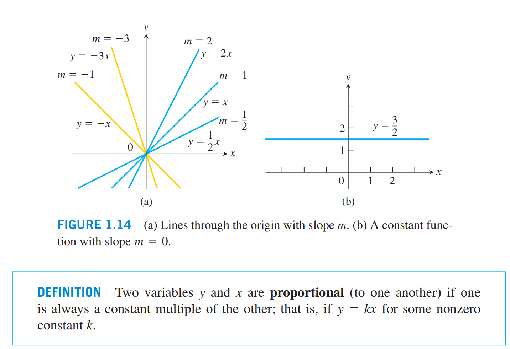
    + > 定义: 说 2 个变量 (相互) 成比例, 是指一个变量总是等于另一个变量的常数倍; 也就是说,
      对于某个非零常数 $k, y = kx$.  
1. **幂函数 (Power Functions) **
    
    + > 幂函数: 一般地，函数 $f(x) = x^a$ 叫做 "幂函数", 其中 $x$ 是自变量$a$ 是常数。
    + **(a)** $a = n$, $n$ 是正整数 (positive integer)
        - $f(x) = x^n \quad (n = 1, 2, 3, 4, 5)$ 的图形显示在图 1.15 中. 这些函数
          是对 $x$ 的全部实数值定义的, 请注意, 当幂 $n$ 增大时, 曲线在区间 $(-1, 1)$ 
          上平缓地向 $x$ 轴靠近, 对于 $|x|$ > 1, 曲线则更陡峭地提升. 每条曲线都经过点 
          (1, 1) 和原点.
        - 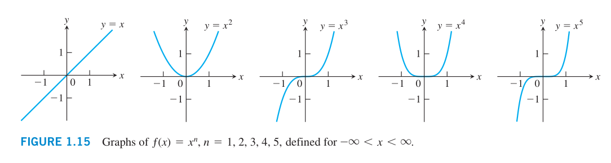
    + **(b)** $a = -1$ 或者 $a = -2$
        - 函数 $f(x) = x^{-1} = \frac{1}{2}$ 和 $g(x) = x^{-2} = \frac{1}{x^2}$
          的图形显示在图 1.16 中. 这两个函数是对所有 $x\neq{0}$ 定义的 (绝不能用 0 作除数).
          $y = \frac{1}{x}$ 的图形是双曲线 $xy = 1$, 曲线在远离原点是趋近坐标轴. 
          $y = \frac{1}{x^2}$ 的图形也趋近坐标轴.
        - 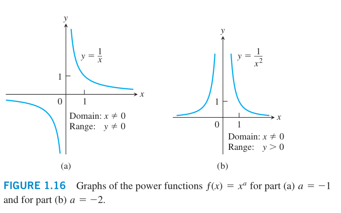
    + **(c)** $a = \frac{1}{2}, \frac{1}{3}, \frac{3}{2}, \frac{2}{3}$
        - 函数 $f(x) = x^{1/2} = \sqrt{x}$ 和 $g(x) = x^{1/3} = \sqrt[3]{x}$ 
          分别是**平方根**函数 和 **立方根**函数. 平方根函数的定义域是 $[0, \infty)$,
          立方根函数是对全部实数定义的. 它们的图形以及 $y = x^{3/2}$ 和 $y = x^{2/3}$
          的图形显示在图 1.17 中. (观察 $x^{3/2} = (x^{1/2})^3$, 
          $x^{2/3} = (x^{1/3})^2$)
        - 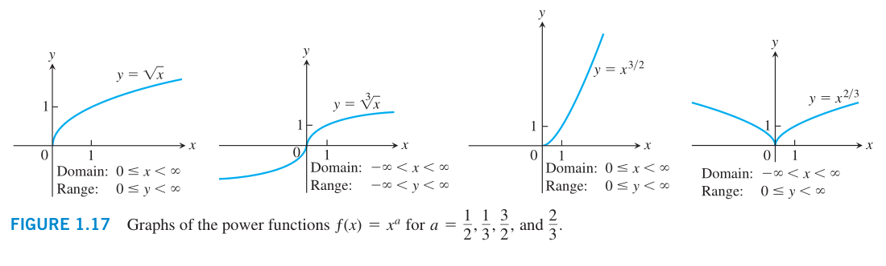
1. **多项式 (Polynomials) **
1. **有理函数 (Rational Functions) **
1. **代数函数 (Algebraic Functions) **
1. **三角函数 (Trigonometric Functions)**
1. **指数函数 (Exponential Functions)  **
1. **对数函数 (Logarithmic Functions) **
1. **超越函数 (Transcendental Functions)** 
#### 1.1.7 增函数与减函数
#### 1.1.8 偶函数与奇函数: 函数的对称性 
- > 定义: 对于函数 $y = f(x)$ 的定义域中的每个 $x$, 如果有 $f(-x)$ = $f(x)$, 那么 
  $f$ 称为 $x$ 的偶函数; 如果 $f(-x)$ = $-f(x)$, 那么 $f$ 称为 $x$ 的奇函数.
 - 对称性:
    + 偶函数的图形是关于 $y$ 轴对称的。
    + 奇函数的图形是关于原点对称的。(Tip: 图形关于原点对称，如果把该图形绕原点转
        $180^\circ$，仍保持图形不变。) 
    + Tip: 根据下面的图形可以看出来，不管奇函数还是偶函数"定义域都是关于原点对称"。  
- 图形如:
    + 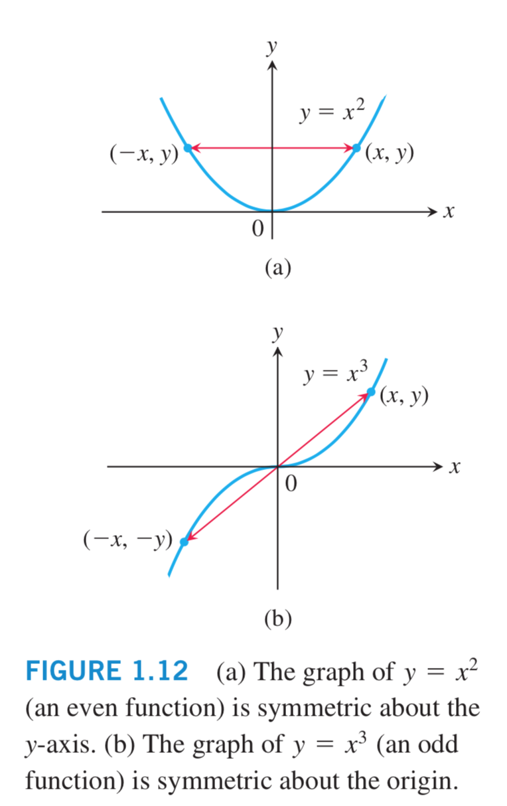
    + symmetric [si'metrik] --adj.对称的，匀称的 
- 如何确定一个函数是奇函数还是偶函数? :
    + A: 欧拉曾提出过 "指数为偶数的幂函数为偶函数，指数为奇数的幂函数为奇函数。"。
        下面这个回答来自知乎: 指数为整数幂，指数的奇偶性和函数的奇偶性保持一致。指数为分数，
        先话为根式的形式，在判断奇偶性。 
        所有函数奇偶性的判断，都是: 
        - (1) 先看定义域是否关于原点对称，如果不对称，则非奇非偶，
        - (2) 如果对称，若 $f(-x) = f(x)$ 为偶函数，若 $f(-x) = -f(x)$ 为奇函数。
    + E.g: $f(x) = ax^2 + bx + 3a + b$ 是偶函数，定义域 $[a-1, 2a]$ 
        求 a=__ b=__ ?
    + 答: 因为说函数是偶函数，那么函数的指数就不存在奇数的情况，但是目前 $f(x) =$
        $ax^2 + bx^1 + 3ax^0 + bx^0$, 中，存在 $bx^1$，所以此项一定等于 0，那么就
        得到 $b = 0$; 再有不管函数是奇函数还是偶函数，定义域一定是关于原点对称的，
        所以 $a-1 = -2a$ $\Rightarrow$ $a = \frac{1}{3}$  
#### 习题 1.1 

## 1.2 函数组合及移动图形与改变图形标度
#### 1.2.1 函数的和, 差, 积, 商
#### 1.2.2 复合函数
- 复合函数是另外一种组合函数的方法:
    + `定义: 设` $\color{#e7691e}{f, g}$ `是函数, 复合函数` 
      $\color{#e7691e}{f \circ g}$ `(` $\color{#e7691e}{f}$ `与` 
      $\color{#e7691e}{g}$ `复合) 由`
      $$
        \color{#e7691e}{(f \circ g)(x) = f(g(x))}
      $$
      `定义`, $\color{#e7691e}{f \circ g}$ `的定义于是由` $\color{#e7691e}{g}$ 
      `的定义域中那些使` $\color{#e7691e}{g(x)}$`位于` $\color{#e7691e}{f}$ 
      `的定义域内的数` $\color{#e7691e}{x}$ `组成.`
    + (DEFINITION: If $f$ and $g$ are functions, the **composite** function 
      $f\circ{g}$ ($f$ composed with $g$) is defined by
      $$
        (f \circ g)(x) = f(g(x)).
      $$
      The domain of $f\circ{g}$ consists of the numbers $x$ in the domain of 
      $g$ for which $g(x)$ lies in the domain of $f$;)
- 这个定义表明, 只有当 g 的定义域位于 f 的定义域内时, 才能构成复合函数 $f \circ g$. 为了
  求 $(f\circ{g})(x)$, 需要首先求 $g(x)$, 然后再求 $f(g(x))$. 图 1.27 把
  $f\circ{g}$ 表示成一个机器图, 而图 1.28 则把这个函数复合表示成箭头图.
- 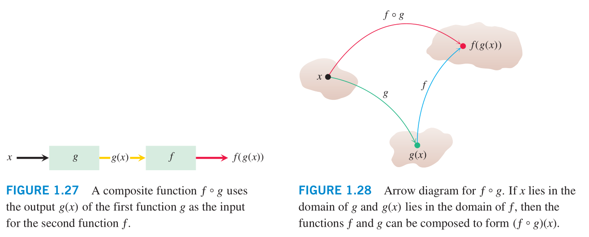
    + Figure 1.27: 复合函数 $f\circ{g}$ 使用第一函数 $g$ 的输出 $g(x)$ 作为第二函数
      $ƒ$ 的输入。 -- <Tomas_Calculus 13th>
    + 图1.27 两个函数可以在这样的 $x$ 点复合, 只要一个函数在 $x$ 的值位于另一个
      函数的定义域内; 这个函数复合用 $f\circ{g}$ 表示. --<托马斯大学微积分>
    + Figure 1.28 $f$与$g$复合的箭头图. 如果 $x$ 位于 $g$ 的作用域中, 并且 $g(x)$ 
      位于 $f$ 的作用域中, 那么函数 $f$ 和 $g$ 可以组成 $(f \circ g)(x)$   
      -- <Tomas Calculus> 13th  
      (Arrow diagram for $f\circ{g}$. If $x$ lies in the domain of $g$ and 
      $g(x)$ lies in the domain of $f$, then the functions $f$ and $g$ can be
      composed to form $(f \circ g)(x)$. )
- 为了计算复合函数 $g\circ{f}$ (当有定义时), 首先求 $f(x)$, 然后求 $g(f(x))$. 
  $g \circ{f}$ 的定义域是 $f$ 的定义域中那些使 $f(x)$ 处于 $g$ 的定义域中的数 $x$ 的
  集合.  
  (To evaluate the composite function $g\circ{f}$ (when defined),we find$f(x)$
  first and then $g(f(x)$). The domain of $g\circ{f}$ is the set of numbers 
  $x$ in the domain of $f$ such that $f(x)$ lies in the domain of $g$.)
- 函数 $f\circ{g}$ 和 $g\circ{f}$ 通常是完全不同的. (The function $f\circ{g}$ and 
  $g\circ{f}$ are usually quite different.)
#### 1.2.3 移动函数图形 (Shifting a Graph of a Function)
- 从现有的函数产生新函数另外一种方法是对现有函数的每个输出值或者对他的输入变量, 增加一个常数.
  新函数图形是原函数图形作如下垂直移动或者水平移动后的图形.
  (A common way to obtain a new function from an existing one is by adding a 
  constant to each output of the existing function, or to its input variable. 
  The graph of the new function is the graph of the original function shifted
  vertically or horizontally, as follows.)
- **移动公式**
    + `垂直移动(Vertical)`: $y = f(x) + k$ $\quad$ (`上加下减`)
        - 如果 $k > 0$, $f$ 的图形向上移动 $k$ 个单位; 
          $\color{#e7691e}{y = f(x) + k}$
        - 如果 $k < 0$, $f$ 的图形向下移动 $|k|$ 个单位. 
          $\color{#e7691e}{y = f(x) - |k|}$
    + `水平移动`: $y = f(x + h)$ $\quad$ (`左加右减`)
        - 如果 $h > 0$, $f$ 的图形向左移动 $h$ 个单位; 
          $\color{#e7691e}{y = f(x + h)}$
        - 如果 $h < 0$, $f$ 的图形向右移动 $|h|$ 个单位.
          $\color{#e7691e}{y = f(x - |h|)}$
- 例如(图): 
  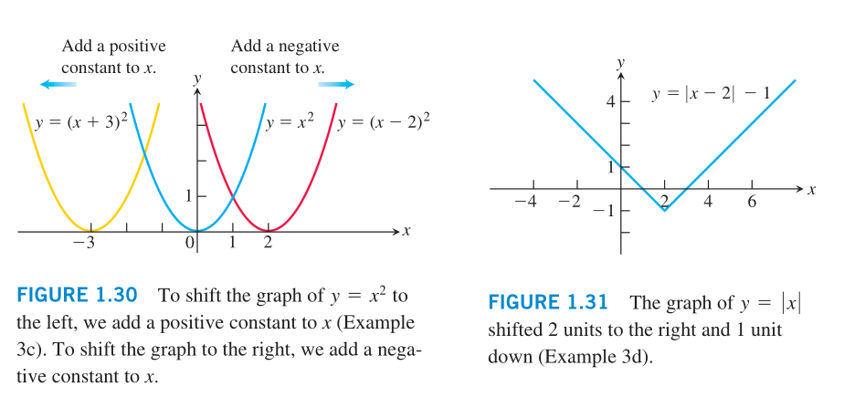 
#### 1.2.4  改变函数图形标度与反射函数图形
- 改变函数 $y = f(x)$ 的图形标度就是在垂直方向或者水平方向拉长或压缩图形. 改变图形标度的方法
  是对函数 $f$ 或自变量 $x$ 乘以一个响应的常数 $c$. 通过坐标轴反射图形是取 $c=-1$ 的特例.
	+ 改变图形的垂直标度和水平标度以及反射图形的公式
	+ 对于 $c > 1$
		- $y = cf(x)$ `按系数 c 垂直拉长 f 的图形`
		- $y = \frac{1}{c}f(x)$ `按系数 c 垂直压缩 f 的图形`
		- $y = f(cx)$ `按系数 c 水平压缩 f 的图形`
		- $y = f(\frac{1}{c}x)$ `按系数 c 水平拉长 f 的图形`
	+ 对于 $c = -1$
		- $y = - f(x)$ `通过` $x$ `轴反射` $f$ `的图形`
		- $y = f(-x)$` 通过` $y$ `轴反射` $f$ `的图形`
- **例 4** 改变 $y = \sqrt{x}$ 的图形标度和反射图形
	+ (a), (b), (c)
	+ 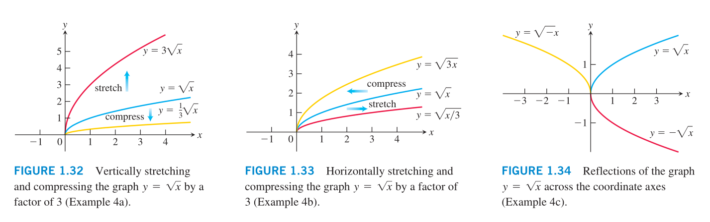 
- **例 5** 给定函数 $f(x) = x^4 - 4x^2 + 10$ (见图 1.35a), 求压缩图形和反射图形的公式:
	+ (a) 按系数 2 水平压缩图形, 再通过 $y$ 轴反射图形 (见图 1.35b).	
	+ (b) 按系数 2 垂直压缩图形, 再通过 $x$ 轴反射图形 (见图 1.35c).
	+  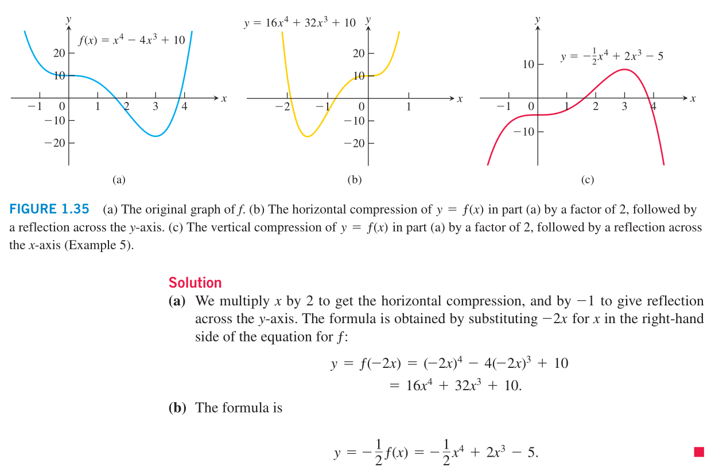 
#### 1.2.5 椭圆 (P17)
- 在数学中椭圆是平面到两个固定点的距离之和为常数的点之轨迹.
#### 习题 1.2

## 1.3 三角函数 (Trigonometric Functions)
#### 1.3.1 角
#### 1.3.2 6 个基本三角函数
#### 1.3.3 三角函数的周期性和图形
#### 1.3.4 三角恒等式
#### 1.3.5 余弦定理
#### 1.3.6 三角函数图形的变换
#### 习题 1.3

## 1.4 指数函数 (Exponential Functions)
#### 1.4.1 指数函数的性质 (定义):
- 设 $a$ 是不等于 1 的正实数，函数 $f(x) = a^x$ (即: $a > 0$ 且 $a \neq 1$)
    是 **底为 $a$ 的指数函数** （Tip: $a$ 为基底，$x$ 为指数）
    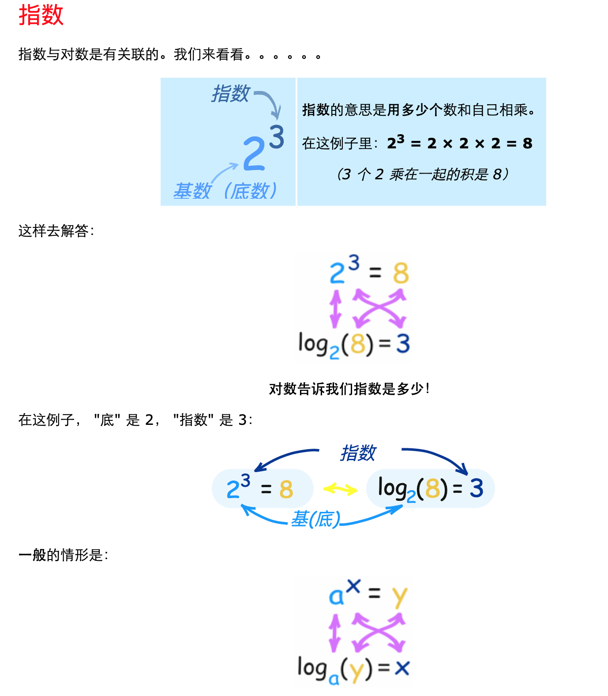
- $f(x) = a^x$的定义域是($-\infty$, $\infty$) 而值域是(0, $\infty$). 若
    a > 1, 指数函数的图形看起来像是增函数; 若 0 < 0 < 1 图形看起来像减函数
    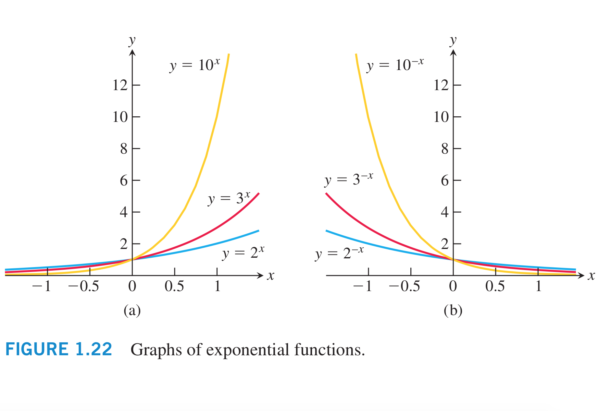  
#### 1.4.2 自然指数函数 $\color{orange}{e^x}$:
- 对自然、物理和经济现象的建模中用到的最重要的指数函数是**自然指数函数**，它的基底是著名
    的数 $e$, 精确到 9 位小数时是 2.718281828. 我们可以把 $e$ 定义为函数 
    $f(x) = (1 + \frac{1}{x})^x$ 当 $x$ 无穷增大时的极限。
    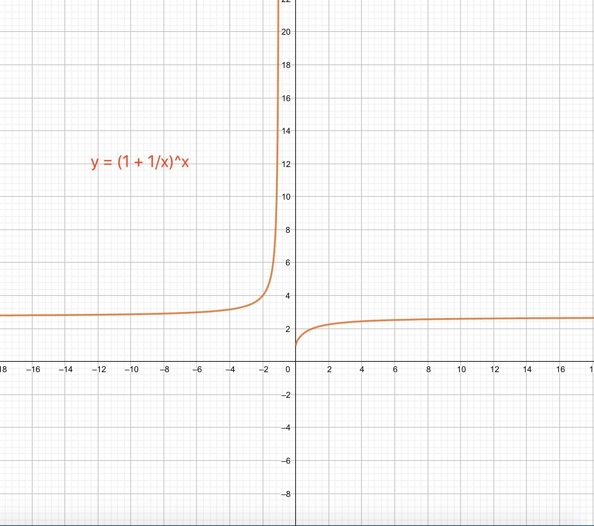
- 图 27 $\quad$ $f(x) = (1 + \frac{1}{x})^x$ 的图形和数值列表都暗示当 
    $x \to \infty$ 时, $f(x) \to e \approx 2.718$
- 指数函数 $y = e^{kx}$，其中 $k$ 是一个非零常数，常被用作指数增长或衰减的模型，作为
    指数增长的一个例子，连续复利，就用到了模型 $y = P \cdot e^{rt}$ 其中 P 是初始投资，
    $r$ 是小数表示的利率，$t$ 是按年计的时间。指数衰减的一个例子是模型 
    $y = A \cdot e^{-1.2 \times 10^4} t$, 这表示放射性元素碳 -14 是怎样随时间衰减
    的。 这里 $A$ 是碳 -14 一开始的含量，$t$ 是按年计的时间。 碳-14 衰减被用来测量诸如
    贝壳、种子和木制手工艺品等的死亡计提残留物的年代。
#### 1.4.3 指数增长、指数衰减:

## 1.5 反函数(Inverse Function) 和 对数函数(Logarithmic Functions)
#### 1.5.1 一对一函数:
- 函数 $f(x)$ 在定义域 D 上是一对一的，若每当 $a \neq b$ 时 $f(a) \neq f(b)$.
- 一对一函数 $y = f(x)$ 的图形与任何水平直线相交至多一次 (水平直线法则). 如果它与水平
    直线相交多于 2 次，即它取同一个 $y$ 值多于一次的话，那么该函数不是一对一的。(图 30)
- 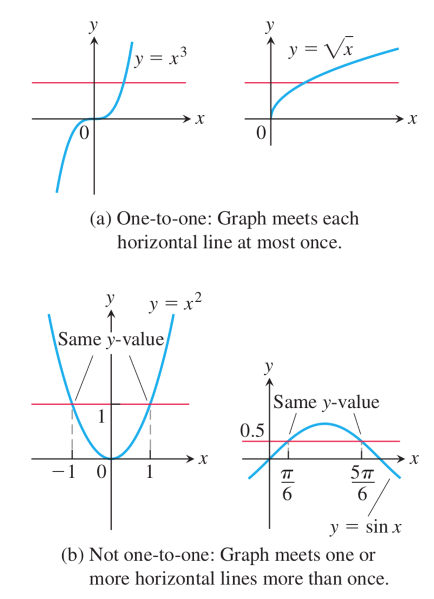
- One-to-one: Graph meets each horizontal line at most once. 
    图形与每条水平线直线只交一次。
- Not one-to-one: Graph meets one or more horizontal lines more than once.
    非一对一: 图形与某些水平线相交多于一次。   
#### 1.5.2 反函数:
- 因为一对一函数的每个输出只来自一个输入，所以一对一函数可以反过来看做是把输出送回到它们所
    来自的输入。由逆转一对一函数的定义域和值域定义的函数就是 $f$ 的反函数。反函数 $f$ 的
    记号是 $f^-1$,读作 "$f$逆"。$f^1$ 中的 -1 不是指数； $f^{-1}(x)$ 的意思也不是 
    $\frac{1}{f(x)}$
- 反函数对:
    + 函数 $f$ 和 $g$ 是反函数对，当且仅当 $f(g(x)) = x$ 并且 $g(f(x)) = x$. 
        这时, $g = f^{-1}$ 而且 $f=g^{-1}$
    + 反函数关于 $y = x$ 对称。
    + 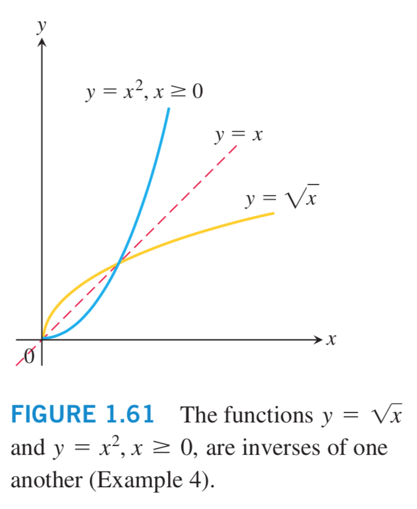
#### 1.5.3 求反函数:
- 注: 把$f^{-1}$ 写作 $x$ 的函数
- 第 1 步: 借助 $y$ 对  $x$ 解方程 $y = f(x)$.
- 第 2 步: 交换 $x$ 和 $y$. 得到的公式将是 $y = f^{-1}(x)$
#### 1.5.4 对数函数
- 若 a 是任何不等于 1 的正实数 (即: $a>0, a\neq 1$), 以 a 为底的指数函数 
  $f(x) = a^x$ 是一对一的，所以它有反函数，它的反函数称为底为 a 的对数函数。
#### 1.5.5 对数函数的性质
#### 1.5.6 对数函数的应用
#### 1.5.7 反三角函数
#### 1.5.8 反正弦函数与反余弦函数

#### 1.5.1 底为 a 的对数函数
- 底为 $a$ 的对数函数 $y = log_a{x}$ 是底为 $a$ 的指数函数 $y = a^x$ 
  ($a>0, a\neq 1$) 的反函数。
    + $log_a{x}$(Read: 以 $a$ 为底 $x$ 的对数) 的定义域是 $a^x$ 的值域 
      $(0, +\infty)$. $log_a{x}$ 的值域是 $a^x$ 的定义域 $(-\infty, \infty)$.
    + 因为我们无法从方程 $y = a^x$ 按 $y$ 解出 $x$, 对数函数作为 $x$ 的函数没有显示
      公式。但是 $y = log_a{x}$ 的图形可以从 $y = a^x$ 的图形关于直线 $y = x$
      反射得到。(下图) 
      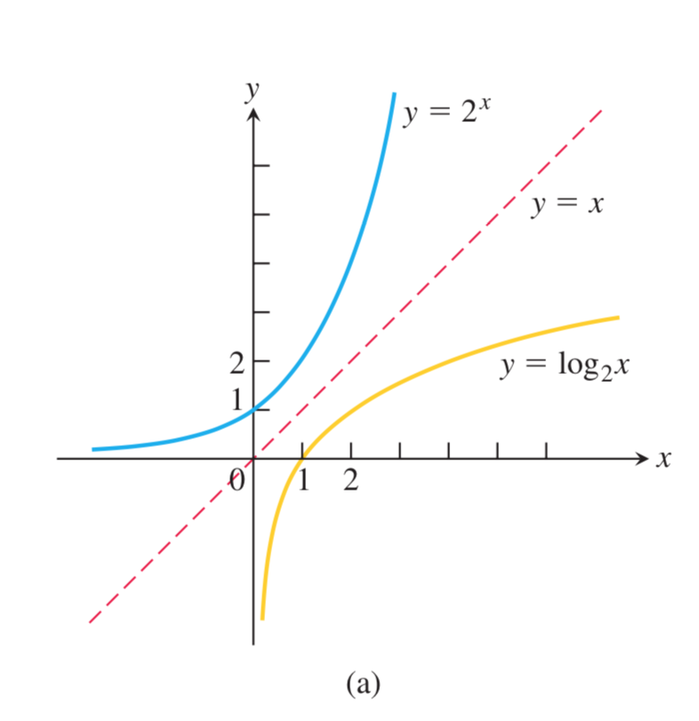  
