# 必修 2
> **目录 (Table of Content)**
- **第 1 章 -- 空间几何体**
    + 1.1 空间几何体的结构
    + 1.2 空间几何体的三视图和直观图
        - 阅读与思考: 画法几何与蒙日
    + 1.3 空间几何体的表面积与体积
        - 研究与发现: 祖暅原理与柱体, 椎体, 球体的体积
    + 小结
	+ 复习参考题    
- **第 2 章 —— 点、直线、平面之间的位置关系**
    + 2.1 空间点、直线、平面之间的位置关系
    + 2.2 直线、平面平行的判定及其性质
    + 2.3 直线、平面垂直的判定及其性质
        - 阅读与思考: 欧几里得《原本》与公理化方法
    + 小结
	+ 复习参考题    
-  **第 3 章 —— 直线与方程**
    + 3.1 直线的倾斜角与斜率
        - 3.1.1 倾斜角与斜率
        - 3.1.2 两条直线平行于垂直的判定
    + 3.2 直线的方程
        - 3.2.1 直线的点斜式方程 (斜截式方程)
        - 3.2.2 直线的 2 点式方程
        - 3.2.3 直线的一般式方程
    + 3.3 直线的交点坐标与距离公式
        - 阅读与思考: 笛卡尔与解析几何 
    + 小结
	+ 复习参考题    
- **第 4 章 —— 圆与方程**
    + 4.1 圆的方程
        - 阅读与思考: 坐标法与机器证明
    + 4.2 直线、圆的位置关系
    + 4.3 空间直角坐标系
        - 信息技术应用: 用 <几何画板> 探究点得轨迹: 圆
    + 小结
	+ 复习参考题

---
## 生词:
- **dihedral [daɪ'hiːdr(ə)l] --n.两面角. --adj.有两个平面的**
    + dihedral angle 二面角

---

## 前置知识:
- 长方体的表面积和体积公式
    + 表面积(S) = $2(ab + ah + bh)$    
    + 体积(V) = $abh$  
- 立方体的表面积(S), 体积(v) 公式
    + S = 6 个面的面积之和 = $6a^2$ (Tip: $a$ 为边长)
    + V = $a^3$

### 圆 
> [来源-1](https://www.shuxuele.com/geometry/circle.html)  
> [来源-2](https://zh.wikipedia.org/zh-cn/%E5%9C%86)  
> 来源: https://www.shuxuele.com/geometry/circle.html
- 圆 (circle)的定义: 根据欧几里得的 "*几何原本*" 定义,在同一平面内到定点的距离等于定长的
  点的集合. 此外, 圆的第 2 定义是: "平面内一动点到两定点的距离的比,等于一个常数,则此动点的
  轨迹是圆."
- 圆心: 圆是在同一平面内到定点的距离等于定长的点的集合,这个定点叫做圆的圆心 (通常用$O$表示.)
- 半径, 直径 和 周长:
    + 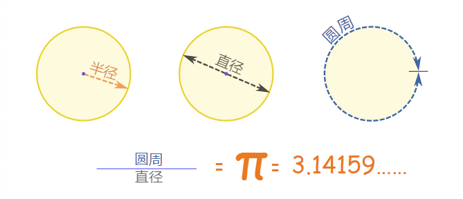
    + 半径(radius): 指的是连接圆心和圆上的任意一点的线段。(用 $r$ 表示)
    + 直径(diameter): 指的是通过圆心并且两端都在圆上的线段。(用 $d$ 表示)
    + 圆的周长指的是圆形一周的长度。
        - 用周长除以直径,我们可以得到 3.141592654......; 这个数字
          就是圆周率 -- **$\pi$**(Pi)
        - 也就是说当圆的直径为 1 的时候,圆的周长为 3.141592654......
        - 我们也可以这么说 : $周长 = \pi \times 直径(d)$ = $\pi \times 2r$

### 扇形 
> [来源](https://zh.wikipedia.org/zh-cn/%E6%89%87%E5%BD%A2)
> 来源: 维基百科 https://zh.wikipedia.org/zh-cn/%E6%89%87%E5%BD%A2
- 扇形 (Circular sector) 指圆上被两条半径和半径所截的一段弧所围成的图形。因形状如一把
  扇子而得名。(绿色区域便是一个扇形)  
  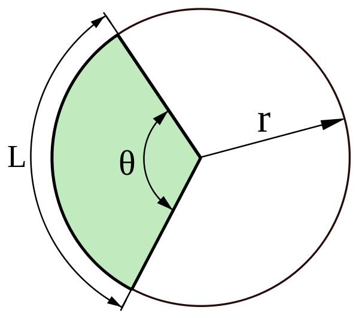
    + circular ['sɜːkjʊlə] --adj.圆形的；循环的。--n.传单，通报
    + sector ['sektə] --n.部门；部分；区域；[计]扇形；扇区。
- 扇形弧长公式:
    + 扇形的弧长 (圆心角)。
        - $L = \theta r$ (弧度制)
            + Tip: ($\theta$ 弧长所对的圆心角)
        - $L = 2 \pi r \cdot \frac{\theta}{360^{\circ}}$ (角度制)
- 扇形的周长公式:
    + 扇形的周长由弧长和两个半径组成:
        - $P = L + 2r = \theta r + 2r = r(\theta + 2)$ (弧度制)
- 扇形面积公式:
    + 扇形的面积 (弧长): 
        - $A = \pi r^2 \cdot \frac{L}{2\pi r} = \frac{rL}{2}$
        - Tip: $\quad \frac{L}{2\pi r}$ : 即弧长除以圆的周长
    + 扇形的面积 (圆心角):
        - $A = \pi r^2 \cdot \frac{\theta}{2\pi} = \frac{r^2 \theta}{2}$（弧度制）
        - $A = \pi r^2 \cdot \frac{\theta}{360^\circ}$ (角度制)
    + 扇形面积的 积分形式:
        - $A = \int_0^{\theta} \int_0^r d S$ 
          $= \int_0^{\theta} \int_0^r \tilde{r} d \tilde{r} d\tilde{\theta}$
          $= \int_0^{\theta} \frac{1}{2}r^2 d \tilde{\theta}$
          $= \frac{r^2 \theta}{2}$ (弧度)
- 弦长:
    + $C = 2r\sin \frac{\theta}{2}$ (弧度制)

---

## 生词: 
- **prism ['prɪz(ə)m] --n.[数]棱柱; [物]棱柱;**
    + --> a regular prism. 正棱柱
    + --> a triangular prism. 三角棱柱
- **triangular [traɪ'æŋgjʊlə] --adj.三角形的**
    + --> One more step will put the system in triangular form.
          还有一步将系统置于三角形状。    
- **pyramid ['pirəmid] --n.金字塔; 棱锥体.**
    + --> a regular pyramid. 正角锥
- **circular ['sɜːkjʊlə] --adj.圆形的；循环的。--n.传单，通报**
- **cylinder ['sɪlɪndə] --n.圆筒; 气缸; 圆柱体**
    + --> The cylinder is a crucial part of the washing machine.
        滚筒是洗衣机必不可少的部分.
    + a sixcylinder engine. 六汽缸引擎

------

## 第 1 章 —— 空间几何体
> 什么是空间几何体?
- 在我们周围存在着各种各样的物体,它们都占据着空间的一部分. 如果我们只考虑这些物体的形状和大小,
  而不考虑其他因素, 那么由这些物体抽象出来的 **空间图形** 就叫做 **空间几何体**.
> 基本的空间几何体有哪些?
- (1) 多面体: 多面体是由若干个平面多边形所围成的几何体.
    + 棱柱
    + 棱锥
    + 棱台
- (2) 旋转体: 一条平面曲线绕着它所在的平面内的一条定直线旋转所形成的曲面叫做旋转面; 该定直线
  叫做旋转体的轴; 封闭的旋转面围成的几何体叫做旋转体.
    + 圆柱
    + 圆锥
    + 圆台
    + 球

### 1.1 空间几何体的结构 
- 一般地，我们把有若干个平面多边形围成的几何体叫做 **多面体**, 围成多面体的各个多边形叫做
  多面体的 **面**, 相邻 2 个面的公共边叫做多面体的 **棱**, 棱与棱的公共点叫做多面体的 
  **顶点**
#### 1.1.1 柱、锥、台、球的结构特征
> **1. 棱柱** 的结构特征
- 一般地, 有 2 个面互相平行, 其余各面都是四边形, 并且每相邻 2 个四边形的公共边都互相平行, 
  由这些面所围成的多面体叫做**棱柱(prism)**. 棱柱中, 这 2 个互相平行的面叫做棱柱的**底面**
  简称**底**; 其余各面叫做棱柱的**侧面**; 相邻侧面的公共边叫做棱柱的**侧棱**; 侧面与底面
  的公共顶点叫做棱柱的**顶点**. 如图 1.1-2   
  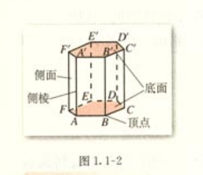
> **2. 棱锥** 的结构特征
- 一般地, 有一个面是多边形, 其余各面都是有一个公共顶点的三角形, 由这些面所围成的几何体叫做 
  **棱锥 (pyramid).** 这个多边形面叫做 **棱锥的底面**或**底**; 有公共顶点的各个三角形面
  叫做**棱锥的侧面**; 各侧面的公共顶点叫做**棱锥的顶点**; 相邻侧面的公共边叫做**棱锥的侧棱**
  底面是 三角形, 四边形, 五边形...... 的棱锥分别叫做 三棱锥, 四棱锥, 五棱锥......其中
  三棱锥又叫做四面体, 棱锥也用表示顶点和底面各顶点的字母表示, 图 1.1-3 的四棱锥,表示为
  棱锥 S-ABCD. 
  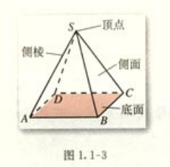
> **3. 圆柱** 的结构特征
- 如图, 1.1-4 以矩形的一边所在直线为旋转轴,其余 3 边旋转形成的曲面所围成的几何体叫做 
  **圆柱 (circular of cylinder)**, 旋转轴叫做 **圆柱的轴**; 垂直于轴的边旋转而成的
  圆面叫做 **圆柱的底面**; 平行于轴的边旋转而成的曲面叫做 "圆柱的侧面"; 无论旋转到什么位置,
  不垂直与轴的边都叫做 **圆柱的侧面的母线**.  
  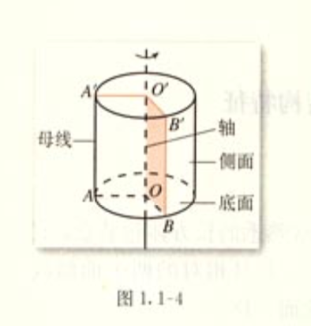
- **圆柱和棱柱统称为柱体**.  
>**4. 圆锥** 的结构特征
- 与圆柱一样,圆锥也可以看作是由平面图形旋转而成的. 如图 1.1-5, 以直角三角的一条直角边所在
  直线为旋转轴, 其余 2 边旋转而成的曲面所围成的几何体叫做 **圆锥 (circular cone)**. 圆锥
  也有 轴, 底面, 侧面 和 母线.
- 圆锥也用表示他的轴的字母表示. 图 1.1-5 中的圆锥表示为圆锥 S0.  
  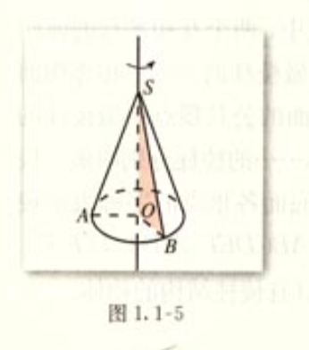
- **圆锥与棱锥统称为椎体.**  
> **5. 棱台 和 圆台** 的结构特征
- 用一个平行于棱锥底面的平面去截棱锥,底面与截面之间的部分,这样的几何体叫做
  **棱台(frustum of a pyramid)**. 原棱锥的底面和截面分别叫做棱台的**下底面**和**上底面**
  , 棱台也有侧面, 侧棱, 顶点.  
  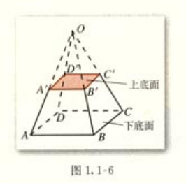
- 与棱台类似，用平行于圆锥底面的平面去截圆锥，底面与截面之间的部分 (如图 1.1-9) 叫做 
  **圆台** (frustum of a cone)。 
  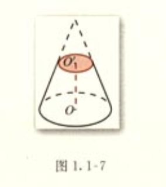
    + **frustum ['frʌstəm] --n.平截头体**
        - --> View frustum 视椎体
        - --> frustum of cone 圆台
    + **cone [kəʊn] --n.圆锥体，圆锥形**
        - --> The police have sectioned off the road with traffic cone.
            警察用锥形路标把路面分隔开来。
- **棱台和圆台统称为台体。**
> **6. 球** 的结构特征
- 如图 1.1-8. 以半圆的直径所在直线为旋转轴, 半圆面旋转一周形成的几何体叫做 
  **球体 (solid sphere)**, 简称为**球**. 半圆的圆心叫做球的 **球心**. 半圆的半径叫做
  球的**半径**, 半圆的直径叫做球的**直径**. 图 1.1-8 中的球表示为球 O.  
  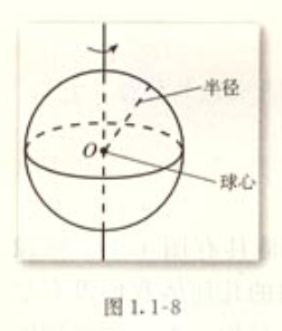

### 1.2 空间结合体的三视图和直观图
> 1.2.1 空间几何体的三视图

> 1.2.2 空间几何体的直观图
- 斜二测画法 -- 口诀是:
    + 平行改斜垂依旧, 横等纵半竖不变; 眼见为实遮为虚,空间观感好体现.
    + 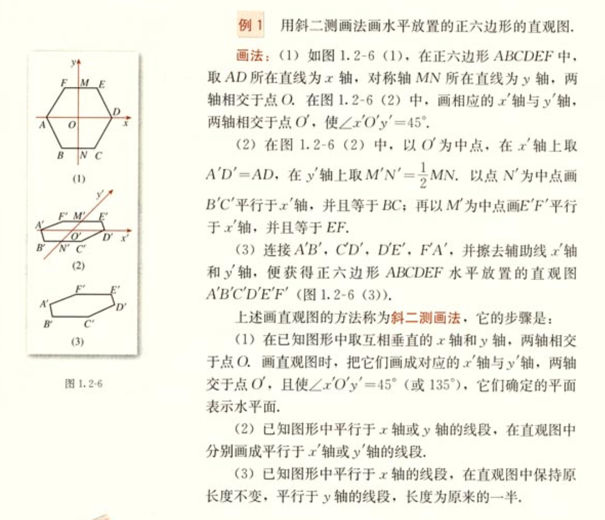
    + Tips: $\angle x'O'y' = 45^\circ$

### 1.3 空间几何体的表面积和体积
#### 1.3.1 柱体、椎体、台体的表面积和体积
> **(1-0)柱体(圆柱)** 的表面积
- 我们知道, 圆柱的侧面展图是一个矩形 (图 1.3-3). 如果圆柱的底面半径为 $r$, 母线长为 $l$, 
  那么圆柱的底面面积为 $\pi r^2$, 侧面面积为 $2\pi rl$, 因此,圆柱的面积为:
    + $S = 2\pi r^2 + 2\pi rl = 2\pi r(r + l)$  
  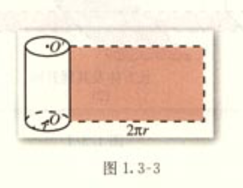  
> **(1-1)柱体** 的体积
- 正方体, 长方体, 以及圆柱的体积公式,统一为 
    + $V = Sh$ ($S$ 为底面积, $h$ 为高)
- 一般棱柱的体积也是: $V = Sh$ ($S$ 为底面积, $h$ 为棱柱的高)
> **(2-0)椎体** 的表面积
- 圆锥的表面积: $S = \pi r^2 + \pi r l = \pi r(r + l)$
    + 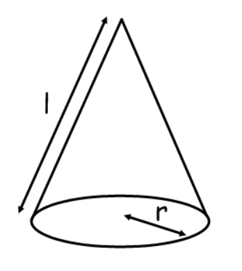
       
    + 如何证明圆锥的侧面积为 $\pi r l$ ? ($l$ 为 圆锥的母线)
        - 证明: 圆锥的侧面展开图为扇形. $S_扇 = \frac{1}{2} rL$ ($L$为弧长, 见上面的
          前置知识), 对应这里的半径就圆锥的母线长 $l$, 
          **弧长就是底面圆的周长 ($P_圆 = 2\pi r$)**, 于是圆锥的侧面积 = 
          $\frac{1}{2} rL$ = ${1 \over 2}l\cdot 2\pi r$ = $\pi r l$
        - Tips: 正圆锥的侧面可以展开为平面上的一个扇形.这个
          **扇形所在的圆半径就是圆锥的母线,对应的圆弧长为底部圆形的周长.** 
> **(2-1)椎体** 的体积
- 圆锥的体积公式是: 
    + $V = {1 \over 3}Sh$ ($S$为底面面积, $h$为高). 它是同底等高的圆柱体积的${1 \over 3}$
- 棱锥的体积也是同底等高的棱柱体积的 {1 \over 3}, 即棱锥的体积 
    + $V = {1 \over 3}Sh$ ($S$为底面面积, $h$为高)
    + 由此可见,棱柱与圆柱的体积公式类似,都是底面面积乘高; 棱锥与圆锥的体积公式类似,都是
      底面面积乘高的 ${1 \over 3}$
- 由于圆台 (棱台) 是由圆锥 (棱锥) 截成的, 因此可以利用 2 个椎体的体积差, 得到圆台 (棱台)
  的体积公式: 
    + $V = {1 \over 3}(S' + \sqrt{S'S} + S)h$
    + 其中 $S', S$ 分别为上, 下底面积, $h$ 为圆台 (棱台) 高.
> **(3-0)台体 (圆台)** 的表面积
- 圆台的侧面展开图是个 **扇环**, 圆台的表面积等于: 上、下 2 个底面的面积加上侧面的面积，即
    + 圆台的表面积 = 圆台的侧面积 + 上下两底的面积
    + 圆台的表面积公式: $S = \pi r^2 + \pi R^2 + \pi Rl + \pi rl$    
        = $\pi (r^2 + R^2 + rl)$
    + $r(上底半径)$、$R(下底半径)$、$h(高)$、$l(母线) = \sqrt{(R-r)^2 + h^2}$ 
    + 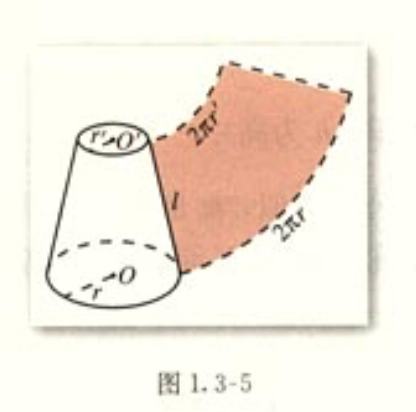
> **(3-1)台体** 的体积 
- 下面内容来自维基百科: https://zh.wikipedia.org/wiki/%E5%9C%86%E5%8F%B0
- 圆台的体积取决于 2 底面之间的距离 (圆台的高), 以及原来椎体的体积. 设 $h$ 为圆台的高, 
  $r$ 和 $R$ 为圆台的上下底面半径, $V$ 是圆台的体积. 由于圆台是由一个平面截取圆锥的一部分
  (也就是和原来圆锥相似的一个小圆锥)得到, 所以计算体积的时候,可以先算出原来圆锥的体积, 再
  减去和它相似的小圆锥的体积.圆锥被平行于底面的平面所截时, **截面圆的半径与底面半径的比,**
  **等于小圆锥和原圆锥的高度比 (Why?)**. 假设原圆锥的高度是 $H$, 那么小圆锥的高度是 $H - h$, 
  也就是说:
    + $\because$ $\frac{H-h}{H} = \frac{r}{R}$. 
    + $\therefore$ $H = \frac{hR}{R-r}$
    + 圆台的体积等于圆锥体积减去小圆锥的体积:
    + $V = \frac{\pi R^2H}{3} - \frac{\pi r^2(H-h)}{3}$
    + $= \frac{\pi(R^2 - r^2)Rh}{3(R-r)} + \frac{\pi hr^2}{3}$
    + $= \frac{\pi h}{3}(R^2 + r^2 + Rr)$
- 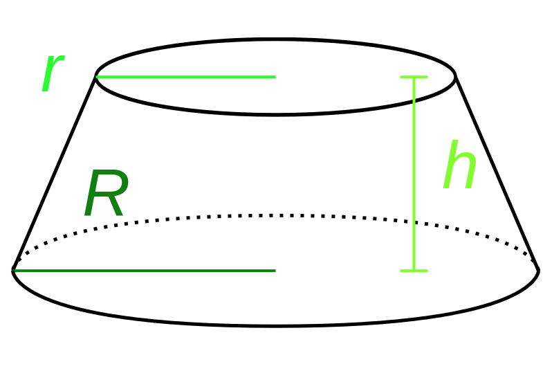

#### 1.3.2 球的体积和表面积
> 球面 - Wikipedia
- 详细内容: https://zh.wikipedia.org/zh-hans/%E7%90%83%E9%9D%A2
- sphere [sfɪə] --n.球，领域，球面，范围
- 球面 (英语: sphere) 是三维空间中完全圆形的几何物体,它是圆球的表面 (类似于在二维空间中, 
  "圆"包围着"圆盘"那样).
- 就像在二维空间中的圆的定义一样, 球面在数学上定义为三维空间中离给定点的点距离相同的
  **点的集合 $r$**. 这个距离 $r$ 是球的**半径**, 球 (ball) 则是由离给定点距离小于 $r$
  的所有点构成的几何体,而这个给定点就是球心. 球的半径和球心也是球面的半径和中心. 2端都在球面
  上的最长线段通过球心,其长度是其半径的 2 倍; 它是球面和球体的直径.
- 尽管在数学之外,术语 "球面" 和 "球" 有时可以互换使用,但在数学中是明确区分的: 球面是一种
  嵌在**三维欧几里得空间** 内的二维封闭曲面,而球是一种**三维图形**, 其包括球面和球面内部
  的一切 (闭球), 不过更常见的定义是只包括球面内部的所有点, 不包括球面上的点 (开球). 这种
  区别并不总是保持不变, 尤其是在旧的数学文献里, sphere(球面) 被当作固体. 这与在**平面**上
  混用术语 **"圆 (circle)"** 和 **"圆盘 (disk)"** 的情况类似.

> (1) 三维空间中的方程
- 参见: 三角函数 和 球坐标系
    + [三角函数](https://zh.wikipedia.org/wiki/%E4%B8%89%E8%A7%92%E5%87%BD%E6%95%B0)
    + 三角函数: https://zh.wikipedia.org/wiki/%E4%B8%89%E8%A7%92%E5%87%BD%E6%95%B0
    + [球坐标系](https://zh.wikipedia.org/wiki/%E7%90%83%E5%BA%A7%E6%A8%99%E7%B3%BB)
    + 球坐标系: https://zh.wikipedia.org/wiki/%E7%90%83%E5%BA%A7%E6%A8%99%E7%B3%BB
- 在[解析几何](https://zh.wikipedia.org/wiki/%E8%A7%A3%E6%9E%90%E5%87%A0%E4%BD%95)
  中, 球心为 $(x_0, y_0, z_0)$, 半径为 $r$ 的球面是满足下面方程的所有点 $(x, y, z)$
  的轨迹
- $(x-x_0)^2 + (y - y_0)^2 + (z-z_0)^2 = r^2$.
- 令 $a, b, c, d, e$ 为实数, $a\neq 0$, 并且
- $x_{0}={\frac{-b}{a}},\quad y_{0}={\frac{-c}{a}}, \quad$
  $z_{0}={\frac{-d}{a}},\quad \rho ={\frac{b^2 + c^2 + d^2 - ae}{a^2}}$
- ...... 更多见 wiki

> (2) 包围的体积 (球的体积)
- 在三维空间中, 球面内包围的**体积** (即**球**的体积) 是 :
    + **$V = {4 \over 3} \pi r^3$**
    + 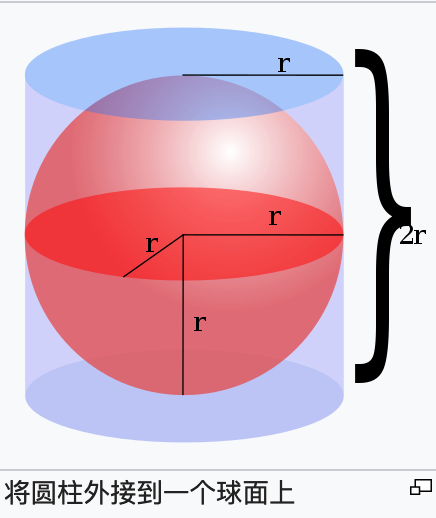  
    + 其中 $r$ 是球面的半径. **阿基米德**首先推导出这个公式,它通过证明球体内的体积是球体
      内部与外接**圆柱体** (具有与球体直径相等的高度和直径) 内部之间的体积差值的 2 倍而得
      出该公式. 这个说法可以根据 **祖暅原理** 得到. 该公式也可以使用积分得出, 即用
      **截面积分 (定积分)** 对无穷多的厚度无穷小的圆盘沿 $x$ 轴从 $x = -r$ 到 $x = r$
      堆积起来的体积求和,假设该球面半径为 $r$, 以原点为球心.
    + ...... 下面的讲解见 wiki
> (3) 球表面积
- 半径为 $r$ 的球体的**表面积** 为:
    + **$A = 4\pi r^2$**
- ...... 更多见 wiki    
> (4) 几何性质
- (4.1) 球面束
> (5) 术语  
> (6) 板球面 
> (7) 推广 
- (7.1) 维数
- (7.2) 度量空间
> (8) 拓扑学 
> (9) 球面几何 
> (10) 球面的是一种性质 

#### 祖暅(gèng)原理 与 柱体、椎体、球体的体积
- 祖暅原理, 又名 "等幂等积定理", 是指所有等高处横截面相等的 2 个同高立体, 其体积必然相等的
  定理. 祖暅之 <缀术> 有云: "缘幂势既同, 则积不容异." (Tip: 幂: 是截面积; 势:是立体的高.)
- 意思是: 两个同高的立体, 如在等高处的截面积相等, 则体积相等. 更详细点说就是，界于两个平行平
  面之间的两个立体，被任一平行于这两个平面的平面所截，如果两个截面的面积相等，则这两个立体的
  体积相等。  
- Tip: 什么是 "立体(图形)" 或 "几何体"? 
  [来源](https://zh.wikipedia.org/zh-hans/%E5%B9%BE%E4%BD%95%E5%9C%96%E5%BD%A2)
    + A: 三维中的几何图形又称为 "立体图形" 或 "几何体". 许多几何体可以透过一系列顶点, 连接
      顶点的线以及线包围出的平面图形作为面来定义, 这种几何体称为多面体, 例如立方体, 四面体等.
      其他三维形状可以由诸如椭圆体和球体之类的曲面界定. 
    + 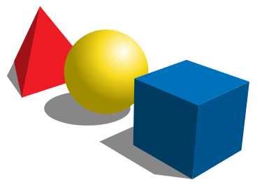

## 第 2 章 —— 点、直线、平面之间的位置关系
### 2.1 空间点、直线、平面之间的位置关系
> Tip: $\in$ 属于符号, $\sub$ 包含于符号  

> **2.1.1 平面**
- 我们常常把水平的平面画成一个平行四边形, 用平行四边形表示平面, 如图 2.1-2 平行四边形的锐角
  通常画成 $45^\circ$, 且横边长等于其邻边长的 2 倍. 如果一个平面被另一个平面遮挡住, 为了
  增强它的立体感, 我们常把被遮挡部分用虚线画出来, 如图 2.1-3
    + 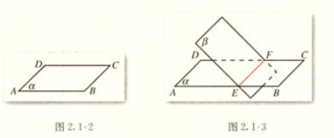 
- 平面内有无数个点, 平面可以看成点的集合. 如图 2.1-4 点 A 在平面 $\alpha$ 内, 记作 
  $A \in \alpha$; 点 B 在平面 $\alpha$ 外, 记作 $B \notin \alpha$. 
- **`公理 1: 如果一条直线上的 2 点在一个平面内, 那么这条直线在此平面内.` **
     + 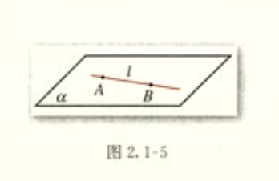
- 如果直线 $l$ 上的所有点都在平面 $a$ 内, 就说 **直线 l 在平面 $\alpha$ 内**, 或者说 
  **平面 $\alpha$ 经过直线 l**, 记作 $l \sub \alpha$; 否则, 就说 
  **直线l在平面 $\alpha$ 外**, 记作 $l \not\sub \alpha$
- 公理 1 也可以用符号表示:  $A \in l, B\in l, 且 A\in \alpha, B\in \alpha $ 
  $\quad  \Rightarrow  l \sub a$
- **`公理 2: 过不在一条直线上的 3 点, 有且只有一个平面.`**
    + 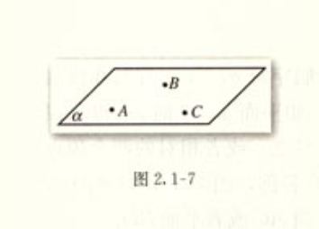
- **`公理 3: 如果 2 个不重合的平面有一个公共点, 那么它们有且只有一条过该点的公共直线.`**  
    + 也就是说, 如果 2 个平面有一个公共点,那么他们必定还有另外一个公共点, 只要找出这 2 个
      平面的两个公共点, 就找出了他们的交线. 
    + 平面 $\alpha 与 \beta$ 相较于直线 l, 记作 $\alpha \cap \beta = l$, 如图 
      2.1-9 公理 3 也可以用符号表示: 
    + $P \in{\alpha \cap \beta} \Rightarrow \alpha \cap \beta = l$
      $, 且 P \in{l}$
    + 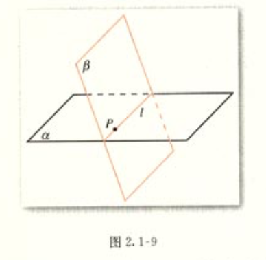 

> **2.1.2 空间中直线与直线之间的位置关系**
- 我们把不同在任何一个平面的两条直线叫做 **`异面直线 (skew lines)`**
- 空间 2 条直线的位置关系有且只有 3 种:
    + 共面直线
        - 相交直线: 同一平面内, 有且只有一个公共点.
        - 平行直线: 统一平面内, 没有公共点.
    + 异面直线: 不同在任何一个平面内, 没有公共点.
- 这样, 空间中 2 直线平行和过去我们学过的平面上 2 直线平行的意义是一致的, 即首先这 2 条
  直线在同一平面内, 其次是它们不想交.
- **`公理4: 平行于同一条直线的 2 条直线互相平行.`**
    + 这个公理表明, 空间平行于一条已知直线的所有直线都互相平行, 它给出了判断空间 2 条直线
      平行的依据. 公理 4 表示的性质通常叫做空间 **`平行线的传递性`**
- **定义: `空间中如果 2 个角的两边分别对应平行, 那么这 2 个角相等或互补.`** 
     + 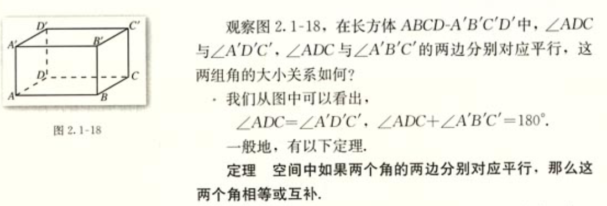 
- 我们知道, 平面内两条直线相交成 4 个角, 其中不大于 $90^\circ$ 的角称为它们的夹角,
    夹角刻画了一条直线相对于另一条直线倾斜的程度. 两条异面直线之间也存在类似的问题, 因此
    我们引入了 "异面直线所成的角" 的概念.
- 如图 2.1-19, 已知两条异面直线 a, b, 经过空间任一点 O 作直线 a'//a, b'//b, 我们
    把 a' 与 b' 所成的锐角(或直角) 叫做 `异面直线 a 与 b 所成的角 (或夹角)`
- 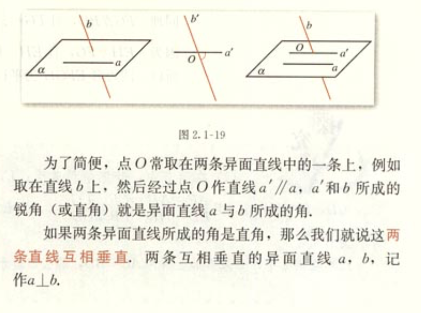 
- 如果 2 条异面直线所成的角是直角, 那么我们就说这 `两条直线互相垂直`, 两条互相垂直
    的异面直线 a, b, 记作 $a \bot b$.

> **2.1.3 空间中直线与平面之间的位置关系** 
- 直线与平面的位置关系有且只有三种:
    + (1) 直线在平面内 - 有无数个公共点
    + (2) 直线与平面相交 - 有且只有一个公共点.
    + (3) 直线与平面平行 - 没有公共点.
    + 直线与平面相交或平行的情况统称为 `直线在平面外`
    + 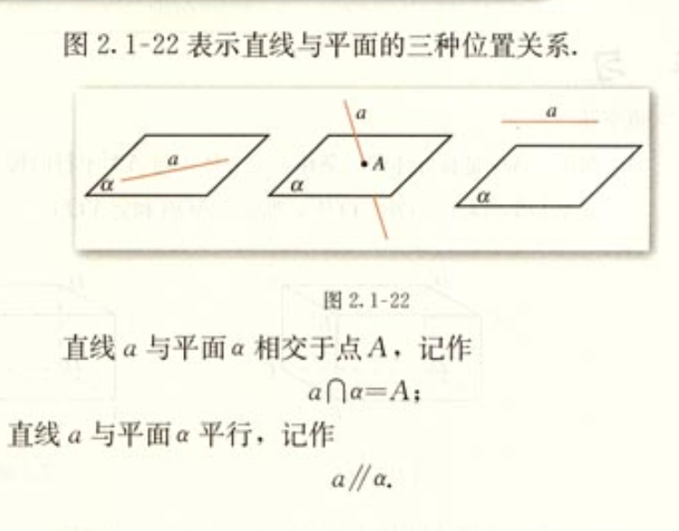 
- 两个平面之间的位置关系有且只有一下 2 种:
    + (1) 两个平面平行 - 没有公共点.
    + (2) 两个平面相交 - 有一条公共直线.
    + 如图 2.1-25 平面 $\alpha$ 与 $\beta$ 平行, 记作 $\alpha // \beta$
    + 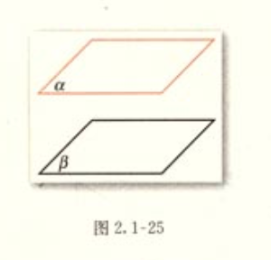 

### 2.2 直线、平面平行的判定及其性质
#### 2.2.1 直线与平面平行的判定
- 怎么判定直线与平面平行呢?
    + 根据定义, 判定直线与平面是否平行, 只需判定直线与平面有没有公共点. 但是, 直线无限延伸,
      平面无限延伸, 如何保证直线与平面没有公共点呢?
- 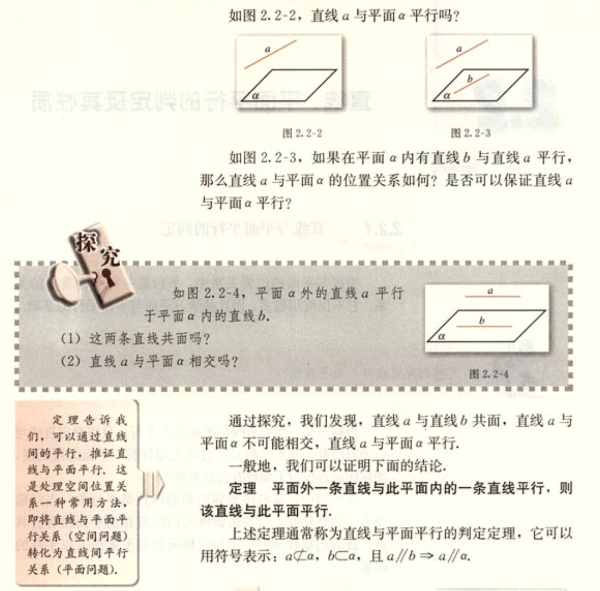     
- **定理: `平面外一条直线与此平面内的一条直线平行, 则该直线与此平面平行.`**

#### 2.2.2 平面与平面平行的判断
- 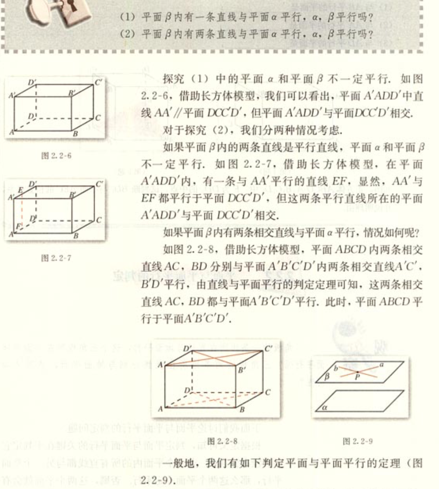  
- **平面与平面平行的判定定理: `一个平面内的两条相交直线与另一个平面平行, 则这两个平面平行`**

#### 2.2.3 直线与平面平行的性质
- 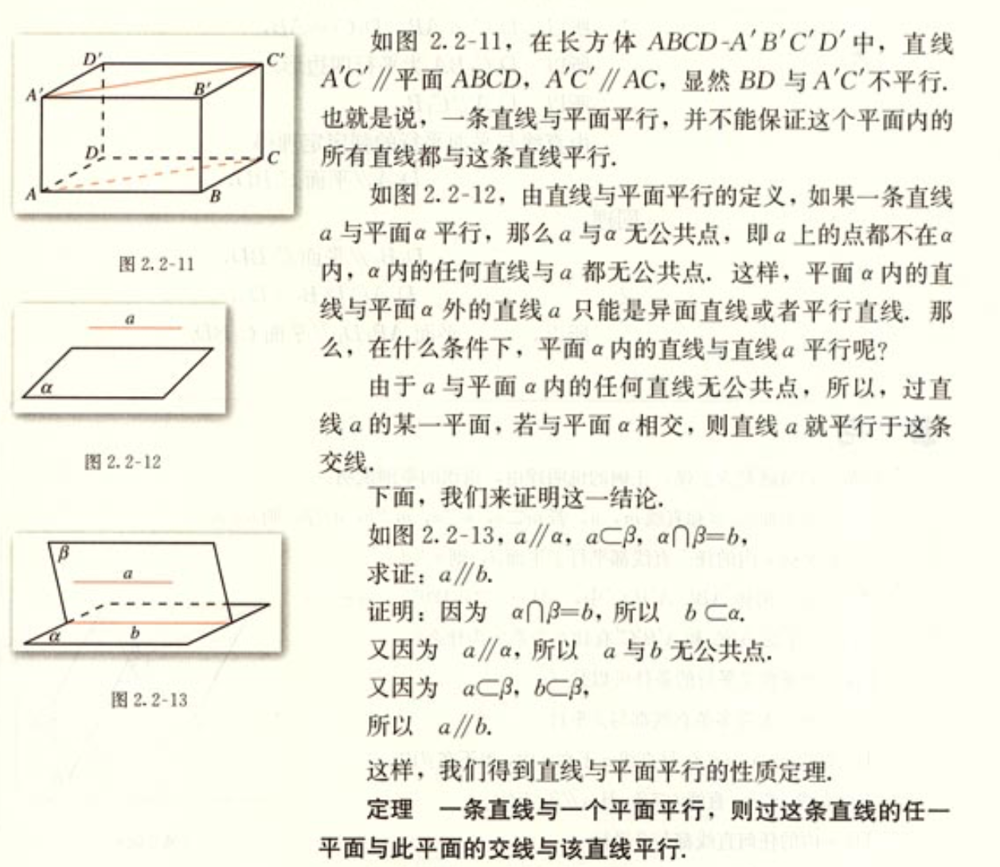 
- Tips: 上图中 "又因为 $a \sub \beta, b \sub \beta$" 的原理是: 
    + A: 是 两条直线平行的定义: (`在同一平面内, 永不相交的 2 条直线叫做平行线.`)

#### 2.2.4 平面与平面平行的性质
- 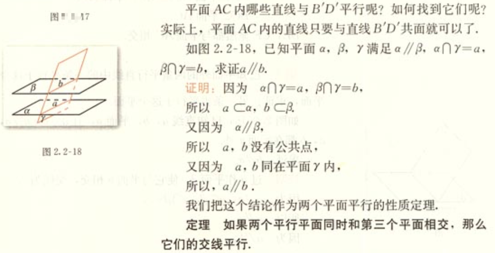 
- 定理: `如果两个平行平面同时和第三个平面相交, 那么他们的交线平行.`
- 上述定理告诉我们, 可以由平面与平面平行得出直线与直线平行.

### 2.3 直线、平面垂直的判定及其性质
#### 2.3.1 直线与平面垂直的判定
- 如果直线 $l$ 与平面 $\alpha$ 内的任意一条直线都垂直, 我们就说
  `直线`$\color{#E87631}{l}$`与平面`$\color{#E87631}{\alpha}$`互相垂直`, 
  记作 $\color{#E87631}{l \bot \alpha}$. 直线 $l$ 叫做
  `平面`$\color{#E87631}{\alpha}$`的垂线`, 平面$\alpha$ 
  叫做`直线`$\color{#E87631}{l}$`的垂面`. 直线与平面垂直时, 它们唯一的公共点 P 叫
  做`垂足`.
- 画直线与平面垂直时, 通常把直线画成与表示平面的平行四边形的一边垂直. 如图 2.3-3
    + 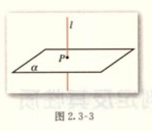 
- 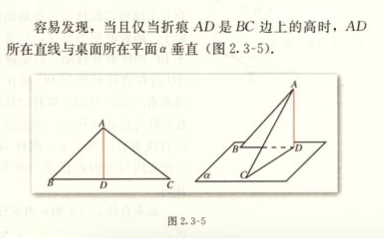
- 一般地, 我们有下面的判定直线与平面垂直的定理.
- 定理: `一条直线与一个平面内的两条相交直线都垂直, 则该直线与平面垂直.` (Tip: 如上图的: 
  AD$\bot$CD, AD$\bot$BD).
- 定理中的 "两条相交直线" 这一条件不可忽视.  
- 如图 2.3-8, 一条直线 PA 和一个平面 $\alpha$ 相交, 但不合这个平面垂直, 这条直线叫做
  这个平面的`斜线`, 斜线和平面的交点 A 叫做`斜足`. 过斜线上斜足以外的一点向平面引垂线 PO,
  过垂足 O 和斜足 A 的直线 AO 叫做斜线在这个平面上的`射影`. 平面的一条斜线和它在平面上的
  射影所成的锐角, 叫做`这条直线和这个平面所成的角.`
#### 2.3.2 平面与平面垂直的判定
- 如图 2.3-10, 从一条直线出发的两个半平面所组成的图形叫做 `二面角 (dihedral angle)`, 
  这条直线叫做 `二面角的棱`, 这两个半平面叫做 `二面角的面`. 棱为 AB, 面分别为 $\alpha$, 
  $\beta$ 的二面角记作二面角 $\alpha-AB-\beta$. 有时为了方便, 也可在 $\alpha, \beta$
  内 (棱以外的半平面部分) 分别取点 P, Q. 将这个二面角记作二面角 P-AB-Q. 如果棱记作 $l$,
  那么这个二面角记作二面角 $\alpha-l-\beta$ 或 $P-l-Q$.
-  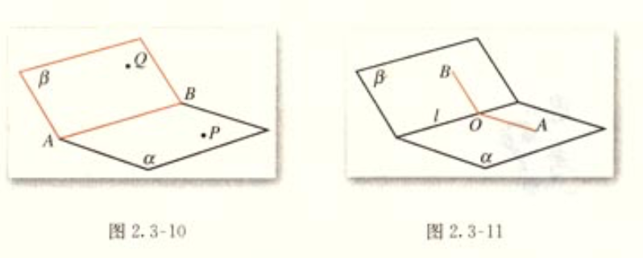
- 如图 2.3-11, 在二面角 $\alpha-l-\beta$ 的棱 $l$ 上任取一点 O, 以点 O 为垂足, 在
  半平面 $\alpha$ 和 $\beta$ 内分别作垂直于棱 $l$ 的射线 OA 和 OB. 则射线 OA 和 OB
  构成的 $\angle AOB$ 叫做 `二面角的平面角`.
- 一般地, 两个平面相交, 如果他们所成的二面角是直二面角, 就说这`两个平面互相垂直.`
- 两个互相垂直的平面通常画成图 2.3-12 的样子, 此时, 把直立平面的竖边画成与水平平面的横边
  垂直. 平面 $\alpha$ 与 $\beta$ 垂直, 记作 $\alpha \bot \beta$.
-  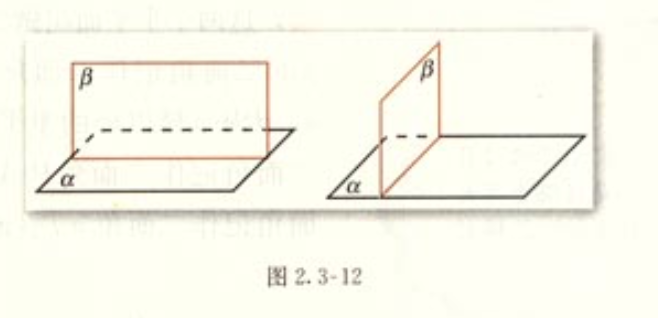  
- 一般地, 我们由下面判断 2 个平面互相垂直的定理.
- 定理: `一个平面过另一个平面的垂线, 则这两个平面垂直.`
- 这个定理说明, 可以由直线与平面垂直证明平面与平面垂直. 

#### 2.3.3 直线与平面垂直的性质
- 一般地, 我们得到直线与平面垂直的性质定理.
- 定理: `垂直于同一个平面的 2 条直线平行.`

#### 2.3.4 平面与平面垂直的性质
- 一般地, 我们得到平面与平面垂直的性质定理.
- 定理: `2 个平面垂直, 则一个平面内垂直于交线的直线与另一个平面垂直.`

#### 欧几里得《原本》与公理化方法
- P75: 所有的数学定理, 都必须按照数学的定义, 公理与三段论的逻辑论证来组织.

## 第 3 章 —— 直线与方程
### 3.1 直线的倾斜角与斜率
#### 3.1.1 倾斜角与斜率
- 怎样描述直线的倾斜程序呢?
- 当直线 l 与 x 轴相交时, 我们取 x 轴作为基准, x 轴正向与直线 l 向 上方向之间所成的角
  $\alpha$ 叫做直线 l 的 `倾斜角 (angle of inclination)`. 图 3.1-2 中直线 l 的
  倾斜角 $\alpha$ 为锐角, 直线 l' 的倾斜角为 a' 为钝角. 当直线 l 与 x 轴平行或重合时,
  直线上的一点和这条直线的倾斜角可以唯一确定一条直线. 因此, 确定平面直角坐标系中一条直线
  位置的的几何要素是: **直线上的一个定点以及它的倾斜角, 二者缺一不可.**  
  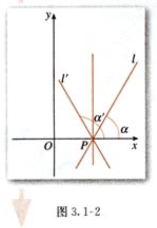 
- 如图 3.1-3, 日常生活中, 我们经常用 `升高量与前进量的比" 表示倾斜面的`,`坡度 (倾斜程度)`
  , 即
  $$
  坡度(比) = \frac{升高量}{前进量}
  $$
  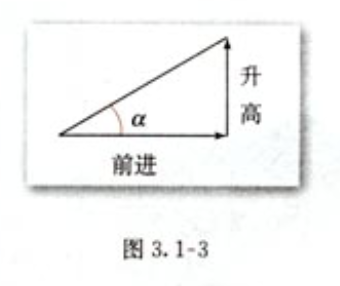   
  例如, "进 2 升 3" 与 "进 2 升 2" 比较, 前者更陡一些, 因为坡度(比) 
  $\frac{3}{2} > \frac{2}{2}$
- 如何我们使用 "倾斜角" 这个概念， 那么我这里的 "坡度(比)" 实际上是 "倾斜角 $\alpha$ 的
  正切". 我们把一条直线的倾斜角 $\alpha$ 的正切值叫做这条直线的 `斜率 (slop)`, 斜率常用
  小写字母 $k$ 表示, 即
  $$
    k = \tan{\alpha}
  $$
  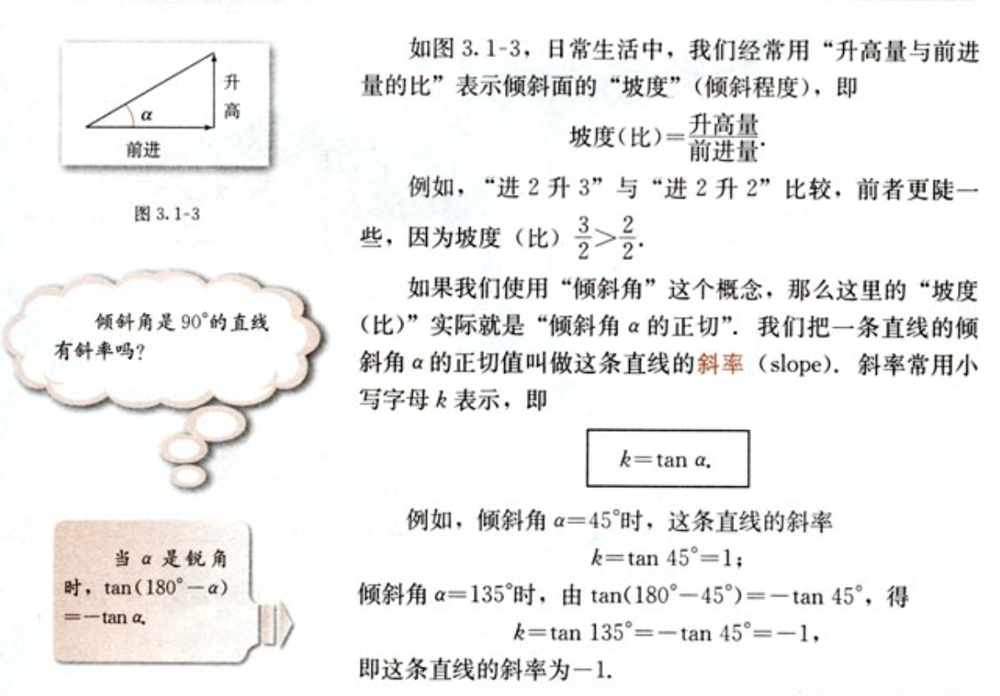 
- 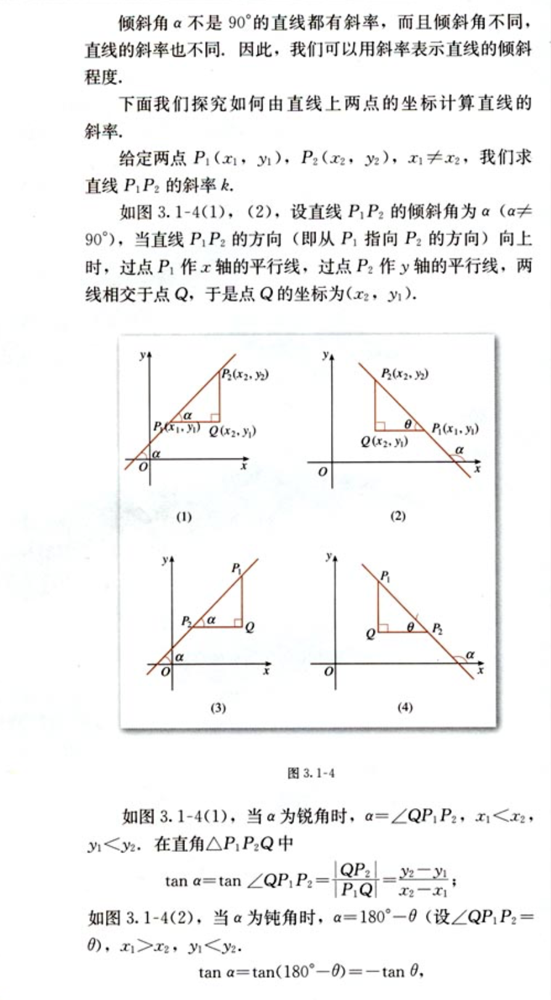 
  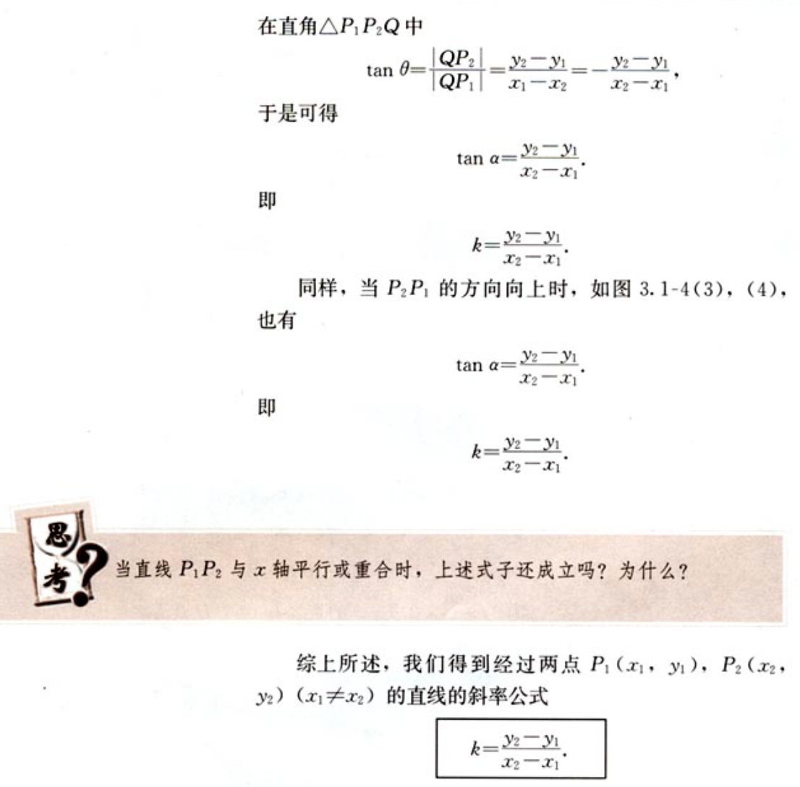 
  综上所述, 我们得到经过两点 $P_1(x_1, y_1), P_2(x_2, y_2) (x_1 \neq x_2)$ 的直线
  的斜率公式 
  $$
    k = \frac{y_2 - y_1}{x_2 - x_1}
  $$
#### 3.1.2 两条直线平行于垂直的判定
- 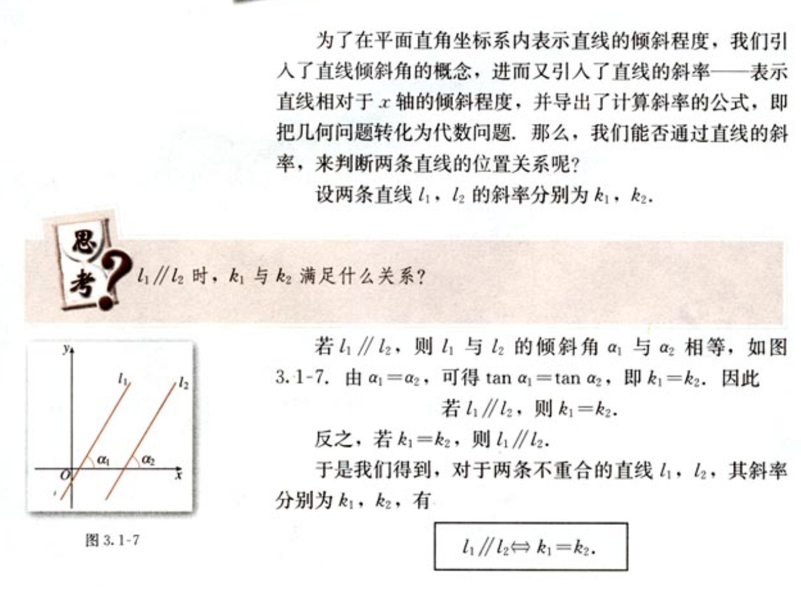 
- 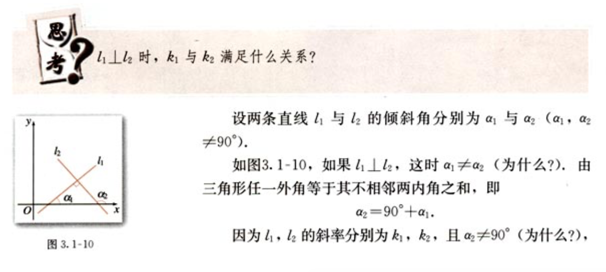 
   

### 3.2 直线的方程
#### 3.2.1 直线的点斜式方程 (斜截式方程)
- `(Tip: 为了节省时间, 从此处开始以截图为主, 以后在转换为文字.)`
- 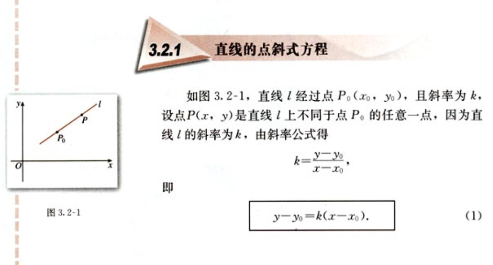 
  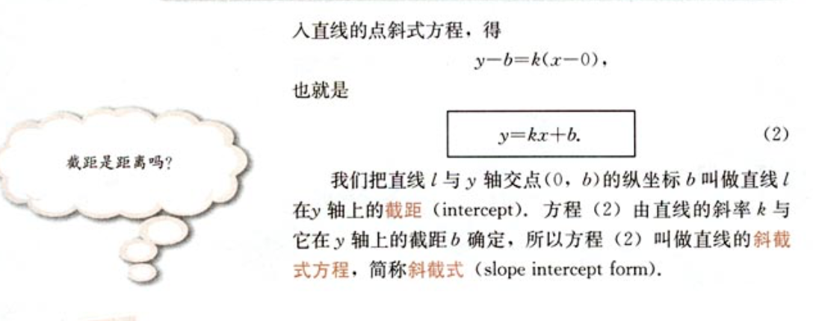 
  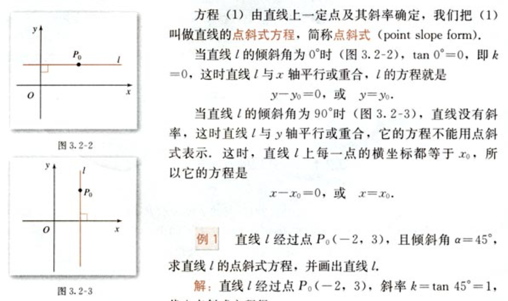                 
#### 3.2.2 直线的两点式方程
- 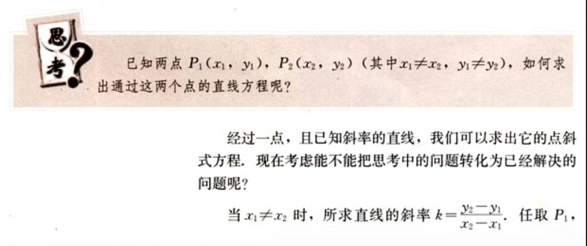 
  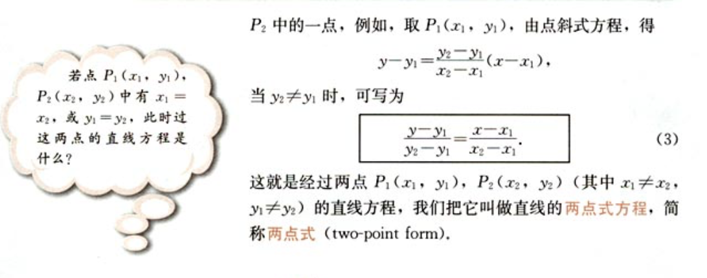       
#### 3.2.3 直线的一般式方程
- 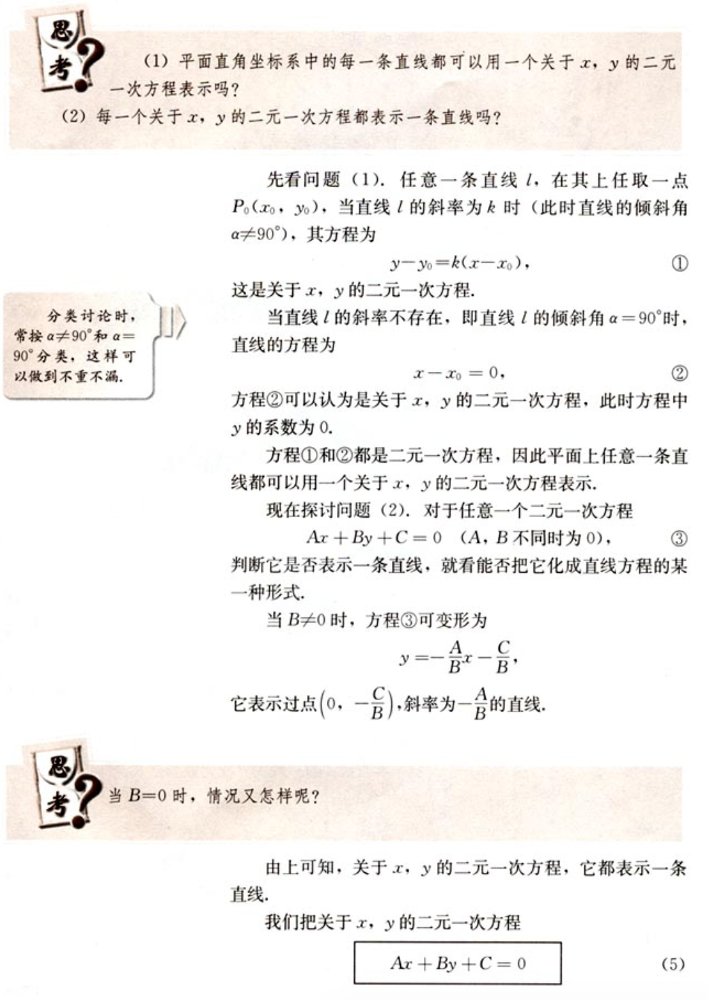   
- 我们把关于 $x, y$ 的二元一次方程 
  $$
    Ax + By + C = 0 \quad \quad (5)
  $$
  (其中 $A, B$ 不同时为 0) 叫做 `直线的一般式方程`, 简称 `一般式 (general form)`

### 3.3 直线的交点坐标与距离公式
#### 3.3.1 两条直线的交点坐标
- 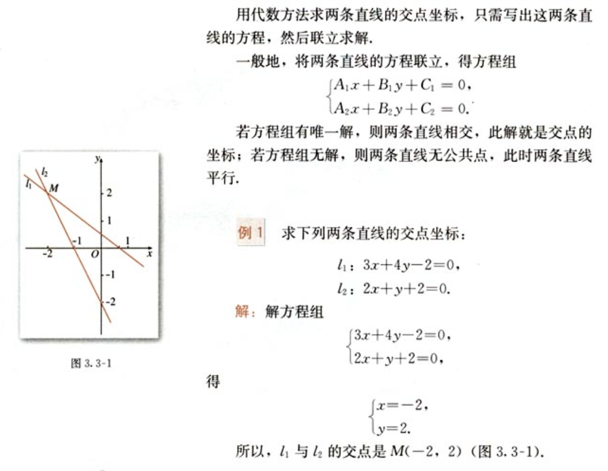 
#### 3.3.2 两点间的距离
- 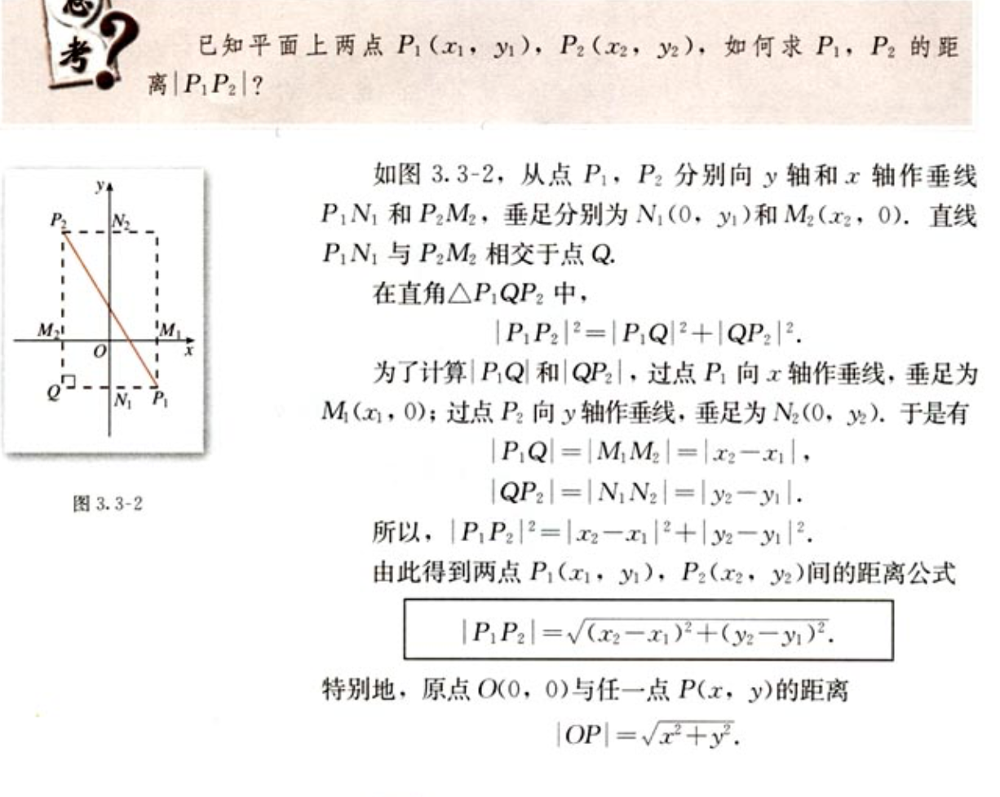 
#### 3.3.3 点到直线的距离
- 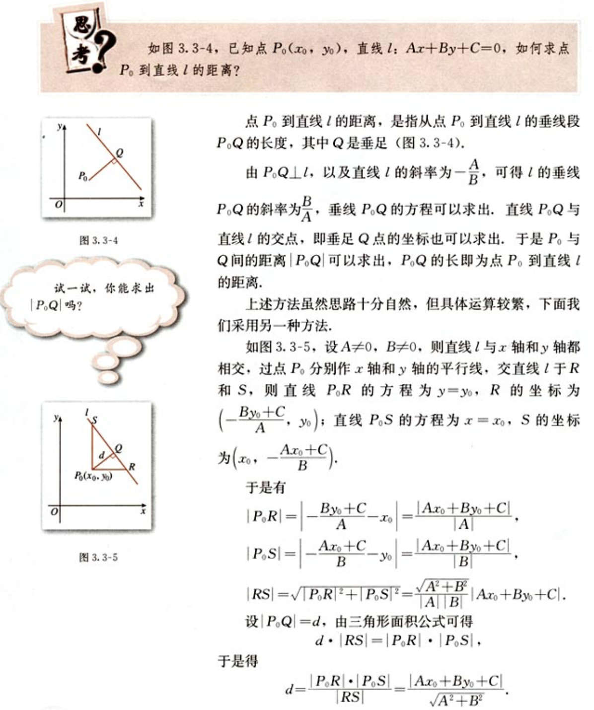 
- 因此, 点 $P_0(x_0, y_0)$ 到直线 $l: Ax + By + C = 0$ 的距离
    $$
    d = \frac{|Ax_0 + By_0 + C|}{\sqrt{A^2 + B^2}}
    $$
#### 3.3.4 两条平行直线间的距离
- 两条平行直线间的距离是指夹在两条平行直线间公垂线段的长. 
- 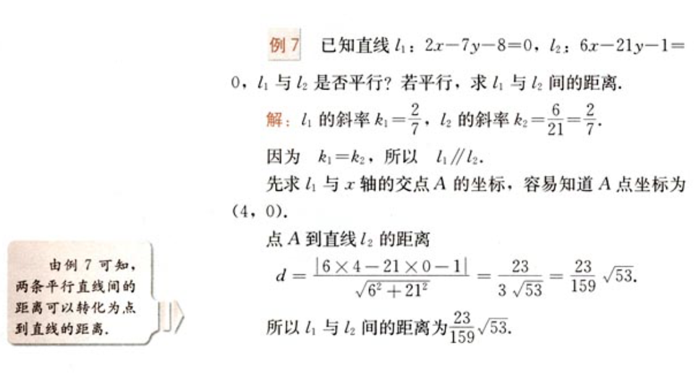      
#### 笛卡尔与解析几何

## 第 4 章 —— 圆与方程
### 4.1 圆的方程
#### 4.4.1 圆的标准方程
- 显然, 当圆心位置与半径大小确定后, 圆就唯一确定了, 因此, 确定一个圆最基本要素是圆心与
  半径. 如图 4.1-1, 在直角坐标系中, 圆心 (点) $A$ 的位置用坐标 $(a, b)$ 表示, 半径
  $r$ 的大小等于圆上任意点 $M(x, y)$ 与圆心 $A (a, b)$ 的距离, 圆心为 $A$ 的圆就是集合 
  $$
    P = \{ M | \, |MA| = r \}.
  $$
  由 2 点见的距离公式, 点 M 的坐标是和的条件可以表示为 
  $$
    \sqrt{(x-a)^2 + (y-b)^2} = r, \quad \quad ①
  $$
  ① 式两边平方, 得 
  $$
    (x-a)^2 + (y-b)^2 = r^2  \quad \quad (1)
  $$
  若点 $M(x, y)$ 在圆上, 有上述讨论可知, 点 $M$ 的坐标适合方程 (1); 反之, 若点 
  $M(x, y)$ 的坐标适合方程 (1), 这就说明点 M 和圆心 A 的距离为 r, 即点 M 在圆心为
  A 的圆上. 我们把方程 (1) 称为圆心为 A(a, b), 半径长为 r 的圆的方程, 把它叫做 
  `圆的标准方程 (standard equation of circle)`
#### 4.1.2 圆的一般方程
- 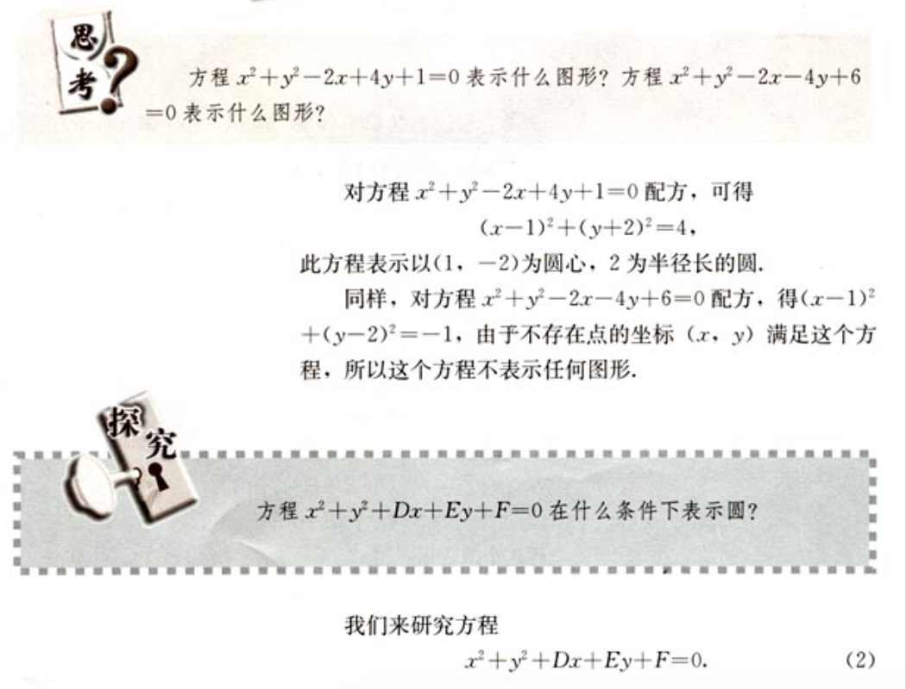
   

### 4.2 直线、圆的位置关系
#### 4.2.1 直线与圆的位置关系
- 由平面几何知, 直线与圆有 3 种位置关系:
    + (1) 直线与圆相交, 有 2 个公共点;
    + (2) 直线与圆相切, 有 1 个公共点;
    + (3) 直线与圆相离, 没有公共点.
- 例1: 分析
    + 方法一: 判断直线 l 与圆的位置关系, 就是看由他们的方程组成的方程组有无实数解;
    + 方法二: 可以依据圆心到直线的距离与半径长的关系, 判断直线与圆的位置关系.    
    + Tip: 点到直线的距离  $d = \frac{|Ax_0 + By_0 + C|}{\sqrt{A^2 + B^2}}$
    +  
- 例1: 略
#### 4.2.2 圆与圆的位置关系
- 例3: 分析
    + 方法一: 圆 $C_1$ 与圆 $C_2$ 有几个公共点, 由他们的方程组成的方程组就有机几组实数解
      确定;
    + 方法二: 可以依据连心线的长与两半径长的和 $r_1 + r_2$ 或两半径长的差的绝对值
      $|r_1 - r_2|$ 的大小求关心, 判断两圆的位置关系.
    +  
#### 4.2.3 直线与圆的方程的应用
- 用坐标法解决几何问题时, 先用坐标和方程表示相应的几何元素: 点, 直线, 圆, 将几何问题转化为
  代数问题; 然后通过代数运算解代数问题; 最后解释代数运算结果的几何含义, 得到几何问题的结论.
  这就是用坐标方法解决平面几何问题的 "三步曲":
  + 第一步: 建立适当的平面直角坐标系, 用坐标和方程表示问题中的几何元素, 将平面几何问题转化
    为代数问题;
  + 第二步: 通过代数运算, 解决代数问题;
  + 第三步: 把代数运算结果 "翻译" 成几何结论.

### 4.3 空间直角坐标系
- 我们知道, 数轴 $Ox$ 上的点 $M$, 可用与它对应的实数 $x$ 表示; 直角坐标平面上的 $M$ 可以
  用一对有序实数 $(x, y)$ 表示.
- 当建立空间直角坐标系后, 空间中的点可用有序实数组 $(x, y, z)$ 表示.
#### 4.3.1 空间直角坐标系
- 如图 4.3-1, $OABC-D'A'B'C'$ 是单位正方体, 以 $O$ 为原点, 分别以射线
  $OA, OC, OD'$的方向为正方向，以线段 $OA, OC, OD'$ 的长为单位长，建立三条数轴: 
  x轴、y轴、z轴这时我们说建立了一个`空间直角坐标系O-xyz`,其中点 O 叫做 `坐标原点`, 
  x轴、y轴、z轴叫做 `坐标轴`. 通过每两个坐标轴的平面叫做 `坐标平面`，
  分别称为: $xOy$平面、$yOx$平面、$zOx$平面.
- Tip: 在平面上华空间直角坐标系 $Oxyz$ 时, 一般使 $\angle{xOy} = 135^\circ$,
  $\angle{yOz} = 90^\circ$   
   
- 在空间直角坐标系中，让右手拇指指向 $x$ 轴的正方向，食指指向 $y$ 轴的正方向，如果中指
  指向 $z$ 轴的正方向，则称这个坐标系为右手直角坐标系.
   
- 如图 4.3-2, 设点 $M$ 为空间的一个定点, 过点 $M$ 分别作垂直于 x轴, y轴 和 z轴的平面,
  依次交于 x轴, y轴和 z轴平面, 作垂直于x轴、y轴和 z轴的平面，依次交 x轴、y轴和 z轴于点P, 
  Q和R. 设点 P, Q 和 R 在 x轴、y轴 和 z轴上的坐标分别是x，y和z，那么点M就对应唯--确定的
  有序实数组(x, y, z).
- 反过来，给定有序实数组(x, y, z),我们可以在 x轴、y轴和 z轴上依次取坐标为x, y和 z的点P, 
  Q 和 R,分别过P, Q 和 R各作一个平面，分别垂直于x轴、y轴和 z轴，这三个平面的唯一的交点就是
  有序实数组(x，y, z)确定的点M.
- 这样，空间一点 M 的坐标可以用有序实数组(x, y,z )来表示，有序实数组 (x，y, z) 叫做点 M 在
  此 `空间直角坐标系中的坐标`，记作 M(x, y, z). 其中 x 叫做点 M 的 `横坐标`，y 叫做点 M 的
  `纵坐标`，z 叫做点 M 的 `竖坐标`，
- 在图4.3-1中，点O, A, B, C的坐标分别是 (0, 0,0)，(1,0,0),(1,1,0),(0,1,0)，这四点在
  $xOy$平面上，它们的竖坐标都是零，点B'的坐标是(1，1, 1).
#### 4.3.2 空间两点间的距离公式
-   
- 这说明, 在空间直角坐标系 $Oxyz$ 中, 任意一点 $P(x, y, z)$ 与原点间的距离
  $|OP| = \sqrt{x^2 + y^2 + z^2}$
 
- 例二: 如果 $|OP|$ 是定长 r, 那么 $x^2 + y^2 + z^2 = r^2$ 表示什么图形?
-  
  (Tips: 上面的推理过程很棒)    
- 因此空间中点 $P_1(x_1, y_1, z_1)$, $P_2(x_2, y_2, z_2)$ 之间的距离
  $|P_1P2| = \sqrt{(x_1 - x_2)^2 + (y_1 - y_2)^2 + (z_1 - z_2)^2}$    
 

