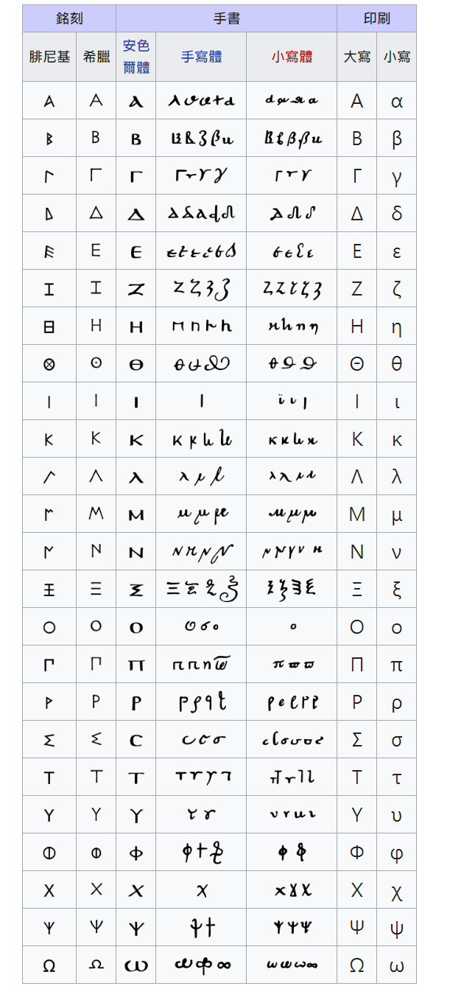

希腊字母 中英对照一览表  

|序号| 大写  | 小写 | 中文名 | 英文注音 | 意义 |
|:---|:---|:---|:-------|:----------|:----------|
|1. | A | α   |  阿尔法     |    Alpha /'ælfə/ n.希腊字母的第1个字母       |    角度，系数，角加速度，第一个，电离度，转化率|
|2. | B | β   |  贝塔      |    Beta /'biːtə/ n.希腊字母中的第2个字母      |    磁通系数；角度；系数|
|3. | Γ | γ   |  伽玛      |    Gamma /'gæmə/ n.希腊字母中的第3个字母      |    电导系数（小写），角度，比热容比|
|4. | Δ | δ   | 德尔塔      |   Delta /'deltə/ n.希腊字母中的第4个字母     |    变化量，焓变，熵变，屈光度，一元二次方程中的判别式|
|5. | Ε | ε   | 伊普西隆    |    Epsilon /'epsɪlɒn/ n.希腊字母的第5个字母  |    对数之基数，介电常数|
|6. | Ζ | ζ   | Z塔        |    Zeta /'ziːtə/ n.希腊字母的第6个字母       |    系数；方位角；阻抗；相对粘度；原子序数  |
|7. | Η | η   | 伊塔       |    Eta /'eitɑ:/  n.希腊字母的第7个字母        |   迟滞系数；机械效率（小写） |
|8. | Θ | θ   | 西塔       |    Theta /'θiːtə/ n.希腊字母的8个字母        |    温度；相位角  |
|9. | Ι | ι   | 埃欧塔     |    Iota /aɪ'əʊtə/ n.希腊字母的第9个字母       |    微小，一点儿 |
|10.| Κ | κ   | 堪帕       |    Kappa /'kæpə/  n.希腊字母的第10个字母     |    介质常数，绝热指数  |
|11.| ∧| λ   | 拉姆达      |    Lambda /'læmdə/ n.希腊字母的第11个字母    |    波长（小写）；体积，导热系数   |
|12.| Μ | μ   | 谬/穆      |    Mu /mjuː/   n.希腊字母的第12个字母        |    磁导系数，微、动摩擦系(因)数，流体动力黏度，货币单位 |
|13.| Ν | ν   | 拗/奴      |    Nu /nu:/   n.希腊字母的第13个字母         |    磁阻系数，流体运动粘度，光波频率，化学计量数 |
|14.| Ξ | ξ   | 可西/赛    |    Xi /sai/  n.希腊字母的第14个字母           |    随机变量，(小)区间内的一个未知特定值 |
|15.| Ο | ο   | 欧米可荣    |   Omicron /ə(ʊ)'maɪkrɒn/ n.希腊字母的第15个字母 | 高阶无穷小函数|
|16.| ∏ | π   | 派         |    Pi /pai/  n.希腊字母的第16个字母           |   圆周率吗，π(n)表示不大于n的质数个数  |
|17.| Ρ | ρ   | 柔         |    Rho /rəʊ/ n.希腊字母的第17个字母           |   电阻系数（小写）,柱坐标和极坐标中的极径，密度|
|18.| ∑ | σ,ς | 西格玛      |   Sigma /'sɪgmə/ n.希腊字母的第18个字母       |   总和（大写），表面密度；跨导（小写），正应力|
|19.| Τ | τ   | 陶         |   Tau /tɔː/ n.希腊字母的第19个字母            |    时间常数，切应力，2π(两倍圆周率)|
|20.| Υ | υ   | 啊普西龙    |   Upsilon /ʌp'saɪlən/ n.希腊字母的第20个字母  |    位移  |
|21.| Φ | φ   | 弗忆       |   Phi /faɪ/  n.希腊字母的第21个字母           |    磁通，角，透镜焦度，热流量，电势  |
|22.| Χ | χ   | 凯         |   Chi /kaɪ/ n.希腊字母的第22个字母            |    统计学中有卡方(x2)分布  |
|23.| Ψ | ψ   | 赛/普赛     |   Psi /psaɪ/ n.希腊字母的第23个字母          |    角速；介质电通量（静电力线），ψ函数|
|24.| Ω | ω   |欧米伽/欧枚嘎 |  omega /'əʊmɪgə/(最后ə发"阿"音)n.希腊字母的第24个字母 | 欧姆，角速度，交流电的电角度，化学中的质量分数  |

- 希腊字母表-wiki

# [HTML 4.01 符号实体](http://www.w3school.com.cn/tags/html_ref_symbols.html)

## HTML 支持的数学符号
| 结果 | 描述 | 实体名称 |	实体编号 |
|:---:|:---:|:---:|:---:|
|∀	|for all|	`&forall;`|   `&#8704;`|
|∂	|part|	    `&part;`|	`&#8706;`|
|∃	|exists|	`&exists;`|	`&#8707;`|
|∅	|empty|	    `&empty;`|	`&#8709;`|
|∇	|nabla|	    `&nabla;`|	`&#8711;`|
|∈	|isin|	    `&isin;`|	`&#8712;`|
|∉	|notin|	    `&notin;`|	`&#8713;`|
|∋	|ni|	    `&ni;`|	`&#8715;`|
|∏	|prod|	    `&prod;`|	`&#8719;`|
|∑	|sum|	    `&sum;`|	`&#8721;`|
|−	|minus|	    `&minus;`| `&#8722;`|
|∗	|lowast|	`&lowast;`|	`&#8727;`|
|√	|square root|	`&radic;`|	`&#8730;`|
|∝	|proportional to|	`&prop;`|	`&#8733;`|
|∞	|infinity|	`&infin;`|	`&#8734;`|
|∠	|angle|	    `&ang;`|	`&#8736;`|
|∧	|and|	    `&and;`|	`&#8743;`|
|∨	|or|	    `&or;`|	`&#8744;`|
|∩	|cap|	    `&cap;|`	`&#8745;`|
|∪	|cup|	    `&cup;`|	`&#8746;`|
|∫	|integral|	`&int;`|	`&#8747;`|
|∴	|therefore|	`&there4;`|	`&#8756;`|
|∼	|simular to|	`&sim;`|	`&#8764;`|
|≅	|approximately equal|	`&cong;`|	`&#8773;`|
|≈	|almost equal|	`&asymp;`|	`&#8776;`|
|≠	|not equal|	    `&ne;`|	`&#8800;`|
|≡	|equivalent|	`&equiv;`|	`&#8801;`|
|≤	|less or equal|	`&le;`|	`&#8804;`|
|≥	|greater or equal|	`&ge;`|	`&#8805;`|
|⊂	|subset of|	    `&sub;`|	`&#8834;`|
|⊃	|superset of|	`&sup;`|	`&#8835;`|
|⊄	|not subset of|	`&nsub;`	|`&#8836;`|
|⊆	|subset or equal|	`&sube;`	`&#8838;`|
|⊇	|superset or equal|	`&supe;`	`&#8839;`|
|⊕	|circled plus|	`&oplus;`|	`&#8853;`|
|⊗	|cirled times|	`&otimes;`|	`&#8855;`|
|⊥	|perpendicular|	`&perp;`|	`&#8869;`|
|⋅	|dot operator|	`&sdot;`|	`&#8901;`|

