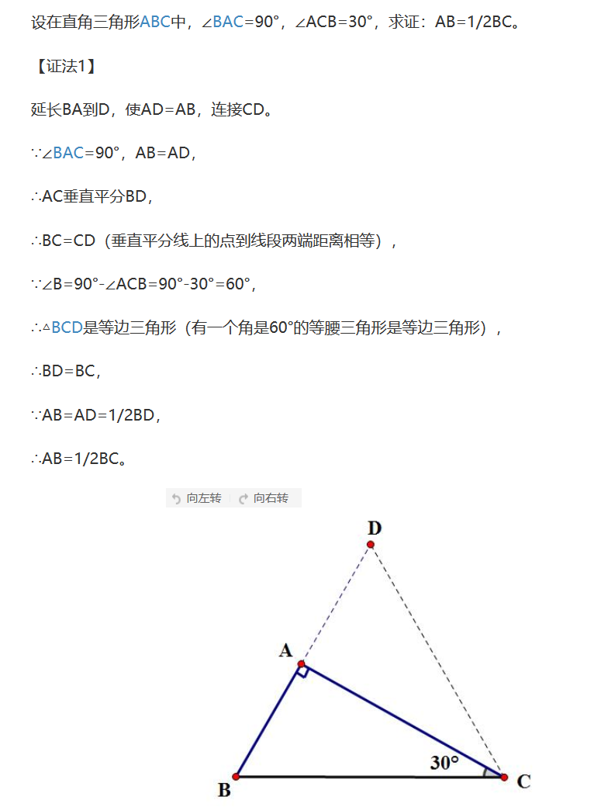

# Mathematics learning 数学学习

$\color{#E87631}{\large }$
$\quad$

## 生词
- **exist [ɪg'zɪst] --vi.存在, 生存, 幸存**
    + --> Some people believe that ghosts exist.
        有的人相信鬼魂存在.
    + --> Such things exist only in fancy. 那样的事只有存在于幻想中
    + --> We cannot exist without air. 我们没有空气就不能存在.
    + --> Mankind exists on food. 人类靠食物生活.

## Content

### 学习线性代数需要先学微积分吗？
- Answer (1): 不需要，它们是独立的。
    + 微积分是序结构，线性代数是代数结构
    + 应该不是独立的吧, 《Linear Algebra with Applications, Eighth Edition》
      这本经典书籍，一些例题涉及了微积分，
      特别是第六章教如何用特征值和特征向量求解线性微分方程组，我看了当时就懵逼了。
      找了另一本《托马斯微积分》，1000多页，还是先得学微积分啊。
        - 线性代数解微积分应该是微分方程这门课的内容，是等到线代和微积分之后再学的。
          线性代数很多用到微积分的例子也是不需要的，如果为了给学生举出无限维向量空间的例子，
          老师可以根据微积分课的进度随便给几个学生看得懂的例子就好。所以建议两门课是大一同时上。
- Answer(2): 微积分和线性代数是合作的关系，微分是曲线曲面的平直化,
  平直化之后就是线性代数的事情了。尤其到多变量微积分，线性代数的知识用得上。
  实际上微积分和线性代数最好都学两轮（不同理论高度学两遍）。或者到微分几何课程里面再重温。

### 机器学习和计算机视觉相关的数学
- (1) 线性代数 (Linear Algebra)
- (2) 概率和统计 (Probability and Statistics)
- (3) 分析 (Analysis)
- (4) 拓扑 (Topology)
- (5) 流形理论 (Manifold Theory)

### 全称量词 / 全称量化
- 来源: https://zh.wikipedia.org/zh-cn/%E5%85%A8%E7%A7%B0%E9%87%8F%E5%8C%96
- 全称量词 $\forall$: 就是 A(ll) 的反写,读作 for all. 表示任意的,所有的.
- 在谓语逻辑中, 全称量化是尝试形式化某个事物 (逻辑谓词) 对于所有事物或所有有关的事物都为真
  的概念. 结果的陈述是全称量化后的陈述,我们在谓词上有了全称量化. 在符号逻辑中,全称量化 (
  $\forall$) 是用来指示全称量化的符号.
#### 基础
- 假设你要说的是: $2 \cdot{0} = 0 + 0, 以及 2\cdot{1} = 1 + 1, 以及$
  $2\cdot{2} = 2 + 2,$ 等等.
- 由于 "以及" 一词的重复使用,这似乎是一个 *逻辑合取*. 然而 *形式逻辑* 中的合取概念却不能
  表达出 "等等" 一词的含义. 因此该命题改述为:
    + 对任意自然数 n, 都存在 $2 \cdot n = n + n$.  
  这便是一个使用全称量化的单一命题.

------

### 存在量词 
- 存在量词 $\exists$: 读作 there exists, 就是 E(xistence) 的反写. 表示存在一个,
  至少一个.

### 注(排)水问题:
> 一个水池, 底部装有一个常开的排水管, 上部装有若干个同样粗细的进水管. 当打开 4 个进水管时,
  需要 5h 小时才能注满水池; 当打开 2 个进水管时需要 15h 才能注满水池; 现在要用 2 小时将
  水注满, 至少打开多少个进水管?
- Note: 注(排)水问题是一类特殊的工程问题, 往水池注水或从水池排水相当于一项工程, 
  水的流量就是工作量. 单位时间内的流量就是工作效率.
- 答: 我们假设每个进水管每小时注水一份; 
    + (1) 4 个进水管 5h 一共注水 $4 \times 5 = 20$ 份
    + (2) 2 个进水管 15h 一共注水 $2 \times 15 = 30$ 份, 
    + (3) 让 (2) - (1) 可得出 10h 小时一共排出 10 份水, 这是因为开 2 个进水管比开
      4 个进水管多向外排水 10 个小时, 由 10 个小时排出 10 份水可得每小时水池排出 1 份水. 
    + (3) 根据 4 个水管 5 小时注水 20 份, 同时 5 小时内又会排出 5 份水 (20 - 5 = 15).
      可得水库容纳 15 份水. 
    + (4) 既然知道水池可容纳 15 份水, 又希望在 2 个小时内注满水池, 
      但 2 个小时内又会流出 2 份水, 所以可得 (15 + 2 = 17), 
      既 2 个小时内住满水池我们总共需要 17 份水. 一个水管 1 小时注水一份, 
      如果 1 小时注满我们需要 17 根,
      但现在说 2 个小时注满即可, 所以 17 $\div$ 2 $\approx$ 9 个.

### 平行四边形, 矩形, 菱形, 正方形的定义和判定方法?
> 定义:
- 平行四边形：两组对边分别平行的四边形是平行四边形。
- 矩形: 4 个角都是直角的四边形是矩形。
- 菱形: 4 条边都相等的四边形是菱形。
- 正方形: 4 条边 和 4 个角都相等(直角)的四边形是正方形.   
> 判定: 
- 平行四边形: 
    + 两对边分别相等; 
    + 两对角分别相等; 
    + 两对边分别平行; 
    + 有一组对边平行且相等;
    + 对角线互相平分.
- 矩形: (在平行四边形基础上) 有一角为直角; 对角线相等.
- 菱形: (在平行四边形基础上) 有一组邻边相等; 对角线垂直; 对角线也是角平分线.
- 正方形: 即是矩形又是菱形. 

### 在直角三角形中, $30^\circ$ 角所对的直角边等于斜边的一半
> 证明: `在直角三角形中,` $\color{#e7691e}{30^\circ}$`角所对的直角边等于斜边的一半`
- 

### 两三角形相似 ($\backsim$)
- (1) 两角对应相等两三角形相似
- (2) 两边对应成比例且夹角相等 
- (3) 三边对应成比例, 两个三角形相似.

