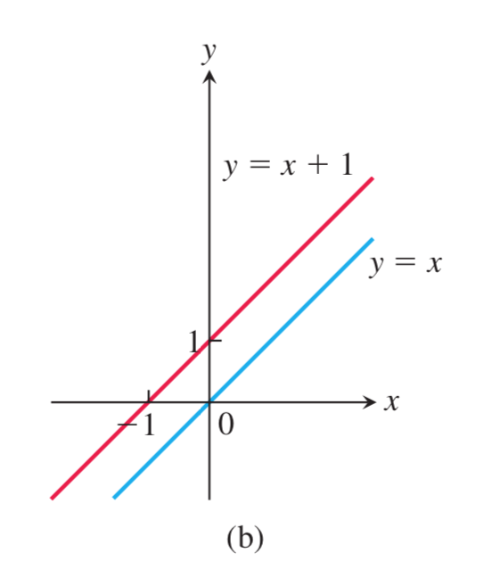
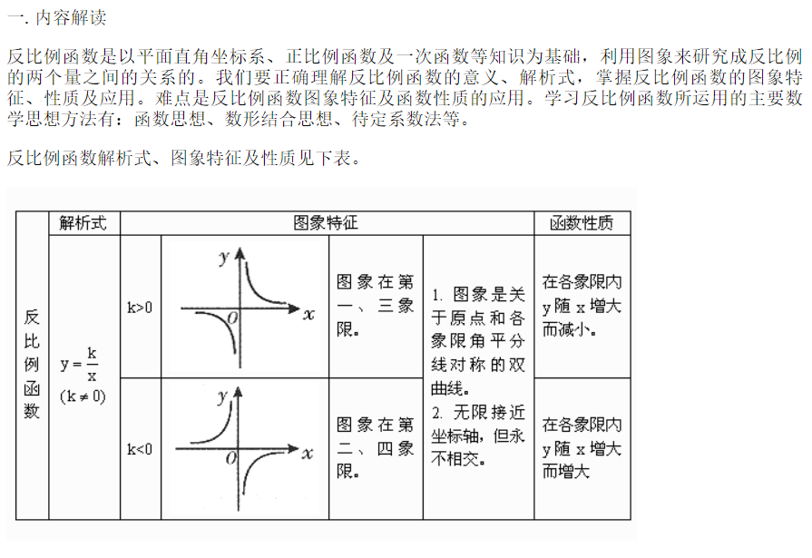
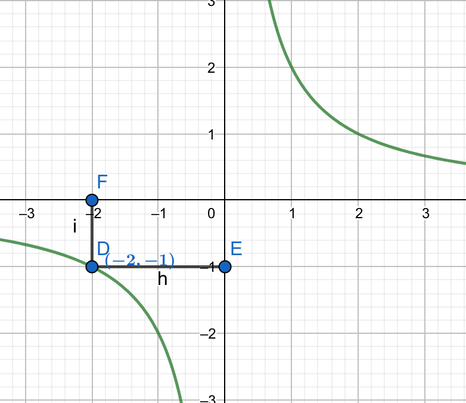
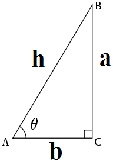
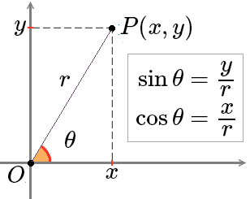
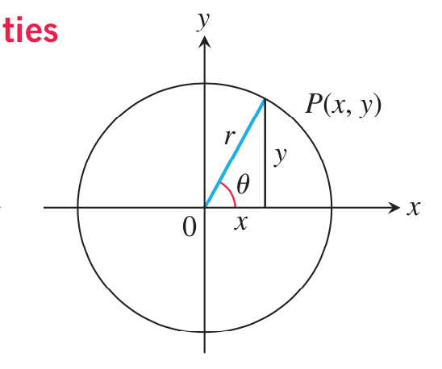
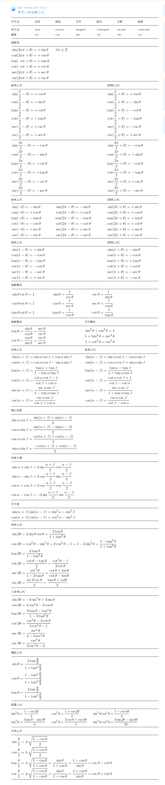
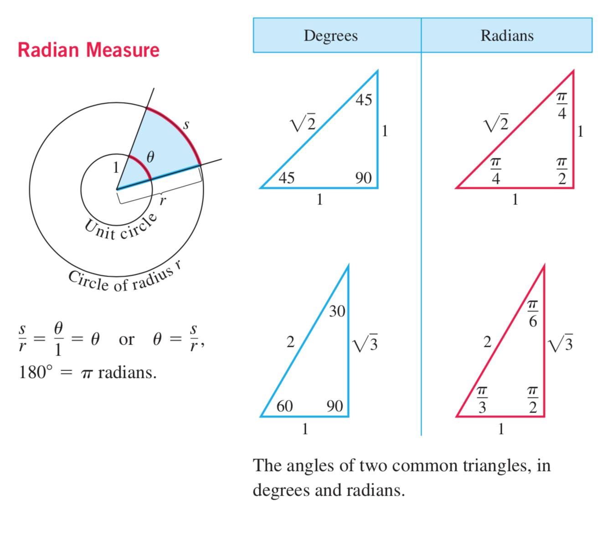

# 三角函数 (trigonometric function)
- 是数学中常见的一一类关于"角度"的函數。 三角函数將直角三角形的內角和他的2个边的比值相关联，
  也可等价地用与"单位圆"有关的各种线段的长度来定义。三角函数在研究三角形和圆等几何形状的性质
  是有重要作用，也是研究"周期性现象"的基础数学工具。在数学分析中，三角函数也被定义为
  "无穷级数"或特定"微分方程"的解，允许他们的取值扩展到任意实数值，甚至是"复数"值。
- 常见的三角函数包括"正弦函数(sin)"、"余弦函数(cos)"、"正切函数(tan)"，在航海学
  、绘测学、工程学等其他学科中，还会用到如"余切(cot)"、"正割(sec)"、"余割函数
  (csc)"、"正矢函数"、"半正矢函数"等其他的三角函数。不同的三角函数之间的关系可以通过
  几何直观或者计算得出，称为"**三角恒等式**".
- **三角函数一般用于计算三角形中未知长度的边和未知的角度**，在导航、工程学以及物理学方便都有
  广泛的用途。另外、**以三角函数为模板，可以定义一类相似的函数，叫做"双曲函数"**。常见的
  双曲函数也被称为双曲正弦函数，双曲余弦函数等等。 

## 生词
- **trigonometric [ˌtriɡənə'metrik] (trigono-metric) --adj.三角法的**
    + --> trigonometric functions 三角函数
- **trigonometry [ˌtrɪgə'nɒmɪtrɪ] (trigo-nometry) --n.三角学, 三角法，三角函数**
    + --> Trigonometry formulas 三角函数公式
- **sine [saɪn] --n.[数]正弦**
- **cosine ['kəʊsaɪn] (co-sine) --n.余弦**
- **tangent ['tæn(d)ʒ(ə)nt] --n.切线; 正切. --adj.接触的; 相切的**
- **cotangent [kəʊ'tændʒ(ə)nt] (co-tangent) --n.[数] 余切**
- **secant ['siːk(ə)nt] --n.正割; 割线. --adj.分割的; 交叉的**
- **cosecant ['ko'sikənt] (co-secant) --n.[数]余割**

------

### 函数
- **《托马斯大学微积分》定义的函数:**
    + 在每种情形下，一个变量(例如 $y$) 的值依赖于另外一个变量(例如 $x$) 的值，我们把这样
      的事例称为 "$y$ 是 $x$ 的函数", 并用记号表示成 $y = f(x)$ (读作: $y$ 等于 $f$ 
      对 $x$ 的值) 在这种表示法中，符号 $f$ 代表函数，字母 $x$ 代表 $f$ 的输入值的 
      **自变量**，而 $y$ 是 **因变量** 或 $f$ 在 $x$ 的输出值。
    + > *<i style="color: red">定义</i>*: 从集合 $D$ 到集合 $Y$ 的 **函数** 是一个
      对应规则, 对于每个元素 $x \in D$ 确定唯一的(单个)元素 $f(x) \in Y$. 
    + 所有可能输入值的集合 $D$ 称为函数的**定义域**，当 $x$ 取遍 $D$ 中的元素时，$f(x)$
      的所有值的集合称为函数的**值域**。 值域可能并不包含集合 $Y$ 中的每一个元素。函数的
      定义域和值域可以为任何对象的集合，不过在微积分中它们通常是解释为坐标轴上点的实数集合。
      (在第 11 章至第 14 章讨论的函数，其定义域和值域集合的元素是坐标平面或坐标空间中的点。)
- **高中课本定义函数:**
  
    - 见 `必修1.md`

> **一次函数(线性函数 linear function)**
- 在初等代数与解析几何中，线性函数是指拥有一个变数的一阶多项式函数或是只有常数的函数，因为
   在直角坐标系中这些函数的图形是直线。所在，这些函数是线性的。
- 线性函数可以表达为 **斜截式**: $y = ax + b (a \not= 0)$ 的定义域是 $R$, 值域也
  是 $R$, 对于 $R$ 中的任意一个数 $x$, 在 $R$ 中都有唯一的数 $y = ax + b$ 
  ($a \not= 0$) 和它对应。其中 $a$ 是斜率，$b$ 是 $y$ 轴截距，即函数的图形与 $y$ 轴
  相交的 $y$ 坐标，改变斜率 a 会使直线更陡峭或平缓。改变 $y$ 轴截距 $b$ 会将直线向上或
  向下平移.
  
- 高等数学用法: 在高等数学里，线性函数是一种线性映射，是在两个向量空间之间，维持向量加法与
  标量乘法的映射。
    + $f(x + y) = f(x) + f(y)$ 
    + $f(ax) = af(x)$
    + 例如我们用 "坐标向量" 来表示 $x$ 与 $f(x)$，那么线性函数可以表达成 
      $f(x) = Mx$，当中 M 为矩阵。

> **二次函数 (quadratic function):**
- $y = ax^2 + bx + c (a \neq 0)$ 的定义域是 $R$, 值域是 $B$.

- 如果令二次函数的值等于0，则可得一个二次方程。该方程的解称为方程的根或函数的零点。       
- 二次方程 $ax^2 + bx + c = 0$ 的 2 个根为:
    + $x$ = $\frac{-b \pm \sqrt{b^2 - 4ac}}{2a}$  [读作: $b^2$ - 4ac 的 2 次方根]     
- 
- 解析式： $f(x) = x^2 -x -2$ 
    + 当 a > 0 时, B = { y | y $\geq$ $\frac{(4ac- b^2)}{4a}$ };
    + 当 a < 0 时, B = { y | y < $\frac{(4ac- b^2)}{4a}$ };
    + 对于 R 中的任意一个数 x, 在 B 中都有唯一的数 $y = ax^2 + bx + c (a \neq 0)$
      和它对应。

> **三角函数 (trigonometric function)**
- 由于内容太多,在当前同级目录单独创建了一个文件: "**三角函数.md**"

> **指数函数 (exponential function): (详细见: 必修1.md)**
- Q: 幂函数和指数函数的区别？
- A: 幂函数 $y = x^a$ 底数 $x$ 为自变量，指数 $a$ 为常数。  
     指数函数 $y = a^x$ (a > 0 且 $a \neq 1$) ($x \in R$) 底数 $a$ 为常数, 
     指数 $x$ 为自变量。

> **2.1.2 指数函数及其性质**
- $\color{red}{指数函数 (exponential function)}$: 一般地, 函数 
  $y = a^x (a > 0, 且 a \not= 1)$ 叫做 "指数函数 (exponential function)"，
  其中 底数 $a$ 为常数, 指数 $x$ 为自变量, 函数的定义域是 $R$.      

> **对数函数 (logarithmic function): (详细见: 必修1.md)**
- $\color{orange}{{对数函数}}$: 我们把函数 y = $log_{a}{x}$ 
  $(a>0, 且 a \neq 1)$ 叫做对数函数, 其中 $x$ 是自变量，函数的定义域是$(0, +\infty)$。
- $\color{orange}{{反函数}}$: 详细见 微积分第一章笔记

> **幂函数 (power function): (详细见: 必修1.md)**
- $\color{orange}{{幂函数}}$: 一般地，函数 $y = x^a$ 叫做 "幂函数", 
  其中 $x$ 是自变量，$a$ 是常数。

> **反比例函数 (Inverse function):**
- 定义: 一般地，如果2個变量 $x, y$ 之间的关系可以表示为 $y = \frac{k}{x} (k \neq 0)$, 
  则称 $y$ 为 $x$ 的反比例函数。  
  其中 $k$ 叫做 "反比例系数", $x$ 是 "自变量"，$y$ 是 $x$ 的函数， $x$ 的取值范围是
  $x \neq 0$ 的一切 "实数"; 且 $y 也 \neq 0$.
- 函数的增减性: 
    + k > 0 时, 函数图像在一，三象限, 且在这两个象限内，函数值 $y$ 随自变量 $x$ 的增大而
      减小 (即减函数)。
    + k < 0 时, 函数图像在二，四象限。在这两个象限内，$y$ 随 $x$ 的增大而增大。
      (即:增函数)
    + $|k|$ (的绝对值)表示的是 x 与 y 的坐标形成的矩形的面积。 
      
- 反比例函数的性质:
    + 1、反比例函数的图像是一对双曲线。双曲线是中心堆成图形，对称中心为坐标原点。
    + 2、k 值相同的反比例函数图像完全重合，k 值不同的反比例函数图像永不相交。
    + 3、反比例函数的图像不与坐标轴相交。
    + 4、在一个反比例函数上任取一点 $p(x,y)$, 过点 $p$ 向坐标轴作垂线，则点 $P$ 坐标与
      两垂足所围成的长方形面积为 $|k|$ (k 的绝对值).  
      下图为反比例函数 $y = \frac{2}{x}$  
      
      
---

## 几何定义
> **直角三角形中的定义**
- 在**直角三角形**中仅有**锐角**(大小在 0 - 90 度之间的角)三角函数的定义. 给定一个锐角 
  $\theta$ ，可以做出一个直角三角形，使得其中的一个内角是$\theta$ 。设这个三角形中，
  $\theta$ 的对边、邻边和斜边长度分别是$a, b, h$, 那么  
  
    + $\theta$ 的正弦是对边与斜边的比值：$\sin{\theta}=\frac{a}{h}$
    + $\theta$ 的馀弦是邻边与斜边的比值：$\cos{\theta}=\frac{b}{h}$
    + $\theta$ 的正切是对边与邻边的比值：$\tan{\theta}=\frac{a}{b}$
    + $\theta$ 的余切是邻边与对边的比值：$\cot{\theta}=\frac{b}{a}$
    + $\theta$ 的正割是斜边与邻边的比值：$\sec{\theta}=\frac{h}{b}$
    + $\theta$ 的馀割是斜边与对边的比值：$\csc{\theta}=\frac{h}{a}$ 
> **直角坐标系中的定义**
- 设 $P(x, y)$ 是平面直角坐标系 $xOy$ 中的一个点, $\theta$ 是横轴正向
  $\overrightarrow{Ox}$ 逆时针旋转到 $\overrightarrow{OP}$ 方向所形成的角, 
  $r = \sqrt{x^2 + y^2} > 0$ 是 $P$ 到原点 $O$ 的距离, 则 $\theta$ 的六个三角函数
  定义为: 
- | 正弦 | 馀弦 | 正切 | 馀切 | 正割 | 馀割 |
  | :--:  | :--:  | :--:  | :--:  | :--:  | :--: |
  |$\sin{\theta}=\frac{y}{r}$|$\cos{\theta}=\frac{x}{r}$|$\tan{\theta}=\frac{y}{x}$|$\cot{\theta}=\frac{x}{y}$|$\sec{\theta}=\frac{r}{x}$|$\csc{\theta}=\frac{r}{y}$|
-  
- 这样可以对 0 到 $360^\circ$ 的角度定义三角函数. 要注意的是以上的定义都只在定义式有意义
  的时候成立. 比如说当 $x = 0$ 的时候, $\sin{\theta} = \frac{y}{x}$ 和 
  $\sec{\theta} = \frac{r}{x}$ 都没有意义,这说明对于 $90^\circ$ 角和 $270^\circ$角,
  正

## 三角函数公式 (Trigonometry Formulas)
- **Definitions and Fundamental Identities 定义和基本特性**
    + Sine: $sin\theta$ = $\frac{y}{r}$ = $\frac{1}{csc\theta}$
    + Cosine: $cos\theta$ = $\frac{x}{r}$ = $\frac{1}{sec\theta}$
    + Cosine: $tan\theta$ = $\frac{y}{x}$ = $\frac{1}{cot\theta}$
    + 

- **Identities 特性**
    + 

- **Trigonometric Functions 三角函数**
    + 
    + Notes: 
        - Domain: 定义域
        - Range: 值域
        - All real numbers except odd integer multiples of $\pi/2$:
          除 π/2 的奇数整数倍之外的所有实数
    + 

## 基本类型的三角函数
1. 正弦sin函數:(sine /saɪn/ ):
    + 奇偶性:	奇函数
    + 定义域:   ($-\infty$, $+\infty$)
    + 值域:	    [1, -1]
    + 周期:	    2π
    + 特定值
        - 当 x = 0	 y = 0
        - 当 x = $+\infty$, y = N/A
        - 当 x = $-\infty$	N/A
    + 最大值:	($\frac{(4n+1)π}{2}$ , 1)
    + 最小值:	($\frac{(4n+1)π}{2}$ , -1)
    + 其他性质
        - 渐近线:	$N/A$
        - 根:	$kπ$
        - 临界点:	$kπ-\frac{π}{2}$
        - 拐点:	$kπ$
        - 不动点: $0$
1. 餘弦cos函數:(cosine): 见上图。 正弦函数和余弦函数关于 x = $\frac{π}{4}$
1. 正切tan函數:(tangent /'tæn(d)ʒ(ə)nt/ )
1. 餘切cot函數:(cotangent)
1. 正割sec函數:(secant /'siːk(ə)nt/ )
1. 餘割csc函數:(cosecant)
1. 正矢函數:
1. 半正矢函數：

## 反三角函数
