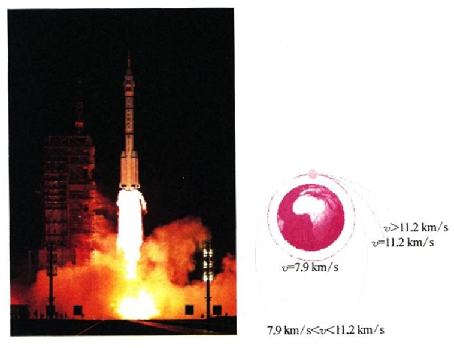
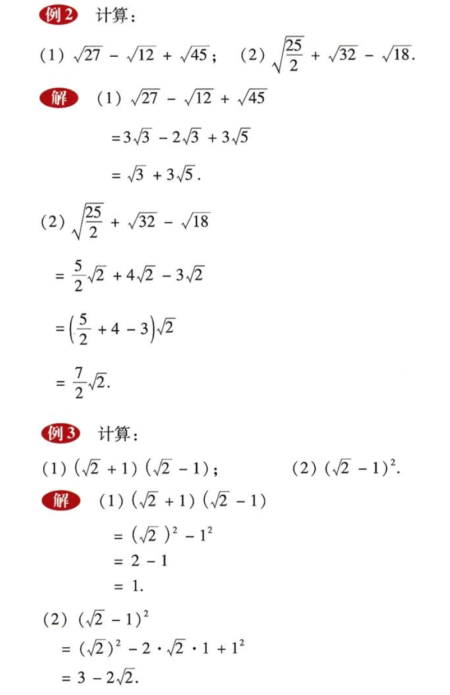
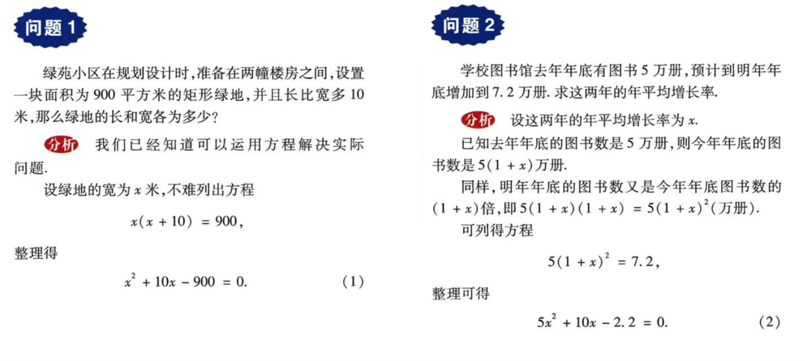

# 九年级数学上册

## 目录(Catalog)
- 第 21 章: 二次根式
    + 21.1 二次根式 (2)
    + *阅读材料: 蚂蚁和大象一样重吗?* (4)
    + 21.2 二次根式的乘除 (5)
        - 21.2.1 二次根式的乘法 (5)
        - 21.2.2 积的算术平方根 (6)
        - 21.2.3 二次根式的除法 (7)
    + 21.3 二次根式的加减 (10)
    + 21.4 小结 (13)
    + 21.5 复习题 (15)
- 第 22 章: 一元二次方程
    + 22.1 一元二次方程 (18) 
    + 22.2 一元二次方程的解法 (20)
        - 22.2.1 直接开平方法和因式分解法 (20)
        - 22.2.2 配方法 (25) 
        - 22.2.3 公式法 (28)
        - 22.2.4 一元二次方程根的判别式 (31)
        - 22.2.5 一元二次方程的根与系数的关系 (33)
    + *阅读材料 "代数学之父" 韦达* (37)
    + 22.3 实践与探索 (28)
    + 22.4 小结 (43)
    + 22.5 复习题 (45)
- 第 23 章: 图形的相似
    + 23.1 成比例线段 (48)
        - 23.1.1 成比例线段 (48)
        - 23.1.2 平行线分线段成比例 (51)
    + *阅读材料 黄金分割* (56) 
    + 23.2 相似图形 (57)
    + 23.3 相似三角形 (61)
        + 23.3.1 相似三角形 (61)
        + 23.3.2 相似三角形的判定 (64)
        + 23.3.3 相似三角形的性质 (71)
        + 23.3.4 相似三角形的应用 (72)
    + 23.4 中位线 (77)
    + 23.5 位似图形 (80)
    + *阅读材料 数学与艺术的美妙结合--分形* (82)
    + 23.6 图形与坐标 (84)
        - 23.6.1 用坐标确定位置 (84)
        - 23.6.2 图形的变换与坐标 (88)
    + 23.7 小结 (94)
    + 23.8 复习题 (95)
- 第 24 章: 解直角三角形
    + 24.1 测量 (100)
    + 24.2 直角三角形的性质 (102)
    + 24.3 锐角三角函数 (105)
    + 24.4 解直角三角形 (111)
    + *阅读材料 葭生池中* (118)
    + 24.5 小结 (119)
    + 24.6 复习题 (120)
    + **总和与实践 高度的测量** (124)
- 第 25 章: 随机事件的概率
    + 25.1 在重复试验中观察不确定现象 (126)
    + *阅读材料*
        - *计算机帮我们画趋势图* (134)
        - *搅匀对保证公平很重要* (135)
    + 25.2 随机事件的概率 (136)
        - 25.2.1 概率及其意义 (136) 
        - 25.2.2 频率与概率 (141)
        - *阅读材料 电脑键盘上的字母为何不按字母顺序排列* (147)
        - 25.2.3 列举所有机会均等的结果 (149)
    + *阅读材料*
        - *The Birthday Problem 生日问题* (155)   
        - *模拟实验* (157)
    + 25.3 小结 (158)
    + 25.4 复习题 (159)
    + **综合与实践 骰(tou)子与概率** (162)
- 数学实验附图
    + 方格图 (163)
    + 点格图 (165)

​    
## 生词(New Word)
- **Nu ($\nu$) [nu:] --n.希腊字母的第13个字母**
- **quadratic [kwɒ'drætɪk] --adj.二次的。--n.二次方程式**
    + complete quadratic equation 完全二次方程
- **equation [ɪ'kweɪʒ(ə)n] --n.相等；均衡；方程式；等式**
    + I can't make this equation come out. 我不会解这个方程式。
    + an equation of the second degree. 二次方程式

## 内容(Content)
### 第 21 章: 二次根式
- 21.1 二次根式 (2)
    + 
      人造地球卫星要冲出地球, 围绕地球运动, 发射时就必须达到一定的速度, 
      这个速度称为第一宇宙速度. 计算第一宇宙速度的公式是:
      $$
        \nu = \sqrt[2]{gR}
      $$
      其中 $g$ 为重力加速度, $R$ 为地球半径.
    + **概括(1):**
        - $\sqrt[2]{a}$ $(a \geq 0)$ 表示非负数 $a$ 的算术平方根, 也就是说,
          $\sqrt{a}$ $(a \geq 0)$ 是一个非负数, 它的平方等于 $a$, 既有:
            + (1) $\color{#E87631}{\large \sqrt{a} \; (a \geq 0)} \quad$
              [读作: $a$ 的二次方根 或 $a$ 的平方根. 通常简读为: 根号 $a$]
            + (2) $\color{#E87631}{\large (\sqrt{a})^2 = a \; (a \geq 0)}$
              [读作: $a$ 的平方根的平方]  
          形如 $\sqrt{a}$ $(a \geq 0)$ 的式子叫做 **二次根式**
    + **注意:**
        - 在 $\sqrt{a}$ 中, $a$ 的取值必须满足 $(a \geq 0)$, 
          即二次根式的被开方数必须是非负数.
        - 例: $x$ 是怎样的实数时, 二次根数 $\sqrt{x - 1}$ 有意义? 答: 略.
    + **概括(2):**
        - $\sqrt{a^2}$ 等于什么?
            + (1) 当 $a \geq 0$ 时, $\color{#E87631}{\large \sqrt{a^2} = a}$ 
              [读作: $a$ 的平方的二次方根等于 $a$] 
            + (1) 当 $a \leq 0$ 时, $\color{#E87631}{\large \sqrt{a^2} = - a}$
- *阅读材料: 蚂蚁和大象一样重吗?* (4)
- 21.2 二次根式的乘除 (5)
    + 21.2.1 二次根式的乘法 (5)
        - **公式(1)**: $\color{#E87631}{\sqrt{a} \cdot \sqrt{b} = \sqrt{ab} \quad (a \geq 0, \; b\geq 0)}$
          [简读为: 根号 a 乘以根号 b 等于根号 a 乘以 b, a 大于等于 0, b 大于等于 0]  
          **两个算术平方根的积, 等于它们被开房数的积的算术平方根.**
    + 21.2.2 积的算术平方根 (6)
        - **公式(2)**: $\color{#E87631}{\sqrt{ab} = \sqrt{a} \cdot \sqrt{b} \quad (a \geq 0, \; b\geq 0)}$  
          **积的算术平方根, 等于个因式算术平方根的积.** 
    + 21.2.3 二次根式的除法 (7)
        - **公式(3)**: $\color{#E87631}{\frac{\sqrt{a}}{\sqrt{b}} = \sqrt{\frac{a}{b}} \quad (a \geq 0, \; b > 0)}$  
          **两个算术平方根的商, 等于商的算术平方根.**
        - 公式(3)也可写成: $\color{#E87631}{\sqrt{\frac{a}{b}} = \frac{\sqrt{a}}{\sqrt{b}} \quad (a \geq 0, \; b > 0)}$  
          **商的算术平方根, 等于两个算术平方根的商.**
        - **最简二次根式:**
            +   
                
              按照例2 和例4 的要求, `化简后的二次根式被开方数中不含分母, 并且被开方数中所有因数(或因式)的幂的指数都小于2, 像这样的二次根式称为最简二次根式.` 
- 21.3 二次根式的加减 (10)
    + **概括**
        - 与整式中同类项相类似, 我们把像 $3\sqrt{a}$, $-2\sqrt{a}$ 与 $4\sqrt{a}$
          这样的几个二次根式, 称为同类二次根式.  
        - 二次根式的加减, 与整式的加减类似, 关键是将同类二次根式合并.
        - 例如:  
          
- 21.4 小结 (13)
- 21.5 复习题 (15)
### 第 22 章: 一元二次方程
- 22.1 一元二次方程 (18)
    + 问题  
      
    + **概括**:
        - 上述问题中 (1) 和 (2) 两个整式方程中都只含有一个未知数($x$),
          并且未知数的最高次数是 2 (注: $x^2$), 这样的方程叫做 **`一元二次方程`**
          (quadratic equation with one unknown). 一元二次方程的一般形式是:
          $$
            \color{#E87631}{ax^2 + bx + c = 0} \quad (a, b, c 是已知数, a \neq 0)
          $$
- 22.2 一元二次方程的解法 (20)
    + 22.2.1 直接开平方法和因式分解法 (20)
    + 22.2.2 配方法 (25) 
    + 22.2.3 公式法 (28)
    + 22.2.4 一元二次方程根的判别式 (31)
    + 22.2.5 一元二次方程的根与系数的关系 (33)
- *阅读材料 "代数学之父" 韦达* (37)
- 22.3 实践与探索 (28)
- 22.4 小结 (43)
- 22.5 复习题 (45)
### 第 23 章: 图形的相似
- 23.1 成比例线段 (48)
    + 23.1.1 成比例线段 (48)
    + 23.1.2 平行线分线段成比例 (51)
- *阅读材料 黄金分割* (56) 
- 23.2 相似图形 (57)
- 23.3 相似三角形 (61)
    + 23.3.1 相似三角形 (61)
    + 23.3.2 相似三角形的判定 (64)
    + 23.3.3 相似三角形的性质 (71)
    + 23.3.4 相似三角形的应用 (72)
- 23.4 中位线 (77)
- 23.5 位似图形 (80)
- *阅读材料 数学与艺术的美妙结合--分形* (82)
- 23.6 图形与坐标 (84)
    + 23.6.1 用坐标确定位置 (84)
    + 23.6.2 图形的变换与坐标 (88)
- 23.7 小结 (94)
- 23.8 复习题 (95)
### 第 24 章: 解直角三角形
- 24.1 测量 (100)
- 24.2 直角三角形的性质 (102)
- 24.3 锐角三角函数 (105)
- 24.4 解直角三角形 (111)
- *阅读材料 葭生池中* (118)
- 24.5 小结 (119)
- 24.6 复习题 (120)
- **总和与实践 高度的测量** (124)
### 第 25 章: 随机事件的概率
- 25.1 在重复试验中观察不确定现象 (126)
- *阅读材料*
    + *计算机帮我们画趋势图* (134)
    + *搅匀对保证公平很重要* (135)
- 25.2 随机事件的概率 (136)
    + 25.2.1 概率及其意义 (136) 
    + 25.2.2 频率与概率 (141)
    + *阅读材料 电脑键盘上的字母为何不按字母顺序排列* (147)
    + 25.2.3 列举所有机会均等的结果 (149)
- *阅读材料*
    + *The Birthday Problem 生日问题* (155)   
    + *模拟实验* (157)
- 25.3 小结 (158)
- 25.4 复习题 (159)
- **综合与实践 骰(tou)子与概率** (162)
### 数学实验附图
- 方格图 (163)
- 点格图 (165)

