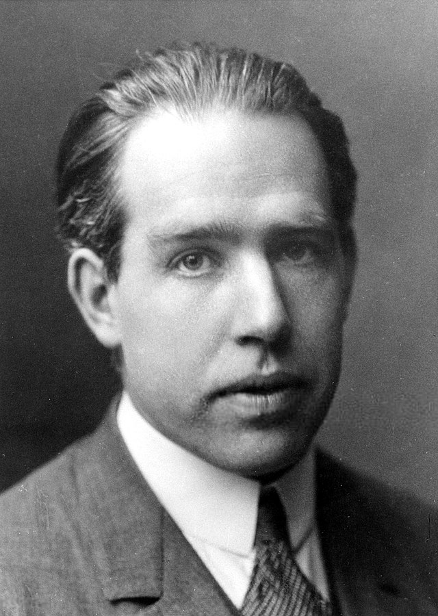

# Niels Henrik David Bohr (尼尔斯·亨里克·达维德·玻尔)

- 简称 尼尔斯·玻尔(Niels Bohr)  

 
## Catalog
1. 尼尔斯·波尔简介

## New Words

## Content
### 1. 尼尔斯·波尔简介
- [尼尔斯·亨里克·达维德·波尔](https://www.wikiwand.com/zh/%E5%B0%BC%E5%B0%94%E6%96%AF%C2%B7%E7%8E%BB%E5%B0%94) 
  (丹麥語：Niels Henrik David Bohr, 1885 年 10 月 7 日 - 1962 年 11 月 18 日)
  , 丹麦物理学家, 1922 年因 "他对原子结构以及从原子发射出的辐射的研究"
  而荣获诺贝尔物理学奖.

  
  
 