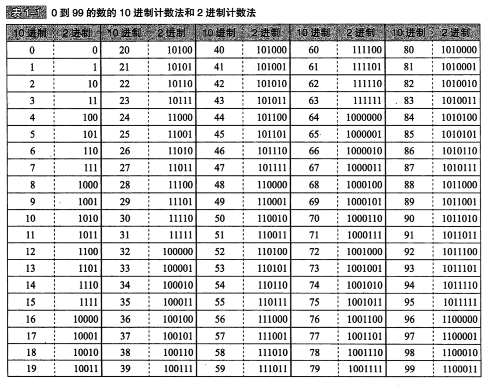
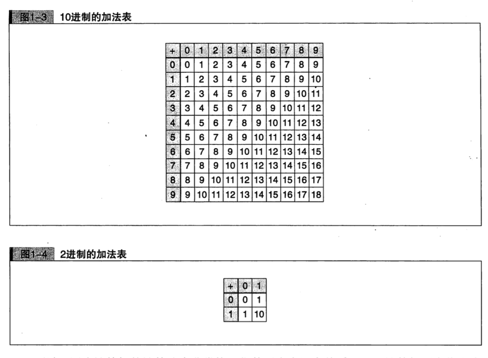
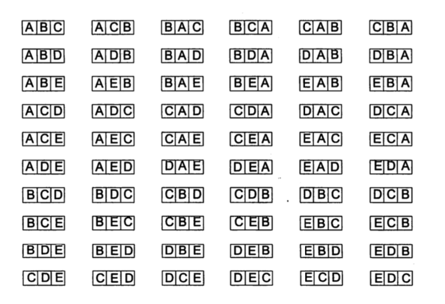
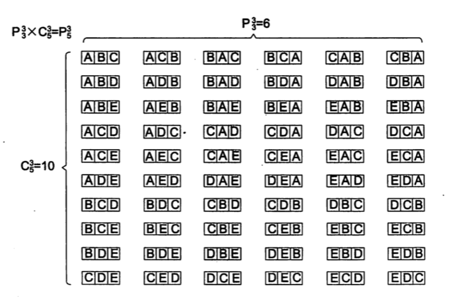

# 程序员的数学 (1)

## 第 1 章 -- 0 的故事 —— 无即是有
#### 10进制计数法
- 什么是 10 进制计数法？
    + 使用的数字有 0、1、2、3、4、5、6、7、8、9 共 10 种。
    + 数位有一定的意义，从右往左分别表示 个位、十位、百位、千位......
- 分解 2503: 这样并排的数字，因数位不同而意义相异。
    + 2 表示 "1000 的个数"
    + 5 表示 "100 的个数"
    + 0 表示 "10 的个数"
    + 3 表示 "1的个数"
- 10 进制计数法的数位全都是 $10^n$ (Read: 10 的 n 次方) 的形式，这个 10 称作 10 进制计
  数法的**基数**或**底**。
- 基数 10 右上角的数字 —— **指数**，是 3、2、1、0 这样有规律地顺次排列的，这点请记住。
- E.g.: 2503  
    = $2 \times 1000$ + $5 \times 100$ + $0 \times 10$ + $3 \times 1$  
    = $2 \times 10^3$ + $5 \times 10^2$ + $0 \times 10^1$ + $3 \times 10^0$
#### 2进制计数法
- 什么是二进制？
    + 使用的数字只有 0 和 1。
    + 从右往左分别表示 1位、2位、4位、8位......
- 用 2 进制计数法来数数，首先是 0，然后是 1，接下去......不是2，而是在 1 上面进位变成 10,
  继而是 11, 100, 101......
- 0 到 99 的数的 10 进制计数法和 2 进制计数法
    + 
- 分解 2 进制表示的 1100：
    + 和 10 进制计数法一样，并排的数字，各个数位都有不同的意义。从左往右一次为:
        - 1 表示 "8的个数"
        - 1 表示 "4的个数"
        - 0 表示 "2的个数"
        - 0 表示 "1的个数"
    + 也就是说，2 进制的 1100 是 1个8、1个4、0个2、和 0个1 累加的结果。这里出现的 
      8、4、2、1，分别表示 $2^3$、$2^2$、$2^1$,、$2^0$, 即 2 进制计数法的 1100，
      表示如下意思：
        - $1 \times 2^3$ + $1 \times 2^2$ + $0 \times 2^1$ + $0 \times 2^0$
    + 如此计算就能将 2 进制计数法的 1100 转换为 10 进制计数法:
        - $1 \times 2^3$ + $1 \times 2^2$ + $0 \times 2^1$ + $0 \times 2^0$  
          = $1 \times 8$ + $1 \times 4$ + $0 \times 2$ + $0 \times 1$   
          = $8 + 4 + 0 + 0$  
          = 12  
> 基数转换 
- 我们把 10 进制的 12 转化为 2 进制: 将 12 反复除以 2，并观察每一步除 2 后的余数为 "1"
  还是为 "0"。最后一步商为 0 则表示 "除完了"。随后再将每步所得的余数的列 (1 和 0 的列)
  逆向排列，由此就得到 2 进制表示了。
  + 
  + (这里的讲解也可以看下统计目录的 `进制转换.md`)
+ 在 10 进制中，基数为 10，各个数位是以 $10^n$ 的形式表现的。而 2 进制中，基数为 2，各个
  数位是以 $2^n$的形式表现的。$\quad$ 从 10 进制计数法转换为 2 进制计数法，称作 10 进制
  至 2 进制的 **基数转换**。
> 计算机中为什么采用 2 进制计数法？
- 在 2 进制计数法中，数字的种类少，但是位数多。 --> 对计算机来说，这种比较易用。
- 10 进制 和 2进制 的加法表
    + 

#### 按位计数法
- 什么是按位计数法？
    + A: 我们学习了 10 进制和 2 进制两种计数法，这些方法一般称作 **按位计数法**。在编程中
      也常常使用 8 进制和 16 进制计数法
- 8 进制计数法: 8 进制计数法的特征如下:
    + 使用的数字有 0、1、2、3、4、5、6、7 共 8 种。
    + 从右往左分别为 $8^0$ 的位、$8^1$ 的位、$8^2$ 的位、$8^3$ 的位...... (基数是 8)
- 16 进制基数法: 16 进制计数法的特征如下:
    + 使用的数字有 0、1、2、3、4、5、6、7、8、9、A、B、C、D、E、F、 共 16 种。
    + 从右往左分别为 $16^0$ 的位、$16^1$ 的位、$16^2$ 的位、$16^3$ 的位......(基数是 16)   
#### 指数法则
#### 0 所起的作用

## 第 2 章 -- 逻辑 —— 真假的二元世界
#### 为何逻辑如此重要
#### 乘车费用问题 —— 兼顾完整性和排他性
#### 建立复杂命题
#### 德·摩根定律
#### 卡诺图
#### 包含未定义的逻辑

## 第 3 章 -- 余数 —— 周期性和分组
#### 星期数的思考题 (1)
#### 星期数的思考题 (2)
#### 乘方的思考题
1. $1234567^{987654321}$ 的个位数是多少呢？
    + A: **能影响 2 个数字乘方结果的个位数的，只有这 2 个数字的个位数**。 也就是说，将 
      1234567 的个位数 7 进行乘方，只看乘方结果的个位数就行了，1234567 的十位以上的数字
      123456 可以暂时忽略。
    + 我们再来试算一下:
        + ![]  
#### 通过黑白棋通信
#### 寻找恋人的思考题
#### 铺设草席的思考题
#### 一笔画的思考题

## 第 4 章 -- 数学归纳法 —— 如何征服无穷数列
#### 高斯求和
- 前 n 项和: 
    + $0 + 1 + 2 + 3 + \cdots + n = \frac{n\tims{(n+1)}}{2}$
#### 数学归纳法 —— 如何征服无穷数列
#### 求出奇数的和 —— 数学归纳法实例
#### 黑白棋思考题 —— 错误的数学归纳法
#### 编程和数学归纳法

## 第 5 章 -- 排列组合 —— 解决计数问题的方法
#### 计数 —— 与整数的对应关系
#### 植树问题 —— 不要忘记 0
#### 加法法则
- 加法法则就是将 "无重复" 元素的 2 个集合 $A, B$ 相加，得到 $A \cup B$ (并)的元素数。
    + $A \cup B$ 的元素个数 = $A$ 的元素个数 + $B$ 的元素个数。
- 加法法则只在集合中没有重复元素的条件下成立。    
#### 乘法法则
#### 置换
- `置换(substitution): 将 n 个事物按顺序进行排列称为置换. `
- 如果将 A, B, C 这 3 章牌按照 ABC, ACB, BAC......等顺序排列, 那么共有多少种排法?
    + A: 经过思考, 我们发现 3 张牌共有 6 种排法 (ABC, ACB, BAC, BCA, CAB, CBA). 如
      本题这般, 将 n 个事物按顺序进行排列称为 置换 (substitution).
    + A, B, C 3 张牌的置换总数, 可以通过下述步骤得出.
        - 第 1 张牌 (最左边的牌), 从 A, B, C 3 张中选出 1 张. 即, 第 1 张牌有 3 中选法.
        - 第 2 张牌, 从已选出的第 1 张牌以外的 2 张中选出 1 张. 即, 第 2 张牌与第 1 张
          牌的选法相对, 分别有 2 种选法.
        - 第 3 张牌, 只有一张可选.
    + 因此, 3 张牌的所有排列方法 (置换的总数), 可以通过如下计算得出.
    + 第 1 张拍的选法 $\times$ 第 2 张牌的选法 $\times$ 第 3 张牌的选法 = 
      3 $\times$ 2 $\times$ 1.
- `阶乘 (factorial)`: $5!$ 称为 5 的阶乘, 阶乘因呈阶梯状递减而得名. 要注意 0 的阶乘 
   ($0!$) 不是 0, 而被定义为 1. 这是数学里的规定. 
- 思考题: 将一副扑克牌里的 52 张 (不包括王牌) 摆成一排, 共有多少种摆法?
    + A: 这是 52 张牌的置换, 因此有 $52!$
- Tips: $1! ~ 52!$ 的阶乘. 随着 n 的增大, 阶乘 $n!$ 的结果呈爆炸式增长.            
#### 排列
- 从 n 个事物中取出一部分进行 "排列".
- `排列 (permutation): 我们将从 n 个不同元素中取出 k 个并按照一定顺序排列的方法称作排列`, 
  `排列的总数记作:` $$\color{#e35a14}{P_{n}^{k}}$$ 
- 思考题 -- 从 5 张牌中取出 3 张进行排列.
    + 你现在手上持有 A, B, C, D, E 共 5 张牌. 要从这 5 张牌中取出 3 张进行排列. 请问
      有多少种排法?  答: 60 种. 如下图
    + 
- 我们将上题那样的排法称作从 5 张里面取出 3 张的排列 (permutation).        
#### 组合
- 置换和排列都需要考虑顺序, 而本节我们要介绍的是 "不考虑顺序的方法" -- 组合.
- `组合(combination): 我们将从 n 个不同元素中取出 k 个, 但是不考虑它们的顺序, 这种取法`
  `称为 组合.` 
- 假设现在有 A, B, C, D, E 五张牌. 要从这 5 张牌中取出 3 张牌, 并且不考虑它们的顺序, 
  即以 3 张牌为 1 组进行选择. 例如, ABE 和 BAE 应视为同一组. 这时, 3 张牌的取法如下, 
  共有 10 种. 
  $$\color{#e35a14}{ABC, ABD, ABE, ACD, ACE, ADE, BCD, BCE, BDE, CDE}$$
- 这种取法称为 **组合 (combination)**. "置换"和"排列"是考虑顺序的, 而 "组合" 则不考虑
  顺序.
- 要计算 5 张里面取 3 张的组合总数, 只要这样考虑就行了.
    + 首先, 和排列一样 "考虑顺序" 进行计数.
    + 其次, 除以重复计数的部分 (重复度: 即 3 张牌的置换总数 3 x 2 x1). 
- 5 张里面取 3 张的组合的总数 = $C_{5}^{3}$
  $$
    C_{5}^{3} = 
        \frac{5 张里面取 3 张的排列总数}{3 张的置换总数} \quad
        \frac{\cdots \cdots 考虑顺序排列的数}{\cdots \cdots 重复度}
  $$      
  $$
    = \frac{P_{5}^{3}}{P_{3}^{3}}
  $$
  $$
    = \frac{5 \times 4 \times 4}{ 3 \times 2 \times 1}
  $$
  $$
    = 10
  $$
- **归纳一下**
- 接下来我们将牌数抽象化, 求出 n 张牌中取出 k 张的组合总数.
- 首先, 从 n 张牌中按顺序取出 k 张牌. 而这时 k 张的置换总数是重复的, 所以要除以这个重复度.
- $$
    \begin{align}
        & C_{5}^{3} = \frac{从 n 张里面取 k 张的排列总数}{k 张的置换总数} \\
        & = \frac{P_{n}^{k}}{P_{k}^{k}} \\
        & = \frac{\frac{n!}{(n-k)!}}{k!} \\
        & = \frac{n!}{(n-k)!} \cdots \frac{1}{k!} \\
        & = \frac{n!}{(n-k)! k!}
    \end{align}
  $$ 
- 这样, 从 n 张里取 k 张的组合总数为  
  $$
    C_{n}^{k} = \frac{n!}{(n-k)! k!}
  $$  
- 置换和组合相结合就是排列, 大家知道为什么吗? 置换表示 "3 张牌的交替排列方法". 组合表示 
  "3 张牌的取法". 两者结合就是 "取出 3 张牌, 进行交替排列", 即表示排列. 
- 通过图 5-17, 我们能清楚第了解到他们存在以下关系.
   
- "3 张的置换" $\times$ "从 5 张中取 3 张的组合" = "从 5 张中取 3 张的排列"
- 即, $$P_{3}^{3} \times C_{5}^{3} = P_{5}^{3}$$ 
- 这与前面求 $C_{5}^{3}$ 时的 $$C_{5}^{3} = \frac{P_{5}^{3}}{P_{3}^{3}}$$ 是一样的.
## 第 6 章 -- 递归 —— 自己定义自己
#### 汉诺塔
#### 再谈阶乘
#### 斐波那契数列
#### 帕斯卡三角形
#### 递归图形

## 第 7 章 -- 指数爆炸 —— 如何解决复杂问题
#### 什么是指数爆炸？
#### 倍数游戏 —— 指数爆炸引发的难题
#### 二分法查找 —— 利用指数爆炸进行查找
#### 对数(logarithm) —— 掌握指数爆炸的工具
#### 密码 —— 利用指数爆炸加密
#### 如何处理指数爆炸

## 第 8 章 -- 不可解问题 —— 不可解的数、无法编写的程序
#### 反证法
#### 可数
#### 对角论证法
#### 不可解问题
#### 停机问题

## 第 9 章 -- 什么是程序员的数学

#### A.4 (P362) 求和符号 $\sum$ (sigma)
- A.4.1 定义与基本性质: $a_{1} + a_{2} + ... + a_{9} + a_{10}$ 可以简写为以下形式: 
    + $$
        \sum_{i=1}^{10}a_{i}
      $$
    + : 意思为 $a_{i}$ 项到 $a_{10}$ 项的求和。
    + tips: 求和符号中可以使用任意未被占用的字母作为计数下标，含义不变。
- A.4.2 双重求和: 两个连用的求和符号间存在运算优先顺序，我们可以通过添加括号来明确区分它们
  的关系, 如下所示:        
  $$
    \begin{align}
        & \sum_{i=1}^3 \sum_{j=1}^4f(i,j) \\
        & = \sum_{i=1}^3 (\sum_{j=1}^4f(i,j)) \\
        & = \sum_{i=1}^3(f(i, 1) + f(i, 2) + f(i, 3) + f(i, 4)) \\
        & = (f(1, 1) + f(1, 2) + f(1, 3) + f(1, 4)) \\
          & \quad + (f(2, 1) + f(2, 2)+ f(2, 3) + f(2, 4)) \\
          & \quad + (f(3, 1) + f(3, 2) + f(3, 3) + f(3, 4))
    \end{align}
  $$
  