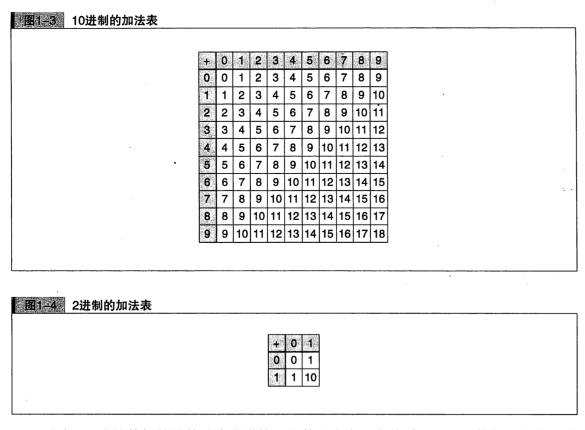

# 第 1 章 -- 0 的故事

## Catalog
+ 1.1 10 进制计数法
    - 1.1.1 什么是 10 进制计数法
    - 1.2.1 分解 2503
+ 1.2 2 进制计数法
    - 1.2.1 什么是 2 进制计数法
    - 1.2.2 分解 1100
    - 1.2.3 基数转换
    - 1.2.4 计算机中为什么采用 2 进制计数法
+ 1.3 按位计数法
    - 1.3.1 什么是按位计数法 
    - 1.3.2 不适用按位计数法的罗马数字
+ 1.4 指数法则
    - 1.4.1 10 的 0 次方是什么
    - 1.4.2 $10^{-1}$ 是什么
    - 1.4.3 规则的扩展
    - 1.4.4 对 $2^0$ 进行思考
    - 1.4.5 $2^{-1}$ 是什么
+ 1.5 0 所起的作用
    - 1.5.1 0 的作用: 占位
    - 1.5.2 0 的作用: 统一标准, 简化规则
    - 1.5.3 日常生活中的 0
+ 1.6 人体的极限和构造的发现
    - 1.6.1 重温历史进程
    - 1.6.2 为了超越人类的极限
+ 1.7 本章小结

## New Words

## Content
### 1.1 10 进制计数法
#### 1.1.1 什么是 10 进制计数法
- 我们平时使用的是 10 进制计数法: 
    + 使用的数字有 0、1、2、3、4、5、6、7、8、9 共 10 种. 
    + 数位有一定的意义, 从右往左分别表示 个位、十位、百位、千位......

#### 1.2.1 分解 2503
- 这样并排的数字, 因数位不同而意义相异.
    + 2 表示 "1000 的个数"
    + 5 表示 "100 的个数"
    + 0 表示 "10 的个数"
    + 3 表示 "1的个数"
    
  综上所述: 2503 这个数是 2 个 1000, 5 个 100, 0 个 10 和 3 个 1 累加的结果. 即:
  $$
    \begin{align}
    & 2 \times 1000 + 5 \times 100 + 0 \times 10 + 3 \times 1  = 
    2 \times 10^3 + 5 \times 10^2 + 0 \times 10^1 + 3 \times 10^0
    \end{align}
  $$
  10 进制计数法的数位全都是 $10^n$ (Read: 10 的 n 次方) 的形式, 这个 10 称作
  10 进制计数法的 `基数` 或 `底`.
  
  基数 10 右上角的数字 - `指数` 是 3, 2, 1, 0 这样有规律地顺次排列的, 这点请记住.
- E.g.: 2503
  $$
    \begin{align}
       2503 & = 2 \times 1000 + 5 \times 100 + 0 \times 10 + 3 \times 1  \\[2ex]
        & = 2 \times 10^3 + 5 \times 10^2 + 0 \times 10^1 + 3 \times 10^0
    \end{align}
  $$

### 1.2 2 进制计数法
#### 1.2.1 什么是 2 进制计数法
- 什么是二进制?
    + 使用的数字只有 0 和 1.
    + 从右往左分别表示 1位、2位、4位、8位 ......
- 用 2 进制计数法来数数, 首先是 0, 然后是 1, 接下去 ... 不是2,
  而是在 1 上面进位变成 10, 继而是 11, 100, 101 ...
- 0 到 99 的 10 进制计数法和 2 进制计数法
  
  
- 分解 2 进制表示的 1100：
    + 和 10 进制计数法一样, 并排的数字, 各个数位都有不同的意义. 从左往右一次为:
        - 1 表示 "8的个数"
        - 1 表示 "4的个数"
        - 0 表示 "2的个数"
        - 0 表示 "1的个数"
    + 也就是说, 2 进制的 1100 是 1个8、1个4、0个2、和 0个1 累加的结果. 这里出现的 
      8、4、2、1, 分别表示 $2^3$、$2^2$、$2^1$,、$2^0$, 即 2 进制计数法的 1100, 
      表示如下意思：
        - $1 \times 2^3$ + $1 \times 2^2$ + $0 \times 2^1$ + $0 \times 2^0$
    + 如此计算就能将 2 进制计数法的 1100 转换为 10 进制计数法:
        - $1 \times 2^3$ + $1 \times 2^2$ + $0 \times 2^1$ + $0 \times 2^0$  
          = $1 \times 8$ + $1 \times 4$ + $0 \times 2$ + $0 \times 1$   
          = $8 + 4 + 0 + 0$  
          = 12  
#### 1.2.2 分解 1100
#### 1.2.3 基数转换
- 我们把 10 进制的 12 转化为 2 进制: 将 12 反复除以 2, 并观察 每一步除 2 后的余数为
  "1" 还是为 "0". 最后一步商为 0 则表示 "除完了". 随后再将每步所得的余数的列
  (1 和 0 的列) 逆向排列, 由此就得到 2 进制表示了. 

  

- 进制转换的完整讲解见当前仓库: `../进制转换.md`.
- 在 10 进制中, 基数为 10, 各个数位是以 $10^n$ 的形式表现的. 而 2 进制中,
  基数为 2, 各个数位是以 $2^n$ 的形式表现的.
  
  从 10 进制计数法转换为 2 进制计数法, 称作 10 进制至 2 进制的 **基数转换**. 

#### 1.2.4 计算机中为什么采用 2 进制计数法
- 在 2 进制计数法中, 数字的种类少, 但是位数多.  --> 对计算机来说, 这种比较易用. 
- 10 进制 和 2进制 的加法表 

  

### 1.3 按位计数法
#### 1.3.1 什么是按位计数法 
- 什么是按位计数法？
    + A: 我们学习了 10 进制和 2 进制两种计数法, 这些方法一般称作 **按位计数法**. 在编程中
      也常常使用 8 进制和 16 进制计数法
- 8 进制计数法: 8 进制计数法的特征如下:
    + 使用的数字有 0、1、2、3、4、5、6、7 共 8 种. 
    + 从右往左分别为 $8^0$ 的位、$8^1$ 的位、$8^2$ 的位、$8^3$ 的位...... (基数是 8)
- 16 进制计数法: 16 进制计数法的特征如下:
    + 使用的数字有 0、1、2、3、4、5、6、7、8、9、A、B、C、D、E、F、 共 16 种. 
    + 从右往左分别为 $16^0$ 的位、$16^1$ 的位、$16^2$ 的位、$16^3$ 的位......(基数是 16)   
#### 1.3.2 不适用按位计数法的罗马数字

### 1.4 指数法则
#### 1.4.1 10 的 0 次方是什么
#### 1.4.2 $10^{-1}$ 是什么
#### 1.4.3 规则的扩展
#### 1.4.4 对 $2^0$ 进行思考
#### 1.4.5 $2^{-1}$ 是什么

### 1.5 0 所起的作用
#### 1.5.1 0 的作用: 占位
#### 1.5.2 0 的作用: 统一标准, 简化规则
#### 1.5.3 日常生活中的 0

### 1.6 人体的极限和构造的发现
#### 1.6.1 重温历史进程
#### 1.6.2 为了超越人类的极限

### 1.7 本章小结
