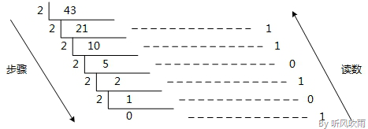
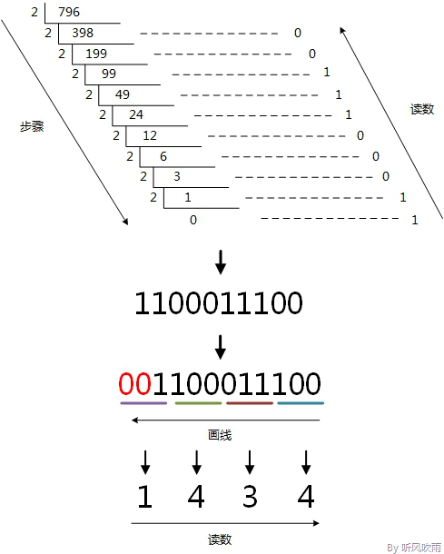
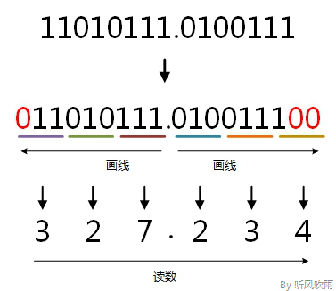
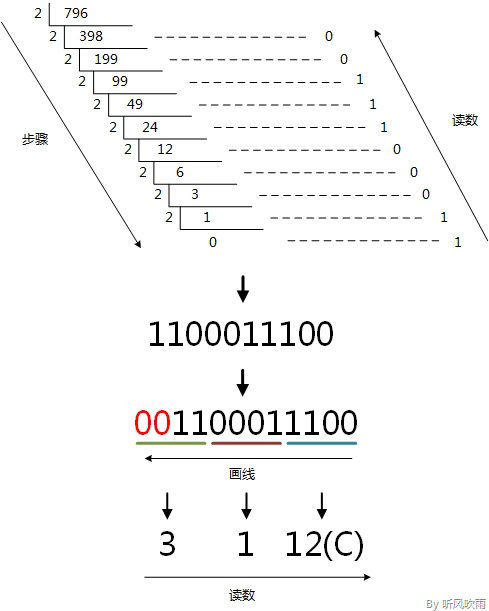
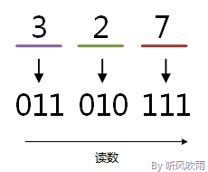
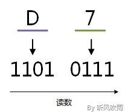

# 进制转换 (Convert)

> [参考文章](https://www.cnblogs.com/gaizai/p/4233780.html#_labelConvert31)

## Catalog
1. (2 / 8 / 16) 进制转换成 10 进制
1. 10 进制 --> (2 / 8 / 16) 进制
1. 2 进制 --> (8 / 16) 进制
1. 8 进制转 2 进制
1. 16 进制转换为 2 进制
1. 8 进制转换为 16 进制
1. 16 进制转换为 8 进制
1. 拓展阅读

## New Words
- **binary ['baɪnərɪ] --adj.二进制的, 二元的.**
    + It is stored as a binary file. 它以二进制格式文件存储. 
    + a data file in binary format. 二进制格式的数据文件. 
- **decimal ['desɪm(ə)l] --adj.十进制的, 小数的.  --n.小数**
    + decimal number 十进制数
    + decimal point 小数点
    + decimal system 十进制
- **octal ['ɒkt(ə)l] --adj.八进制的**
    + octal number  --n.八进制数
- **hexadecimal [ˌheksə'desɪm(ə)l] --adj.十六进制的**
    + the hexadecimal number system. 十六进制数字系统
- 进制英文表示
    + B (binary) -- 2 进制
    + 0 (octal) -- 8 进制
    + D (decimal) -- 10 进制
    + H (Hexadecimal) -- 16 进制

## Content
### (2 / 8 / 16) 进制转换成 10 进制
- 2 进制到 10 进制
    +  (1100)B  
      = $1 \times 2^3$ + $1 \times 2^2$ + $0 \times 2^1$ + $0 \times 2^0$  
      = $1 \times 8$ + $1 \times 4$ + $0 \times 2$ + $0 \times 1$   
      = $8 + 4 + 0 + 0$  
      = 12                              
- 8 进制到 10 进制
    + (53)O  
      = $5 \times 8^1$ + $3 \times 8^0$   
      = 40 + 3  
      = 43
- 16 进制转换到 10 进制
    + (2B)H  
      = $2 \times 16^1$ + $B \times 16^0$  
      = 32 + 11  
      = 43 

### 10 进制转换为 (2 / 8 / 16) 进制
- 10 进制转换为 2 进制
    + 方法: 10进制数除以 2 取余数法。即每次将整数部分除以 2， 余数为该位权上的数，而商继续
      除以 2，余数又为上一个位权上的数，这个步骤一直持续下去，直到商为 0 为止，最后读数时，
      从最后一个余数读起，一直到最前面的一个余数。 例如: 将 10 进制的 43 转换为 2 进制的
      步骤如下:
        1. 将商43除以2，商21余数为1；
        2. 将商21除以2，商10余数为1；
        3. 将商10除以2，商5余数为0；
        4. 将商5除以2，商2余数为1；
        5. 将商2除以2，商1余数为0； 
        6. 将商1除以2，商0余数为1； 
        7. 读数，因为最后一位是经过多次除以 2 才得到的，因此它是最高位，读数从最后的余数向
            前读， 101011，即 (43)D = (101011)B
        
        

    + 当 10 进制数有小数时，如何转换成 2 进制？ 例如: 13.625 
        - A: 整数部分和上面是一样的，小数部分乘 2 取整，然后从前往后读。
            + 0.625 * 2 = 1.25  取整  1
            + 0.25 * 2 = o.5    取整  0
            + 0.5 * 2 = 1       取整  1
            + 所以小数部分的二进制 101
        - 整数部分是 1101 + 小数部分 101 即是: 1101.101    
- 10 进制转换为 8 进制
    + 方法(1): 和上面的 2 进制转换类似，只是把所有的除 2 换成除 8.
    + 方法(2): 10 进制先转换为 2, 然后从 2 进制转换为 8 进制
- 10 进制转换为 16 进制
    + 方法: 同上            

### 2 进制转换为 (8 / 16) 进制
- 2 进制转换为 8 进制
    + 2 进制无小数点时: 
        - 如果二进制没有小数点，就从最右边起始位开始向左每三位取成一位，接着将这三位
          二进制按权相加，然后按顺序进行排列，得到的数字就是我们所求的八进制数，如果最左边
          无法凑足 3 位，就补0凑足三位，在按权相加。如下图。

          

    + 2 进制有小数点时: 
        - 取三合一法，即从二进制的小数点为分界点，向左（向右）每三位取成一位，接着将这三位
          二进制按权相加，然后，按顺序进行排列，小数点的位置不变，得到的数字就是我们所求的
          八进制数。如果向左（向右）取三位后，取到最高（最低）位时候，如果无法凑足三位，可以
          在小数点最左边（最右边），即整数的最高位（最低位）添0，凑足三位。

          
     + |二进制|八进制|
       |:--:|:--:|
       |000|0|
       |001|1|
       |010|2|
       |011|3|
       |100|4|
       |101|5|
       |110|6|
       |111|7|

- 2 进制转换为 16 进制:
    + 2 进制无小数点时:
        - 如果二进制没有小数点，就从最右边起始位开始向左每 4 位取成一位，接着将这 4 位
          二进制按权相加，然后按顺序进行排列，得到的数字就是我们所求的 16 进制数，如果
          最左边无法凑足 4 位，就补 0 凑足 4 位，在按权相加. 如下图:

          
        
    + 2 进制有小说点时:
        - 和上面的八进制的规则一样，只是换成 4 为取成一位

### 8 进制转 2 进制
- 方法: 取一分 3 法，即将一位 8 进制分解成 3 位 2 进制数，用 3 位 2 进制按权相加去凑这位 
  8 进制数，小数点位置照旧。
    + 将 8 进制的 327 转换为 2 进制的步骤如下:

      

### 16 进制转换为 2 进制
- 方法: 取一分 4 法， 即将一位 16 进制数分解成 4 位 2 进制数，用 4 位 2 进制按权相加去凑
  这位 16 进制数，小数点位置照旧。
    + 将 16 进制的 D7 转换为 2 进制的步骤如下:

    

### 8 进制转换为 16 进制
- 方法: 8 进制转换为 2 进制 --> 16 进制 

### 16 进制转换为 8 进制
- 方法: 16 进制 --> 2 进制 --> 8 进制 

### 扩展阅读
1. 包含小数的进制转换 (E.g.: 16 进制 转换成 10 进制)
    + (ABC.8C)  
      = $10 \times 16^2$ + $11 \times 16^1$ + $12 \times 16^0$ + 
        $8 \times 16^{-1}$ + $12 \times 16^{-2}$  
      = $2560 + 176 + 12 + 0.5 + 0.046875$  
      = $2748.546875$
1. 负次幂的计算:
    + $2^{-5}$  
      = $2^{0-5}$  
      = $\frac{2^0}{2^5}$  
      = $\frac{1}{2^5}$ 
    + 同底数幂相除，底数不变，指数相减，反过来。  
1. 我们需要了解一个数学关系， 即 23 = 8， 24 = 26，而 8 进制和 16 进制是用这个关系衍生
   而来的，即用 3 位 2进制表示 1 位 8 进制，用 4 位 2 进制表示 1 位 16 进制数。接着，
   记住 4 个数字 8、4、2、1 (23=8、22=4、21=2、20=1)